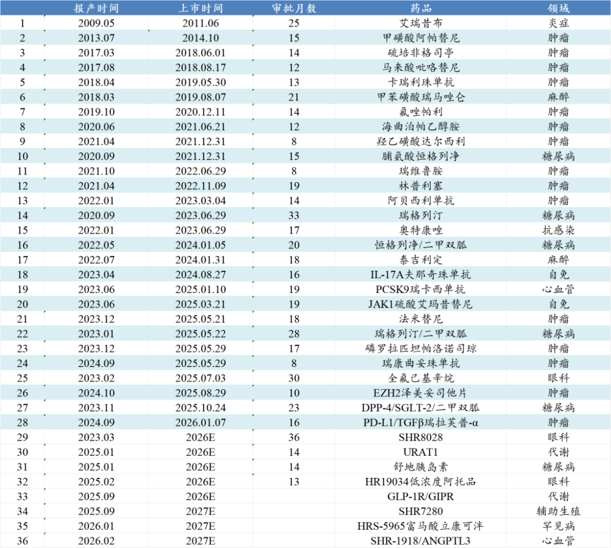
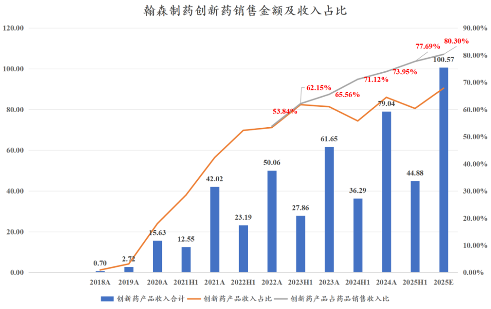
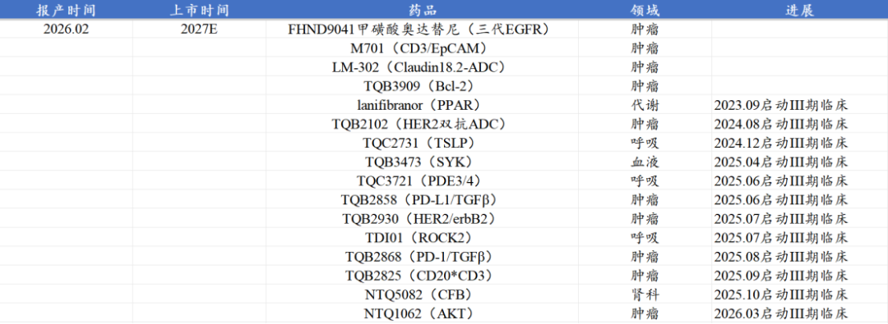
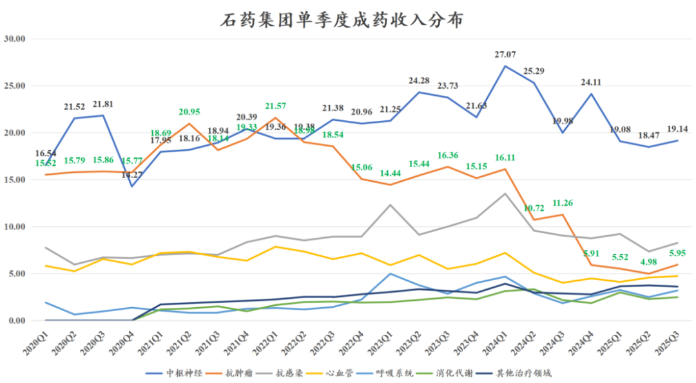
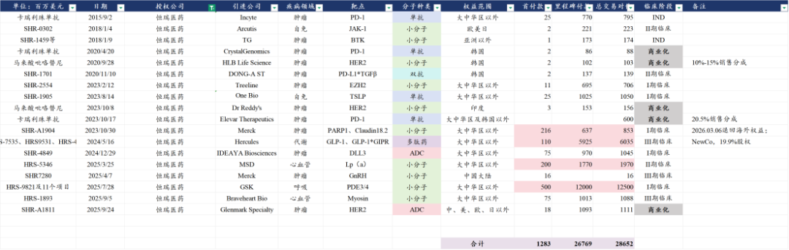
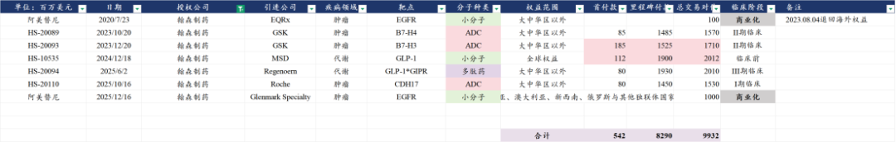
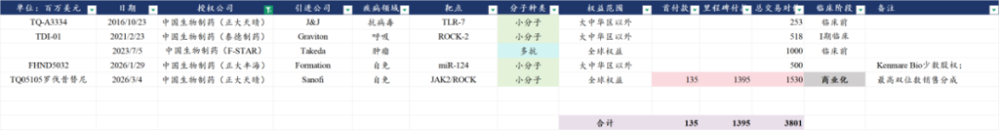
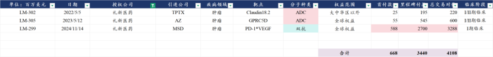
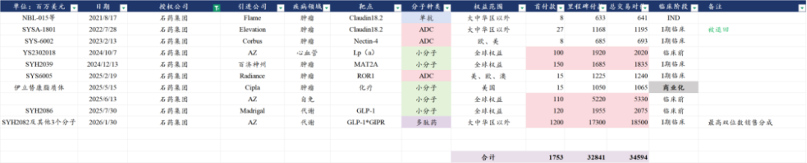

# 医药龙头全面突破

大家好，我是龙哥。

老读者可能会记得、新读者也可以翻翻历史文章，我们在2023年下半年开始判断部分头部药企可能将进入新一轮的创新药密集商业化阶段，业绩即将迎来加速，到2024年中报业绩分析时恒瑞、翰森、中生等头部药企的业绩已经非常明显的开始验证我们的判断，再到2025年创新药板块的腾飞，翰森制药从底部至今涨了3倍左右，中国生物制药从底部至今涨了1-2倍，大象也能起舞。

有不少读者是25年创新药热度提升之后才关注的我们，我们要承认对行情短期波动的把握有很大的局限性，我们这公众号分享的内容更擅长的还是基于中长期产业趋势进行定性判断。

来到2026年初，虽然几家传统pharma都还没披露2025年报，但在这里我们先来梳理一下几家医药龙头pharma公司过去一年各方面的进展，以此展望行业的趋势，本文主要讨论恒瑞、翰森、中生、石药四家传统pharma转型创新的医药龙头的情况。

1、创新药研发及商业化

①恒瑞医药：无需多言，火力全开

恒瑞医药在2025年新获批上市了9款创新药，2026年初新获批1款，2018-2025年获批上市的品种数量分别是2/2/1/3/2/3/3/9个，且这9款药物中有6款都是在2025年上半年获批上市，恒瑞合计有28款新药在国内获批，2026年预计还会有5款左右的新药上市，就创新药商业化数量而言国内5-10年维度都难有企业能和恒瑞有正面PK的能力。

在2025年的医保谈判中，恒瑞医药有20款新药/新适应症纳入医保，其中包括10款新药为首次纳入医保，预计到2026年还有5-7款新药会参与国家医保谈判。

产品密集获批上市、密集纳入医保，且其中不乏HER2-ADC、JAK1抑制剂等重点品种，其创新药商业化在未来几年的快速增长是基本明确的。2025年上半年公司创新药商业化销售收入75.7亿+21.8%，公司对未来三年的创新药商业化增长指引是25%的复合增长，对应2026-2027年的国内创新药收入分别突破200亿和超过250亿。

恒瑞医药的管线布局我们就不在本文太多赘述，可大致参照去年恒瑞研发日的文章。

②翰森制药：彻底转型，但需要后续品种承接

翰森制药是比较早被集采大幅冲击仿制药业务的传统药企之一，近几年随着创新药商业化销售的放量，在产品销售收入中的创新药占比（不含BD收入）已经提升到2024年的74%和2025H1的78%，预计2025全年创新药收入占比将突破80%，翰森已经成为一家彻底的创新药公司。

翰森制药目前创新药商业化品种中，收入贡献最大的部分来自2020年上市的阿美替尼，大概贡献2025年创新药收入的60%左右，阿美替尼预计在未来1-2年的增长也会有所降速，翰森制药需要下一个重磅品种承接。

从其管线来看，下一个承接创新药收入增长的品种可能来自代谢领域——中国第三款、国产第二款GLP-1R/GIPR双靶点激动剂HS-20094，国内第一款GLP-1R/GIPR双靶激动剂是礼来的替尔泊肽，估计很多读者都已经用过，第二款是恒瑞医药的HRS9531，已经在2025年9月申报首个减重适应症的上市申请，第三款就是翰森的HS-20094，在3月上旬宣布达到减重适应症的III期临床终点，预计很快会看到上市申请。

自免领域，翰森制药有国产首款TYK2抑制剂和国产第二款IL-23p19（自荃信生物引进），都处于III期临床阶段，在此前分析MNC财报时我们也多次强调IL-23p19的巨大市场，但在国内市场能不能做起来还要取决于信达、翰森等公司推广的情况。

肿瘤领域，公司的B7-H3 ADC、B7-H4 ADC都已经启动国内和全球的III期临床（海外合作方GSK开全球临床），自普米斯合作引进的EGFR\*c-MET双抗也已经在24年就开了联合阿美替尼治疗NSCLC的国内II/III期临床。

③中国生物制药：创新药密集进入III期临床，但需要从fast follow更进一步

自2018年5月的安罗替尼之后，中国生物制药BD引进多个创新药品种，如康方的PD-1、亿帆的长效升白、益方的KRAS G12C，期间也有自研的PD-L1单抗、ROS1抑制剂和ALK抑制剂等药物获批，这3款药物要么是上市时间太晚、国内市场已经高度内卷，要么是市场容量不够。

中国生物制药原本属于转型创新相对保守的企业，在2021-2024年还是付出了不少精力在仿制药领域，更多仿制药和生物类似药的快速开发也确实一定程度上平滑了公司从仿制药向创新药转型阶段的阵痛期。

2024年中国生物制药的创新产品收入合计120.6亿+22%，2025H1则是78亿元+27%，不过注意中生报表口径的创新产品收入不仅包含创新药，还包含生物类似药，生物类似药还是贡献了不少的增量。

从2024年以来，中国生物制药的积极变化的确在发生，小谢总接班后在公司管理上的付出很值得肯定，公司的在研管线也大跨步的迈进：

从2024年8月的HER2双抗ADC开始，公司这两年陆续启动了10个新分子的注册临床，目前在注册申报和注册临床阶段的分子合计超过20个。

除了数量的提升以外，质量上也有显著提升，如刚在去年12月获批的CDK2/4/6抑制剂与国内过去两年陷入内卷的CDK4/6抑制剂有所差异化竞争，26年2月刚获批的JAK2/ROCK双靶点抑制剂为一款全球FIC的药物，TQB2102为国内第二款进入注册临床的HER2双抗ADC，另外公司还凭借在呼吸领域长期布局，其TQC3721是慢阻肺领域国产首家开III期临床的PDE3/4小分子。

④石药集团：开始走出困境

产品商业化方面，石药集团从2024年二季度后的一年半里经历了压力较大的调整期，以丁苯酞为代表的中枢神经领域季度销售额从巅峰的27亿元被打回到20亿左右，最惨的肿瘤领域由于一系列化疗药和升白药的降价或集采，收入体量从单季度20亿+掉到只有5-6亿元，石药从肿瘤领域收入TOP3的国内头部肿瘤药企掉到三线水平。

在连续5个季度的同环比下滑后，2025Q3石药集团的成药收入终于迎来了同环比增长转正，也是到2025Q3，公司肿瘤药板块彻底出清，不再存在高基数的因素影响，后续也有望看到石药总体收入端开始企稳。

石药集团回顾过去几年，可能是几家传统pharma中“研发效率最低”的一家，从2019年以来陆续构建了庞大的研发管线，2020年的研发投入已经接近30亿，当时就号称300+的研发管线和100+的创新药管线，直到现在除了老咕噜棒子丁苯酞和改良化疗药以外几乎没有新的大品种拿得出手。过去多年BD引进的项目里，目前来看难得有不错成果的应该还算是从康宁杰瑞引进的HER2双抗和HER2双抗ADC，自研的Claudin18.2-ADC在海外由于临床数据与国内差异较大而惨遭退货。

但石药的变化的确已经发生，在小核酸领域，恒瑞和石药算是头部pharma里布局最领先的两家公司，石药集团的首个小核酸药物SYH2053（PCSK9）已经在2月启动了国内的III期临床，另外还有多个小核酸管线处于早期临床阶段。在全球最火的GLP-1代谢领域，公司基于超长效给药的技术平台开发了系列管线并成功以超大交易规模授权AZ。

2、创新药出海

创新药出海，国内的pharma随着研发管线日益充实，也开始加入到海外BD的大军中。

①恒瑞医药：BD数量较多，等待一个海外大单品

恒瑞医药BD授权的数量可以算是国内最多的，交易的总包高达286.5亿美元也是国内最高的，有代表性的大品种，就是GLP-1R/GIPR（HRS-9531）和PDE3/4（HRS-9821）。

HRS-9531已经推到全球III期，但毕竟替尔泊肽已经占据绝对市场优势，后续合作方的再授权或者被并购也是比较关键的，借助MNC的渠道或许还有机会在礼来和诺和的相爱相杀中抢下少部分市场。PDE3/4也具备全球大药潜质，交易规模很大（十几个药的总包交易），HRS-9821在I期临床，要看GSK的推进节奏。

总体来说，还是等待恒瑞一个真正验证的全球大药，也等待恒瑞后续更多高价值量的项目BD。

②翰森制药：只选择高质量合作方

翰森制药最早在2020年7月将阿美替尼的海外权益授予EQRx，但后续海外权益被退回，此后翰森制药的5笔海外BD都是与MNC进行，包括3款ADC药物、1款小分子药物和1款多肽药，合作方包括葛兰素史克、默沙东、再生元、罗氏等4家MNC。

在2023年与GSK合作的两款ADC药物也得到了GSK的重视，截止到目前，HS-20093（B7-H3 ADC）已经在国内启动4项III期临床、在海外启动1项III期临床（二线SCLC），HS-20089（B7-H3 ADC）已经在国内启动1项III期临床、在海外启动2项III期临床（子宫内膜癌、卵巢癌），这两款药物也分别是同靶点全球第二款开注册临床的ADC药物，在临床进度上处于国际一线水平，对于GSK来说也是其拓展肿瘤板块的重要抓手。另外与再生元合作的GLP-1/GIPR双靶点激动剂也有望在2026年启动全球III期临床。

③中国生物制药：质的突破

中国生物制药过去一年多在创新药出海方面一直是“憋着一口气”，除了公司收购来的F-STAR和礼新此前有对MNC的创新药授权（如礼新对默沙东授权的PD-1\*VEGF双抗）以外，中国生物制药的自有管线一直缺少对MNC的BD授权的验证，公司25年也给了做BD交易的预期，但市场期待的PDE3/4并没能授权出去，反而被恒瑞的超百亿美金交易总包捷足先登。

直到3月初，中国生物制药的JAK2/ROCK抑制剂与赛诺菲达成了全球权益授权合作，中国生物制药可获得1.35亿美元首付款、15.3亿美元总包，虽然不是一个超级重磅的BD交易，但对中生来说是首次与MNC合作、管线得到MNC认可的质的突破。如上文所言，中生的研发管线也进入了快速进化的时期，其管线有越来越多的品种有机会参与全球市场竞争。

④石药集团：一鸣惊人

石药集团可谓是不鸣则已、一鸣惊人。去年公告3个超50亿美元总包的BD交易，其中与AZ达成的小分子平台的合作，首付款仅1.1亿美元、交易总包53.3亿美元，有些不及预期，市场万众期待的EGFR ADC也迟迟没能达成BD授权，此前甚至有预期可能超过百利天恒的EGFR\*HER3双抗ADC的交易规模。

直到今年1月底又一笔与AZ的技术平台合作，首付款12亿美元、交易总包185亿美元，打破了中国创新药出海交易的天花板，我承认去年对你讲话声音有点大，对不起。

......

我们从2019年开始写公众号的时候就开始和读者们讲我们的一个基本观点，就是不论你投任何一个行业的时候是偏好大公司的风格还是小公司的风格，对于这些行业里的头部企业是肯定要研究跟踪的，他们能很大程度上影响、代表甚至引领产业发展方向，当然，篇幅所限，我们不可能对每个公司全面展开的讲，还包括更多日常研究中的跟踪积累。

对于投创新药ETF的读者，跟踪行业龙头公司的基本面变化甚至更加重要，行业龙头在ETF中往往都占有较高的权重。在红色火箭小程序就可以随便查看所有ETF的持仓变化情况，上文提到的4家pharma中除了恒瑞去年刚发港股、还没有进入指数权重股，另外3家都已经是常年处于所有港股创新药ETF基金前十大权重的公司，3家公司合计权重接近20%。

还可以查看另一个有意思的数据：基金份额和净值走势的背离，这个背离非常经典的反映了一个交易习惯——下跌趋势中持续补仓，回本就持续减仓，行情进入狂热期快速加仓，再在回调中补仓摊薄成本。

风险提示：本文仅讨论行业/公司经营情况，投资需综合考虑公司经营、估值、管理层等多方面因素，建议读者审慎参考，本文不作为投资依据，不建议大家根据本文做出投资计划。

<!-- wxmp-comments-begin -->

---

## 留言（21 条，含回复共 43 条）

- **雪山之巅8866** 👍13 · 2026-03-12 18:56
  创新药调整时间和幅度都够了，但投资医药的资金太狗了，一路下跌，迷茫中[捂脸][捂脸][捂脸]
  - ↳ **作者** · 2026-03-12 19:03
    医药基金这几年感觉一直这个状态，但还是那句话，包括大家现在觉得封神的光模块龙头，曾经也有半年时间、30%以上的回调幅度，回调是资本市场的常态，和资金属性有一定关系，但资金属性终究影响不了基本面和中长期估值中枢的持续抬升。
- **parhelia** 👍6 · 2026-03-12 20:05
  想买恒生医药ETF，但是不知道为啥2024-2025居然翻了三倍，不敢买了。。。
- **唯一视觉一大鹏** 👍5 · 2026-03-12 18:53
  有跟踪中药吗？怎么看西药越来越有白酒和啤酒的感觉[破涕为笑][破涕为笑]。
  - ↳ **作者** · 2026-03-12 18:56
    中药有关注啊，中药确实越来越有白酒的感觉，特定的群体一直比较信，消费群体越来越少。
    中药前面几年受政策面支持比较多，大家估计很多人都有感受，平时去医院给你开几块或者几十块的看病的化药，再给你开几百块不知道有没有用的中成药，大量占用医保资金，现在慢慢反噬了。
- **嘀嗒** 👍5 · 2026-03-12 18:56
  龙哥觉得器械一哥年报后能止跌吗？是要看年报和一季报的具体情况吗
  - ↳ **作者** · 2026-03-12 19:01
    是的呀，要看财报情况，25年报压力还是客观存在的，尤其是利润端。26年的情况后面要再看公司和行业专家口径，但总体26年压力肯定要比25年缓解很多了，25年应该是最差的时候了。
- **R9-牛牛** 👍4 · 2026-03-12 19:06
  大哥，是港股创新药etf好！还是a股创新药etf好啊？中
  - ↳ **作者** · 2026-03-12 19:08
    建议可以多翻翻历史文章哈，总体还是认为港股创新药etf更好
- **田力** 👍4 · 2026-03-12 19:58
  龙哥厉害，这么多复杂的医药名字，你是怎么记住的？
  - ↳ **作者** · 2026-03-12 20:06
    术业有专攻啊[偷笑]
- **9527568** 👍3 · 2026-03-12 19:52
  创新药etf已回到2024年924的水平
- **辉** 👍2 · 2026-03-12 18:55
  龙哥，怎么看康龙与礼来的合作？
  - ↳ **作者** · 2026-03-12 18:59
    康龙和礼来这次对于口服GLP-1小分子药物O药国内制剂的CMO合作，对于康龙来说是一次不错的突破，既进入了顶级MNC礼来的供应链，又能获得重磅药物的订单。
    当然局限性也是有的，其一是这次合作仅限于国内O药的制剂CMO，空间就有所局限，其二是技术转移要到下半年，有收入贡献最快也要到明年了。
- **翔** 👍2 · 2026-03-12 18:57
  龙哥，百济呢？不算头部创新药企吗
  - ↳ **作者** · 2026-03-12 19:04
    百济是我们老生常谈的公司了，他商业化也主要在海外，我们这里谈的是过去以国内商业化为主的几个大的pharma哈
- **志摩先森** 👍2 · 2026-03-12 19:00
  龙哥，创新药械再分析下
  - ↳ **作者** · 2026-03-12 19:06
    器械的话后面我会结合具体公司去和大家聊的，总体观点也多次强调了，26年还是选有出海高增长的α的公司，27年及以后可能迎来行业更大的β
- **小勇** 👍2 · 2026-03-12 19:15
  龙哥，复星医药怎么样，三四年前股价比恒瑞还高，现在不及恒瑞一半了？
  - ↳ **作者** · 2026-03-12 19:18
    复星真是一言难尽，分拆上市的复宏汉霖这边这两年改善非常明显，复宏汉霖以外的复星医药自研创新药管线、医疗器械、医疗服务基本都是表现一般或者压力较大，扣除国控贡献的投资收益以外的经营利润微薄。
  - ↳ **作者** · 2026-03-12 19:31
    按理说，复星医药是母公司，是大股东，享受复宏汉霖市值的增长和创新药的红利，子公司赚的钱主要还是母公司来分。
  - ↳ **作者** · 2026-03-12 19:32
    可以看看上一篇文章
- **江苏热心网友777** 👍2 · 2026-03-12 19:18
  信达呢
  - ↳ **作者** · 2026-03-12 19:22
    信达也是biopharma，没放在这次讨论的传统pharma里，我看大家问这几家biopharma百济、信达、康方、荣昌啥的很多，不要着急哈，每篇文章女每篇文章的主题和观点，这些biopharma都是我们老生常谈的优秀公司，都会不少分析解读的。
- **小伍哥** 👍2 · 2026-03-12 19:28
  恒瑞的股价啥时候能重回荣光呢
  - ↳ **作者** · 2026-03-12 19:29
    可能得慢慢来，业绩全面放出来的。恒瑞就是估值其实是一直没有到特别低估的水平，即便是最差的时候也有2000多亿，市场还是给了恒瑞充分的尊重的[破涕为笑]
- **王宁** 👍1 · 2026-03-12 19:01
  按照上一篇买分叉友谊资产逻辑，石药是不是买新诺威更好
  - ↳ **作者** · 2026-03-12 19:07
    理论上是，逻辑上略有差别的是石药只有一部分资产放在新诺威，还有一部分比较有价值的资产还是在石药的，所以要综合评估。
- **lee** 👍1 · 2026-03-12 19:22
  百利天恒有啥进展不？
  - ↳ **作者** · 2026-03-12 19:23
    刚好明天我要去百利天恒调研，如果有特别的进展回来再和大家聊聊。
- **庸言** 👍1 · 2026-03-12 19:37
  龙哥，都说医药，创新药，港股创新药调整基本到低位了，我是坚定的医药投资者，一直都是越跌越投。请龙哥分析一下ST人福，作为麻醉药的龙头，我对人福的方向，行业和业绩的坚守初心值得吗？
  - ↳ **作者** · 2026-03-12 20:08
    人福ST的原因主要是前大股东和管理层的因素，目前问题基本已经解决完，虽然最后还是没能避免被ST，但对公司层面已经基本没什么影响，所以就等今年底到明年初看看能不能顺利摘帽就好了。
- **涛哥** 👍1 · 2026-03-14 18:17
  你好，汇聚南药申请转发此文，请开白，谢谢！[抱拳][抱拳][抱拳][玫瑰]
  - ↳ **作者** · 2026-03-14 22:28
    已开白
- **人间白加黑** · 2026-03-12 18:56
  龙哥，默克终止与恒瑞合作，对恒瑞会造成什么影响？
  - ↳ **作者** · 2026-03-12 19:04
    被退货嘛，负面影响肯定是有，但parp1这个药授权出去2年多没看到什么进展，包括恒瑞自己的临床推进也偏慢，本身市场预期也不高吧。
- **廖书豪** · 2026-03-12 19:06
  百济神州是不是市场不准备按照MNC定价了，最近除了荣昌，越是国际化的跌得越惨，遭不住了啊[捂脸]
  - ↳ **作者** · 2026-03-12 19:06
    也不是，荣昌不也是包含大半的国际化的逻辑。
  - ↳ **作者** · 2026-03-12 19:30
    开个玩笑吐槽下，除了草案那天涨了点，大部分都快跌回来了。百济回到去年8月暴涨前了，现在其他行业的故事确实是比药好听。短期行业动能向下，越研究越迷茫，大方向看好，但左侧除了被套着不知道啥时候看拐点..
- **水中的鱼** · 2026-03-12 19:17
  老师，看看九典制药还能拿吗
  - ↳ **作者** · 2026-03-12 19:20
    九典逻辑被破坏的开始就是CDE批了几个洛索洛芬钠凝胶贴膏仿制药上来的时候，从那之后我就没怎么看了。
- **求索者** · 2026-03-12 22:10
  metoo太多，确的是bic，最好是fic
  - ↳ **作者** · 2026-03-12 22:22
    Pharma从转型创新到跟上节奏到bic/fic确实需要个过程，和biotech还是不太一样

<!-- wxmp-comments-end -->
