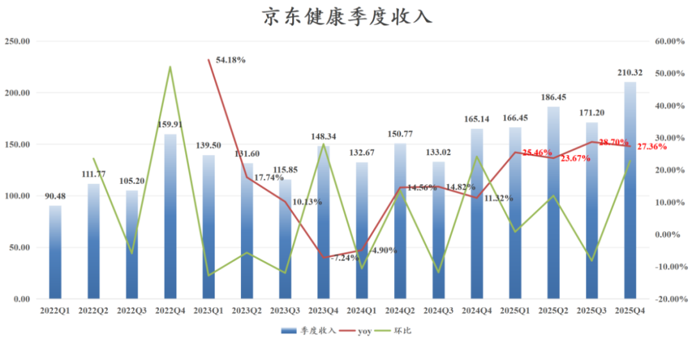
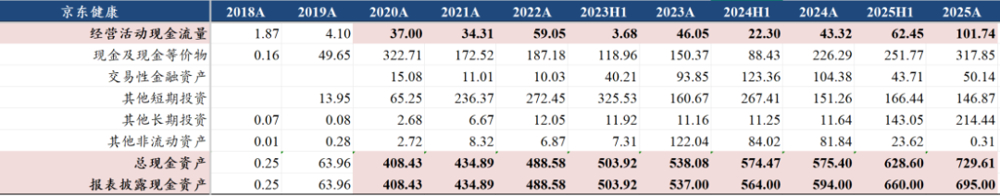
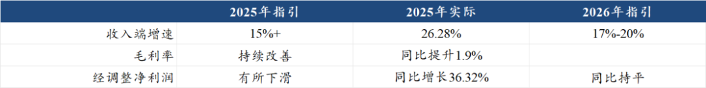
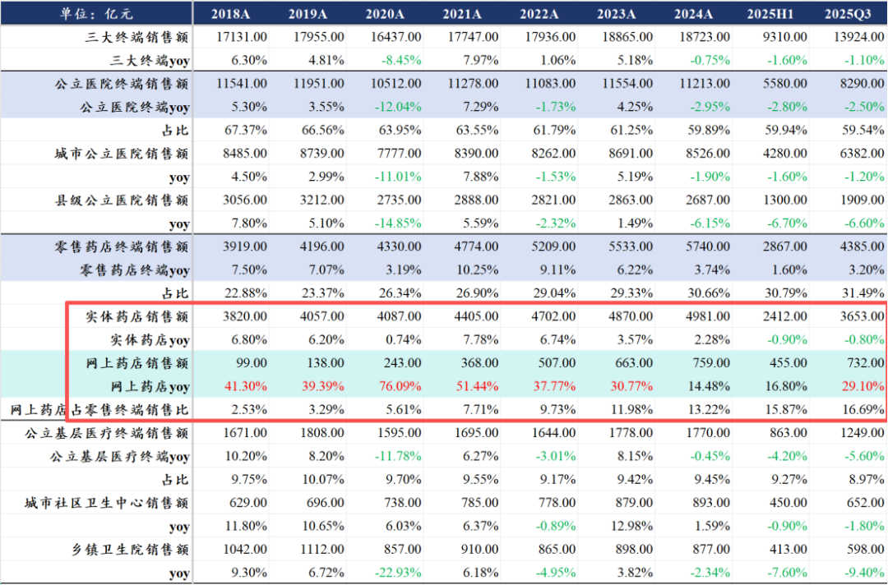
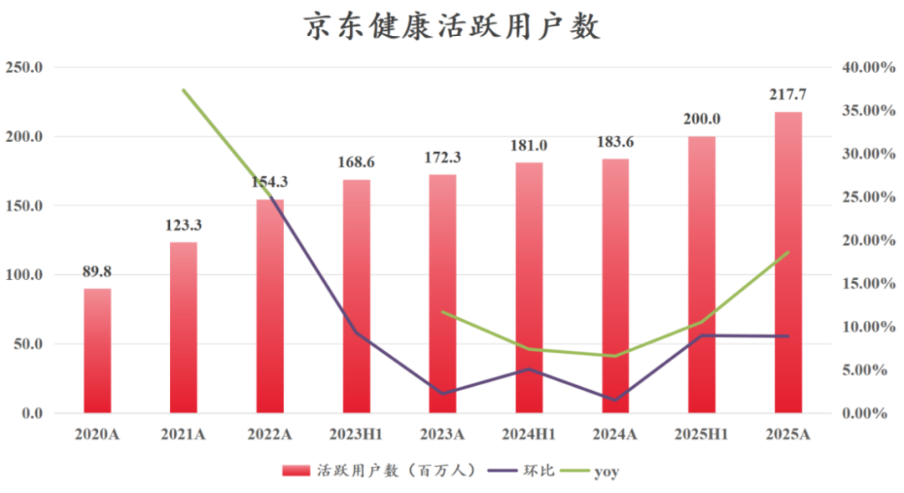
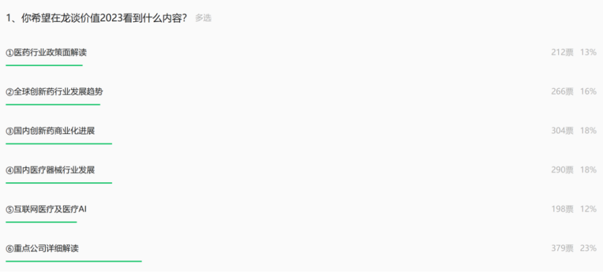
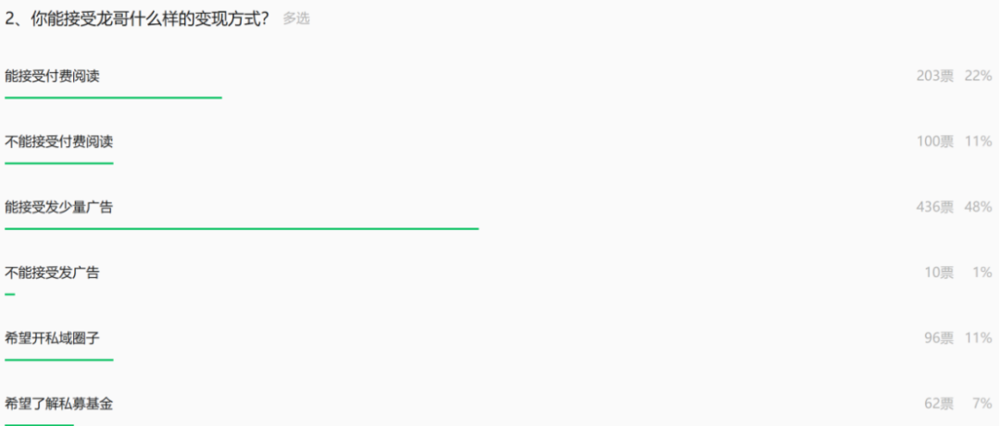

# 互联网医疗巨头表现亮眼

大家好，我是龙哥。

互联网医疗龙头京东健康在上周发布了2025年度业绩，业绩表现也比较亮眼，还记得去年京东健康发布超预期的中报后股价大涨两天，几乎就是去年以来的估值高位，而这次发布同样表现不错的业绩，股价相较1月的高位已经回撤接近30%，此时我们再来看看京东健康的经营质量和未来的成长潜力，对于读者们也会更有意义。

1、收入、现金流强劲

京东健康2025年全年营业收入734.42亿同比+26.28%，时隔两年后京东健康的收入增速重回25%以上的高增长；四季度单季度收入210.32亿元同比增长27.36%，单季度收入创历史新高，四个季度维持了比较均衡的增速，其中下半年相较上半年还有所加速。

由于京东健康和阿里健康的财报披露时间不同，阿里健康的财年是当年4月1日到次年3月31日作为完整财年（阿里健康的2026财年是我们通常认为的2025Q2-2026Q1），收入没法直接对比，但在可比的时间内：2025Q2-Q3这两个季度，京东健康的收入体量已经达到阿里健康的2.14倍，二者近年的差距持续扩大，在2019年时两家公司的收入体量还是差不太多的水平。

毛利率24.78%同比+1.90%，毛利率提升预计主要是业务结构变化，高毛利的平台、广告等服务收入占比提升，2025年商品收入608.85亿+24.77%，服务收入125.57亿+34.09%，服务收入占比提升1.0%到17.10%，而商品收入的毛利率只有高个位数到低双位数，服务收入的毛利率可以达到80%+。2025年履约费用率10.37%同比持平。

2025年归母净利润53.67亿+29.11%，经调整净利润65.33亿+36.32%。

公司2025年利息收入15.38亿同比减少4.23亿，投资收益为-8.43亿元同比减少14.67亿，这个主要是一脉阳光股权的影响，目前已经基本减持完；股份支付费用5.91亿元同比减少5.39亿元，公司的股权激励费用从最高2021年的25.8亿（那年刘强东拿了11.6亿的薪酬，预计大部分是股权）逐渐下降到2025年的5.91亿元，对归母净利润的影响也已经相对有限。

京东健康2025年经营现金净流量101.74亿元，截至2025年底的类现金资产合计730亿元。

公司对2026年的指引是收入端高双位数增长，经调整归母净利润持平，经营利润率稳中有升。公司的指引口径依然是过于保守。

回顾2025年初的全年业绩指引，公司指引2025全年收入端增速超过2024H2的增速（对应大概15%+）、毛利率改善、经调整净利润下滑，实际经调整净利润增长36%。

经营稳定的行业龙头公司对自己公司的业绩指引偏离可以这么大的也是比较少见的，公司应该反思，极保守的指引可以减少公司IR团队对外交流的负担，但是是对投资人的不负责。

2、经营变化

京东健康2025年有一些积极的变化，也有一些问题，我们来大致分析一下：

2025年积极变化：

①25年收入端逐季度超预期，受益于多个新兴重磅药物在京东健康线上药店首发和销售，尤其是降糖、减重、降尿酸、降脂等代谢类药物以及抗流感药物，包括信达生物的减重药玛仕度肽、卫材的失眠药物莱博雷生，还有3款国产抗流感新药青峰的玛舒拉沙韦、众生药业的昂拉地韦、济川/征祥的玛硒洛沙韦。

随着国内越来越多的创新药上市，新药上市之初在没有医保的时候，越来越多的选择在互联网医疗龙头平台上做药物首发，尤其是类似减肥药这种偏消费的流量品种，在京东健康这样的互联网医疗平台销售可以高效率的推广和配送，这很可能成为未来的一个趋势。

行业层面来看，线上药店的增速也是长期、大幅超过线下药店的增速：

②活跃用户数2.18亿人同比增长18.57%、环比增长8.9%，活跃人数增速恢复到2022年以来最高水平。京东健康的活跃用户数在2020-2022年有一波爆发，原因嘛大家都知道的，疫情的确是带来了医疗需求线上化的快速发展。

2022年京东健康的活跃用户数达到1.54亿人，但随后的2023-2024年分别同比增长11.67%和6.56%，疫情过去+高基数之下，增速明显放缓，而2025年活跃用户数增速重回高双位数。

③经营现金净流量102亿元大增135%，在手现金增加100亿+。电商的商业模式天生就是现金流充沛，当然京东健康历年的现金流波动都还是蛮大的，也没办法线性外推。

不过从他目前的经营状况大致推算，公司未来每年大几十亿以上的经营现金流大概率是可持续的，那么其现金积累的速度也会非常快，到26年底可能达到800亿左右现金，到27年底达到900亿左右现金。

④AI医疗的布局：公司在AI医疗的布局还是比较多的，去年我们也曾经将其作为AI医疗的核心标的之一。

i.to C端2025年推出“AI京医”，涵盖AI医生、AI药师、AI营养师等10多个专业智能体，提供医疗服务咨询、售前售后咨询。

ii.to B端智慧医院解决方案“AI卓医”已经落地华科附属协和、华科附属同济、温州医科大第一医院等，服务患者超500万人次，帮助医生进行患者管理、预问诊，不过这种“智慧医院解决方案”现在也挺卷的，京东健康切入进去做这种半to B半to G的项目还是有挑战的。

iii.to B端面向医生推出“智医”，还在试运行。

公司在AI医疗领域，院内院外、医生、患者端都有布局，应该是医疗行业内布局最全的，比阿里健康和蚂蚁更全，但京东健康不会做大规模营销，主要原因是现在对于AI医疗变现路径还不清晰，因此AI医疗这块虽然公司也做了一些研发投入，但短期没有做太大的营销投入，蚂蚁阿福此前营销投入大，但热了一段时间后也有些偃旗息鼓。

京东健康2025年也有一些不太好的情况，最主要的就是公司账上如此多的现金，但公司依然维持不分红、不回购。当然公司对此的表示是其目前仍然处于快速成长的阶段，成长阶段可能还是需要钱，并且在港股分红还得交20%的税，所以短期选择不分红。

医保覆盖方面，2025年没有太大的进展，目前O2O线上医保个账支付试点扩展到29个城市，B2C的医保支付仍然只有北京等个别城市试点，政策面的变化目前仍无法预测，未来如果某天互联网医疗平台全面放开医保支付，将是线上药店大幅加速、线下药店压力倍增的时间。

......

文末再说一下咱们上周一发起的投票，主要是2个问题，一个是大家对我们发布内容感兴趣的方向，另一个是大家能否接受龙哥做一些变现，参与投票的人数合计是542人，我们来看下结果：

第一个问题，关于大家感兴趣的内容，大家最希望看到的是重点公司详细解读（70%）和国内创新药商业化（56%），第三的是国内医疗器械行业发展（54%）。去年我们大多数的文章都是谈行业为主，既然大家还是想看重点公司的解读，今年也会增加对各个细分领域龙头公司的解读，国内创新药商业化进展这块我们倒是一直讲的不少，也会继续下去。

医疗器械去年有少量文章涉及，主要是我们去年判断行业政策面企稳、基本面还未企稳，会有滞后性，今年对器械板块的解读还是会重点集中在出海的增量做的比较好的公司。

让我比较意外的是对互联网医疗和AI医疗关注度居然是最低的，可能也是因为25年初AI医疗爆炒了一把之后全面miss。但AI的进步大家有目共睹，现在调研多数公司都会提到AI的助力。

第二个问题是问问大家能否接受一些变现方式。80%的参与投票的读者都是选择能接受少量广告，先感谢大家的包容。对于付费阅读的问题投票的300多人里有三分之一不能接受（占比18.5%）、三分之二可以接受（占比37.5%），不得不说国内对于知识付费的接受度的确在提高，能接受付费阅读的读者比例居然能达到这么高是我很意外的。

.......

近期重点文章：

[全球创新药群雄逐鹿](https://mp.weixin.qq.com/s?__biz=MzkyMzQ3MDc3Mw==&mid=2247485696&idx=1&sn=2002ef1aefbfe45d2c08e9865819c21f&scene=21#wechat_redirect)

[从BD交易趋势看全球创新药产业链重大变化](https://mp.weixin.qq.com/s?__biz=MzkyMzQ3MDc3Mw==&mid=2247485637&idx=1&sn=071db5edaba9683f86385cb488c291e7&scene=21#wechat_redirect)

[医保砍价，股价历史新高](https://mp.weixin.qq.com/s?__biz=MzkyMzQ3MDc3Mw==&mid=2247485589&idx=1&sn=3da758317db21b4529507e894a75d500&scene=21#wechat_redirect)

[中国医疗器械全球化路径](https://mp.weixin.qq.com/s?__biz=MzkyMzQ3MDc3Mw==&mid=2247485569&idx=1&sn=4fb6ee854b13ff09385b88fb3c638409&scene=21#wechat_redirect)

风险提示：本文仅讨论行业/公司经营情况，投资需综合考虑公司经营、估值、管理层等多方面因素，建议读者审慎参考，本文不作为投资依据，不建议大家根据本文做出投资计划。

<!-- wxmp-comments-begin -->

---

## 留言（11 条，含回复共 22 条）

- **听涛观海** 👍3 · 2026-03-16 16:13
  体量越大的公司继续压迫小公司的成长，小微公司活的越来越难
  - ↳ **作者** · 2026-03-16 16:17
    绝大多数行业都是从行业发展初期诸多竞争者，到后续逐渐龙头强者恒强、行业集中度提升，这是产业良性发展的过程。不要老是以一种悲悯的心态去看世界，你是投资人，不是佛祖。
- **俫佧光域 飞扬** 👍3 · 2026-03-16 16:14
  感觉大A似乎没有像样的互联网医疗公司，虽然有一个互联网医疗指数，请问是这样吗？
  - ↳ **作者** · 2026-03-16 16:18
    你应该说，A股都没有啥像样的互联网公司[捂脸]这不一样的嘛~
- **累了就睡** 👍2 · 2026-03-16 16:08
  AI医疗感觉有故事可以讲一讲的
  - ↳ **作者** · 2026-03-16 16:10
    虽然目前商业化还没有什么进展，但只要未来有好的商业化路径，京东健康还是比较有可能跟上的，AI医疗这块确实可以把京东健康作为一个重点公司关注。
- **天涯过客** 👍2 · 2026-03-16 17:09
  龙哥，泰格今年有望重回正增长吗？
  - ↳ **作者** · 2026-03-16 17:09
    收入利润应该今年都会挺不错的。
- **大内总管** 👍2 · 2026-03-16 22:14
  回答一下龙哥的几个问题 哈哈哈
  一、互联网医疗关注度低 可能是因为该类标的多在港股
  二、接受付费程度好，是大家觉得确实能在龙哥这得到靠谱的知识及信息[得意]
  - ↳ **作者** · 2026-03-16 22:39
    是的，互联网医疗本身标的没那么多，一直没有作为一个大家比较关注的板块，属于医药投资人和互联网投资人都容易忽略的板块，实际上就在医药行业来说，我认为互联网医疗比连锁药店的研究和投资价值还是要更高的。
- **希真书童 (Terence Fang)** 👍1 · 2026-03-16 16:05
  Al医疗，医渡科技，龙哥怎么看？
  - ↳ **作者** · 2026-03-16 16:13
    就是比较便宜。他这个AI医疗主要是to G/to B，可以类比下讯飞医疗科技，商业模式上还是差些意思，市场也因此不愿意给估值。
- **勇敢的十六宝** 👍1 · 2026-03-16 16:49
  迈瑞是怎么回事啊？
  - ↳ **作者** · 2026-03-16 16:54
    等他出年报你就知道了，基本还是压力很大
- **随遇而安的懒鬼** · 2026-03-16 16:59
  C端AI医疗的变现短期来看还是比较早期，B端逻辑倒是还可以，总的来说还可以再观察观察
  - ↳ **作者** · 2026-03-16 17:09
    是的，但是京东健康优势还是在C端，在B端现在挺卷的，需求也没完全起来，京东健康看起来没太大优势在B端。
- **王宁** · 2026-03-16 18:01
  美团的医疗体系怎么样，好像增长很快，现在达到京东和阿里体量的一半有吗？
  - ↳ **作者** · 2026-03-16 18:10
    O2O的增长的确比较快，所以京东健康这两年也在发力做O2O，但总体和B2C的终端销售规模还差着数量级，一个是几百亿的体量，一个是2000亿+的体量。
- **dolphin邹** · 2026-03-17 11:32
  文中“卫材的降尿酸药物莱博雷生”好像有错哦，是多替诺雷片（商品名：优乐思）
  - ↳ **作者** · 2026-03-17 11:36
    感谢指出错误，是失眠药物莱博雷生，感谢感谢[抱拳][抱拳]
- **俫佧光域 飞扬** · 2026-04-01 13:21
  A股也有一个互联网医疗指数，但似乎不咋样[破涕为笑]
  - ↳ **作者** · 2026-04-01 13:25
    A股有互联网医疗公司吗[翻白眼]

<!-- wxmp-comments-end -->
