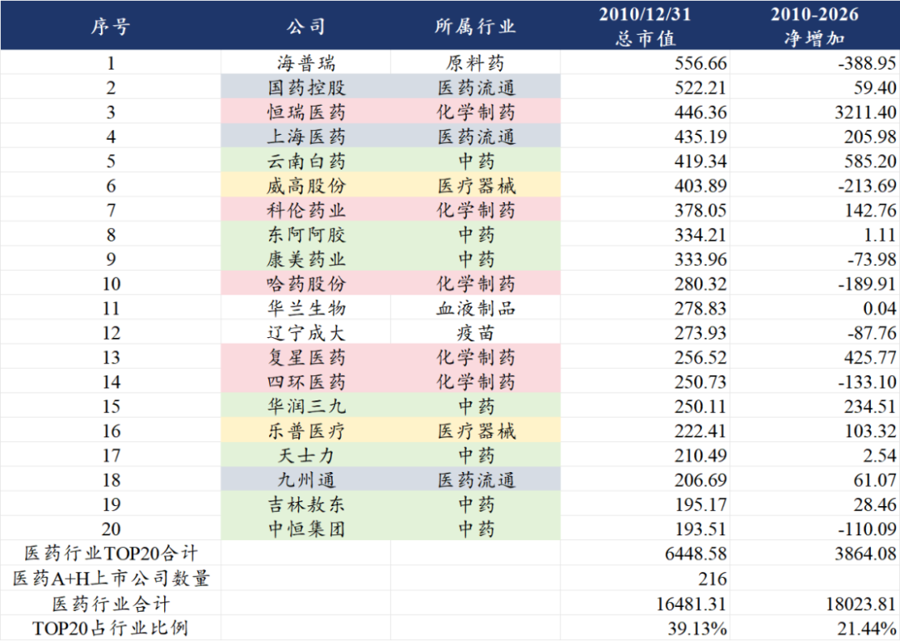
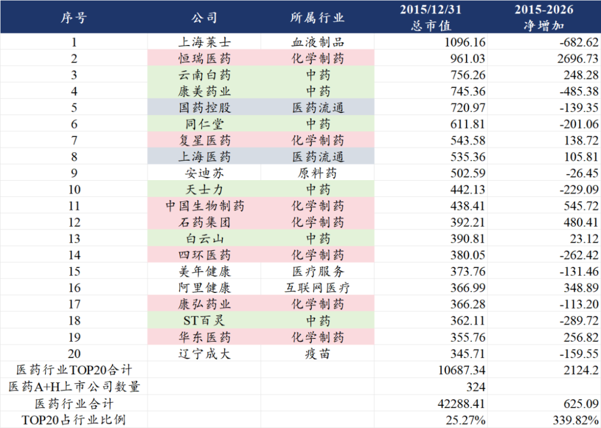
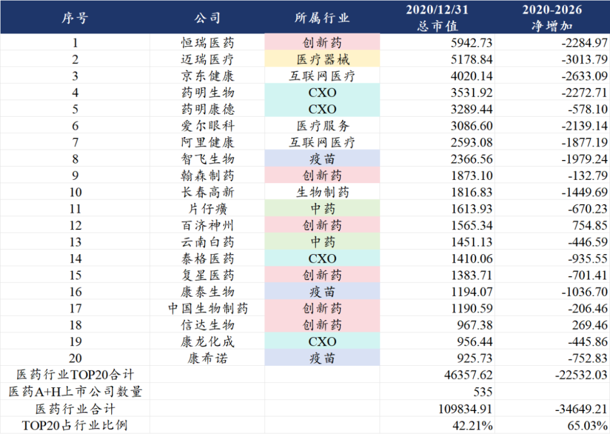
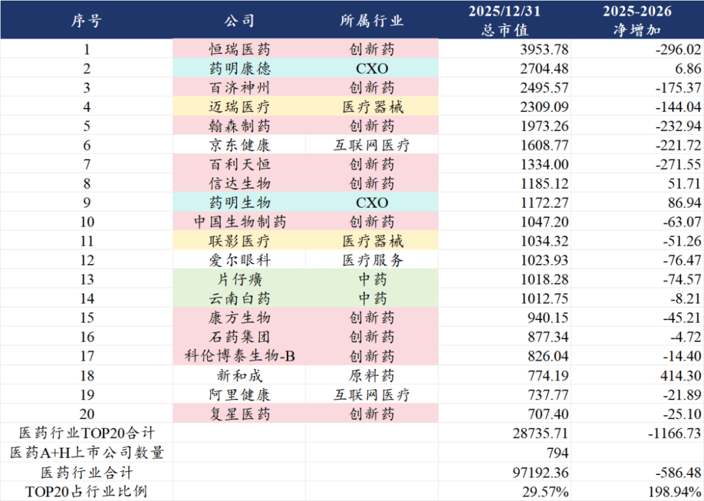
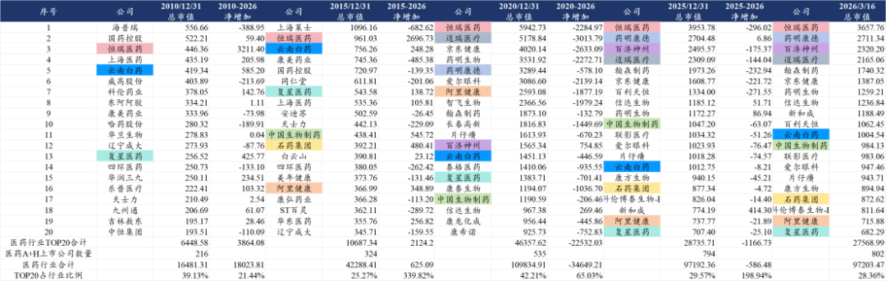
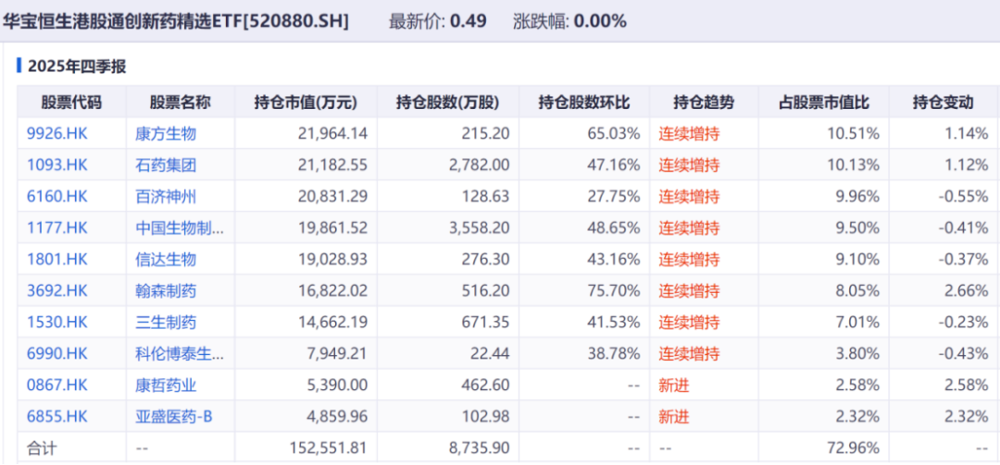
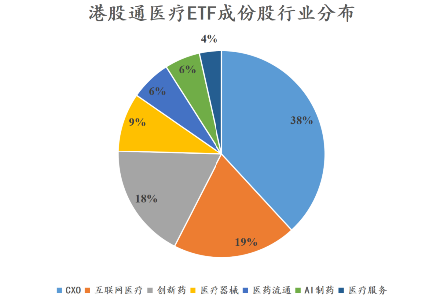

# 医药TOP20变迁，十五年的轮回

大家好，我是龙哥。

本文我们来回顾一下过去十五年间，医药行业市值TOP20公司的变迁情况。不同时期的行业大市值公司的变化，能反映不同时期市场的偏好，但更多的还是反映时代背景与产业发展趋势，以史为镜，看产业发展在资本市场的映射。

我们先就几个关键时间点来分析，然后汇总行业历年变化情况来分析总结。

**1、2010年，中药巅峰**

2010年医药行业总市值达到1.65万亿元，上市公司合计216家，平均市值76.3亿元。市值TOP20的公司中，包括7家中药、5家化学制药、3家医药流通股、2家医疗器械、1家血制品、1家疫苗、1家原料药。

看到这些公司，还是挺让人唏嘘的。

当年中药注射剂大行其道，中恒集团是一年半涨10倍的超级牛股，至今还是腰斩不止；康美药业达成医药行业最大财务造假案的成就，在整个A股历史上也是能排进前几的反面教材；品牌中药龙头东阿阿胶十五年过去、市值仍在原点；去美国开复方丹参滴丸的III期临床开了20多年的天士力也还在原点打转；中药消费品的龙头公司，云南白药算基业长青。

后来的创新药龙头恒瑞医药在此时已经崭露峥嵘，创新药转型另一家头部公司复星医药也已经榜上有名。

器械领域，威高股份在2010年仅有25亿收入，如今收入规模已经超过130亿，市值反而腰斩。

**2、2015年，化学仿制药快速成长**

到2015年，医药行业总市值达到4.23万亿元+157%，上市公司合计324家+50%，平均市值130.5亿元。市值TOP20的公司中，包括7家化学制药、6家中药、2家医药流通股、1家血制品、1家原料药、1家互联网医疗、1家医疗服务、一家疫苗。

后来转型创新的化学制药龙头们在2015年已经尽显强势，专科仿制药成就了一众大牛股，包括恒瑞、复星、中生、石药四家头部pharma位列其中，华东医药、康弘药业、信立泰、丽珠集团等大家耳熟能详的公司快速崛起。此时的恒瑞医药已经有2款创新药上市。

此时医药行业历史留名的两大庄股——上海莱士、康美药业分别位列行业第一和第四，两个庄股最终都在2018年化为一地鸡毛。

**3、2020年，创新药+CXO首次爆发**

2020年，医药行业总市值达到10.98万亿元+160%，上市公司合计535家+65%，平均市值205.3亿元。市值TOP20的公司中，包括6家创新药、4家CXO、3家疫苗、2家中药、2家互联网医疗、1家生物制药、1家医疗器械、1家医疗服务。

2020-2021年，医药行业的巅峰，11万亿总市值、17家千亿市值上市公司至今未能超越。

2018年港股18A、2019年科创板第五套规则，资本市场新规则全面向创新药械张开怀抱，叠加新冠疫情带来的行业关注度历史最高，上市公司数量激增，创新药、创新器械一二级市场大爆发。疫苗行业在长春长生疫苗造假低谷中走出来，在疫情中成为涨幅最惊人的板块，体外诊断、低值耗材、医疗设备等医疗器械细分行业也；CXO也迎来历史最好的产业发展阶段，一二三线CXO公司集体暴涨。

当时的535家公司至今总市值仍净减少3.46万亿元，其中TOP20的企业总市值减少2.25万亿元，平均每家公司损失1100亿市值，恒瑞医药、迈瑞医疗、京东健康、药明生物、爱尔眼科各损失超2000亿市值。疫苗板块从超级成长行业跌落谷底，成为医药行业市值损失最大的子领域之一，智飞、康泰、康希诺、沃森、万泰、华兰、百克等公司合计损失超5000亿市值。

这一场轰轰烈烈的医药牛市所造就的泡沫破灭，5年后的今天仍有部分公司在“消化”当时的估值和预期。但每一个新兴产业发展的早期又何尝不是会经历这样的过程。

**4、2025年，创新药重新换发生机**

2025年医药行业总市值达到9.72万亿元，上市公司合计794家+48%，平均市值122.4亿元，平均市值仅有2020年的60%。市值TOP20的公司中，包括10家创新药、2家CXO、2家医疗设备、2家中药、2家互联网医疗、1家原料药、1家医疗服务。

从2023年下半年开始，国内创新药产业的投资逻辑逐渐开始清晰，创新药出海+国内政策转向和商业化加速，行业很多biotech公司跌到净现金水平，产业逻辑明确、估值低谷。

但在这样的情况下，行业从2023年下半年到2024年下半年又在底部折磨了大家一年时间，才终于迎来修复和爆发，到2025年底，创新药已经占行业市值TOP20的半壁江山，CXO基本面也重回升势、估值得以修复。

今天的创新药行业所展现的全球竞争力，已经远非5年前以me too/slow follow管线为主的行业所能相比。今天的CXO行业历经一系列政治因素考验后仍展现的强大全球竞争力，也远非5年前新冠疫情下全球产能紧缺所能相比。

尽管中间还是充满波折，近半年又是进入hard模式，但基本面的蓬勃向上还是让我们对全年比较有信心。

**5、行业十五年变迁，谁是常青树？**

过去15年，医药上市公司的数量以每5年增加50%左右的速度快速扩张，一方面是给投资人带来很多新的优质公司的选择，确实有不少我们看好的优质企业都是近5-7年上市的，但另一方面来说这种无限制的IPO和增发融资也给行业和不少投资人带来烦恼。

纵观过去15年医药行业大市值公司的变化，有3家公司是医药行业“常青树”，分别是恒瑞医药、云南白药、复星医药，在产业从中药→专科仿制药→创新药的发展历程中始终能站在行业前端甚至是潮头之上。

恒瑞医药我们过去讲的比较多，公司在面对每次产业大的变革时都能积极且领先的转型，到今天我们说其国内创新药管线可能在至少未来5年没有公司能与之有一战之力。

云南白药和复星医药，则是一定程度上靠其投资能力维持产业地位，尤其是复星系，我们回首来看，其投资能力有余而运营能力不足，尤其是在细胞治疗、mRNA疫苗、手术机器人等全球前沿技术领域在国内的布局都很早，但都没能有好的成果。

新一批的“常青树”已经出现。CXO里的药明康德、药明生物，医疗器械里的迈瑞医疗、联影医疗，互联网医疗里的京东健康、阿里健康，都还在不断强化分别所处领域的竞争优势，这三大领域要出现能挑战这6家行业细分龙头的公司的概率已经不高。

而行业主线——创新药的竞争，未来还会愈发激烈和精彩。

国内市场来看，头部pharma的竞争优势难以被超越，目前看为数不多有机会晋升国内头部pharma的biotech/biopharma公司里，信达生物已经锁定一个位置。

全球化仍将是创新药公司实现对国内传统pharma弯道超车的核心驱动力，百济、康方、信达、科伦博泰、百利天恒等公司能跻身TOP20，莫不是靠广阔国际市场的机遇，未来随着研发管线的推进，还会有诸多波折，后来者也仍有机会！

**6、行业ETF，锁定常青树公司**

行业ETF由于主要以市值为权重，基本不会错过行业龙头公司，能享受行业龙头公司的复利，也能根据市值变化调低与产业趋势脱节、市值萎缩的公司的权重，因此我们基于3-5年前写公众号时候吃的亏，近2年反复强调行业ETF的价值。

以我们此前聊过的520880港股通创新药ETF为例，虽然持仓根据指数成分股调整情况会有变动，但TOP20的头部创新药公司永远都在权重股名单里，只要产业在顺畅的向前发展，再规避一下类似去年“药捷安康事故”这种坑，总归是好过大部分上蹿下跳的单一个股。

除了港股通创新药ETF以外，还有另一个有意思的ETF，今年新上的159137港股通医疗ETF，成份股覆盖头部CXO、互联网医疗、创新药、医疗器械公司，其中药明系3家公司占32.1%，互联网医疗3家头部公司占18.8%，AI制药的晶泰控股占5.46%，可满足港股医药行业除创新药以外的需求。

......

近期重点文章：

[那些“严重低估”的公司，后来怎么样了？](https://mp.weixin.qq.com/s?__biz=MzkyMzQ3MDc3Mw==&mid=2247485735&idx=1&sn=d2252fb149e35ac9b92d617d03b0c44e&scene=21#wechat_redirect)

[港股通调整，哪些公司值得关注](https://mp.weixin.qq.com/s?__biz=MzkyMzQ3MDc3Mw==&mid=2247485722&idx=1&sn=0ab2f9225b98f03816e38e7b86121a36&scene=21#wechat_redirect)

[从BD交易趋势看全球创新药产业链重大变化](https://mp.weixin.qq.com/s?__biz=MzkyMzQ3MDc3Mw==&mid=2247485637&idx=1&sn=071db5edaba9683f86385cb488c291e7&scene=21#wechat_redirect)

[BD交易之后，创新药下一个爆点](https://mp.weixin.qq.com/s?__biz=MzkyMzQ3MDc3Mw==&mid=2247485517&idx=1&sn=4165772f7153d7557d469892fbced90b&scene=21#wechat_redirect)

风险提示：本文仅讨论行业/公司经营情况，投资需综合考虑公司经营、估值、管理层等多方面因素，建议读者审慎参考，本文不作为投资依据，不建议大家根据本文做出投资计划。

<!-- wxmp-comments-begin -->

---

## 留言（9 条，含回复共 17 条）

- **尘缘** 👍2 · 2026-03-18 12:44
  基业长青，则市值长青。踏实做好主业，紧跟时代步伐。
- **嘀嗒** 👍1 · 2026-03-18 12:10
  器械是没有最低只有更低啊。龙哥，是不是年报很差啊
  - ↳ **作者** · 2026-03-18 12:13
    那得看你说的哪个器械，你要是说的迈瑞，那预计是很差，其他的器械有不少不错的，小一点的公司里归创昨晚出业绩就很好。
- **Zg** 👍1 · 2026-03-18 12:12
  下周二药明三傻大考的日子，求求带波情绪吧[捂脸]
  - ↳ **作者** · 2026-03-18 12:13
    药明三家去年的业绩都比较明确了，可以看看三家公司给今年的指引情况。
- **Marx** 👍1 · 2026-03-18 12:17
  龙哥 中午好 一直想请教一个问题 您怎么看迈瑞 切换到2026年 能不能按照20倍估值 100亿利润 来看迈瑞呢
  - ↳ **作者** · 2026-03-18 12:22
    正常来说可以这样预期的。
    企业下行期的时候往往会比大家线性外推的要更差，上行期也是一样。25年的迈瑞就是这样，叠加公司调控季度业绩释放节奏。
- **田霖** 👍1 · 2026-03-18 12:39
  港股创新药etf还有可能回到2025年初吗
  - ↳ **作者** · 2026-03-18 12:42
    感觉有难度，经过一年多，行业不论是业绩还是逻辑，市场认可度有提升不少，回到那个预期很低的时候的概率比较低吧。
- **大喵金** · 2026-03-18 12:13
  非常感谢分享
  - ↳ **作者** · 2026-03-18 12:14
    [握手][握手][握手]
- **廖书豪** · 2026-03-18 12:28
  上次说下了（奶了口）君实阶段反弹了...希望百济和百利两龙头给点力[捂脸]
  - ↳ **作者** · 2026-03-18 12:41
    先发年报的一般都是业绩比较好、比较有信心的，就像考试先交卷的一般都是学习好的[破涕为笑]
- **Peach tree.** · 2026-03-18 12:47
  刚关注您，请问现在开始定投这两只是合适的时机吗？
  - ↳ **作者** · 2026-03-18 12:51
    刚关注的话要么多翻翻历史文章，要么多关注一阵子，投资不要轻易下决策
- **sym** · 2026-03-18 13:05
  龙哥，您对智翔金泰有啥看法，我觉得未来一年应该要爆发了
  - ↳ **作者** · 2026-03-18 13:14
    商业化品种是密集上市期了，就是品种大多是低效重复研发的品种，看商业化能不能有点改善吧。

<!-- wxmp-comments-end -->
