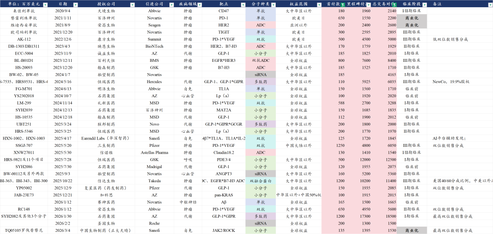

# 什么样的项目在出海时能成为超大deal

大家好，我是龙哥。

今天我们讲一个简单的逻辑，复盘来看，到底什么样的创新药项目在海外授权时能达成超大规模的deal？

筛选逻辑很简单，首付款超1亿美元+总交易对价超15亿美元（100亿人民币），然后我们来看看历史上曾经达成这些交易的项目具有什么特点。

我们去掉了一些基于技术平台的产品组合授权而看起来规模特别大的交易，例如石药、晶泰、和铂、科伦博泰等都曾有过这类的交易，这类交易当然也有价值，但我们本文主要想讨论就具体单个项目或分子而言的情况。

在我们梳理的中国创新药海外授权的289个项目中，能达成以上要求，首付款≥100m USD、交易总包≥1500m USD的项目合计只有32个，如果进一步把总包的规模提高到2500m USD，则只有13个项目了，占比只有4.5%。

1）疾病领域：

肿瘤15个（占比46.9%），代谢10个（占比31.3%），自免及呼吸4个（占比12.5%），中枢神经1个。

耳熟能详的超级大项目，康方、礼新、三生、信达、荣昌授权的IO双抗，百利天恒授权的双抗ADC等大多出现在肿瘤领域。

自免领域3个项目都是首付款1-1.5亿美元、交易总包10-15亿美元，目前尚未出现超级重磅项目；呼吸领域恒瑞的PDE3/4+另外11个项目达成5亿首付款+120亿美元里程碑付款的超大总包，一定程度上还是基于技术平台和广阔产品线。自免是全球仅次于肿瘤的药物领域，是超级大药的温床，但在国内创新药出海时始终未能出现标志性的大项目。

心血管代谢领域达成的10笔重磅交易，3笔降血脂领域、7笔GLP-1相关代谢领域，其中交易规模较大的，恒瑞的GLP-1系列产品组合的newco、舶望的siRNA技术平台的3款药物、石药集团GLP-1系列4款药物组合+长效给药技术平台。

2）分子类型：

小分子10个（占比31.3%），双抗/多抗6个（占比18.8%），ADC药物5个（占比15.6%），单抗5个（占比15.6%），多肽3个（占比9.4%），siRNA药物3个（占比9.4%）。国内还是很擅长做小分子，新技术领域在不同发展阶段百花齐放，小分子却是经久不衰。

3）药物定性：

对于分子的定性我们分为First in Class（FIC，同靶点/机制的全球首个）、潜在Best in Class（潜在BIC，已有同靶点药物上市、仍有机会做到同类最佳）、潜在FIC/BIC（非全球进度首位，但尚未有同靶点药物上市，仍有机会成为FIC/BIC）、大病种管线布局需要（MNC为了优势大病种领域管线布局而引进的项目）、me too药物（已有竞品上市且未见明确差异化竞争优势的项目）。

以上类型的分子分别为：

FIC项目4个，占比12.5%，康方PD-1\*VEGF，百利天恒EGFR\*HER3 ADC，信达PD-1\*IL-2α，中国生物制药JAK2\*ROCK。FIC项目的单个项目首付款和总包天花板很高，首付款可以达到5-10亿美金，总包可以达到50-100亿美金。

潜在FIC/BIC项目9个、潜在BIC项目3个：单个项目的交易总包基本在20亿美金上下。

大病种管线布局需要项目15个，心血管代谢领域6个项目是此类管线，除了IO双抗外的项目价值较高为，其他此类项目的单项目首付款基本是1-2亿美元，交易总包15-20亿美元为主，这已经是此类项目里最优质的一批的表现。

4）临床阶段：

在以上重磅项目海外授权时全球最快研发阶段来看，处于商业化阶段的有3个（占比9.4%），处于III期临床阶段的有6个（18.8%），处于I/II期临床阶段的有16个（50%），处于临床前阶段的有5个（15.6%）。

5）合作方：

32个项目中有25个是与MNC的合作（占比78%），5个是与有一定商业化能力的知名biopharma合作，1个newco合作，1个biotech合作。

......

就以上数据对比来看，我们大致可以得出以下结论：

①动辄3-5亿美元首付款、数十亿美元交易总包的预期，实际大多都是不现实的，现在很多投资人还看不上1亿美元首付款的交易（例如加科思的pan KRAS）。实际上能达到1亿美元+首付款、30亿美元+交易总包的已经是所有出海项目中的前4%，这种交易规模在全球都算是稀缺的。

②肿瘤、代谢领域比较容易出现重磅的deal，自免领域至今尚未有标杆性的大项目，我们认为可能与肿瘤、代谢领域近年新技术平台发展比较多有关，自免领域近年显著的研发趋势是双抗（自免传统靶点排列组合双抗、或者自免TCE双抗），但普遍交易规模不大，有些公司只能做newco低价卖出去。

③掏钱大方还是得看MNC，与一众biotech、biopharma甚至newco谈来谈去也谈不出重磅的交易，且后续临床推进的不确定性会显著高于MNC。

④国内确认商业化成药并不能提升大额BD交易的概率，反而概率还要低不少；处于II期和III期临床阶段的项目达成大额BD的概率更高。

......

近期重点文章：

[医药TOP20变迁，十五年的轮回](https://mp.weixin.qq.com/s?__biz=MzkyMzQ3MDc3Mw==&mid=2247485777&idx=1&sn=ba8657fd715a74ce3c30b09fca229635&scene=21#wechat_redirect)

[那些“严重低估”的公司，后来怎么样了？](https://mp.weixin.qq.com/s?__biz=MzkyMzQ3MDc3Mw==&mid=2247485735&idx=1&sn=d2252fb149e35ac9b92d617d03b0c44e&scene=21#wechat_redirect)

[全球创新药群雄逐鹿](https://mp.weixin.qq.com/s?__biz=MzkyMzQ3MDc3Mw==&mid=2247485696&idx=1&sn=2002ef1aefbfe45d2c08e9865819c21f&scene=21#wechat_redirect)

风险提示：本文仅讨论行业/公司经营情况，投资需综合考虑公司经营、估值、管理层等多方面因素，建议读者审慎参考，本文不作为投资依据，不建议大家根据本文做出投资计划。

<!-- wxmp-comments-begin -->

---

## 留言（6 条，含回复共 10 条）

- **十里春风不入秋** 👍4 · 2026-03-19 13:40
  创新药的内部环境和外部环境也太复杂了，感觉半年的回调时间和力度都不够，还得磨底啊[苦涩]
- **范征** 👍1 · 2026-03-19 13:21
  龙哥，全球降息延迟甚至取消，今年如果不降息了，对于创新药板块来说应该是最大利空了。
  - ↳ **作者** · 2026-03-19 13:37
    是的，流动性是行业最大β影响因素，尤其港股。
- **ACE** 👍1 · 2026-03-19 13:24
  [强]
- **魏小魏** · 2026-03-19 13:24
  上次还调侃创新药，现在我发现都是坏蛋，整个都没有好东西 [流泪]   我不要验牌了，谁需要我给他擦皮鞋
  - ↳ **作者** · 2026-03-19 13:37
    来上海我给你擦皮鞋
- **廖书豪** · 2026-03-19 16:26
  请教个宏观问题：看原油期货现在是在贴水，如果转升水，是不是会拉到全球股市一起爆，基本要出现流动性危机，这种情况除了配置期货对冲，怎么避免或减少损失呢[捂脸]
  - ↳ **作者** · 2026-03-19 17:07
    系统性风险看不清的时候就减仓啊。还能怎么应对[捂脸]
- **王晨潮** · 2026-03-20 12:32
  龙哥，最近的地缘因素会影响BD出海速度吗？
  - ↳ **作者** · 2026-03-22 18:26
    地缘政治因素影响的核心不是BD出海的速度，还是流动性因素，而创新药对流动性极其敏感。

<!-- wxmp-comments-end -->
