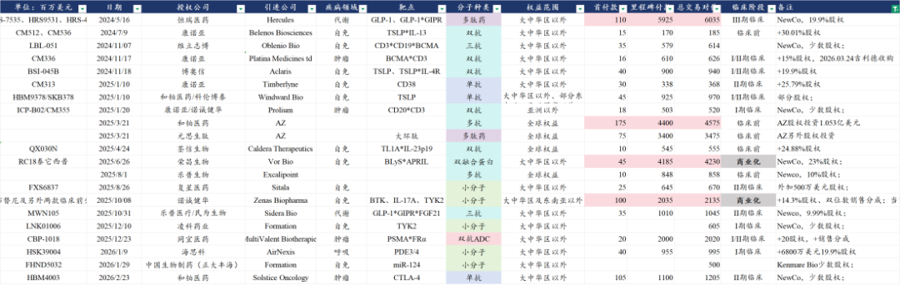
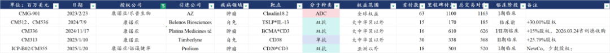
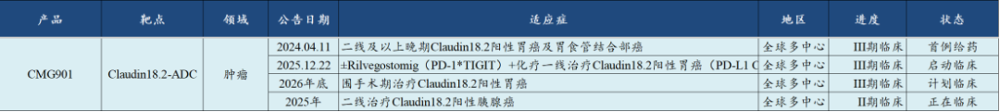
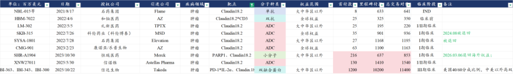

# 中国创新药出海，新的里程碑

大家好，我是龙哥。

今天一早，康诺亚发布好消息，Ouro Medicines最新与吉利德科学签署并购协议，吉利德科学以16.75亿美元首付款+5亿美元里程碑付款收购Ouro，康诺亚可以获得2.5亿美元首付款+7000万美元里程碑付款。

这是康诺亚在2024年11月做的一笔Newco交易——1600万美元首付款+6.10亿美元里程碑付款+Oure Medicines少数股权（PML为其全资子公司）将BCMA\*CD3双抗的海外权益授权给Platina Medicines td。

为什么说这是一个中国创新药出海又一个里程碑式的事件呢，这我们首先要回顾一下创新药公司为什么要做这种newco的交易模式。

早在2023年8月，恒瑞医药将其TSLP单抗的海外权益授权给One Bio，恒瑞医药获得2500万美元首付款+10.25亿美元里程碑付款。该公司后改名为Aiolos Bio，仅仅在5个月后的2024年1月，GSK以10亿美元首付款+4亿美元里程碑付款的总交易对价收购了Aiolos Bio，相当于5个月时间转手赚了10亿美元，而恒瑞医药则还是只能捧着之前与One Bio的交易，区别是合作方转为GSK，但并没有给恒瑞带来额外的现金收益。当然我们知道这笔交易很可能促成了恒瑞后续与GSK的超大BD交易，那是后话。

被伤透心的恒瑞医药，随后就引领了国内创新药出海的另一个方向——做Newco交易，简单说就是在BD交易中与海外资本和小biotech合作时不仅要首付款、里程碑和销售分成，还要拿到部分股权。

2024年5月恒瑞医药率先达成了一笔规模庞大的Newco交易，以1.1亿美元首付款+59.25亿美元里程碑付款+19.9%股权将GLP-1系列产品组合的海外权益授权给Hercules（Kailera前身），2025年10月14日，Kailera完成6亿美元的B轮融资，2025年12月16日，Kailera启动了GLP-1\*GIPR双靶点激动剂的3项全球III期临床。

从恒瑞这笔Newco交易之后，国内陆续又出现了一系列的newco交易：

其中又以康诺亚最为突出，康诺亚近3年做的5笔BD交易中，除了与AZ合作的Claudin18.2-ADC以外，另外4笔都是以Newco方式进行海外授权，交易首付款和总包的规模都不大，都每笔交易都有一定规模的合作方股权。

而本次吉利德收购Oure Medicines，是第一笔真正意义上的中国Newco出海项目被MNC收购，是中国创新药公司做Newco交易这个商业模式的跑通。

在此以前，Newco模式出海几乎已经完全不被市场认可，尤其是在市场高度重视首付款和交易总包的环境下，Newco模式由于首付款和总包规模普遍不大，且合作方大多是小biotech，资金实力弱、临床开发执行力不确定，因此基本不被投资人给估值。

实际上本次康诺亚交易的BCMA\*CD3双抗在我们的估值模型中也没有给海外估值预期，但这样反而是给了大家惊喜，康诺亚可以拿到17亿元的首付款，还有5亿元的潜在里程碑付款，并且原本BD交易中的里程碑付款和销售分成也将由吉利德科学继续支付。

天才与疯子只是一念之差，Newco公司能被MNC收购，就是一笔绝佳的、载入史册的交易，不能被MNC收购，则是石沉大海的期权。

对于康诺亚来说，原本市场有所预期的是其另外一笔BD交易——TSLP\*IL-13自免双抗的Newco公司可以再授权或者直接被MNC收购，我们在去年也以多篇文章介绍自免双抗的潜力。这笔交易在2025年以来迟迟未能落地，反而是BCMA\*CD3双抗先被收购，BD交易从单个项目来说就是这样有一定的偶然性，但只要能达成，总归是好事。

对于吉利德科学来说，过去主要聚焦在抗病毒（HIV、乙肝、丙肝等）和肿瘤领域（CAR-T、ADC），在自免领域的管线布局相对不多且大多处于早期，本次引进的BCMA\*CD3双抗也是用于开发自免适应症，算是吉利德科学向着自免这个超大疾病领域的又一次尝试。

......

康诺亚海外授权的项目中还有另一款值得关注的项目：CMG901（Claudin18.2-ADC）

这是康诺亚/乐普生物在2023年2月与顶级MNC之一的阿斯利康达成的BD交易，康诺亚和乐普生物分别占70%和30%的权益比例。

这笔交易虽然规模也不算太大，但AZ是切切实实在推进该项目，拿到该项目权益一年后AZ就启动了首个二线胃癌的全球III期临床，这个III期临床在25年以超预期的速度完成了患者入组，并且预计在26年上半年有望读出III期结果，则2026年下半年可能会申报上市。

阿斯利康在2025年底启动了CMG901的第二项全球III期临床，联用其PD-1\*TIGIT双抗+化疗一线治疗Claudin18.2阳性的胃癌，计划全球入组2500例患者，也是因为该一线胃癌III期临床的启动，康诺亚收到了4500万美元的里程碑付款。阿斯利康还规划了胃癌围手术期治疗的全球III期临床，预计2026年底启动，计划入组1200人。另外阿斯利康还有一项二线胰腺癌的适应症在II期临床。

以上4项II期和III期临床合计计划入组超4000例患者，阿斯利康也是舍得投入的。

由于国内Claudin18.2-ADC的竞争格局较差，这个靶点一直被低估。中国此前海外授权了一系列的Claudin18.2靶点的分子，但实际推进下去的寥寥无几，基本是被退货的退货、终止的终止、没进展的没进展，目前真正启动全球III期临床的也只有AZ引进的这款CMG901。

欧美市场在创新药的竞争格局方面的确与国内存在较大差异，同时胃癌在中国是高发癌种，在欧美则没有那么高发，因此国内和海外的胃癌新药开发意愿也有较大差别。

国内目前有信达、恒瑞、康诺亚/AZ、石药、中生/礼新、信诺维等6家公司启动Claudin18.2-ADC的III期临床，还有齐鲁制药的Claudin18.2\*CD3、科济药业的Claudin18.2 CART。

不出意外的话，今年CMG901将成为首款披露全球III期注册临床结果的国产ADC药物，并且将被推进到上市注册阶段，并且是同靶点ADC药物中的全球FIC。

康诺亚的商业化方面，2025年由于没有进入医保，司普奇拜单抗的商业化做的非常艰难，26年是其特应性皮炎、过敏性鼻炎、鼻窦炎伴鼻息肉等3个适应症纳入医保的第一年，今年的商业化销售值得期待。

早研管线方面，26年的康诺亚也将会有一系列的siRNA药物、双抗ADC药物和自免双抗等管线上临床。

2026年的康诺亚，已经进入全新的阶段。

......

近期重点文章：

[什么样的项目在出海时能成为超大deal](https://mp.weixin.qq.com/s?__biz=MzkyMzQ3MDc3Mw==&mid=2247485788&idx=1&sn=72df75c9012c898283035bc74a59acdf&scene=21#wechat_redirect)

[医药TOP20变迁，十五年的轮回](https://mp.weixin.qq.com/s?__biz=MzkyMzQ3MDc3Mw==&mid=2247485777&idx=1&sn=ba8657fd715a74ce3c30b09fca229635&scene=21#wechat_redirect)

[医药龙头全面突破](https://mp.weixin.qq.com/s?__biz=MzkyMzQ3MDc3Mw==&mid=2247485752&idx=1&sn=1a749843501ff014c50cb88ff71ce580&scene=21#wechat_redirect)

[那些“严重低估”的公司，后来怎么样了？](https://mp.weixin.qq.com/s?__biz=MzkyMzQ3MDc3Mw==&mid=2247485735&idx=1&sn=d2252fb149e35ac9b92d617d03b0c44e&scene=21#wechat_redirect)

风险提示：本文仅讨论行业/公司经营情况，投资需综合考虑公司经营、估值、管理层等多方面因素，建议读者审慎参考，本文不作为投资依据，不建议大家根据本文做出投资计划。

<!-- wxmp-comments-begin -->

---

## 留言（11 条，含回复共 23 条）

- **灵感自在** 👍2 · 2026-03-24 10:56
  龙哥药明的年报稍微点评一下呗
  - ↳ **作者** · 2026-03-24 11:00
    今晚药明生物发年报，准备明天一起聊药明三家的。康德的年报之前已经有过快报，业绩情况都是明牌了，超预期的就是在手订单不错、对26年的指引很不错。合联的话也是比较不错的高增长，项目数、在手订单增长这些都挺好，ADC CDMO依然是高景气、有壁垒的方向。另外今晚发财报的药明生物也值得期待，双抗/多抗这两年的超高景气度也会反映在药明生物的财报中。
- **杨思宁** 👍1 · 2026-03-24 10:52
  恒瑞已经很长时间没有海外BD了，还被抛弃了一个大单BD[发怒]
  - ↳ **作者** · 2026-03-24 10:56
    只能说BD在精不在多，恒瑞历史上做了18笔海外BD交易，但你能记住的其实就是那么三两个。BD交易对单个公司来说也确实是存在偶然性的。
- **穆晓春** 👍1 · 2026-03-24 10:59
  从使用司普奇拜开始，知道了康诺亚，小仓位投入了一点，感觉还不时有惊喜[愉快]
  - ↳ **作者** · 2026-03-24 11:00
    老读者都知道我有过敏性鼻炎，还挺严重，我正准备用司普奇拜单抗😂
  - ↳ **作者** · 2026-03-24 11:07
    使用之前，先把激素类喷剂例如内舒那等和组胺类药物例如路雷他盯等的购买发票提供给医保审批人员，证明这两种药物使用一周无效，就可以使用医保结算使用司普奇拜了。效果还是很好的
- **快乐羽毛球** · 2026-03-24 10:49
  今年最有可能第一个获批上市的不是百利的药物么
  - ↳ **作者** · 2026-03-24 10:50
    【海外】你要是看国内的话ADC药物已经批了好几个了。
- **廖书豪** · 2026-03-24 10:51
  百济神州最近杀估的好厉害，除了国会山股神导致市场price in加息外，请问还有其他压制因素吗？最近真的是跌得最多，反弹的也少，前期也没多涨啊[捂脸]
  - ↳ **作者** · 2026-03-24 10:55
    是的，百济在财报后基本就和恒医一起向下了，并且跌幅还要超过指数，百济主要是在去年下半年显著跑赢指数，最近都还回去了。
- **Mont Cristo** · 2026-03-24 10:55
  龙哥，图片好糊呀[流泪]
  - ↳ **作者** · 2026-03-24 10:58
    哎我看这次的图都不大，我就直接截图的，我下次注意，尽量把表格直接转换图片
- **Yu#** · 2026-03-24 11:36
  龙哥 可以点评一下百利天恒吗？港股暂缓，海外和BMS的合作，以及除了izabren以外其他ADC的管线有没有潜在的BD？
  - ↳ **作者** · 2026-03-24 13:14
    EGFR*HER3双抗ADC目前发布的临床数据还是非常惊艳的，前几天刚发布了一线SCLC的II期数据，也是目前横向可比疗法里最好的。
    与BMS的合作还在推进，虽然进度上比我们之前预期的慢了一些，但公司也给了指引，关于后续BMS可能会开一系列联用的全球III期。
    除了与BMS合作的该双抗ADC以外，其他ADC管线目前还没看到非常突出的。
- **JeFF** · 2026-03-24 12:26
  龙哥，泰格A还是看好吗[撇嘴]
  - ↳ **作者** · 2026-03-24 13:15
    去年以来一直关注的是泰格H
- **我在楼脚搂实喊你** · 2026-03-24 12:29
  龙哥，药明系的高景气对创新药板块景气度关联强吗？
  - ↳ **作者** · 2026-03-24 13:12
    有一定关联度，但药明系在各个细分领域的竞争力是最出众的。
- **sunnyfok** · 2026-03-24 13:04
  聊聊石药
  - ↳ **作者** · 2026-03-24 13:11
    看看历史文章
- **马先生** · 2026-03-24 13:53
  <a class="js_mention_entry wx_at_link" data-biz="Mzk0NzY4MjM5MA==" data-servicetype="0" data-username="gh_63f7f08149c4" href="">@元宝</a>总结一下
  - ↳ **作者** · 2026-03-24 13:54
    康诺亚BCMA*CD3双抗被吉利德16.75亿美元收购，标志中国创新药Newco出海模式获国际认可。这是国内首个Newco项目被MNC成功收购案例，意味着药企通过持股合作方的新路径实现价值突破。

<!-- wxmp-comments-end -->
