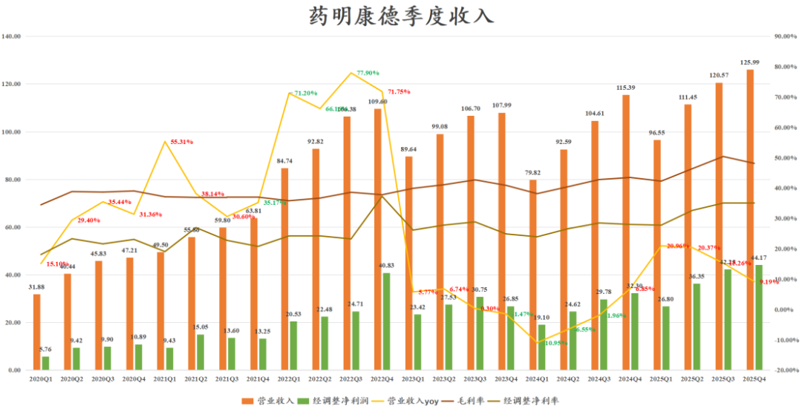
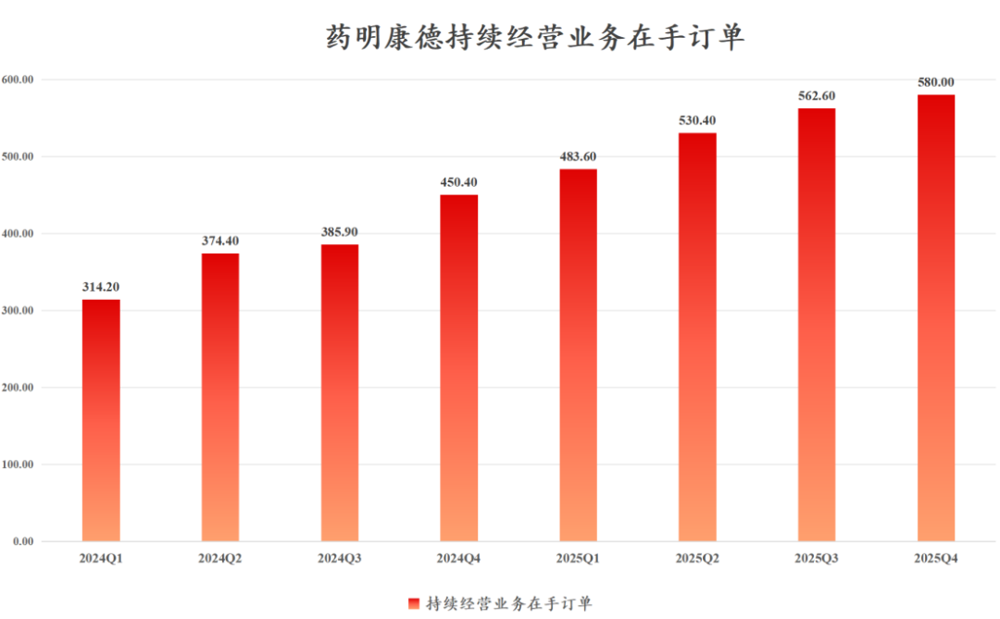
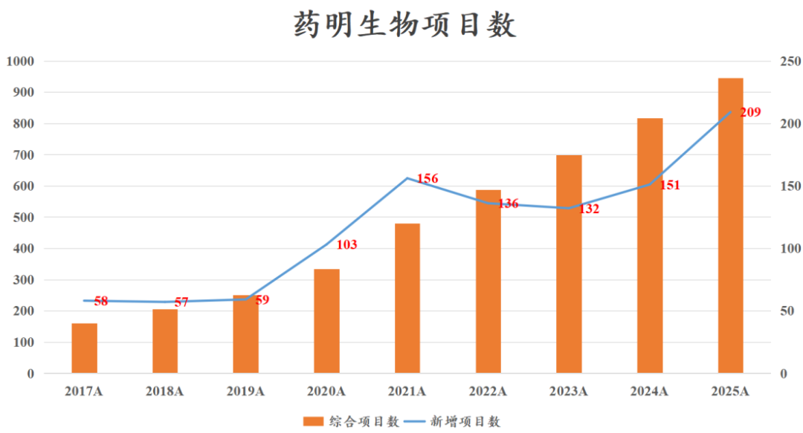
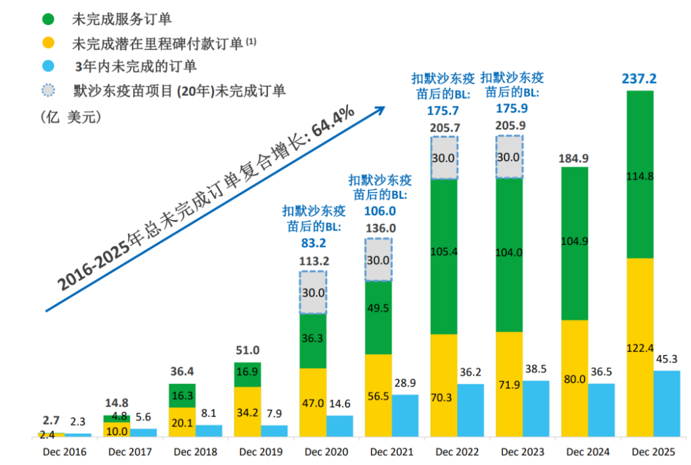
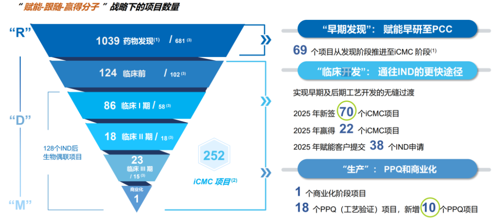
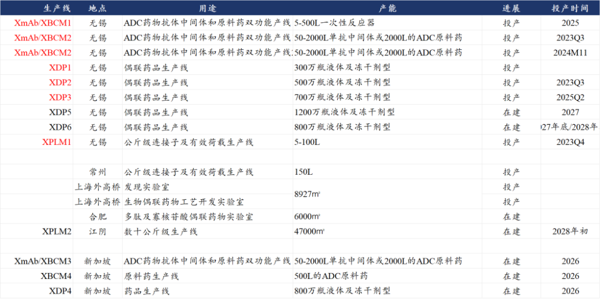
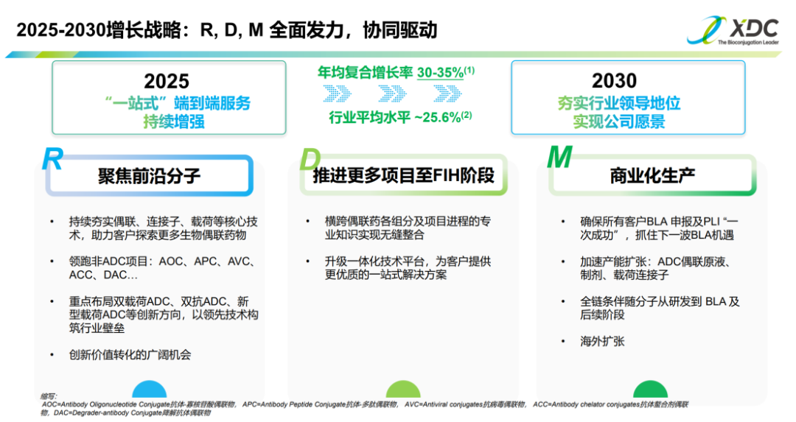

# 药明系，即将登顶

大家好，我是龙哥。

昨晚药明生物发布2025年度业绩，至此药明系三家上市公司都已经发布25年业绩，我们本文一起汇总聊聊公司的业绩和估值情况，总体来看如我们在25年初讨论药明系三家所讲到的观点，药明康德、药明生物均实现了收入端和利润端的显著加速，在手订单和资本开支也都有不错的增长，药明合联也维持了行业高景气下的收入、利润和订单的快速增长。

药明系在一定程度上反映行业景气度，但更多还是三家公司分别在3个高景气的技术方向（多肽、多抗、ADC）的全球顶级的竞争力，药明系在经历行业一轮疫情期间的周期性波动后，呈现非常明确的强者恒强态势，在新兴技术领域的领先优势仍在扩大。

1、药明康德

2025年收入454.56亿元同比增长15.84%，其中持续经营业务收入434.21亿元+21.4%，公司2024-2025年陆续剥离了临床CRO业务和细胞基因治疗CDMO业务，高度聚焦化学板块CDMO/CMO业务。Q4单季度来看收入同比增速有所降速，也与资产剥离有一定关系。

截至2025年底的可持续经营业务在手订单580亿元同比增长28.8%，环比增长3.1%。

公司指引2026年收入513亿-530亿元同比增长12.9%-16.6%，中位数为521.5亿元+14.7%，以可持续经营业务口径计算的同比增速为18%-22%，中位数增长20%。礼来的替尔泊肽、口服GLP-1药物Orforglipron等超大品种仍将给药明康德带来强劲增长势能。

2025年经调整归母净利润149.57亿元+41.37%，经调整净利率达到32.9%。公司指引2026年“保持稳定且有韧性的经调整Non-IFRS归母净利率”，毕竟公司25年经调整净利率已经非常高。

公司2025年经营现金流172.03亿元，capax为55.4亿元，自由现金流116.6亿元，公司指引2026年自由现金流105亿-116亿元、capax65亿-75亿元，以此计算经营现金流约为170亿-191亿元。充沛的自由现金流也使得药明康德这两年积极的进行回购和分红，逐渐向“国际化成熟公众企业”的特点靠拢。

业务板块经营来看，公司剥离了增长压力较大、盈利能力不佳的ATU部门（细胞基因治疗CRTDMO）、临床CRO/SMO部门，由此实现了毛利率（41.5%提升至47.0%）和经调整净利率（27.0%提升至32.9%）的显著提升。

化学板块25年收入364.66亿+25.5%，经调整毛利率52.3%同比提升5.9%，预计主要是多肽及寡核苷酸部门（TIDES）的毛利率较高贡献，TIDES部门25年收入113.7亿+96.0%，在手订单+20.2%、服务客户+25%、服务分子数+45%、固相合成产能超10万升，TIDES业务的收入占比已经达到25%。

小分子CDMO部门收入199.2亿+11.5%，也从新冠大单的高基数中走出来、重回双位数增长，已经超越2022年历史最高收入水平。

药物发现收入51.76亿元同比-3.8%，早研部门仍在下滑，预计也与新药开发药物形式迭代有关，药明在小分子新项目的渗透率已经较高。

另外测试业务收入40.42亿+4.7%，生物业务收入26.77亿+5.2%，收入占比分别8.9%和5.9%，其他业务收入2.36亿元。

总体来看，药明康德的25年业绩此前已经发过快报，总体符合预期，其中TIDES部门收入仍超预期。25年底在手订单维持快速增长，26年指引可持续经营业务继续增长20%，预计药明康德26年最新估值为16倍PE左右。

2、药明生物

2025年收入217.90亿+16.68%，毛利率45.98%同比+5.01%，归母49.08亿+46.25%，经调整归母56.40亿+17.90%，公司业绩经过2023-2024年两年的低迷期，25年呈现恢复性增长。

其中2025年下半年收入118.37亿+17.18%，毛利率48.71%同比+6.13%，归母25.69亿+38.34%，经调整归母32.52亿+28.33%，下半年增速要更显著好于上半年。

分区域来看，中国区25年收入仍在下滑，已经回到接近2020年的水平，预计基本见底，中国区的收入占比已经下降到12.3%——2020年为43.9%；美国区收入增长18.3%略快于收入增速，欧洲区收入增长16.6%，日韩及其他区域收入增长69.1%为增长最快的区域。

2025年公司员工人数13252人同比增长5.38%，经过前期的裁员后，人员重回扩张。25年资本开支53亿元，虽然低于公司年初指引的60亿元，但也是回到2022年的较高水平。

2025年公司新增项目数209个同比增长38.4%创历史新高，历史最高时的2021年新增156个项目（包含32个新冠项目），综合项目数增加至945个同比增长15.67%。

项目数的增长也带来订单的恢复性增长，截至2025年底公司未完成订单合计237亿美元，其中未完成服务订单115亿美元同比增长9.52%，经历4个半年度的同比下滑后首次重回增长，如考虑剥离欧洲疫苗工厂而减少的30亿美元长期疫苗订单，实际的增长更加显著；未完成里程碑付款122亿美元同比增长52.5%，主要是公司25年又有多个基于多抗/ADC的技术平台的项目授权；三年内未完成订单45亿美元同比+21.62%，该指标能更直接的反映公司未来1-3年的增长趋势。

总体来看公司的在手订单已经预示公司未来1-3年的收入端将维持较快增长，但公司指引还是有些低于预期，公司指引2026年收入端增长13%-17%，按中位数计算增长15%约为250亿元，在双抗/多抗和ADC两大景气赛道高增长的背景下仅有中双位数增长，可见公司对其他业务的预期还是非常保守。

由于公司过去几年的收入端承压，导致利润端一直表现不佳，公司2025固定资产周转率还不到1，2025年公司净利率22.53%、经调整净利率25.88%，均显著低于历史高位的30%左右，预计收入端的增长可能会继续带来公司利润率有所回升。预计药明生物26年最新估值在19倍PE左右。

3、药明合联

合联是药明系三家中增速最高的独立上市公司，2025年收入59.44亿+46.69%，归母净利润14.81亿+38.42%，经调整归母净利润15.59亿+69.95%，净利率水平已经超过母公司药明生物。

区域分布来看，2025年北美收入增长49%、占比51%，欧洲收入增长129%、占比25%，其他地区收入增长59%、占比9%，中国区收入下滑12.3%、占比15.5%。

药明合联复制药明康德和药明生物上已经成功验证的follow the molecule和win the molecule战略，管线漏斗已经形成：

2025年药明合联客户数643个同比增长28.8%，药物发现数量1039个同比增长52.6%，管线中的综合项目数252个同比增长29.90%，目前仍只有1个商业化项目，但处于III期临床阶段的有23个项目，多个项目（如昨天文章提到的康诺亚的Claudin18.2-ADC）即将进入上市申报阶段，商业化CMO生产的放量也将临近。

项目数的增长也反映在订单中，截至2025年底的未完成订单是14.89亿美元同比增长50.3%，合同负债8.0亿元同比增长60%。

合联目前也在积极扩充产能，新加坡的产线将在2026年陆续投产，公司2026年资本开支计划超过30亿元，其中约16.8亿用来收购东曜药业，东曜药业本身有2万升的商业化生产的产能，还有2条抗体制剂产线、2条XDC制剂产线，CDMO/CMO服务的管线里也有多个临近商业化的项目，例如乐普生物的EGFR ADC已经进入商业化阶段。

公司对2025-2030年的增长目标非常乐观，给到了年均复合增长30%-35%的乐观预期，颇有些当年药明生物线性外推的乐观态势。对于公司指引我们客观理性的看待，但基于当前的行业景气度、公司订单情况和公司CDMO漏斗模型，近年达到30%以上的增长还是比较有可能实现的。预计药明合联26年最新估值在30倍PE左右。

......

药明系过去几年也算是“历经磨难”，有行业周期因素，有地缘政治因素，有公司治理因素，但公司还是突破种种因素创下业绩的新高。

2025年药明系的药明康德+药明生物收入体量已经突破670亿元，其中CDMO收入已经突破530亿元，距离全球CDMO龙头lonza已经只有一步之遥（Lonza 2025年收入578亿元），未来两年有望登顶全球CDMO第一，这也将是中国CXO产业的又一座里程碑——虽迟但将至。

......

3月底了，开一次赞赏。过去一个月实属不易，外部因素扰动下，行业剧烈波动，作为领先市场回调的板块，部分优秀的CXO和创新药公司在基本面的驱使下，股价也开始有正面的反馈，是时候积极乐观一些了！

风险提示：本文仅讨论行业/公司经营情况，投资需综合考虑公司经营、估值、管理层等多方面因素，建议读者审慎参考，本文不作为投资依据，不建议大家根据本文做出投资计划。

<!-- wxmp-comments-begin -->

---

## 留言（11 条，含回复共 22 条）

- **也无风雨也无晴** 👍5 · 2026-03-25 11:22
  这几年投资医药的除了药明系，还有部分创新药，别的都亏得一塌糊涂
  - ↳ **作者** · 2026-03-25 11:24
    因为这两年医药行业就是CXO和创新药的基本面支棱起来了，其他细分领域的基本面都还比较差，我这两年也是绝大部分文章都在讨论创新药和CXO，基本的方向选择还是能做到的。
- **sampleHu** 👍2 · 2026-03-25 11:28
  龙哥，怎么看再鼎医药呢
  - ↳ **作者** · 2026-03-25 11:30
    参照去年11月的文章，目前还没看到积极的变化。
- **快乐河马** 👍2 · 2026-03-25 11:36
  公司再优秀，资金对管理层也不会有太多信心，能赚钱的股票市场也不缺
  - ↳ **作者** · 2026-03-25 11:52
    低位回购、增持，高位配股、减持的上市公司大股东和管理层也不少，最终还是业绩和股东回报说话，合联底部起来也涨了6倍，资金对有竞争力的真成长股是很有信心的。
- **WISCHUANG** 👍1 · 2026-03-25 11:51
  龙哥，顺便再帮忙分析一下凯莱英，他在多肽和ADC，多抗赛道以及小核酸上是否还有所期待
  - ↳ **作者** · 2026-03-25 11:53
    多肽布局晚了一些，但也陆续有一些管线品种进入商业化阶段。ADC的话相对难做一点，凯莱英在大分子这块的能力确实不算强。小核酸的话布局也是不差的，只不过小核酸CDMO这个赛道的容量目前还是小了些。多抗的话也是前面说的大分子这块能力不足。
- **啵啵啵** 👍1 · 2026-03-25 16:48
  时代天使还有机会吗[苦涩]
  - ↳ **作者** · 2026-03-25 16:49
    时代天使肯定有啊，只是短期这种流动性差的票面对港股流动性压力的时候会跟着回调，和基本面关系不大。
- **十里春风不入秋** · 2026-03-25 11:22
  请问龙哥，在基本面稳定向好的情况下，目前最近引发的加息预期，对于创新药的影响到底有多大，这个一般如何观测啊。或者换句话说，大公司受此影响是不是相对较小
  - ↳ **作者** · 2026-03-25 11:26
    pharma受影响小一些，biotech受影响大一些，这个是客观存在的，但创新药和CXO本身就是提前跌了很多的板块，属于本身就被抽了流动性的板块，短期在系统性风险下又来了一波利空突袭，或许也会是先企稳的方向。
- **追求卓越** · 2026-03-25 11:24
  龙哥，纵使绩优增速高，无奈股价不争气啊。咋整呢
  - ↳ **作者** · 2026-03-25 11:29
    药明生物是指引弱了些，康德和合联都还是不错的。股价和业绩不会是一一对应的，短期影响因素很多，但中期趋势是看得清楚的，尤其是在当前不确定性增加的环境下，确定性的业绩+较低的估值，还是会有安全边际的。
- **皓元永存** · 2026-03-25 11:53
  我买的是药名的对手。
  - ↳ **作者** · 2026-03-25 11:54
    ADC CDMO是行业景气度比较高，市场容量也大，可以容纳不止一家公司，并不冲突。
- **我在楼脚搂实喊你** · 2026-03-25 12:17
  龙哥，从药明生物和药明合联国内业务依然下滑来看，似乎国内创新药仍在底部徘徊，复苏回升还得假以时日对吧？康德国内业务是增长的吗？
  - ↳ **作者** · 2026-03-25 13:05
    他这个回升需要时间的，看药明生物的收入结构有这个迹象，IND前的收入还不错，III期和商业化项目也不错，I/II期项目收入就是下滑的，从早期立项的恢复逐渐传导需要时间吧我理解。
- **xin** · 2026-03-25 12:28
  龙哥，泰格临床方面是不是也有回暖的迹象了
  - ↳ **作者** · 2026-03-25 13:05
    这个肯定的，年初的文章也都有写到。
- **Seplues** · 2026-03-26 11:23
  微创机器人业绩会超预期吗？
  - ↳ **作者** · 2026-03-26 11:29
    跟订单就行了，订单已经对业绩有很强的前瞻指引了

<!-- wxmp-comments-end -->
