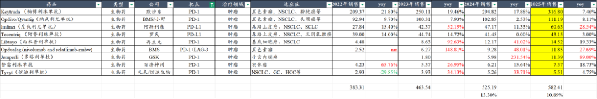
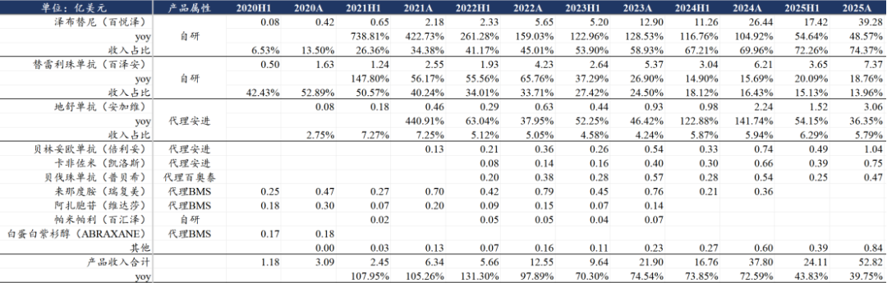
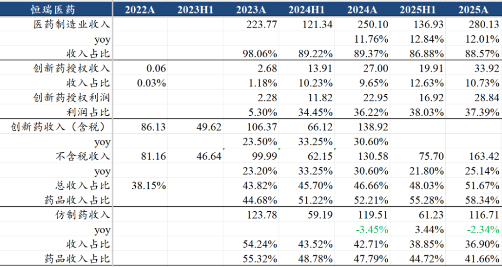
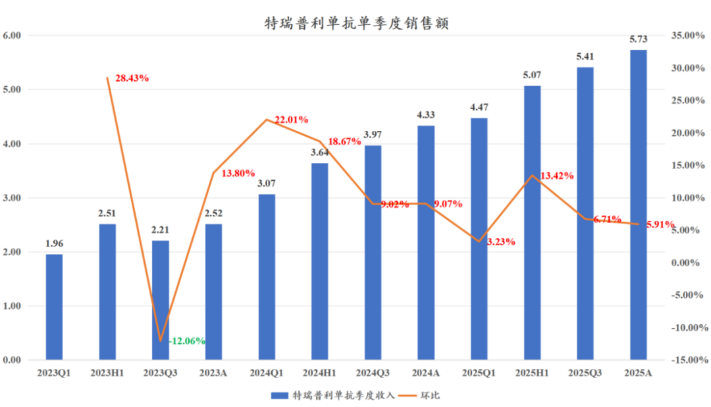

# PD-1四小龙都长大了

大家好，我是龙哥。

肿瘤免疫是缔造大药的领域，广谱抗肿瘤的特性使得该领域哪怕是后来者也能凭借差异化的适应症拿到部分市场，2025年以下9款全球PD-1/L1合计销售582.4亿美元同比+10.9%，表中未统计的还有其他多家国内厂家，国内PD-1/L1合计销售额预计超过40亿美元，即便是落后很多的GSK凭借子宫内膜癌也能拿下超10亿美元的销售额、且仍在爆发增长的阶段。

IO的市场潜力如此之大，因此市场对于下一代IO双抗的关注度才会如此之高，因此我们过去也用多篇文章介绍和跟进IO双抗领域的研发进展。

在中国创新药市场，“PD-1四小龙”也是上一轮创新药牛市中最受关注的公司，2018-2021年四小龙的崛起是中国创新药行业从萌芽到第一轮爆发的过程中很重要的一个阶段，随后的几年，几家公司虽然都历经波折，但直到2025年以来，终于是都进入全新阶段。

——PD-1四小龙都长大了。

1、收入体量壮大，可持续盈利

百济神州是初始的PD-1四小龙，但其核心逻辑实际上一直不在于PD-1单抗，而是在于其血液瘤领域的泽布替尼、索托克拉等药物，2025年替雷利珠单抗销售53亿元同比增长18.6%，虽然是四小龙中上市时间最晚的一家，现如今却成为中国销售规模最大的PD-1单抗，并且在欧美也陆续获批了多个适应症，可以拓展部分海外市场。

2025年，百济神州合计实现52.8亿美元的产品收入，折合人民币超过370亿元，已经远超恒瑞、中生等国内传统头部pharma，仅泽布替尼一款药物实现39.28亿美元的全球销售额、同比增长48.6%，而PD-1单抗的收入占比则只有14%，中国市场表现惊艳的重磅大药在国际市场收入面前也不过尔尔。

2025年是百济实现归母口径正式扭亏的一年，2024年百济归母口径尚且净亏损50亿元，2025年则是实现盈利14.2亿元，百济成立到2024年累计超过700亿的净亏损，2025年正式开始盈利，2025年百济神州的经营现金净流量达到11.28亿美元，超级大药的赚钱能力恐怖如斯。

百济这些年基本“没吃过生活的苦”，不像国内其他pharma、biopharma那样经历过惨痛的出清、裁员阶段，员工人数从2021年的8000多人到2022年的9000多人、2023年突破1万人、2024年1.1万人、2025年1.2万人，团队规模稳定扩张。百济神州2024年销售人员的人效就超过600万——这还是在4386人的销售团队大部分是中国团队的情况下实现的，2025年预计人效会超过700万。

恒瑞医药在2020年收入达到277亿，随后连续两年下滑，直到2024年回到280亿新高，2025年借助BD，收入增长13%到316亿元，制药业务收入280亿也终于创下新高，其中创新药收入163亿，占制药板块收入的58.3%，PD-1的收入占比从巅峰时的20%到如今大概只占10%左右。

2025年恒瑞医药归母净利润77.1亿创历史新高，但其中BD贡献了三分之一的利润，扣除BD后制药板块的利润仍未回到新高，尤其是2025年恒瑞医药还有17.6亿元的研发投入资本化。

另一个值得关注的指标是员工人数，恒瑞的员工总数从2020年巅峰时的28903人下降到2023年低谷的19611人，减少了三分之一的员工，2024-2025年略微增长到20602人，其中销售人员从2020年的17138人下降到2024年最低8910人，2025年首次重回增长到8953人，恒瑞的销售人员的人效从2020年的162万提升到2025年的313万。

我们很难说一个行业龙头纷纷大幅裁员的行业是蓬勃向上发展的行业，所幸，2025年，拐点已至。

信达生物这两年算是“风生水起”。产品商业化方面，信迪利单抗2018年12月上市，2020年销售就干到23亿，叠加生物类似药的爆发，2021年产品收入就达到40亿，但2022年经历了PD-1的大幅下滑，收入增长停滞，再到2023-2025年连续三年40%左右的产品收入增长，2025年产品收入已经达到119亿元，PD-1在其中贡献仍超三分之一，但已经不是贡献未来着重依赖的品种。

年报交流中信达生物称其迈入“可持续盈利”阶段，2025年实现盈利8.14亿元，2026年预计将计入与武田和礼来的两笔BD交易贡献的合计超百亿元首付款，也将实现大规模盈利，2027年公司目标200亿产品收入，实现经营性盈利自然也是不成问题，信达生物历经15年风雨，终于成长为具有强大自身造血能力的中国头部、国际新兴biopharma。

信达生物的员工人数在2022-2023年的低谷期也有所下降，但到2025年员工人数超过7500人，相比2023年增长超过50%，销售人员增长超过60%，销售人员的人效从2021年的145万提升到2025年的248万。

君实生物，PD-1四小龙中最坎坷的一家，第一家上市的国产PD-1单抗，在2020年销售达到10亿，2021年最惨的时候下滑到4亿，君实生物在主要癌种的一线大适应症中与其他三家难以竞争，选择布局差异化适应症、以及在肺癌、肝癌、胃癌、食管鳞癌等大癌种上往辅助/新辅助治疗等更前线推进。

这两年凭借肺癌围手术期治疗、一线肾癌、一线三阴乳腺癌等差异化的适应症获批而实现快速增长，2025年特瑞普利单抗收入终于突破20亿元。但直到2025年，特瑞普利单抗的累计销售额才达到74亿元，而特瑞普利单抗累计的研发投入已经高达63.3亿元，特瑞普利可能仍需要2年以上的时间收回研发成本，实属不易。

2025年君实生物净亏损8.75亿元，是四小龙中唯一一家还没能实现盈利的公司，目前来看2026-2027年实现扭亏的难度依然不小，截至25年底的净现金是-8.7亿元，资金压力也还客观存在。

2、后续管线布局，进入新时代

百济神州的管线布局并不追逐IO双抗和减肥药等热点领域，百济的成功不无道理，其始终是颇具国际MNC的气质——只做全球TOP3且具有国际竞争力（BIC潜质）的分子或靶点。

其BTK抑制剂是全球第三款、现在已经验证best in class的药物，其Bcl-2抑制剂是全球第三款、海外第二款、有潜力成为BIC的药物，其BTK CDAC是全球进度第一、且正面头对头挑战礼来匹妥布替尼的药物，其CDK4是全球进度第二、直接一线头对头挑战3款CDK4/6抑制剂的药物。

国际临床开发的高成本、高收益，使得百济不像恒瑞、信达、中生、石药这些过去以国内为主的公司那样“摊大饼”式的铺管线，而是致力于高效率的生产国际大药。

恒瑞医药布局了一款PD-1和一款PD-L1后，在下一代IO的布局不算领先，曾经把所有具有下一代IO潜力的单靶点抗体布局了一遍，包括LAG-3、TIM3、TIGIT、CD47、OX40、IL-15、PD-L1\*TGFβ等等，最终只有PD-L1\*TGFβ的一线胃癌成药。在后续IO双抗的布局中恒瑞落后较多，直到2025年12月其PD-1\*VEGF双抗才获批临床，公司也没有再去与其他家正面竞争，而是直接做了一款皮下注射制剂以求差异化竞争。

2026-2027年的恒瑞医药将进入ADC药物、代谢药物的收获期，今明年公司会陆续有HER2-ADC多个大适应症、HER3-ADC、Nectin4-ADC、CD79b-ADC等分子陆续读出III期数据和申报上市，恒瑞的首款国产GLP-1\*GIPR双靶点激动剂已经在去年9月申报上市，首款国产胰岛素/GLP-1复方制剂已经申报上市，首款开III期的国产口服GLP-1也有望在2027年申报上市。

但恒瑞医药的问题也客观存在，至今上市28款新药，商业化始终是表现平平，28款新药在2025年才贡献163亿元的收入，平均每款新药销售额5.8亿元，28款新药销售额只有百济的泽布替尼这1款药物的一半多点。

信达生物的研发管线已经是士别三日当刮目相看，信达生物一款具有卓越早期临床数据表现的PD-1\*IL-2α（IBI-363）已经推进到全球III期临床，这款药物25年读出早期肺癌OS显著获益数据、并以超百亿美元的总包授权给武田制药，一切是那么顺理成章。

但大家是否记得，信达生物像恒瑞一样把所有能做的下一代IO的靶点全做了一遍，信达生物还把IO双抗组合都尝试了一遍，曾经尝试过PD-L1\*LAG-3、PD-1\*4-1BB、PD-L1\*CD47、PD-1\*TIGIT、PD-1\*IL-2\*IL-21、PD-1\*HER2、PD-1\*PD-L1等诸多靶点组合，最终才试出来一款IBI-363。

创新药研发是残酷的、是高风险的，我们看到这些企业为了做出优秀的分子而经历的失败，也因此我们非常厌恶有些公司做着fast follow甚至slow follow的分子还得意洋洋的说自己100%的成功率，创新药公司100%的成功率唯一的可能性就是持续的抄袭。

当然，信达生物不仅只有一款IBI-363，曾经的信达生物在ADC领域的布局相对并不领先，公司2022年才有第一个ADC分子进临床，还是竞争比较激烈的HER2和Claudin18.2靶点，信达的强大执行力和效率在ADC领域体现的淋漓尽致，仅用了3年时间，信达生物构建了国内一线的ADC管线，Cladun18.2-ADC甚至可能后来居上成为国内首款读出III期结果的分子，新一批的双抗ADC、双payload ADC也已经陆续在24-25年进入临床阶段。

2026年也将是信达生物国际化迈入新阶段的一年，公司将有3-4项国际多中心III期临床启动，包括PD-1\*IL-2α、Claudin18.2-ADC和VEGF\*Ang2三款药物，按信达生物对外的口径是这3款药物合计可覆盖600亿美元的潜在市场。

君实生物，公司做抗体药起家，期间与一系列公司合作引进了一大批的小分子靶向药，至今也只有一款与润佳合作引进的PI3Kα推进到III期临床。2023-2025年，君实生物研发投入规模最大的依然是特瑞普利单抗。

2025年，君实生物新启动了JS207（PD-1\*VEGF双抗）的国内和海外首个II/III期临床，启动了Claudin18.2-ADC的III期临床，管线中还布局了EGFR\*HER3 ADC、PD-1\*IL-2c等热门靶点，也算是进入了新的阶段，不过在研发方面君实仍缺少一个重点项目（不论BD与否）来证明自己。

......

我们始终认为，创新药是典型的“时间的敌人”的行业，但历经5年时间，曾经的“中国创新药之光”的PD-1四小龙也都已经长大，着实令人欣慰。

这其中有部分原因是身处在肿瘤免疫这个天生诞生大药的大赛道之中，到2025年国内PD-1/L1市场预计将接近300亿元，康方的IO双抗也已经创造近30亿的国内销售额，市场容量即便相较曾经预期的千亿市场自然是有差距，但300亿+的市场也足以诞生多个中等市值biopharma。

另一方面则是这些公司曾经可以在PD-1的竞争中获得领先，说明本身就具有不错的眼光和执行力，强大的管线未必能成就强大的公司，强大的执行力和效率+持续的试错和一定的运气，方能在“时间的敌人”的创新药行业持续占据一席之地。

信达在内的部分优秀biopharma也在持续证明，真正的国际化并不是一句口号，是有足够的积累和优秀的分子后顺理成章的推进。

回顾我们2022年的提出的观点：真正能实现国际化的药物一定是具有全球竞争力的分子，而真正具有竞争力的分子一定会寻求国际化。

事实证明，随着国内创新药审批速度的加快，中国与海外创新药上市时间差缩短，中国市场不再是一个局限和封闭的市场，即便是仅仅想要在中国市场取得好的成绩，也需要药物至少具有一定的全球竞争能力。

2023-2026年，国际化已经逐渐成为创新药行业无可争议的核心驱动逻辑。

风险提示：本文仅讨论行业/公司经营情况，投资需综合考虑公司经营、估值、管理层等多方面因素，建议读者审慎参考，本文不作为投资依据，不建议大家根据本文做出投资计划。

<!-- wxmp-comments-begin -->

---

## 留言（9 条，含回复共 17 条）

- **和** 👍5 · 2026-03-30 17:14
  今天建仓一笔恒生医药ETF159892[呲牙]等生根发芽
- **PBalu 一颗尘埃** 👍5 · 2026-03-30 17:18
  已经持有翰森，康方，药名生物五年多了。我还有一百万，搞哪个好呢？ 
  - ↳ **作者** · 2026-03-30 17:26
    药明系另外两家也都不错，港股biopharma里一些二线的公司的发展也都很好，参照我们历史文章。
- **Mont Cristo** 👍3 · 2026-03-30 17:14
  龙哥怎么看基石的三抗呀？能给多少估值？
  - ↳ **作者** · 2026-03-30 17:18
    这次更新的数据不错的，10例一线PD L1高表达人群90%的ORR，扭转市场预期。只不过相比于数据，基石股价更重要的影响因素可能是管理层怎么炒股票，需要股价涨的时候发数据，减持了就静默，增持完了又发数据，能跟上管理层炒股节奏就好。
- **老宋** 👍3 · 2026-03-30 18:05
  龙哥，看来今年君实又没有戏了啊[流泪][流泪]
  - ↳ **作者** · 2026-03-30 18:07
    只能说，有边际变化，但似乎不足以带来市值大的跃升。
- **WillHoa 豪** 👍2 · 2026-03-30 17:18
  药神，a股有哪些弹性药标看看吗[太阳]
  - ↳ **作者** · 2026-03-30 17:27
    药神在雪球，哈哈。
    A股更多可能还是看边际变化和资金驱动，普遍估值不算便宜，看中期的可选标的相对少一些。
- **大海** 👍1 · 2026-03-30 18:12
  龙哥，怎么看百济的美港股年报和26年指引，感觉低于预期啊[抱拳]
  - ↳ **作者** · 2026-03-30 18:14
    低于预期倒没有，只是有些投资人可能预期偏高，你要知道泽布替尼很多投资人预期峰值是50亿美金呢，去年都接近40亿美金了，怎么可能还能维持四五十的增长。
- **东** · 2026-03-30 18:26
  龙哥，怎么看英科
  - ↳ **作者** · 2026-03-30 18:45
    英科我也在重点跟，但这种周期性价格波动我不太好写文章讲，因为需要比较紧密的跟踪各种因素的变化，就目前的情况来看英科今年的利润肯定是爆发的，丁腈胶乳原料和能源的成本优势相较马来的厂家都比较显著，目前丁腈手套的价格已经提了9美金/箱左右。
- **嘀嗒** · 2026-03-30 18:37
  龙哥，威高的年报是这么差吗，暴跌都
  - ↳ **作者** · 2026-03-30 18:43
    利润端miss一些
- **Asherl.W** · 2026-03-30 19:01
  龙哥，时代天使业绩可以理解为反转吗？
  - ↳ **作者** · 2026-03-30 19:08
    我理解的基本面早就反转了，只不过市场有担心和博弈的点，现在已经是加速放业绩的阶段了，公司还派发了8%的特别股息。

<!-- wxmp-comments-end -->
