# 当医药重回舞台中央

大家好，我是龙哥。

最近财报密集披露期，有好多话题想分享，由于需要大量的阅读财报和听电话会议，耽搁了一些，但市场行情不等人，医药行业出现连续的大涨，行业短期关注度快速提升，医药又回到舞台中央。

作为医药投资人，也作为医药自媒体，面对这种“大反攻”的行情理论上应该是很激动，但我们现在的心态反而是比较平淡的——当行业基本面足够强的时候，我们并不担心全年来看行业不会涨，只是考虑战争因素导致的回调能有多深、外部因素影响有多大、以及什么时候涨的问题。

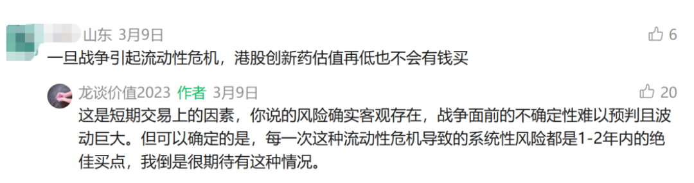

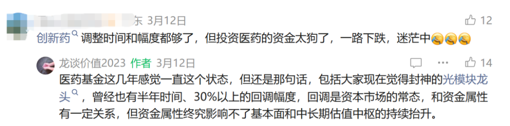

年初已经给大家明确了我们今年看好的方向《[医药行业2026，继往开来](https://mp.weixin.qq.com/s?__biz=MzkyMzQ3MDc3Mw==&mid=2247485469&idx=1&sn=51560c124ea3a20e1624cd73474f43a5&scene=21#wechat_redirect)》，这里来更新下创新药、CXO、器械出海一季度的表现，以强调我们看好的方向和资产。

1、创新药行业

创新药公司的财报还没出完，下图中标黄的是已经更新过财报数据和26年指引/预测的公司。

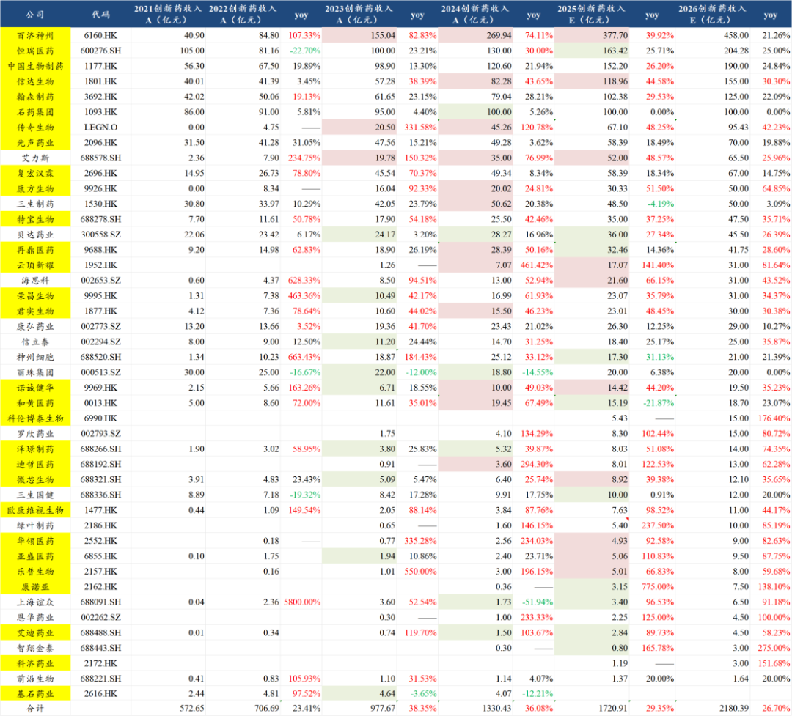

以上我们统计的44家创新药商业化公司（还有部分没统计到的，如非上市公司，如上市公司中难以分拆创新药销售数据的公司）在2025年合计的创新药商业化收入是1721亿元同比增长29.35%，且预计2026年会进一步增长26.7%至2180亿元。

大家可以寻遍各大行业，全市场能找到几个具有这样的、且可持续的增速的行业，且前期还经历如此大幅度的回调。

创新药商业化收入毫无疑问是处于行业发展历程中最好的高增长阶段，肿瘤领域不必多说，众多新产品层出不穷，而自免和代谢这两个天生诞生大药的领域，国内公司的新药也陆续上来和纳入医保。

BD方面去年和今年在持续超预期：

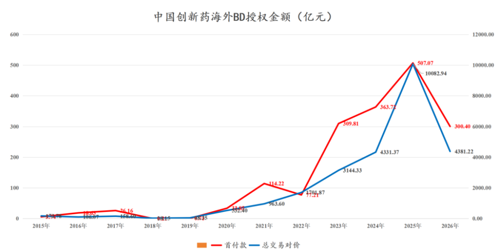

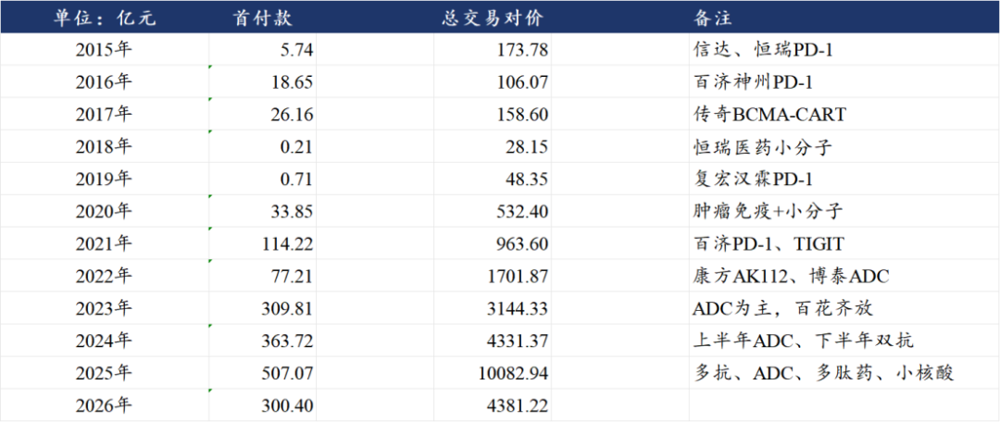

2026年以来的创新药海外授权已经达到接近30个项目，合计首付款300亿元，合计里程碑付款4381亿元。

前两天国家药监局还专门发文报道了该消息：

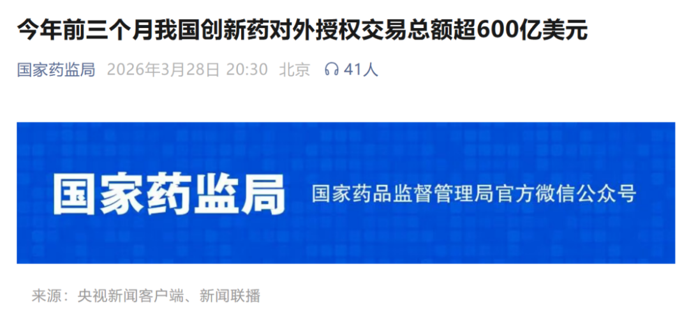

创新药的定义被升级为“新兴支柱产业”，靠的是行业自己争气，靠的是超强的赚外汇、创造高收入就业岗位、拉动产业升级的能力。

我们在去年和今年都会看到大量的首付款、里程碑付款计入收入和利润，例如：

- 信达生物去年与武田制药、今年与礼来签订的两笔BD交易合计是15.5亿美元首付款+187亿美元里程碑付款，而2025年信达生物才计入了11亿的授权费收入，还有大概14亿美元、接近100亿人民币的收入会在今明年计入报表。
- 恒瑞医药去年授权GSK的那笔交易拿到5亿美元首付款，但在25年的报表里恒瑞只确认了1亿美元收入，还有4亿美元会在今明年确认。
- 石药集团年初与AZ谈定的BD交易涉及12亿美元首付款，又是接近百亿的收入会确认到石药今年的报表上。

里程碑付款方面，传奇、和黄这些海外品种已经商业化的公司就不说了，这些公司这两年一直在持续的收里程碑付款，去年和今年我们也看到越来越多授权项目收到里程碑付款，例如：

- 百利天恒在去年底就收到BMS支付的2.5亿美元里程碑付款。
- 康诺亚在今年初收到AZ的4500万美元里程碑付款。

Newco授权方式也迎来首次破冰，《[中国创新药出海，新的里程碑](https://mp.weixin.qq.com/s?__biz=MzkyMzQ3MDc3Mw==&mid=2247485797&idx=1&sn=e287b1e60d27ce529415dc7afae6a8ce&scene=21#wechat_redirect)》中给大家讲到了康诺亚的BCMA\*CD3项目海外NEWCO公司被吉利德科学收购，康诺亚因此可以拿到2.5亿美元首付款和7000万美元里程碑，且后续的6.1亿美元里程碑及销售分成都由吉利德科学继续执行。

2、CXO行业

前两天的文章刚和大家展示了药明系的卓越表现《[药明系，即将登顶](https://mp.weixin.qq.com/s?__biz=MzkyMzQ3MDc3Mw==&mid=2247485809&idx=1&sn=6afc905dfa419dcf60bb333d6f228170&scene=21#wechat_redirect)》，这里不再赘述。

这两天凯莱英、康龙化成、泰格医药、昭衍新药等药明系以外的各领域一二线龙头都发布了年报，对后续的指引也是非常亮眼。

①凯莱英：25Q4收入20.40亿+22.59%、环比增长41.53%，归母净利润3.32亿+39.27%，扣非归母3.08亿+65.74%，在三季度业绩miss后Q4业绩改善明显。截至25年底在手订单13.85亿+31.65%，其中化学大分子在手订单增长127.59%（主要是GLP-1类多肽药）、生物大分子CDMO订单增长55.56%（抗体、ADC等）。凯莱英指引2026年收入增长19%-22%。

②康龙化成：25Q4收入40.09亿+15.93%维持中双位数增长，归母净利润5.23亿+40.76%，扣非归母5.04亿+55.28%，利润端大幅修复（24Q4基数也偏低）。实验室服务新签订单同比+12%，小分子CDMO新签订单同比+13%。康龙业绩受周期波动影响相对小，因此业绩和订单增长相对平稳。

③泰格医药：25Q4收入18.07亿同比+17.68%，创12个季度的增速新高，毛利率22.56%同比提升4.86%，毛利率有恢复但还是较低，主要是25年执行的订单大部分还是23-24年的底价单，25年新签订单102亿+20.6%，在手订单182亿+15.4%，公司预计26年新签订单增速至少达到25年的水平。

24-25年临床CRO行业经历惨烈出清，卫健委数据显示2025年备案中的临床CRO企业数量相较2021年下降69%，供给端大幅收缩；需求端25年CDE公示的I-III期临床试验数量2333个同比增长25.6%，25年2703个IND获批、同比增长19%。

④昭衍新药：25Q4收入6.73亿同比-1.54%，虽然还在下滑，但已经是过去8个季度最好表现，毛利率19.48%同比下降10.8%、环比提升3.16%还是很差，25年Q1-Q4新签订单分别为4.30亿（+7.5%）、5.90亿（+18.0%）、6.20亿（+24.0%）、9.60亿（+118.2%），订单环比增长、且逐季度加速，25年全年新签订单26亿+41%。

大家也可以对比一下海外的CXO公司的增速是什么水平，估值是什么水平，而中国的龙头CXO公司是什么增速水平，估值又是什么水平。

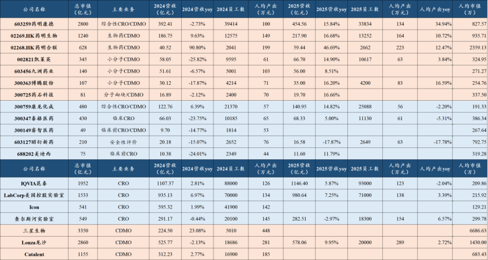

3、器械出海

器械出海是我们今年重点强调的器械投资方向《[中国医疗器械全球化路径](https://mp.weixin.qq.com/s?__biz=MzkyMzQ3MDc3Mw==&mid=2247485569&idx=1&sn=4fb6ee854b13ff09385b88fb3c638409&scene=21#wechat_redirect)》，可惜对这个方向关注和讨论的投资人不多，大多投资人还是盯着迈瑞这些传统大龙头，反而体感极差。

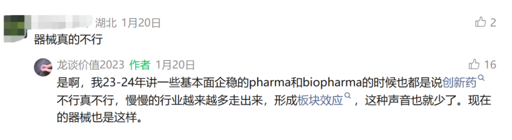

我们今年重点讲到的出海做的比较优秀的公司中，时代天使、微创机器人、先瑞达医疗，都已经发布了2025年年报。

时代天使25年海外案例数已经接近国内水平，达到25.6万例、同比增长82%，公司指引26年国内案例数增长18%到33万例左右，海外案例数增长33%至34万例左右，公司布局海外3年时间，2026年将实现海外案例数和隐形矫治收入反超国内，时代天使的总收入增速从2022年的-0.16%被海外业务拉动到2024-2025年分别增长31%和35%。

由于海外的投入已经进入稳定期，公司也不再需要保留这么多现金在账上，时代天使直接选择在2025年派发特别股息，每股4.99港元，25年的股息率高达8.2%。

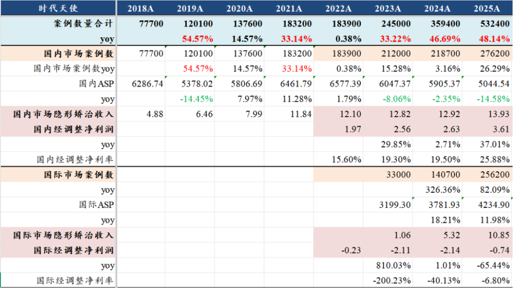

微创机器人，在2023年时已经是被担心会破产的公司， 国内经营状况极差，这两年国内的腔镜手术机器人招标也是差的一塌糊涂，根本不足以支撑微创机器人的运营，公司员工人数从2022年的1200人砍到2024年只有450人。

但是2024年海外的突破使得微创机器人峰回路转，从下图所示的订单量可见，图迈在2024年海外订单就反超了国内，2025年海外订单更是爆发到100多台，已经远超过国内十几台的订单量，2025年微创机器人收入增长114%，其中海外收入占比增长287%，海外收入占比达到73%。

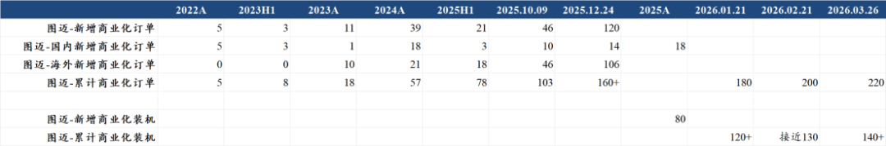

海外取得卓越表现的公司不止以上两家，越来越多器械公司在海外取得较好的表现：

南微医学，过去5年国内收入几乎没怎么增长， 海外收入规模从7亿左右大幅增长到20亿，海外收入占比从40%左右提升到60%+，今年南微医学国内集采影响可能会逐渐出清，也将进入新的发展阶段。

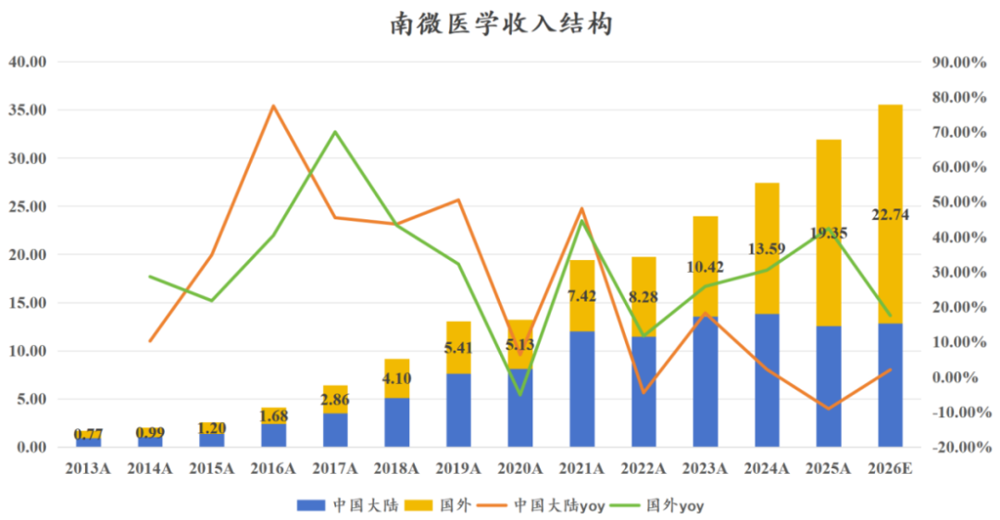

其他还有：

- 骨科中出海做的比较领先的春立医疗，25年海外收入同比增长38%、海外收入占比已经提升到47%。
- 做CGM的微泰医疗没有局限在国内的高度内卷，25年海外收入同比增长227%，海外收入占比提升都52%。

相信后续器械出海也会有越来越多的资产给大家选择。

不仅是出海，国内部分细分领域也有积极变化，神经介入领域的优秀小公司归创通桥在25年实现2.44亿归母净利润、同比增长144%，公司选择在2025年每股派息0.22元，创新器械小公司也开始大幅放利润和给股东分红，可喜可贺。

......

三大方向，几十个公司，简单汇总起来就是两个方向：港股创新药、港股医疗。

去年核心主线就是创新药，CXO作为辅助，我们大部分的文章都在讲港股创新药ETF（如520880港股通创新药ETF）：

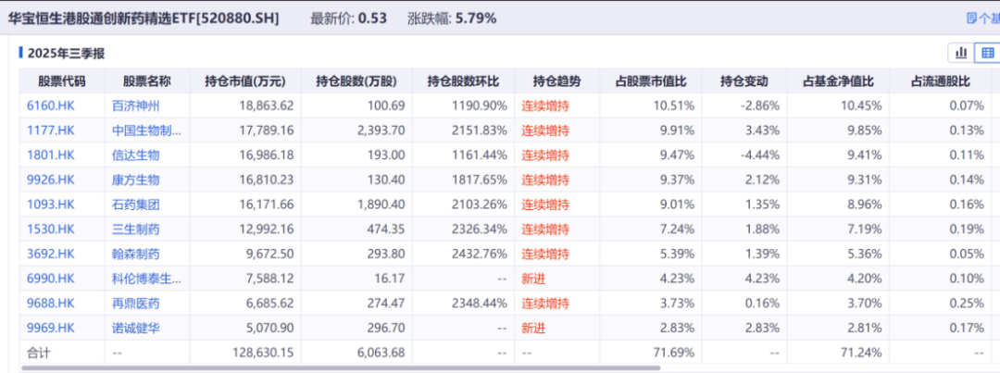

包括我们此前的文章讨论头部pharma的拐点《[医药龙头全面突破](https://mp.weixin.qq.com/s?__biz=MzkyMzQ3MDc3Mw==&mid=2247485752&idx=1&sn=1a749843501ff014c50cb88ff71ce580&scene=21#wechat_redirect)》，PD-1四小龙（biopharma）的拐点《[PD-1四小龙都长大了](https://mp.weixin.qq.com/s?__biz=MzkyMzQ3MDc3Mw==&mid=2247485818&idx=1&sn=143ca55fa645e7f24a9dedd1fec5c92c&scene=21#wechat_redirect)》，最终都是港股创新药ETF的权重股。

今年我们可能同时强调159137港股通医疗ETF，其中CXO、互联网医疗（[互联网医疗巨头表现亮眼](https://mp.weixin.qq.com/s?__biz=MzkyMzQ3MDc3Mw==&mid=2247485764&idx=1&sn=ecea9671080ab91514fb0ddbdac3c6b3&scene=21#wechat_redirect)）、创新器械在今年同样是值得关注的重点赛道。

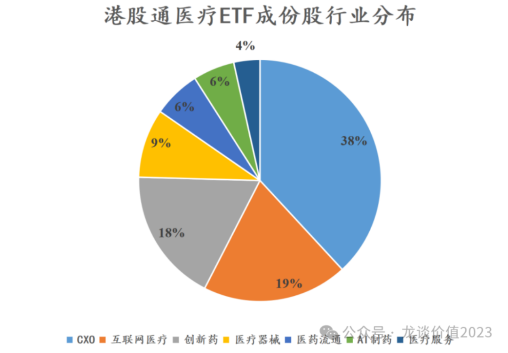

风险提示：本文仅讨论行业/公司经营情况，投资需综合考虑公司经营、估值、管理层等多方面因素，建议读者审慎参考，本文不作为投资依据，不建议大家根据本文做出投资计划。

<!-- wxmp-comments-begin -->

---

## 留言（20 条，含回复共 35 条）

- **廖书豪** 👍10 · 2026-04-01 13:39
  可能我也有点功劳，买了好多亿纬锂能第二天就强制转债赎回直接带崩风光储能，吹着储能星辰大海结果千分之二的利率都不会想给，对比药这边到处都在回购自己票，相形见绌给我往死里砸[旺柴]
  - ↳ **作者** · 2026-04-01 13:40
    [捂脸][捂脸][捂脸]
- **政委** 👍10 · 2026-04-01 14:05
  我又相信爱情了。[呲牙]
- **张洪亮** 👍5 · 2026-04-01 13:33
  前面底仓不少，回撤挺大，龙哥现在可以加仓了吧。
- **陈小群日常号** 👍4 · 2026-04-01 13:12
  看好创新药
- **王熙** 👍4 · 2026-04-01 13:15
  药品、医疗器械的增长其实都是靠海外赚来的
  - ↳ **作者** · 2026-04-01 13:24
    是的呀
- **浪子** 👍4 · 2026-04-01 13:37
  医药基金2021年--2026年的坚持也没谁了，只能庆幸当时进去的时候到现在还没把我一棒子打死。未来可期，今年涨个30%
- **李伟** 👍3 · 2026-04-01 13:18
  扬眉吐气
  - ↳ **作者** · 2026-04-01 13:24
    确实[加油]
- **风驰电掣** 👍3 · 2026-04-01 13:28
  唉，沉迷在过往的结果，没有自己去加强研究，就买了迈瑞这种老登，幸好也买了一些创新药，不然真的亏嘛
  - ↳ **作者** · 2026-04-01 13:30
    三十年河东，三十年河西。设备本身有一定的周期性，并且迈瑞的海外占比已经很高。这两年头部设备公司里表现最好的是联影，本文虽然没特别讲到，但看联影也是凭借强大的产品力在海外贡献了很重要的增量。
- **周泽洋** 👍3 · 2026-04-01 13:31
  龙哥威武，研究创造价值[烟花][烟花][烟花]
  - ↳ **作者** · 2026-04-01 13:39
    研究是投资的基础，做好研究不一定能知行合一，但不做研究更是盲人摸象，至少龙哥这里总会给大家输出客观理性的行业研究成果，医药投资和研究不易，大伙也且看且珍惜[愉快]
- **希希** 👍2 · 2026-04-01 13:29
  医药终于起来了，平躺半年多
  - ↳ **作者** · 2026-04-01 13:31
    文初截图的那个留言其实我多次说过，涨了几十倍的光模块有好几次30%以上、持续半年的回调，再牛的业绩和逻辑也会有正常市场波动。
- **和** 👍2 · 2026-04-01 13:33
  凯莱英今年咋样
  - ↳ **作者** · 2026-04-01 13:36
    看本文第二部分有讲到。凯莱英的业绩加速也比较明显，之前的文章也回答过几次，凯莱英在这波GLP-1减重药的产业趋势中，是落后于药明康德的，但也逐渐进入兑现期了，业绩加速非常显著，凯莱英去年化学大分子收入已经超过10亿，收入占比超过15%。
- **杨宇晨Rudi🇨🇳** 👍2 · 2026-04-01 14:11
  愿世界和平[合十]
- **yang** 👍2 · 2026-04-01 14:33
  别的行业可以工程师红利，医药也一样，集采，生物法案都是外在因素，根本还是内生强大，资金不会视而不见的，只需要够便宜
  - ↳ **作者** · 2026-04-01 14:35
    创新药和CXO近些年一直是工程师红利逻辑非常强的领域。
- **蔡建东_行家说** 👍2 · 2026-04-01 16:50
  恒瑞说创新药力争30%增长，龙哥这里特地打个折取25%？
  - ↳ **作者** · 2026-04-01 17:41
    没有，他上一期股权激励考核目标是创新药收入复合增速30%，新一期的调整为25%了，看25年的业绩也是按25%做的，所以我就都按25%来拍了。
- **吕帅** 👍1 · 2026-04-01 13:17
  您好，图片美股cro是美元计价吗
  - ↳ **作者** · 2026-04-01 13:24
    为了方便比较，我全部换成人民币计价的，因此图里的数据是可以直接横向比较的。
- **R9-牛牛** · 2026-04-01 13:59
  涨的有点太快了，感觉不是好事儿，小朗子那边，不知道会不会结束
  - ↳ **作者** · 2026-04-01 14:23
    因为筹码出清了很多，全基都没医药持仓，但又知道创新药其实基本面不差，所以一旦空头回补，就会演变成抢筹，结果就是这样大起大落的。
- **David** · 2026-04-01 14:12
  恩华药业也有创新药，市场视而不见吗
  - ↳ **作者** · 2026-04-01 14:23
    额，相对还是占比比较低，以及麻醉药的行业β还是受到医院手术量影响比较大，而我们知道24-25年门诊量和手术量确实一般。
- **zhz** · 2026-04-01 14:23
  龙哥可是南微和春立四季度怎么都大幅降速
  - ↳ **作者** · 2026-04-01 14:24
    南微还是有国内集采的影响，今年下半年南微国内集采的影响应该大部分可以出清了，届时才能体现出来海外增速更快的拉动。
- **沈清沁（随順自性）** · 2026-04-01 14:26
  龙哥，咨询一下华东医药这个公司的投资看点有吗
  - ↳ **作者** · 2026-04-01 14:34
    华东医药目前主要的看点在代谢这边，GLP-1*GIPR已经开了降糖和减重的III期临床，进度不算靠前，不过GLP-1的市场容量比较大，华东医药未来能靠他在内分泌糖尿病领域的渠道优势切一部分蛋糕。小分子口服GLP-1也开了两项II期，这个进度还算可以。GLP-1R/GCGR/FGF21R三靶点也已经在中国和海外开了几个II期临床，这个算是相对靠前的。
    另外有意思的是华东医药还做了一个宠物用减重GLP-1/GIPR双靶点激动剂。。。
    华东在自免领域主要通过BD引进一系列管线实现布局，基本覆盖了主要的自免大靶点，后续也可以关注商业化情况。
- **特别稳** · 2026-04-02 09:07
  龙哥觉得威高骨科潜力大吗
  - ↳ **作者** · 2026-04-02 09:41
    目前来说没看到很大的成长潜力

<!-- wxmp-comments-end -->
