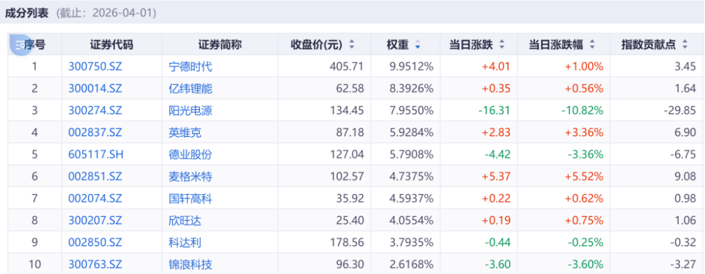
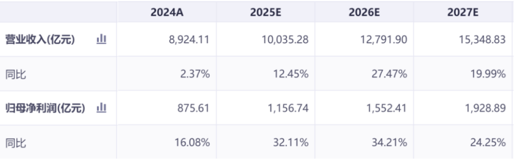
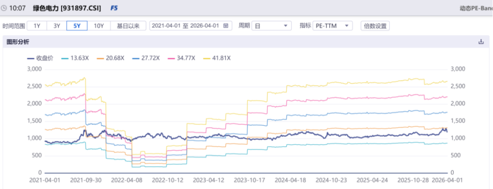
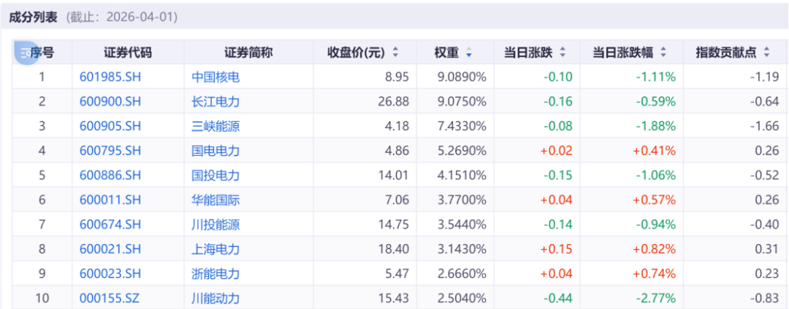

# 聊两个新方向

大家好，我是龙哥。

昨天的文章讲到在创新药回调之际我们并不担心行业今年会不涨，只是思考阶段性的回调幅度，同时我们也在思考哪些是长期的变化，结合去年以来我们认为AI带来的算力需求引发的长期对用电量的需求增长，新能源已经成为在医药以外我们中长期战略配置的方向。

我们看海外市场，第一阶段是用电负荷增长带来的电网消纳问题，倒逼头部大厂自建电网，从而引发燃气轮机、电网设备、储能的需求，这两天我们也看到燃气轮机持续的大单，中期来看AI的需求会使得新能源成为伴生快速增长的行业，由此引起我们在医药以外希望中长期战略配置的两个领域：

1）储能

当下欧洲、美国、东南亚以及国内都是缺消纳，储能可以很好的平抑电价波动。

行业核心三点：

①储能目前在国内和欧洲等地具有较强的经济性，国内发布容量电价政策，鼓励企业布局储能项目，核心就是过去几年光伏风电装多了，导致电价有很大的峰谷价差，很多光伏项目白天发电是负电价，电网的负荷波动也较大，储能就能发挥很好的调节作用，结合峰谷价差就有很高的经济性；欧洲也是类似，今年以来的户储需求爆发也是因为之前峰谷价差较大。

②AI发展需求来看，数据中心需要24小时稳定电源，长期来看数据中心配储能是必要选项，因此数据中心的高增长基本可以衍生储能的高增长，尽管当下此类需求占比并不高，远期来看这可能是储能重要的成长动能。

③数据中心用电需要变压器、液冷等电力相关的设备。

我们关注的有一个159566储能电池ETF易方达，跟踪的指数国证新能源电池指数，成份股如下：

指数成份股未来两年的盈利预测如下：

由此可见：

①指数成份股包括储能+电力设备+电池等的完整环节，可以覆盖新能源中各个景气度最高的方向的重点公司，成份股中例如德业股份核心受益于户储需求爆发，也有如麦格米特专攻数据中心电力设备，英维克主供液冷，还有金盘科技等等。

②行业盈利预测可见26-27年行业景气度相较24-25年有明确加速，不光是宁德时代等单个公司比较好，是行业性的表现较好，具有行业β特征。

2）绿电

我们另外关注的一个方向是绿电，主要考虑长期电力需求增长带来的稳定性收益，政策支持下要求更多企业使用绿电，发电公司发布的“绿证”进入涨价通道，十五五中双碳也是重要方向，这些政策都会使得绿电运营商获得更高电价和绿证收入，未来的算力项目也会直接连接绿电，算电协同使用。

更重要的是这些相关的电力公司在过去几年涨幅并不大，估值普遍是长期估值中枢偏下的位置。我们跟踪的562960绿色电力ETF易方达，其标的指数是中证绿色电力指数，从其成份股的历史估值水平来看，当前的确算不上很高的估值位置。

其成份股覆盖长江电力、三峡能源、中国核电、国电电力、华能国际等头部绿电运营商以及少量具备绿能转型属性的火电公司，这类公司有稳定发电资产做底，可以拿保底的分红，又同步受益于政策红利和碳市场机制完善。

风险提示：本文仅讨论行业/公司经营情况，投资需综合考虑公司经营、估值、管理层等多方面因素，建议读者审慎参考，本文不作为投资依据，不建议大家根据本文做出投资计划。

<!-- wxmp-comments-begin -->

---

## 留言（17 条，含回复共 26 条）

- **Murphy Chen** 👍14 · 2026-04-02 16:26
  什么情况，龙哥也看储能和电力，创新药的天踏了一半
  - ↳ **作者** · 2026-04-02 16:27
    看我昨天的文章啊，peace and love好吧，哈哈
- **尘缘** 👍5 · 2026-04-02 16:33
  龙哥，跨界了啊
  - ↳ **作者** · 2026-04-02 16:34
    小小的跨一步，新能源相关的产业链学习了半年了[破涕为笑]
- **R9-牛牛** 👍4 · 2026-04-02 16:27
  困境反转行业，光伏etf，目前估值很低，可以买啊
- **林** 👍3 · 2026-04-02 16:32
  龙哥，医美的爱美客的能看了吗，这家公司有看头没
  - ↳ **作者** · 2026-04-02 16:33
    医美我觉得需要消费环境好+领先的爆款大单品，目前可能大家会期待一下前者。
- **听闻** 👍2 · 2026-04-02 16:29
  要不是套在恒科，真得买点，创新药快解放了[捂脸]
- **宇文大大爷** 👍2 · 2026-04-02 16:29
  储能电池被阳光带崩了！
- **陈小群日常号** 👍2 · 2026-04-02 16:35
  创新药可能成主线
- **berlin0320** 👍2 · 2026-04-02 16:44
  龙哥，我以为点错了[呲牙]
  - ↳ **作者** · 2026-04-02 16:55
    明天来还是你喜欢的那个龙哥
- **王熙** 👍2 · 2026-04-02 16:47
  AI的尽头是电力，而电力的尽头是风光储。
- **ava** 👍1 · 2026-04-02 16:28
  乍一看以为看错了[捂脸]
- **Zg** 👍1 · 2026-04-02 16:30
  龙哥不要！不要龙哥！
  - ↳ **作者** · 2026-04-02 16:30
    [好的]
- **独秀夫** 👍1 · 2026-04-02 16:32
  阳光一季报出来，可能不会太好，那时候不错[呲牙]
  - ↳ **作者** · 2026-04-02 16:33
    嗯
- **泪珠吻叶儿** 👍1 · 2026-04-02 16:33
  太好了，又能过来把去年看过的龙哥的文章再补习一遍了
- **墨** 👍1 · 2026-04-02 16:36
  就算是好，也是先等一个调整企稳了，最近涨多了
- **Rain** · 2026-04-02 16:29
  最近储能和电力回调了一段时间了
  - ↳ **作者** · 2026-04-02 16:30
    那不挺好的吗
  - ↳ **作者** · 2026-04-02 16:32
    看另一个博主拿了一段时间回调10个点，割肉了
- **相濡** · 2026-04-02 16:54
  这次地缘冲突，要加速储能装机；产业链长期利好
- **笑书坊** · 2026-04-02 22:31
  龙哥你不知道雪球第一反指“省子”刚销户了港股通买了新能源吗
  - ↳ **作者** · 2026-04-02 22:50
    [捂脸][捂脸][捂脸]

<!-- wxmp-comments-end -->
