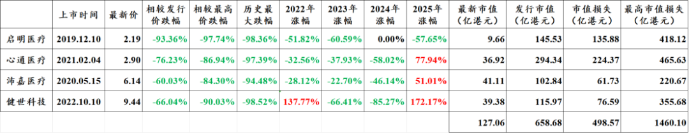
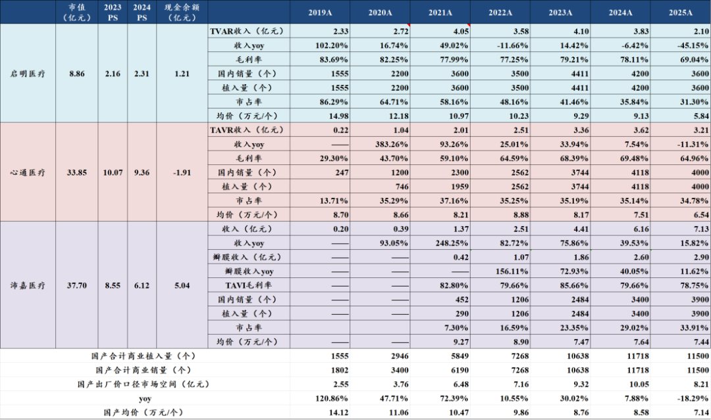
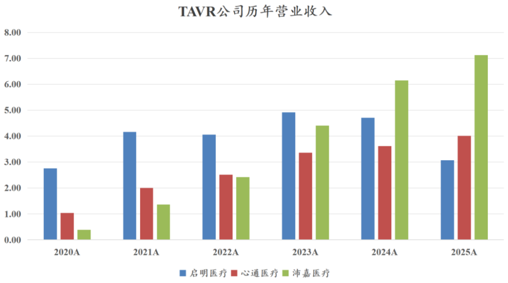
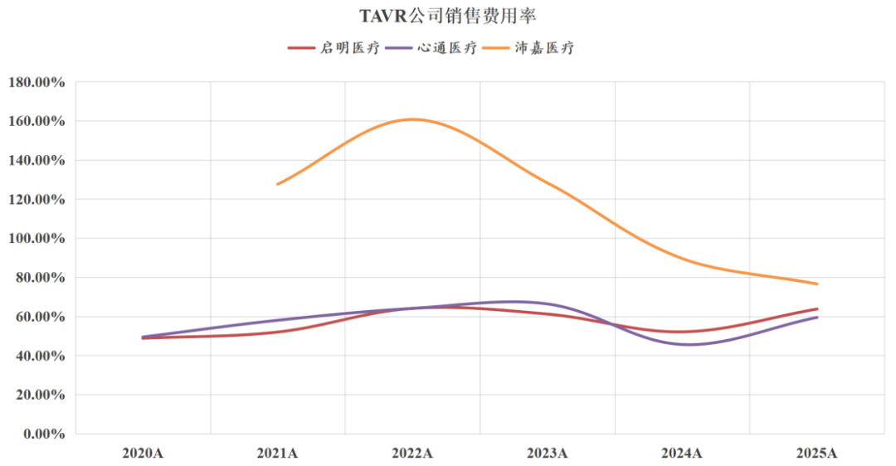
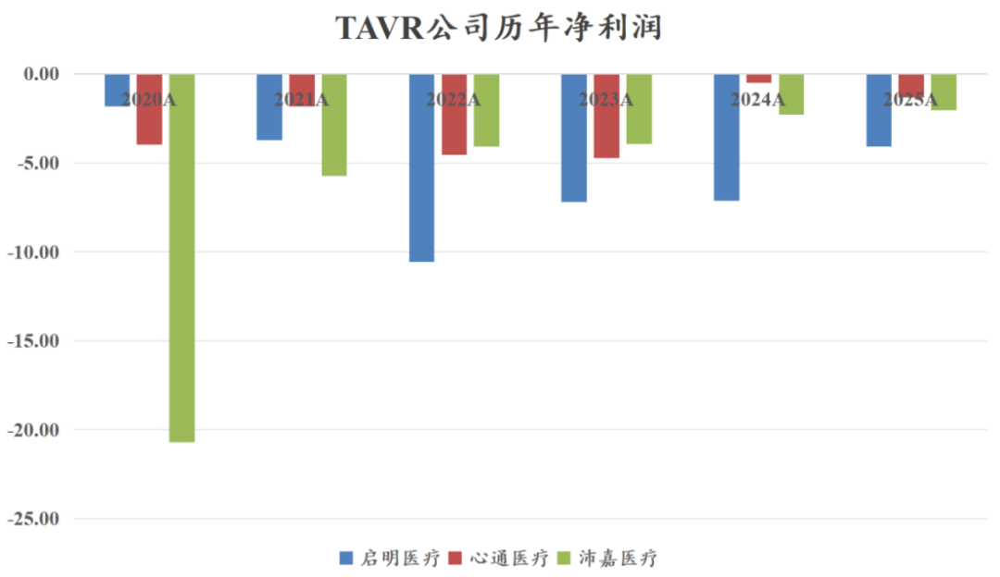
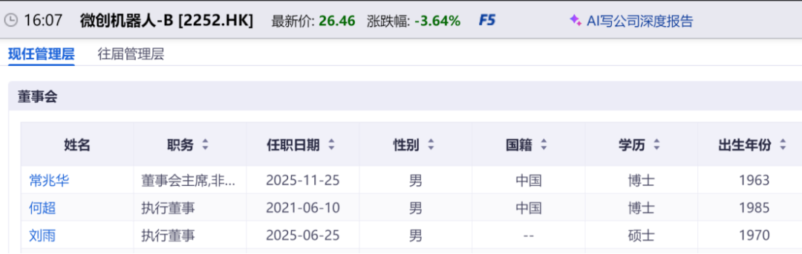

# 医药行业价值毁灭之王

大家好，我是龙哥。

港股因为多个公共假期连接，这周五到下周二休市五天，一半的医药公司、大半的创新药械公司这几天不交易，咱们来聊点吐槽的。这个行业我早就想吐槽，也刚好昨天才把最后几家“最不想看的医药公司”的年报简单过了一遍，趁这个时间讲讲，也不影响下周港股开市后大伙的心情。

有一个行业，我愿称之为医药领域的“价值毁灭之王”，不仅是行业内的几家公司同时面临逻辑和估值的崩塌，市值巨额损失，与此同时行业龙头公司还面临一系列的公司治理和道德问题，值得我们引以为戒。

1、市值毁灭

以前的TAVR三剑客，后来变成了TAVR三傻，现在变成了TAVR三傻\*。

经导管心脏瓣膜的港股4家上市公司，曾经最高市值合计达到1620亿港元，去掉健世科技的三傻最高总市值也有1400多亿港元，如今四家公司加一起的市值只有127亿港元，十不存一，即便相较发行市值也是合计损失超过500亿港元。

四家公司从股价的历史高位跌到历史低位，最大跌幅分别是98.4%、97.4%、94.5%、98.5%。

以前入行的时候有句老话，叫“如果一个公司股价最终跌了90%，那么你在跌50%的时候去买和在最高点去买的人没有什么区别，前者亏损80%、后者亏损90%”。

真正让我们切身体会到这段话的威力，就是在上一轮港股熊市中的医药行业表现，以上三傻表现尤其突出，可以修改一下这句话，“如果一个公司股价最终跌了98.5%，那么你在跌90%的时候去买和最高点去买的人没有什么区别，前者亏损98.5%、后者亏损85%”。

2、逻辑破灭

回顾2019-2021年各家买方和买方分析师的研报，普遍认为TAVR（经导管主动脉瓣）的市场容量在百亿以上，也有部分报告预计市场容量可以达到200-300亿，如果再加上经导管二尖瓣、三尖瓣的市场预测，市场规模可达数百亿至千亿。

现实中到底做了多大的市场规模？

截止到2026年3月，中国市场合计有11个国产品牌和3个进口品牌共计14家厂商获批了TAVR产品，其中有公开披露TAVR销量和数据的3家独立上市公司启明、心通、沛嘉的销售数据如图所示：

三家行业龙头在2024-2025年合计的手术量在1.1-1.2万台，合计的报表口径收入在8-10亿元，当然，这是出厂价口径，实际终端口径肯定要比这还大不少，但肯定是相较曾经100-300亿的市场预期相去甚远。

3家所谓的行业龙头，即便加上沛嘉的神经介入收入（占沛嘉收入50%-60%），过去6年合计收入62亿元，合计净亏损90亿元。

我们不愿在现在这个时点再去追问当年的分析师为什么给出当时那么乐观的行业预期，毕竟龙哥当年也花了大量的时间精力去研究和跟踪这几家公司。以史为鉴，我们需要反思的是，行业到底出了什么问题，何至于此？

总结来说可以归为几点：

- 国内器械市场β问题。
- 行业恶性竞争。
- 定价较高，支付能力不足。
- 龙头公司自己作死。

①器械市场β问题

国内的器械行业一直存在一个最大的问题，直到今天依然存在，就是创新器械的定价问题。

虽然有创新器械绿色审评通道，但绝大部分的所谓创新器械，并没有类似创新药医保谈判那样的独立的、成熟且成体系的定价机制，反而还会和其他器械一起纳入集采，并不能体现出“创新器械”和“仿制器械”有什么区别，我们知道本文讨论的TAVR行业也即将迎来集采。

大部分产品都被一一集采，又没有能纳入医保的高定价、差异化创新器械来补缺口，这就导致我们看到国内很多器械公司这几年呈现出“每年都在集采出清、怎么年年都出清不完”的问题。

我们期待后续创新器械定价机制可以得以完善。

②恶性竞争

很多人总是吐槽某保局砍价的问题，但问题是如果一个领域有十几家同质化竞争的产品，换你是买方，你不砍价？

从2011年爱德华生命科学的全球首款球扩式TAVR获批，至今美国市场仍然只有爱德华、美敦力、雅培、JenaValve等4款TAVR商业化（波科25年5月退出TAVR市场），有限的竞争来自专利的保护、审批端的审慎、企业的研发决策和资本市场的理性。

国内市场，自2017年启明医疗的首款国产TAVR获批以来，至今已经有11家国产公司的17款TAVR产品获批上市，加上进口三家，合计超过20款产品，主打一个饱和式供应。

TAVR手术作为一个创新术式，有一定的学习曲线，需要企业去跟台教育医生，前期的销售费用投入必不可少，作为一个新兴的器械领域和术式，这个行业哪怕有多家企业竞争，理论上应该大家共同去开拓市场、做大蛋糕。

让我印象深刻的是，某家公司当年自豪的表示他们不要去教育医生和市场，而是要用所谓me better的产品直接抢占先发企业教育好的医院和医生。

这样做的结果，就是倒逼头部企业开启价格战——大额补贴和超高销售费用率，最终行业蛋糕没能做大，做蛋糕的桌子被掀了。

各家公司随着销售放量，反而销售费用率还往上走，也算是行业奇观了。

三家公司过去6年时间一共亏了90亿。

③定价较高，支付困难

TAVR植入耗材本身的出厂价就高达7-10万元/个，终端价再叠加各种手术耗材和用药，总的治疗费用高达20多万到30万 ，即便已经有不少省份有医保支付，但也只支付其中少量的手术费，费用的大头还是患者自付，这个费用对于国内大部分患者来说都是不小的负担。

由于上文说到的创新器械缺少医保定价和纳入医保支付的路径，使得高价器械的放量面临困难。

④龙头公司自己作死

三家行业龙头，各有各的骚操作。

行业龙头本应对行业发展起到引领作用，TAVR行业三家公司原本也被资本市场寄予厚望，但现实则是令人失望不已。

启明医疗老板还有一堆体外资产，不但谋求体外资产注入，还占用上市公司资金，致使公司停牌接近一年半时间，复牌当日股价暴跌三分之二。

杭州是一个开放、高效率的城市，但在我们医药行业，2023-2024年出现了诺辉健康和启明医疗两家行业之耻的公司。

心通医疗不遑多让，微创系的各种离谱操作已经是广为人知，去年又玩了一把离谱操作，微创医疗集团十年前从海外买来的、连年亏损的、做心脏起搏器业务的CRM（微创心律），由于有分拆上市的对赌协议，眼看上市无望，去年直接高溢价注入心通医疗。

为什么是心通医疗？因为心通医疗还有十几亿在手现金，足够偿还CRM的债务，因为心通医疗在港股上市，没什么监管，放在A股的心脉医疗看看，监管能同意？

我们此前讲到器械出海的龙头公司中，有溢价微创机器人，也是微创系分拆出来的子公司，目前最大的风险可能也是公司的治理风险，毕竟某人目前还是机器人的董事长。

......

TAVR三傻\*，对医药行业，对医疗器械行业，对创新器械行业，对医药投资人，是最深刻的血与泪的教训。行业也应该直面当年的错误，积极求变，这也是为什么我们现在如此关注器械出海做的优秀的企业。

......

[那些“严重低估”的公司，后来怎么样了？](https://mp.weixin.qq.com/s?__biz=MzkyMzQ3MDc3Mw==&mid=2247485735&idx=1&sn=d2252fb149e35ac9b92d617d03b0c44e&scene=21#wechat_redirect)

[中国医疗器械全球化路径](https://mp.weixin.qq.com/s?__biz=MzkyMzQ3MDc3Mw==&mid=2247485569&idx=1&sn=4fb6ee854b13ff09385b88fb3c638409&scene=21#wechat_redirect)

[医药行业2026，继往开来](https://mp.weixin.qq.com/s?__biz=MzkyMzQ3MDc3Mw==&mid=2247485469&idx=1&sn=51560c124ea3a20e1624cd73474f43a5&scene=21#wechat_redirect)

风险提示：本文仅讨论行业/公司经营情况，投资需综合考虑公司经营、估值、管理层等多方面因素，建议读者审慎参考，本文不作为投资依据，不建议大家根据本文做出投资计划。

<!-- wxmp-comments-begin -->

---

## 留言（18 条，含回复共 31 条）

- **长线复利** 👍10 · 2026-04-03 17:00
  写得不错，就是要多写写这类的，让大家看清某些公司各种丑陋的嘴脸
- **李伟** 👍8 · 2026-04-03 16:54
  三剑客——三傻——三傻*，这个递进描述绝了~~[呲牙]
- **JMTerry** 👍6 · 2026-04-03 16:38
  这样的文可以多来[666]
- **小左** 👍5 · 2026-04-03 16:29
  天啦，见识了
- **东北大飞哥** 👍4 · 2026-04-03 16:47
  器械黄金十年已经泥石流五年
  - ↳ **作者** · 2026-04-03 16:59
    后五年靠出海[加油]
- **小刘鸭埃里克** 👍3 · 2026-04-03 16:25
  反者道之动，我恰好觉着现在是TAVR的机会，
  相对成熟的TAVR（治疗主动脉瓣狭窄+反流）未来手术现在2万多/年；相对新兴的TEER（治疗二三尖瓣反流）现在0.2-0.3万台/年，这些术式带来的场景由于其作为身内之物，销售的前期难度大后期退坡反而更困难。我说的这些术式未来哪怕悲观的看有3倍以上的空间，龙哥怎么看
  - ↳ **作者** · 2026-04-03 17:10
    参照文章中的问题第一条，如果能解决了定价问题，很多国内的创新器械都还能看的，否则就主要看出海
- **郭文爵** 👍3 · 2026-04-03 17:01
  看标题以为要说疫苗[捂脸]
  - ↳ **作者** · 2026-04-03 17:06
    有人想看吐槽疫苗的吗[吃瓜]
- **佳丙** 👍3 · 2026-04-03 17:18
  感谢龙哥的分享，我觉得这类文章的分享，某种意义上，比讲我国创新药开疆拓土更好。要想活得长，在我国资本市场要有十足的风险意识。
- **嘀嗒** 👍1 · 2026-04-03 16:50
  龙哥，迈瑞，威高，微创这些龙头也是价值毁灭吗
  - ↳ **作者** · 2026-04-03 16:56
    迈瑞威高主要是有政策周期和疫情周期，不算价值毁灭，现金流也很充沛
- **靡不有初** 👍1 · 2026-04-03 16:56
  还好这三家都没碰，手上持有的是迈瑞、乐普和恒瑞
  - ↳ **作者** · 2026-04-03 17:08
    有现金流的行业龙头，就算周期下行，也不至于这样亏95%以上。。。
- **大海** 👍1 · 2026-04-03 17:00
  龙哥，说说今天美国新关税政策对百济神州的影响吧，能定量分析出来吗？
  - ↳ **作者** · 2026-04-03 17:07
    对百济没影响啊，百济已经去美国建厂了啊，可以美国本地化供应的
- **光头的复利人生** 👍1 · 2026-04-03 18:29
  我之前买心玮的时候，第一件事就是先查查它跟微创系有没有关系[偷笑]
- **Yu(不吃米饭版)** · 2026-04-03 16:27
  龙哥，有没有考虑分析一下国外的医药公司
  - ↳ **作者** · 2026-04-03 17:10
    其实吧，国外的我们也看了不少，但是对绝大部分读者来说都投不了，意义不大
- **累了就睡** · 2026-04-03 16:31
  今天老美发了个进口药关税，结果市场的反映没有想想的那么剧烈，是大家更理智了？，还是大a现在跌不动了[捂脸]
  - ↳ **作者** · 2026-04-03 17:09
    去年这事说了好几回了[捂脸]
  - ↳ **作者** · 2026-04-03 18:06
    是的，9月11号有一次，然后基本都是超水下开，今天还想深水干呢，发现不恐慌了[捂脸]
- **穆晓春** · 2026-04-03 16:32
  能再讲讲微创医疗吗？感觉控股的几家子公司已经超过他的市值了，而且他本身还有业务，是不是有点低估了
  - ↳ **作者** · 2026-04-03 17:08
    哎你别说，我3月9号那篇文章刚写了这事
- **建东** · 2026-04-03 16:42
  沛嘉是不是好点
  - ↳ **作者** · 2026-04-03 17:00
    和另外两个过于拉的公司比起来还算好点的
- **HungMan🍓🍒** · 2026-04-03 16:45
  龙大[玫瑰]我一直在医疗里躺着几年了也没亏也没咋盈利！是否该换港股创新药好些呢，弹性好点 谢谢指教[玫瑰]
  - ↳ **作者** · 2026-04-03 16:59
    也是比较熟悉的IP了，去年的文章白看了[捂脸][捂脸]
- **qzz** · 2026-04-03 16:48
  龙哥，血制品的股价也到十年前了
  - ↳ **作者** · 2026-04-03 16:56
    血制品是逆周期的阶段，杀业绩杀估值，但是是创造现金流的，只是股价目前不太好

<!-- wxmp-comments-end -->
