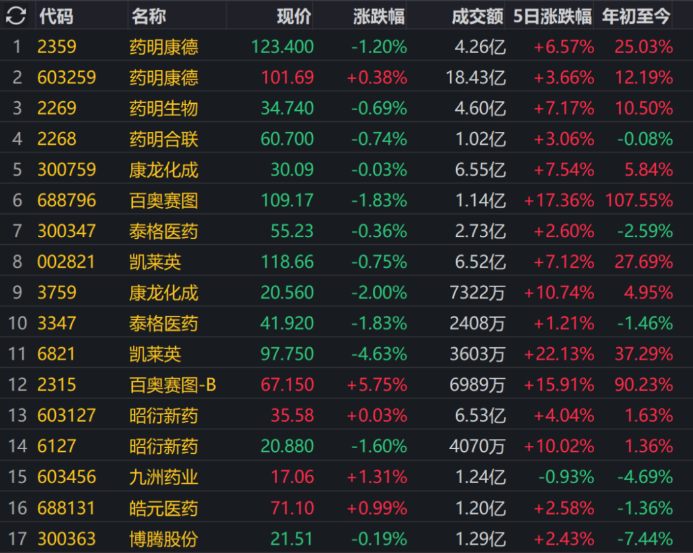
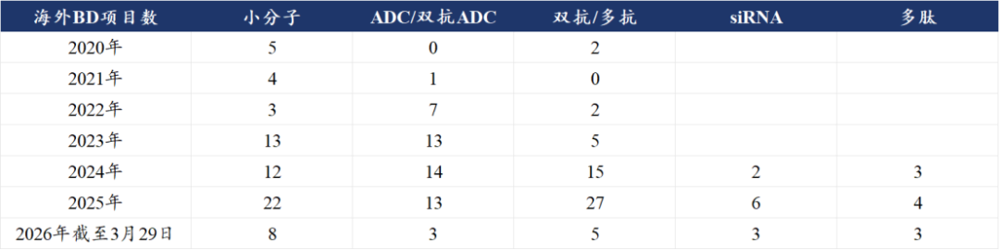
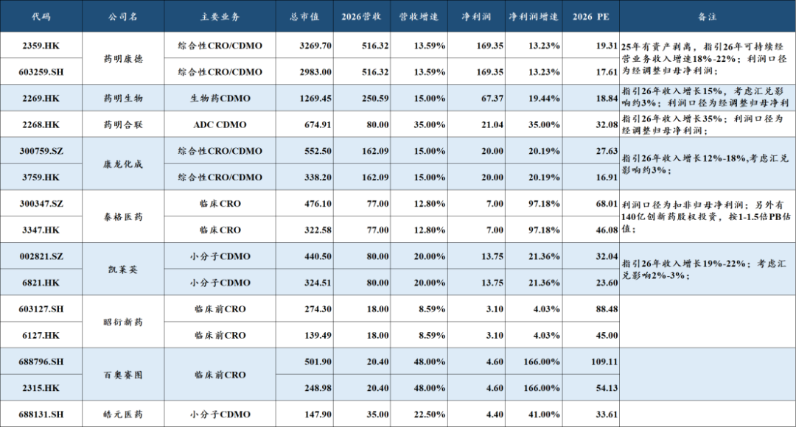
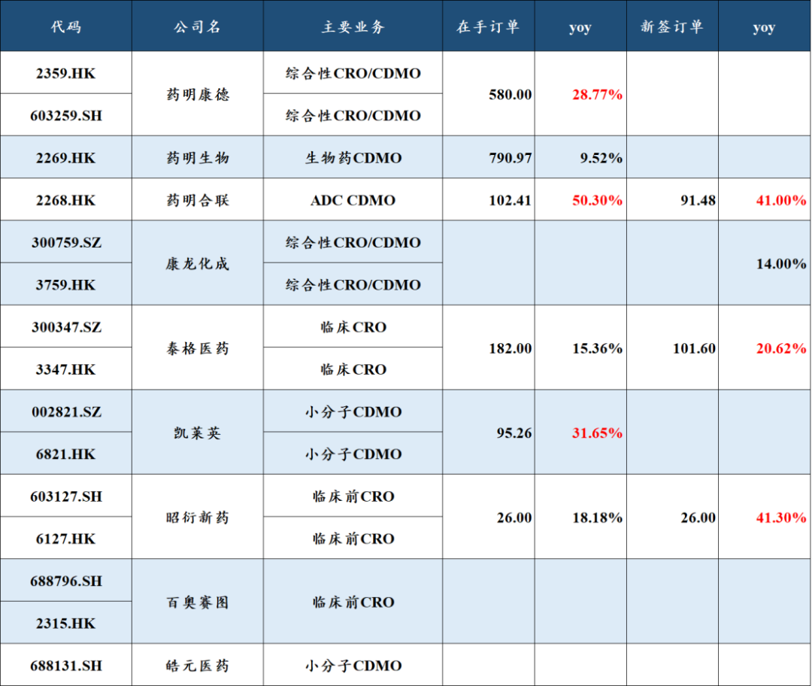
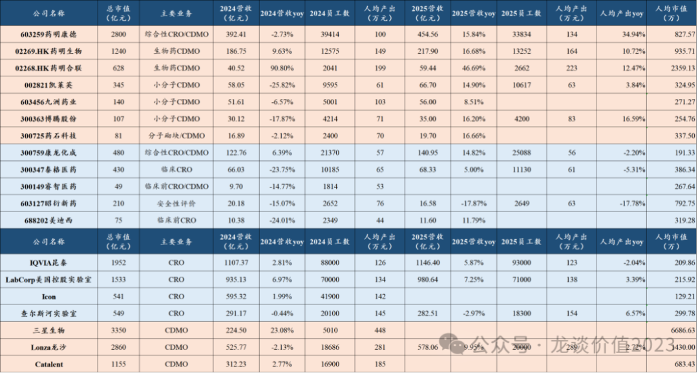

# CXO，强劲的基本面能否对冲医药的蹲狗

大家好，我是龙哥。

CXO主要一二线公司的财报已经发布完毕（头部CXO大部分是AH同步上市，港股要在3月31日前公布年度业绩），对应今年以来行业内公司的股价表现也已经走出分化，这里我们结合基本面和估值水平来看看当前的CXO行业处于什么阶段和估值水平。

从业绩和估值角度，今年一二线公司中，业绩可以维持较好增长的公司，总体还是以主要服务于创新药高景气赛道的公司为主。

哪些是创新药高景气赛道？我们此前已经多次强调，这两年来看就是GLP-1类减重药（包括多肽类、小分子类）、ADC、双抗/多抗，去年以来又增加一个小核酸领域，这些大家从我们此前持续梳理更新的创新药BD的情况就可以清晰的看到。

结合下图两个表可以看到各家公司的业绩和订单情况：

（表中所有单位均为“亿元人民币”，最新市值为截止上周五时点的总市值）

①药明康德：

礼来的替尔泊肽今年继续放量、但增速会有所放缓，礼来的口服小分子GLP-1药物orforglipron早于预期时间获批上市，药明康德也将为其提供CMO代工，另外截止2025年底药明康德的管线中已经合计有473个多肽及寡核苷酸类的项目在推进，后续还会有更多项目陆续推进到商业化阶段，因此药明康德一直是国内最充分享受这轮GLP-1赛道爆发的CXO公司。

截至25年底其可持续经营业务的在手订单580亿同比增长28.8%，公司指引26年可持续经营业务的收入增长18%-22%，由于剥离资产，表观的增速会低一些，不过市场总体还是认可其以可持续经营业务的增长作为核心业绩增长考核指标的。

②药明生物：

公司横跨ADC（分拆药明合联）和双抗/多抗两大景气赛道，并且在这两大赛道都达到了全球40%的市场份额，按照药明系的follow/win the molecule的趋势，ADC和双抗/多抗未来诞生的大项目会有相当一部分在药明系的漏斗中推进到商业化阶段。

药明生物指引26年收入增长13%-17%，这个是考虑了3%左右的汇兑影响，扣除汇兑影响的话实际增速应该在16%-20%，其中2026年一季度新签订单同比增长100%，且今年来的新签订单平均涨价5%-10%。

25年药明生物的产能利用率只有70%左右，这也使得药明生物的利润率目前还是处于偏低水平，产能利用率的抬升将带来其利润率提升。

③药明合联：

作为ADC CDMO的细分领域绝对龙头，表观增速最高，截至25年底的新签订单同比增长41%，在手订单同比增长50%，指引26年收入增长35%，如考虑并表东曜后的表观收入增速能达到40%，是一二线CXO公司中增速最高的一家，当然其对应的估值也是一二线CDMO里最高的。

④康龙化成：

公司今年小分子CDMO会有明显的改善，这也符合我们此前的判断，从公司的全年指引来看，收入端预计增长12%-18%，其中也是考虑了3%的汇兑波动影响，中位数增速15%左右与其新签订单增速14%相匹配，其中预计小分子CDMO的收入增速在25%左右，会显著快于公司总体的增长。前阵子康龙化成还与礼来合作，拿到礼来的orforglipron在中国区的制剂CMO订单。

⑤凯莱英：

公司业绩和订单的优秀表现是带动上周CXO行业上涨的重要原因，其截止25年底的在手订单同比增长32%，指引26年收入增长19%-22%，并且是考虑了2%-3%的汇兑影响的情况下，扣除汇兑因素的实际增速可能在21%-25%。

凯莱英在GLP-1领域的订单也逐渐进入放量阶段，2025年凯莱英的化学大分子板块收入突破10亿元、同比增长124%，而药明康德的多肽及寡核苷酸业务收入在2022年就突破了20亿元，凯莱英落后4年多时间，但随着这两年陆续有重点项目进入后期和商业化阶段，凯莱英也将开始受益于GLP-1赛道的红利。

凯莱英过去去年由于新冠口服药订单的萎缩，固定资产周转率下降了比较多，也导致其相较过去行业供需稳定阶段的利润率下降了很多，后续随着固定资产周转率的回升，也会看到其净利率的回升。

⑥泰格医药/昭衍新药：

CRO业务的恢复具有滞后性，这点在我们去年5月份时候创新药行业经历一波大涨、我们最早分析CXO行业的时候就有讲到，CRO公司的订单价格传导没有那么快，需要经历“一二级市场融资恢复→创新药企业信心恢复→创新药企业研发管线扩充→CRO订单增加、价格回升→CRO订单执行和确认收入”。

当时我们说这个过程大概需要半年到一年的时间，到现在来看可能还有点乐观了，实际传导到订单的量价回升都花了半年多的时间，新签订单再传导到业绩还需要2-3个季度的时间。

这也就导致，大家可以看到上表中泰格医药新签订单增长20%多、且公司预计26年新签订单还会维持这个增速，昭衍新药25年新签订单增长41%，但实际上泰格医药和昭衍新药的报表端的业绩显著修复可能都是在26年下半年或者四季度，即便是药明康德的药物发现业务收入在25年也依然承压。

......

上周的文章中给大家分享过这么一张图：

国内和海外对比来说，中国CXO公司目前的业务增速要显著高于海外可比的一二线CXO公司，与此同时我们的估值水平又要低于海外CXO公司——lonza37倍PE、三星生物40倍PE、IQVIA21倍PE、Labcorp Holdings25倍PE。当然我们AH股的这些公司可能还要承担一些中长期的地缘zz风险，所以可能会有一些折价，即便如此也是估值与成长匹配较好的细分领域。

如果要让龙哥说一个行业目前的风险点，那就是行业一二线头部公司的业绩和订单情况都已经基本发布，行业较为强劲的基本面已经成为明牌，全市场几乎所有关注医药行业的投资人都看好CXO，而医药行业作为一个卷王+蹲狗遍地走的行业，还是挺怕高度一致的预期。

......

[当医药重回舞台中央](https://mp.weixin.qq.com/s?__biz=MzkyMzQ3MDc3Mw==&mid=2247485838&idx=1&sn=fab6738e63e6fda2e8b72c8d2c59cf4f&scene=21#wechat_redirect)

[药明系，即将登顶](https://mp.weixin.qq.com/s?__biz=MzkyMzQ3MDc3Mw==&mid=2247485809&idx=1&sn=6afc905dfa419dcf60bb333d6f228170&scene=21#wechat_redirect)

[中国创新药出海，新的里程碑](https://mp.weixin.qq.com/s?__biz=MzkyMzQ3MDc3Mw==&mid=2247485797&idx=1&sn=e287b1e60d27ce529415dc7afae6a8ce&scene=21#wechat_redirect)

[医药TOP20变迁，十五年的轮回](https://mp.weixin.qq.com/s?__biz=MzkyMzQ3MDc3Mw==&mid=2247485777&idx=1&sn=ba8657fd715a74ce3c30b09fca229635&scene=21#wechat_redirect)

风险提示：本文仅讨论行业/公司经营情况，投资需综合考虑公司经营、估值、管理层等多方面因素，建议读者审慎参考，本文不作为投资依据，不建议大家根据本文做出投资计划。

<!-- wxmp-comments-begin -->

---

## 留言（9 条，含回复共 15 条）

- **光头的复利人生** 👍9 · 2026-04-08 11:37
  虽然每次都被骗炮，但依然含泪高喊“这次不一样”！
- **飛行艇wdl** 👍5 · 2026-04-08 11:31
  业内高度一致，但是一看股价大部分月线还在下面....相比科技的景气度，吸引不到外部的资金[捂脸]
  - ↳ **作者** · 2026-04-08 11:35
    CXO总归是比创新药，更容易被全基的资金看懂吧，哈哈
- **廖书豪** 👍3 · 2026-04-08 11:49
  好骂，今天盘面就是真实写照，怒其不争[捂脸]
  - ↳ **作者** · 2026-04-08 11:50
    单日的盘面都还好，毕竟上周医药一把涨这么多。
    只是中长期来看医药每次都搞利好兑现猛砸的话，很打击投资人信心的，信心比黄金重要[呲牙]
- **1little0** 👍2 · 2026-04-08 11:23
  对比科技，医药真的是狗都不理哎。那批人科技里面的一坨屎都觉得香
  - ↳ **作者** · 2026-04-08 11:25
    科技的一些细分领域确实是产业逻辑强、有业绩，咱们也不可否认的。但还是那句话，创新药及其产业链的基本面在全市场比较来说肯定不算差的，应该说是比较靠前的几个细分行业之一，是不容忽视的。
- **田霖** 👍2 · 2026-04-08 11:48
  港药etf目前三分之一仓位，这部分我是坚决不做高抛低吸的，跌出好价格就继续补
- **雨化心声** 👍1 · 2026-04-08 11:35
  龙大，今年的医药，BD肯定不是主角，但不会落下，cxo扛大旗，行不行，多研究研究解读，不然就从原料换工具吧[咖啡]
  - ↳ **作者** · 2026-04-08 11:37
    CXO相对明牌，估值也不能提到天上去啊，创新药我觉得还是主线，产业链配合。创新药能走强，大家对CXO的信心也是越足的。
- **奇志** 👍1 · 2026-04-08 11:40
  龙大，器械，迈瑞这种26年的发展怎么看
  - ↳ **作者** · 2026-04-08 11:48
    迈瑞25年三季度收入增速转正，原本我们也期待那个拐点，但那时候实际来看渠道库存依然没出清，年报压力依然很大，后续年报放出来大家也都看到了。
    看今年我认为是有机会看到真正的业绩拐点的，问题在于看到拐点可能向上的业绩弹性的没有很大，迈瑞当前的体量，在没有外部事件冲击的情况下很难有大的加速。未来业绩会逐渐趋于相对的稳定，变成偏美的/格力这样的红利股，迈瑞去年的股息率不到3%，后续利润端企稳的话，还可以看看股息。
- **DRAGON** 👍1 · 2026-04-08 11:50
  有药明系两家就够了，伴随创新药可以多拿几年
- **好久不见** · 2026-04-08 11:28
  龙大，普洛药业怎么样
  - ↳ **作者** · 2026-04-08 11:34
    原料药去年基本处于周期底部比较差的阶段，今年又叠加这么复杂的局势，基本上化工链的产品都有提价，原料药的成本提升向下游顺价我认为基本没太大问题，印度那边的产能的压力比咱们要大的多，边际上大概率向好，只不过普洛本身也说不上是特别低估的估值，还要看具体今年业绩修复的情况。

<!-- wxmp-comments-end -->
