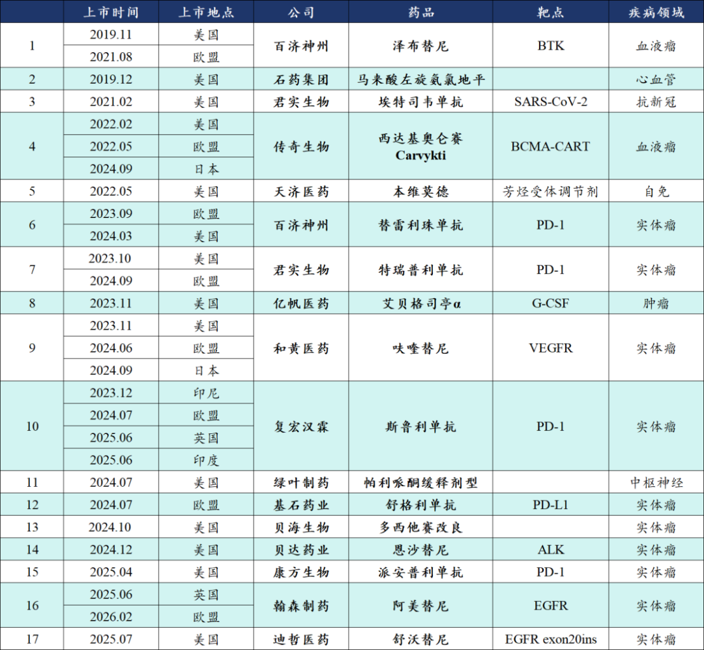
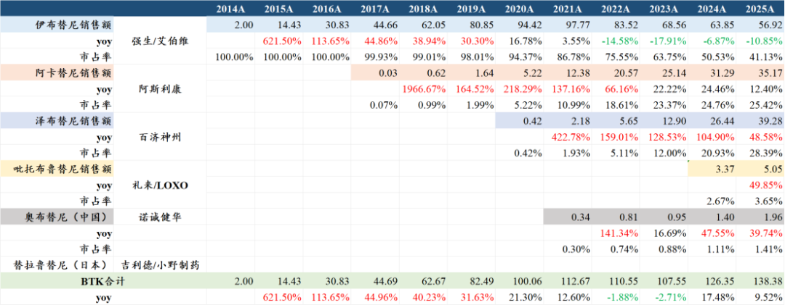
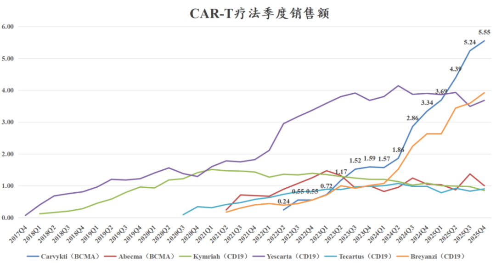
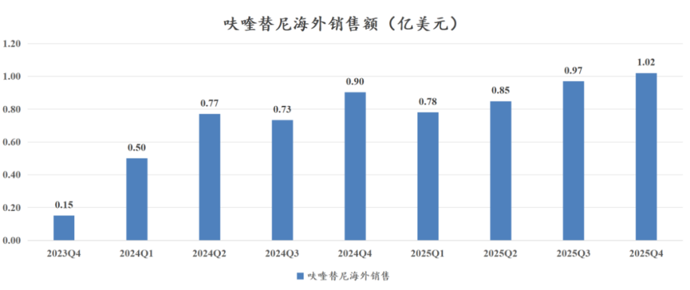
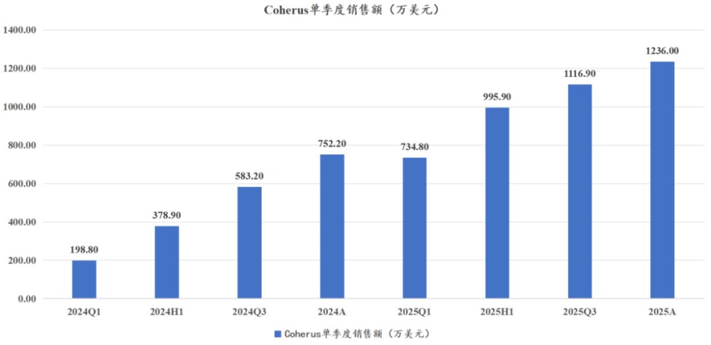

# 创新药出海，面对现实

大家好，我是龙哥。

创新药出海，前提是要先出去，但出去了还只是个开始，截止目前，不考虑仿制药和生物类似药，仅国产创新药已经有17款药物在海外主流市场——欧美市场获批上市，如今商业化做的怎么样？

结果可能不是很尽如人意，真正能做到优秀的商业化表现的品种仍是屈指可数，国产创新药从23-26年以来的密集BD交易，大部分管线还在临床阶段，到未来想要密集的取得商业化的成功可能也是道阻且长。

1）海外商业化大获成功

在中国创新药出海、在主流的欧美市场获批商业化的品种中，能称得上“大获成功”的截止到目前只有3个品种，分别是泽布替尼、Carvykti和埃特司韦单抗。

①泽布替尼：

泽布替尼是目前国产创新药全球销售TOP1的品种，25年全球销售39.28亿美元同比增长48.58%，在全球BTK抑制剂的份额提升至28.39%，单季度市占率已经提升到31.23%，2026年预计将实现单季度销售额登顶全球BTK抑制剂的TOP1，26全年销售额有望达到48-50亿美元，将达到不少投资人此前预计的销售峰值。

②Carvykti

Carvykti是传奇生物在2017年12月授权给强生的一款BCMA-CART，最早于2022年2月获得美国FDA批准首个适应症，目前已经在美国、欧洲、日本、中国获批多个适应症，2025年，Carvykti已经超越比其早4-5年上市的其他CAR-T疗法，成为全球销售额最高的细胞疗法，2025年全球销售额18.87亿美元同比增长96%，预计2026年的全球销售额可能会达到27-30亿美元，传奇生物和强生各50%的权益比例，传奇生物目前市值仅33.6亿美元，相当于对应26年仅2.4倍PS。

优秀的产品+顶级的MNC合作方使得Carvykti取得巨大的成功。

③埃特司韦单抗

很多投资人可能都不记得这款药物，实际上这是君实生物当年的高光时刻，2020年5月以1000万美元首付款+2.45亿美元的里程碑付款将这款临床前阶段的中和抗体授权给礼来，2021-2022年礼来的bamlanivimab+etesevimab组合疗法分别实现22.39亿美元和20.24亿美元的销售，君实生物在2021年拿到12.59亿元里程碑付款+11.12亿元销售分成、产品供应收入，不过2023年该品种销售就已经几乎归零。

时也命也，多少国产创新药出海过程中一顿操作猛如虎，最后远不如君实随手授权出去的一款新冠中和抗体赚的多。不过这款中和抗体也没能给君实带来什么质变，当年花钱如流水的君实，在中和抗体贡献20亿+收入的情况下仍在2021年亏损了7.2亿。

2）海外商业化高开低走

部分创新药出海品种商业化呈现“高开低走”，要么是开局还不错、后续表现一般，要么是公司给的指引或者预期比较高、实际表现不佳，例如和黄的呋喹替尼、君实的特瑞普利、亿帆的艾贝格司亭等。

①呋喹替尼

呋喹替尼于2023年11月获得美国FDA批准上市，2023年1月和黄医药把该项目以4亿美元首付款+7.3亿美元里程碑付款+双位数销售分成将大中华区以外权益授予武田制药，也算是当时的一段佳话。当时在美国定价2.5万美元/盒（月用药费用）VS国内定价7500元/盒，同一款药物做到中美价格相差24倍。

海外商业化之初的销售也是超预期的，海外上市第一个月卖了0.15亿美元，商业化到第三个季度就达到0.77亿美元，然而直到2025Q3-Q4单季度销售额还在1亿美元附近震荡，当然这里面也有一部分美国市场去年有所降价的影响，但总体来说末线适应症的尴尬就体现在这里，哪怕是消化道领域渠道和品牌较强的武田制药似乎也有些力不从心，赚回4亿美元首付款可能都需要几年时间。

②特瑞普利单抗

君实生物2021年2月将特瑞普利单抗的美国商业化权益授予Coherus，君实获得1.5亿美元首付款+7.6亿美元里程碑付款+20%销售分成，对君实来说也算是一笔不错的交易。其在美国获批的唯一适应症是复发或转移性鼻咽癌，原本预计是特瑞普利单抗在美国市场可以在1-2年内快速爬坡到2亿美元销售额，实际上市第一年和第二年分别销售0.19亿和0.41亿美元，小适应症+小biotech的组合实在是不堪重任。

③艾贝格司亭α

亿帆医药的创新药子公司亿一生物开发的长效升白——艾贝格司亭α，也是所谓的Best in class产品，2023年11月获得美国FDA批准，2024年10月完成首批发货，原本预计25-26年在国内及海外合计销售额分别达到20亿元和30亿元，实际给公司贡献的业绩也是较为有限，前后经历13年开发周期、海外花费10亿元做完III期临床，到2025年也只能给出海外峰值10-15万支销量、单支200-300美元利润的预期，顺利达峰的情况下想要收回临床成本也是需要多年时间。

3）海外商业化不声不响

以上“高开低走”的公司无论如何还能有商业化分成收入，如果加上前期的BD收入，至少还是能收回研发成本、甚至创造部分利润的。但还有些项目更加尴尬，海外开发多年，也曾给颇高的预期，却在商业化后都没能BD出去，例如贝达药业的恩沙替尼、迪哲医药的舒沃替尼。

①恩沙替尼

跟踪贝达药业比较久的投资人都知道，恩沙替尼海外这个老大难，miss了多年，终于在2024年12月在美国获批上市，直到我们24年12月海外获批前夕去调研的时候公司仍在信誓旦旦的承诺一定会在美国获批之前落地BD授权，但可惜的是直到现在也没有声音。

2025年贝达药业的产品收入规模预计超过35亿元，也算是个中型biopharma的水平了，但依然是比较让人失望的表现，如今大几百亿到千亿市值的几家biopharma成立的时间也就是2010-2012年前后，那时贝达都已经有一款重磅产品埃克替尼获批上市，2015-2016年就已经达到10亿元销售体量，兜兜转转到现在市值还是在2018年前后的水平震荡，在三代EGFR TKI的销售上被翰森、艾力斯等后来者摁在地上摩擦，研发团队和管线开发都是历经波折。

可能往前5年、往后5年，贝达都会被作为一个典型的“创新药是时间的敌人”的经典案例来讲述。

②舒沃替尼

迪哲医药的舒沃替尼在2025年7月获得美国FDA批准上市用于二线治疗EGFR Exon20ins突变晚期NSCLC，其另一款药物戈利昔替尼也在用于外周T细胞淋巴瘤的全球注册临床中，但两款药物的海外权益都没能授权出去，舒沃替尼海外获批已经快一年仍然没有动静，不禁让人疑惑，难道连阿斯利康对这个自家团队出去创业、已经成功在美国获批的分子都不感兴趣？

迪哲医药260亿市值，公司预计26年产品收入增长30%-40%，大概10-11亿元收入，当前市值中包含了不低的海外部分估值预期，如海外商业化没有积极进展，前途也是尚未可知。

......

创新药研发的成功本身需要天时地利人和，商业化更是充满不确定性，创新药是时间的敌人，没有那么多时间留给企业原地踏步。

除了头部pharma和少数执行力超强、眼光卓绝的biopharma能穿越产品周期，执行力稍差的企业都会在全球和国内的残酷竞争中逐渐掉队，时间在这个行业不断进行残酷的大浪淘沙，对投资人来说也是巨大的考验。

风险提示：本文仅讨论行业/公司经营情况，投资需综合考虑公司经营、估值、管理层等多方面因素，建议读者审慎参考，本文不作为投资依据，不建议大家根据本文做出投资计划。

<!-- wxmp-comments-begin -->

---

## 留言（12 条，含回复共 27 条）

- **DQ董琦** 👍1 · 2026-04-13 14:44
  传奇生物之前还真没关注过，为何缘由重磅产品之下股价那么惨
  - ↳ **作者** · 2026-04-13 14:46
    市场担心竞品，包括吉利德的BCMA CART，以及强生自己的TCE疗法
- **严丹** 👍1 · 2026-04-13 16:10
  感觉创新药今年挺难走
  - ↳ **作者** · 2026-04-13 16:11
    肯定不会像去年那么狂热和鸡犬升天，但α也不少的，多关注我们之前的文章强调的公司
- **大钟** · 2026-04-13 14:53
  CXO，26年有没有全面反转机会？
  - ↳ **作者** · 2026-04-13 14:56
    ？之前的文章是一点没看吗，25年CXO都已经全面反转了，26年行业景气度比较确定的向上。
- **张浩特** · 2026-04-13 14:56
  博主您好，您怎么看海思科的海外管线和商业模式布局呢？谢谢
  - ↳ **作者** · 2026-04-13 15:06
    海思科管线丰富还是比较不错的，国内4个创新药商业化，今年预计创新药能有接近30亿的销售额，收入占比超过50%，27年还有一款新药将获批上市。
    目前有多个项目已经实现海外授权或者后续有机会实现海外授权，今年海外授权项目也开始和FDA在内的监管部门讨论注册临床方案，海外临床今年也会有不错进展。
- **O how young** · 2026-04-13 15:02
  泽布替尼距离奥希替尼还有距离吧
  - ↳ **作者** · 2026-04-13 15:03
    泽布替尼今年应该可以超越伊布替尼。奥希替尼是EGFR抑制剂，患者群体大的多，销售规模也确实更大，已经达到七八十亿美金。
- **波** · 2026-04-13 15:03
  迪哲医药有没有可能是自己想海外销售呢
  - ↳ **作者** · 2026-04-13 15:07
    公司明确说在谈BD，缺钱的小biitech自行商业化的可能性很低。
  - ↳ **作者** · 2026-04-13 15:37
    还是患者群体数量没有那么多，有一定局限性，即便如此也应该能卖的出去才对，我们也疑惑为什么获批快一年了还卖不出去，可能的原因是要等海外一线适应症的成功，才能谈下来更好的交易价格。
- **大海** · 2026-04-13 15:28
  泽布替尼达到销售峰值，股价是不是就失去了动力了呢[凋谢]
  - ↳ **作者** · 2026-04-13 15:31
    他只是达到有些投资人预期的销售峰值，不是达到销售峰值，今年还能有20%-25%的增长，显然不是峰值水平。
  - ↳ **作者** · 2026-04-13 15:32
    另外百济的市值大的提升，肯定是需要下一个重磅产品的，今年BCL2也要在海外获批了，以及多个实体瘤项目开全球头对头3期临床，具体参照以前的文章
- **咀方头湾** · 2026-04-13 15:29
  请问龙大，1.百济的替雷利珠为何没能复制泽布替尼的成功效应；2.安进授权项目中还有哪些潜在成为大单品的管线？谢谢
  - ↳ **作者** · 2026-04-13 15:34
    替雷利珠已经是国内销售第一的PD-1了，已经做的很好了，这本身就不是一个me better的药，也没有开全球多中心头对头3期，泽布替尼的成功是头对头战胜伊布替尼的结果。
  - ↳ **作者** · 2026-04-13 15:36
    安进合作项目去年卖掉了DLL3*CD3双抗的海外分成权，这个品种在国内也刚获批商业化。如果看国内市场的话容量毕竟有限，不会对估值带来大的提振。
- **廖书豪** · 2026-04-13 15:38
  百利天恒在ELCC的iza-bren联合斯鲁利单抗一线治疗II期数据请教下龙哥，ORR和OS读出来算符合预期吗，预期差关键还是鼻咽癌/食管鳞癌这两个适用症获批吗，4月的AACR它也不参加
  - ↳ **作者** · 2026-04-13 15:47
    鼻咽癌和食管鳞癌获批能有啥预期差[破涕为笑]
    一线SCLC数据非常好啊，目前看到最好的一线SCLC数据吧。AACR一般发临床前和临床1期的早期的数据。
- **特别稳** · 2026-04-13 15:47
  龙哥觉得三生国健和诺诚健华目前贵吗？谢谢
  - ↳ **作者** · 2026-04-13 16:09
    H股不贵
- **刘明旭 ོ** · 2026-04-13 15:57
  请教龙大，百奥赛图预期是不是透支了，跌跌不休
  - ↳ **作者** · 2026-04-13 16:10
    百奥赛图前面涨这么多，正常回调吧，H股回调一波还是值得关注的，公司这几年大概率都是会快速放利润的
- **'AAA雪碧爱可乐** · 2026-04-13 17:25
  恒瑞的海外市场咋样啊
  - ↳ **作者** · 2026-04-13 17:34
    还没到产品商业化阶段，GLP-1/GIPR双靶点已经开了几个3期临床

<!-- wxmp-comments-end -->
