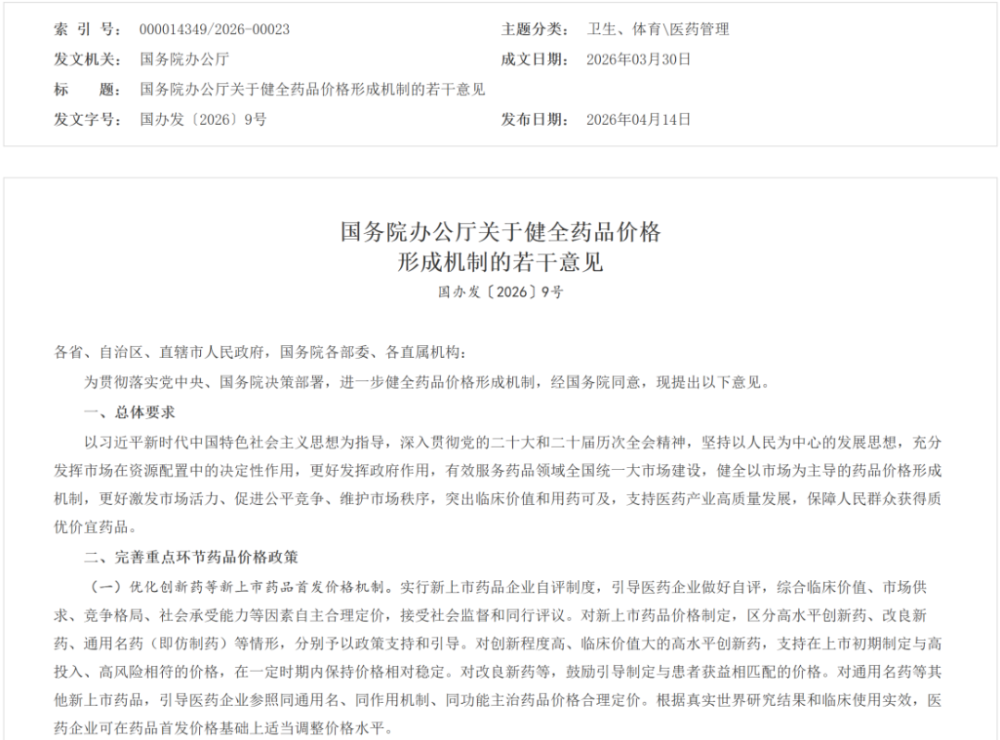
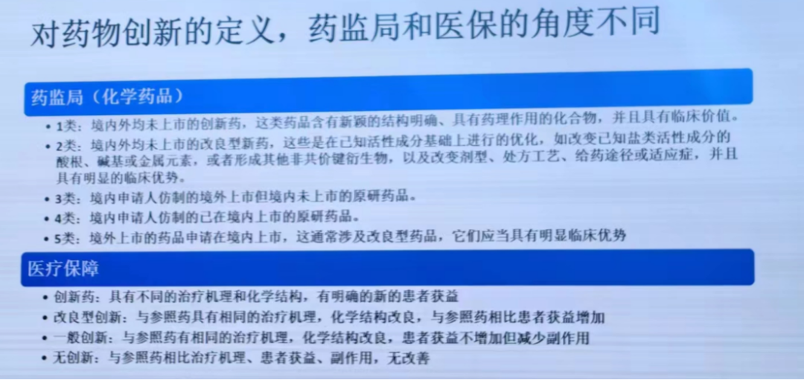
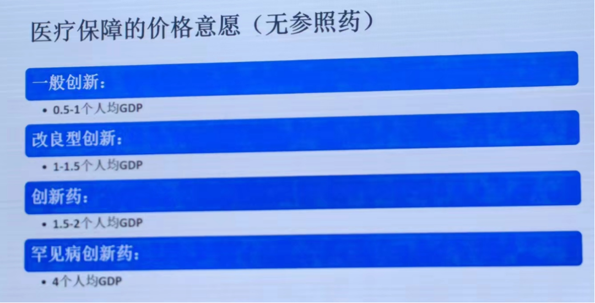
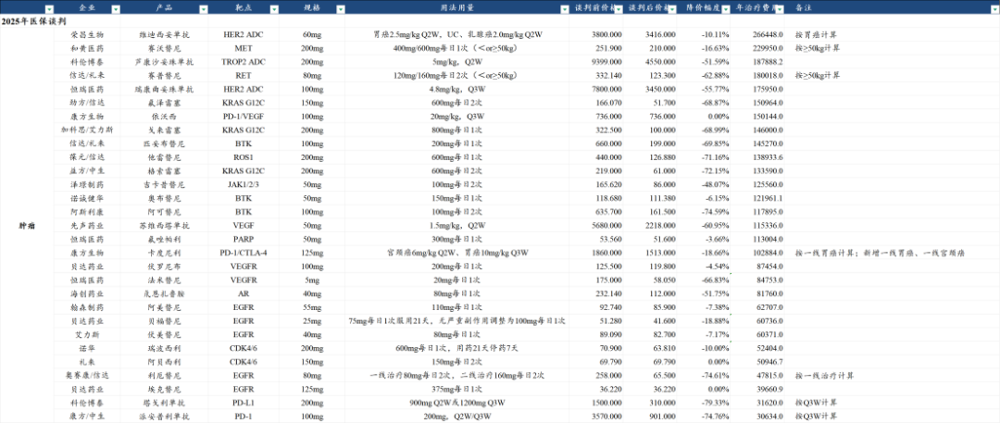
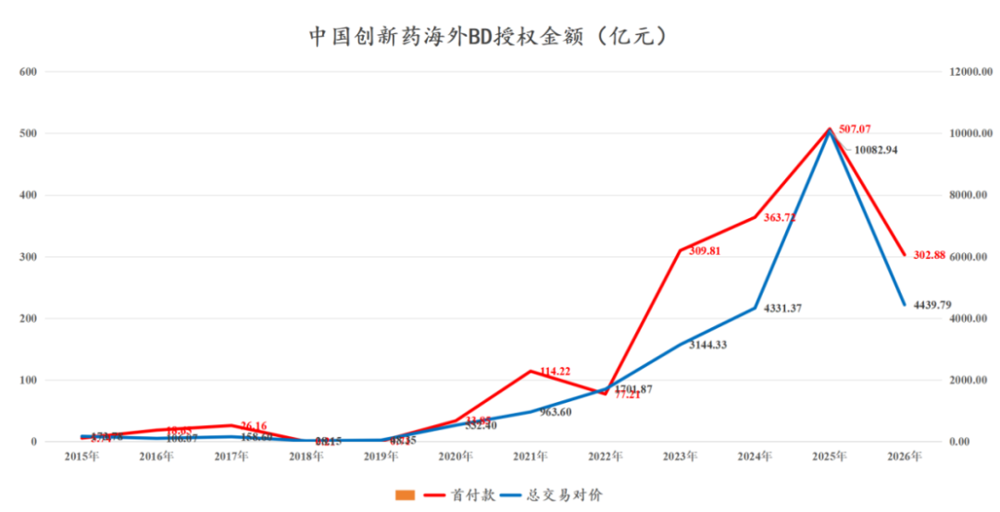
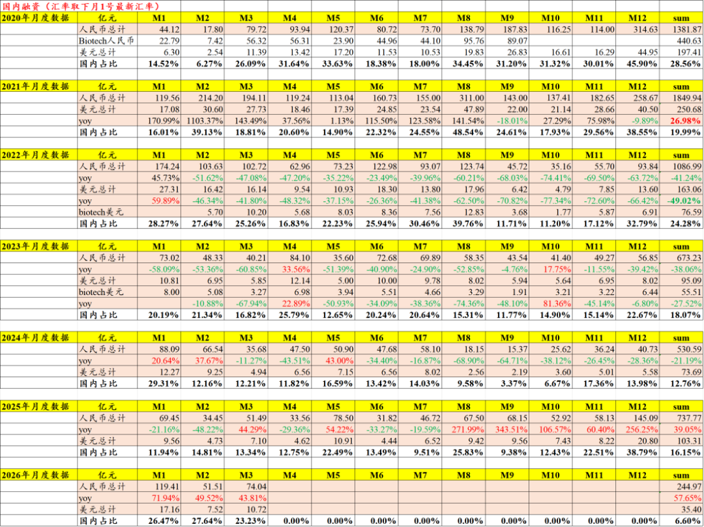
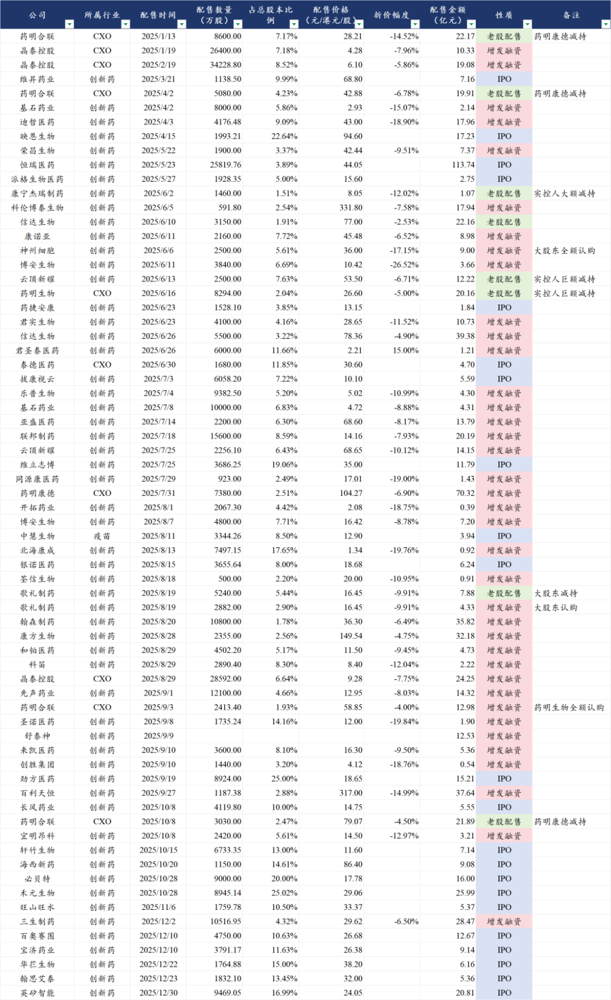

# 当政策面大力支持医药

大家好，我是龙哥。

昨天，国务院办公厅正式发布了《国务院办公厅关于健全药品价格形成机制的若干意见》文件：

这是继全链条支持创新药发展实施方案后又一个对创新药行业有重要意义的政策文件，不少读者比较关注这个消息，想让我们解读一下，毕竟过去几年我们对政策面的理解一直是比较前瞻和有效的。

我们的核心观点是：

政策面的持续改善可以一定程度上提升企业及投资人对国内市场的信心，可以更好的支撑国内企业出海时的底气和基本盘，政策面的改善是很好的“锦上添花”。

同时中国创新药行业参与全球市场竞争和在全球医药市场攫取收益的产业趋势已经比较清晰，越来越多创新药公司的估值大头也会是来自全球市场而非单一国内市场。

1、政策解读

首先我们要明确一点，医保局目前的专业水平是非常高的，其实际上完全有能力学习和了解市场上的创新药真实的全球市场竞争力和临床获益程度，我们在几年前也就明确了医保局对创新药的定价规则：

从2019年至今我们已经连续7年跟踪国家医保谈判的情况，我们也曾详细梳理了从2017-2025年医保谈判的结果，因此我们也有信心说市场上少有投资人能比我们更深刻的理解医保政策的变化趋势。

2022开始，医保谈判的定价机制逐渐完善和趋于成熟，从2025年的医保谈判结果来看，实际上也比较充分的反映当前创新药在医保体系中的定价模式——基于临床获益水平、疾病患者人数和市场容量（需要考虑医保基金承受能力）、竞争格局三大核心要素进行定价（下图以肿瘤药为例）：

着眼当前，本次政策面又提出哪些新的变化？总结来看主要是两点：

①药品价格双轨制

本次文件中提到：“医药企业根据协议约定按不高于支付标准的价格向医保定点医药机构供应谈判药品，向非医保定点医药机构供应谈判药品的市场价格可不受支付标准约束”。这可以被称为药品双轨制的形成。

此前在2025年12月2日，北京市已经与国家医保局合作发布了中国药品价格登记系统，系统区分登记价和医保谈判价，医保谈判价保密非公开、是国家医保局向企业支付的真实价格，登记价是终端的标签价，可相对自由的市场化定价。

价格双轨制主要影响我们认为有三点：

- 解决或缓解国产创新药出海时面对的全球市场药品比价压力。
- 促进更多人参与医保或者购买商业保险，从而改善支付端，否则自费市场的创新药标签价会非常高。
- 药企可在非国家医保市场定高价赚钱，也可减少关于医保局压价而影响产业发展的舆论压力。

②商保在内的多元支付

支付端继续强调商保，加快商业健康保险创新药品目录落地实施，推荐商保和医疗互助等多层次医疗保障体系参考使用。

过去2-3年国家医保也在一再明确未来医疗支付路径变化：国家医保不再包揽全局，而是尽量保基本、广覆盖（共同富裕，提高低收入人群的医疗质量），商保去补充基本医保覆盖不到或者没有能力覆盖的部分，对于创新药企业来说也是多了一种选择，不必单一的选择国家基本医保目录。

总体来说，在当前医保基金收支偏紧张的背景下，政策面对于创新药的支付端已经算是“全力以赴”，医保基金的现实收支情况摆在眼前，从2023年的医疗FF以来，医保基金的支付效率我们认为也是在持续提升的，因此也不能不现实的期望医保能大规模的以非常高的价格支付创新药，能有当前的一系列积极变化，对行业来说已经算是“锦上添花”。

2、产业发展

创新药行业从一系列的支付端的倾斜，到2026年政府工作报告中将生物医药产业与集成电路、航空航天、低空经济一起列为“新兴支柱产业”，靠的是行业自己争气，靠的是超强的赚外汇、创造高收入就业岗位、拉动产业升级的能力，以及一二级市场投资人在经历行业几年寒冬后依然热爱、真金白银的支持。

2023年开始急剧爆发的创新药海外BD授权规模，是中国创新药产业纳下的“投名状”，中国创新药展现全球竞争力，奠定了这个行业“死不了”，几年的寒冬使得行业变得更强大，仅靠PPT+一堆me too管线就能骗钱的时代一去不复返，【全球竞争力】成为考量创新药企业管线价值的核心要素。

2025年，中国医疗健康领域一级市场融资规模达到738亿元同比增长39%，虽然相较2020-2021年还有较大差距，但已经超过2023年的水平，2026年一季度中国医疗健康领域一级市场融资规模245亿元同比增长58%。

二级市场的鼎力相助更是不必多说，去年AH股创新药公司和CXO公司的定增+配售+老股东大规模减持合计接近千亿规模，这是从二级市场投资人手中净获得的真金白银，助力行业内企业在走出行业寒冬之际能快速获得现金流补充以推进管线开发和商业化。

行业历经从去年10月到今年3月这整整半年的回调，很多读者在此期间有非常悲观的留言，不乏读者劝龙哥转行，我们在春节前最后一篇文章《[做困难且正确的事](https://mp.weixin.qq.com/s?__biz=MzkyMzQ3MDc3Mw==&mid=2247485646&idx=1&sn=a9530ea0f59ac32afc0157a7f29b0442&scene=21#wechat_redirect)》也有写到。

相比于我们坚守过2021-2024年这三年多的寒冬，相比于当年的行业全面下行，看着今天的行业蓬勃发展，面对短期的回调，又怎么会轻易退缩。

今天我们看到行业各方的“锦上添花”，也有我们在行业寒冬中以数十万字的文章给各位读者的“雪中送炭”。

风险提示：本文仅讨论行业/公司经营情况，投资需综合考虑公司经营、估值、管理层等多方面因素，建议读者审慎参考，本文不作为投资依据，不建议大家根据本文做出投资计划。

<!-- wxmp-comments-begin -->

---

## 留言（18 条，含回复共 34 条）

- **陈小群日常号** 👍5 · 2026-04-15 13:35
  蓄势待发
- **廖书豪** 👍2 · 2026-04-15 13:36
  昨天尾盘拉，今天高开砸。蹲狗真的🐶那是真玩不过啊，突然理解为啥全行业配置这么低了……
- **观复** 👍1 · 2026-04-15 13:46
  感觉高值耗材爱博 春立最近也在筑底了
- **YHB** 👍1 · 2026-04-15 14:01
  创新药的政策，对cxo公司有什么提升？什么时候能体现出来？
  - ↳ **作者** · 2026-04-15 14:09
    CXO还指望什么政策啊，创新药行业蓬勃发展不就是CXO行业最好的催化剂
  - ↳ **作者** · 2026-04-15 20:38
    你这样问代表你还没理解CXO是啥。创新药政策好有钱赚了，他们就更有动力做管线，也更想做更高质量的产品，他们会用更多钱砸向CXO服务
- **COCO** 👍1 · 2026-04-15 14:22
  血液制品行业怎么看，受影响吗？
  - ↳ **作者** · 2026-04-15 14:39
    血制品行业和这没太大关系，血制品行业短期受到增值税简易征收调整的影响比较大
- **sym** · 2026-04-15 13:32
  智翔金泰这个月涨了25%
  - ↳ **作者** · 2026-04-15 13:39
    智翔金泰是因为发了股权激励，对收入考核目标还算不错，毕竟之前没有医保的时候公司实在是卖的太差，基本预期很低了。
- **包子君** · 2026-04-15 13:33
  创新药出海冲冲冲
  - ↳ **作者** · 2026-04-15 13:40
    不止创新药出海，还有成熟制剂的出海，医疗器械的出海，国内医药医疗产业多个细分领域的全球竞争力提升都是值得期待的。
- **毫末** · 2026-04-15 13:38
  我重仓了医疗器械 还有戏吗 目前还亏10个点呢
  - ↳ **作者** · 2026-04-15 13:43
    那要看你重仓的什么啊，目前医疗器械行业处于公司间基本面大幅分化的阶段，还没到能行业β全面向上的阶段。
- **眰恦** · 2026-04-15 13:40
  龙哥，国药一致是受这个影响嘛
  - ↳ **作者** · 2026-04-15 13:45
    医药商业总体是吃药品国内商业化的全行业β的，未来可能还会有一些行业整合和行业集中度提升，但长期来看比较难有较高的复合回报率，更多是作为低成长红利股来看吧。
- **气宇轩昂** · 2026-04-15 13:44
  龙哥，请问乐普医疗新药临床I期数据怎么样？一般到Ⅲ期结束有多长时间？公司花4.5亿买的创新药对业绩影响大吗？谢谢
  - ↳ **作者** · 2026-04-15 13:50
    他这个三靶点药物的数据关注度很低，也可能还只是I期临床数据的原因，但数据本身是很好的。至于到III期临床结束那还比较久，参照恒瑞医药的GLP-1*GIPR大概是两年半的时间完成II期和III期临床并申报上市，但民为生物的临床效率和执行力目前来看肯定是不如恒瑞的，可能会更久一点。
- **JMTerry** · 2026-04-15 13:48
  龙哥，心脉目前的出海速度如何了呢？
  - ↳ **作者** · 2026-04-15 13:51
    心脉医疗2025年海外收入占比大概19%，公司对26-27年的海外增长预期大概是30%的复合增速，你可以大概推算一下海外的收入占比情况，对总体收入增速肯定是有拉动的，但确实没有那种像时代天使和微创机器人那样的海外爆发式放量。
- **Aiolos** · 2026-04-15 13:55
  对创新药的支持政策基本上这一两年来已经充分明牌了，啥时候对创新器械、制剂、CXO这种出海赚钱的多给些政策才好
  - ↳ **作者** · 2026-04-15 13:56
    CXO是属于to B的业务，不太需要政策支持。仿制药制剂可能难说大的支持，不知道未来对于高端制剂、复杂制剂会不会有些政策支持，至少目前不明确。创新器械已经期待很久了，现在政策面明确定义为创新器械的只有几个赛道，像脑机接口、手术机器人、高端医学影像、高端生物材料这些。
- **墨墨** · 2026-04-15 13:55
  <a class="js_mention_entry wx_at_link" data-biz="Mzk0NzY4MjM5MA==" data-servicetype="0" data-username="gh_63f7f08149c4" href="">@元宝</a>简短总结下文章内容
  - ↳ **作者** · 2026-04-15 13:56
    国务院新政策确立药品价格双轨制和商保多元支付体系，为创新药行业提供&quot;锦上添花&quot;式支持。政策缓解创新药出海比价压力，但行业核心竞争力仍在全球市场表现，2025-2026年融资回暖印证行业复苏。
- **几米阳光** · 2026-04-15 14:17
  讲一期绿叶制药可以吗？我觉得这个股很有潜力啊，想看看你们的专业视角
  - ↳ **作者** · 2026-04-15 14:38
    公司喜欢资本运作，资产负债表又呈现大存大贷，所以一直估值起不来。
- **無言** · 2026-04-15 14:18
  龙哥，药明康德会破前高吗？预计
  - ↳ **作者** · 2026-04-15 14:39
    这也没太多异议吧，H股康德已经突破前高了
- **蓕钦** · 2026-04-15 14:23
  请问龙哥减肥药系列最近如何？方便的话想知道mnh的减肥药真的那么神奇吗？
  - ↳ **作者** · 2026-04-15 14:40
    哈哈
- **感恩** · 2026-04-15 15:05
  龙哥，请问微创啥时候业务反转
  - ↳ **作者** · 2026-04-15 15:08
    微创机器人目前业务增长是很强劲的，其他的可以参照3月9号的文章
- **Rose@RTS | LED Factory | 13Years** · 2026-04-15 15:18
  龙大 医保局水平高为啥不把安慰剂中药的份额多点挪给创新药呢？比如中药/创新药/仿制药三足鼎立，各占三分之一，那可以逐渐把创新药提高到二分之一
  - ↳ **作者** · 2026-04-15 15:20
    创新药现在增速很快啊。而且这也不是你说挪就一下子挪了，现实中有临床用药习惯，有各方利益博弈，有基层用药特点，中医药也是国家支持的方向，医保局又不是可以独立制订文件的。

<!-- wxmp-comments-end -->
