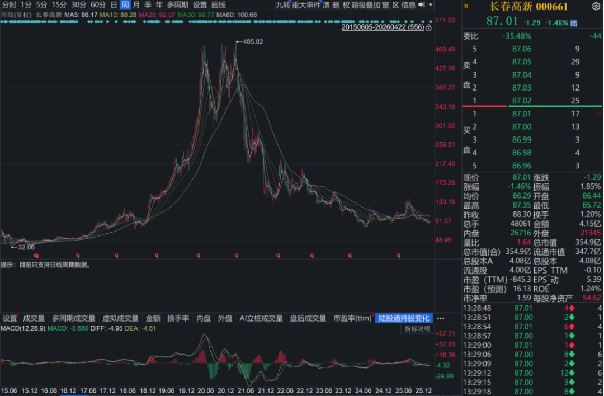
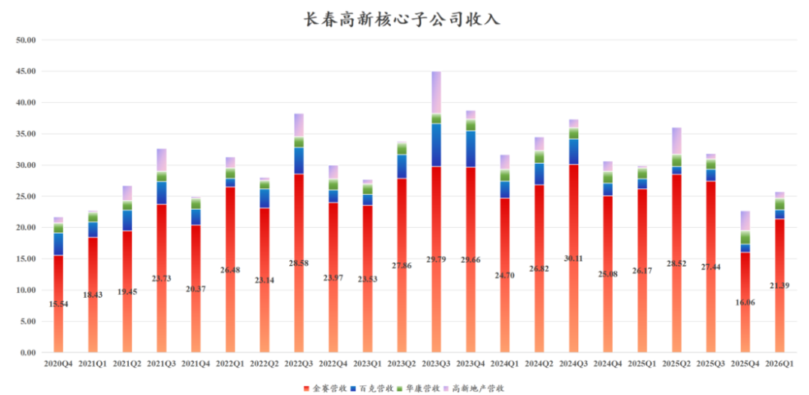
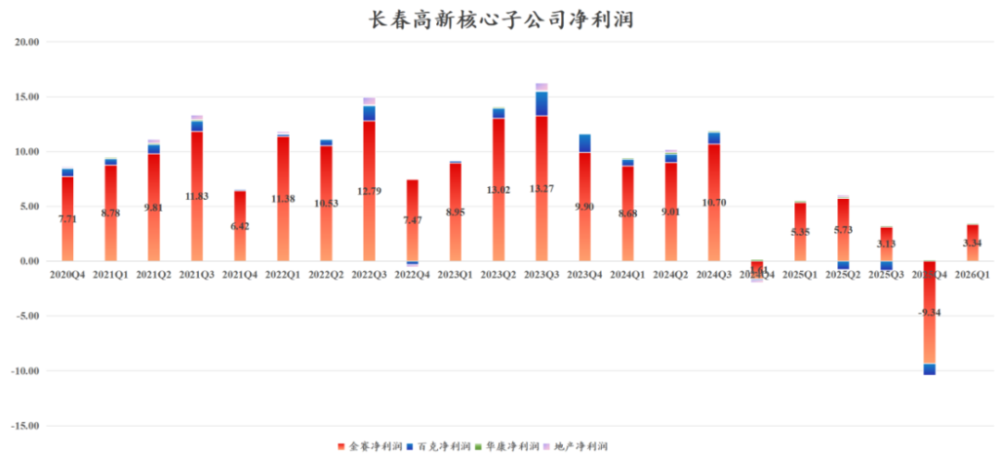
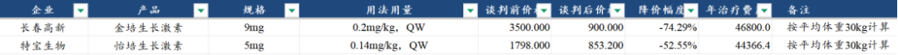
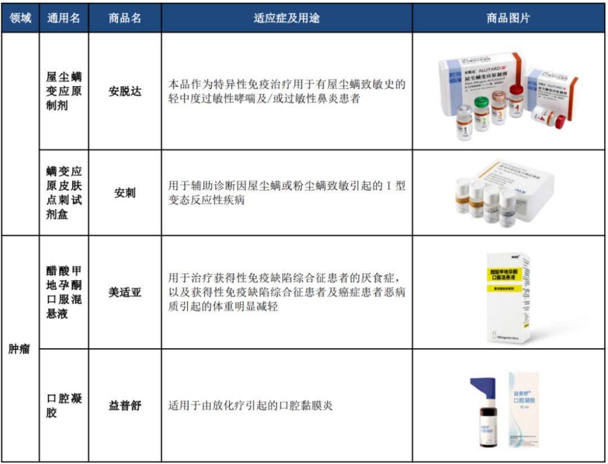
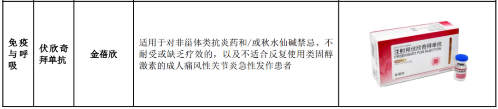
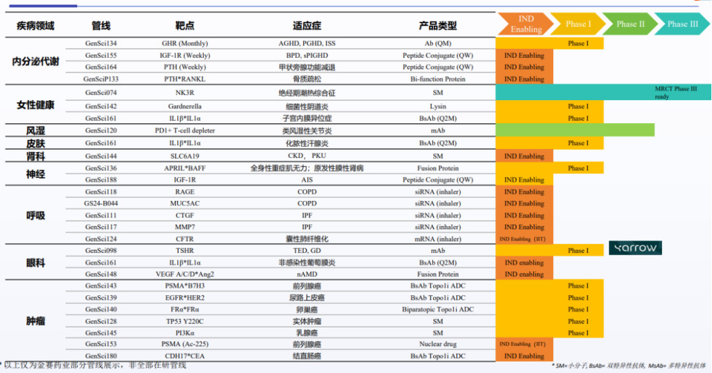

# 超级白马，第N-1次拐点

大家好，我是龙哥。

长春高新，儿童身高焦虑终结者，曾经医药行业超级大白马，“投资不过山海关”的漏网之鱼，却也成了医药行业一众pharma中最大的遗憾之一，如今股价相较历史高点依然跌80%以上，且不说重回辉煌，就连走出困境都还谈不上。

稀烂的2025年报和2026一季报后，券商点评又是“拐点”，那么长春高新距离“真拐点”到底还有多远？

——我们认为，现在可能是“N-1拐点”。

1、业绩惯性

- 2025年长春高新营收120.83亿同比下降10.27%，归母净利润1.55亿同比下降94.0%。
- 2025年四季度长春高新营收22.77亿同比下降26.03%，归母净利润-10.10亿。
- 2026年一季度长春高新营收25.87亿同比下降13.69%，归母净利润2.76亿同比下降41.67%。

金赛药业这个核心子公司表现更是一言难尽，2025Q4收入16.06亿同比下降35.96%，净亏损9.34亿元，2026Q1收入21.39亿元同比下降18.27%，归母净利润3.34亿同比下降37.57%。

金赛收入回到2021年的水平，利润比2021年还腰斩不止。

百克生物更是离谱，收入相比2020-2021年腰斩，利润连续4个季度亏损。

2026年，金赛这边的业绩压力依然很大，业绩拐点大概率在2026年，但尚未清晰：

①2025年国家医保谈判，长效生长激素大幅降价，其中长春高新的金培生长激素降价74%，年用药费用降至与水针差不多。

长春高新近百亿的生长激素收入中，50%左右来自短效水针、40%左右来自长效水针，国谈如此大幅度的降价一方面直接冲击长效水针的销售，另一方面也会导致原本用短效水针的患者大量切换到长效水针，同时特宝生物会切走一部分份额。与此同时公司账上还有高达58亿的存货......

2026年生长激素板块收入端可能还会有大幅度的下滑，预计基本也是出清的一年，利润端则预计会好于收入端——没有医保降价后的渠道调价影响了。

②企业经营进入下行期时，往往会有惯性，这种惯性不仅体现在产品和市场，还体现在公司运营和管理上。

类似这样的药品大幅降价和收入萎缩，往往伴随着企业的降本控费、裁员降薪，轻则冲击员工积极性，重则人人自危、无心开展业务，这点我们过去几年在行业集采加速期时的感受尤为显著，企业真正的经营拐点在绝大多数情况下都比市场预期的要晚出现——那时可能已经近乎无人问津。

如果只谈生长激素的拐点，那本篇文章就不会出现了，公司未来的看点还是在创新药转型方面做出的努力，用公司的话来说就是，希望市场对长春高新的定性从“生长激素公司”转变为“创新药公司”，当然这必然会需要一个过程。

2、创新药管线起势

1）创新药商业化初期

长春高新自研管线及外部引进结合，目前有多款潜在重磅新产品在国内商业化：

①伏欣奇拜单抗：2025年6月获批上市的国内首款治疗痛风的IL-1β单抗，用于痛风性关节炎适应症（抗炎，本身不降尿酸）。国内高尿酸血症患者人群约1.8-1.9亿人，痛风患者人群约1500万人，典型的超大患者群体的适应症。

伏欣奇拜单抗可以做到快速止痛、长效给药（半年一次皮下注射）、安全性可控，对于急性发作期剧烈疼痛患者、传统药物不耐受患者具有较强的用药刚需属性。

金蓓欣2025年上市半年时间实现近亿元的销售，2026年预计还会有数倍的增长，成为长春高新近年自研创新药管线里首个放量的品种。全球首款IL-1β单抗是诺华的llaris，2025年全球销售18.83亿美元同比增长25%。

②美适亚：代理台湾厂商的醋酸甲地孕酮——肿瘤恶病质药物，2025年国谈降价三分之二进医保。25年高价卖了1亿+，公司预计26年的销售也会有数倍的增长。

另外公司还有引进的屋尘螨变应原制剂（安脱达）、用于肿瘤放化疗治疗引起的口腔粘膜炎的益普舒等重点品种商业化，辅助生殖领域新品种长效绒促卵泡激素αN02、水溶性黄体酮等也有较高的销售目标。

以上新品种虽然在2026年还远不足以弥补生长激素的下滑，但至少新的增长动能已经初现。

2）创新药出海起点

2025年底，长春高新以7000万美元首付款+5000万美元近期里程碑付款+13.65亿美元研发及商业化里程碑付款+10%以上销售分成将其GenSci098（TSHR单抗）大中华区以外权益授予Yarrow Bioscience，这是长春高新首款实现较大金额海外BD授权的自研创新药，也是长春高新创新药管线出海的起点。

GenSci098目前被长春高新用于开发甲状腺相关眼病（TED）和弥漫性毒性甲状腺肿（GD）等适应症，并进行了中美双报临床试验。

这1.2亿美元首付款将在2026年计入报表，可以很大程度上缓解长春高新今年的报表压力，毕竟相当于增加报表端接近8个亿的收入和利润。

3）创新药早期管线

长春高新过去几年陆续构建了丰度较高的早期研发管线，公司在年报中有详细图表列示，篇幅所限我们这里不做罗列。

公司布局了内分泌代谢、女性健康、自免及呼吸、肾病、眼科、中枢神经、实体瘤等7大疾病领域，广泛覆盖了矮小症、骨质疏松、COPD、尘螨过敏、类风关、慢性肾病、急性缺血性脑卒中、乳腺癌、前列腺癌、结直肠癌等一系列市场容量较大的数十个适应症，包括多个双抗、双抗ADC等新技术平台下的管线，当然这其中大部分管线在临床早期阶段，金赛作为国内生物药曾经的领军企业之一，研发实力不容小觑。

但摊子铺太广也会有一个问题，过去生长激素的销售没出问题，公司每年有30-50亿的经营现金流，投十几亿到20多亿的研发费用还算能应对，而如今生长激素销售和现金流大打折扣，再去维持如此庞大的研发投入，可能就会有点捉襟见肘。

过去几年我们也不止一次的看到传统药企在面对传统现金流业务大幅下滑、外部融资不利时被迫削减研发开支的局面，即便长春高新即将发行港股，资金面的压力可能在这两年还是会客观存在，可能至少不能再大手大脚、众多疾病领域广泛立项。

......

从2018年药品集采开启以来，国内众多药企经历惨痛的出清和转型，其中越是在集采初期就被重锤的企业，转型创新的态度最为坚决，这两年陆续有一些创新品种出来，基本面和股价早已走出拐点。

而头部的pharma中，石药集团和长春高新算是出清相对晚的，石药的丁苯酞+化疗改良新药，长春高新的生长激素，在基本盘业务还稳定的时候往往不能有足够的决心投入巨额资金到新业务中去谋求转型。

一鲸落、万物生，长春高新生长激素业务的崩塌，市场早有预期，只是时间问题，而生长激素业务的出清，才是长春高新进入新阶段的开始。

风险提示：本文仅讨论行业/公司经营情况，投资需综合考虑公司经营、估值、管理层等多方面因素，建议读者审慎参考，本文不作为投资依据，不建议大家根据本文做出投资计划。

<!-- wxmp-comments-begin -->

---

## 留言（18 条，含回复共 37 条）

- **Iven Ge** 👍2 · 2026-04-22 16:46
  再鼎医药最近接连放利好，股价也很顶，龙大觉得有持续性吗？
  - ↳ **作者** · 2026-04-22 16:49
    也不算连放利好吧，这公司由于执行力偏弱，之前又老是给不现实的乐观指引，导致市场对他的估值定价容易走极端，走极端之后就有投资人算算账觉得很便宜再买起来。公司一直不缺好的品种，缺的是把好的品种如期落地的执行力。
- **朱元敏** 👍1 · 2026-04-22 16:09
  龙哥，君实生物请帮忙解答一下，目前持有中。
  - ↳ **作者** · 2026-04-22 16:15
    君实生物，在前面的文章PD-1四小龙里有讲到，可以去翻看一下。公司最近讲二代IO双抗+双抗ADC的逻辑，但不仅是管线，公司研发效率、执行力也需要跟上。
- **c** 👍1 · 2026-04-22 16:11
  长春高新后期龙哥还看好吗？
  - ↳ **作者** · 2026-04-22 16:13
    公司今年大概率看到拐点，但不确定什么时候，企业经营向下的惯性很多时候还是会导致超预期的下行的。基本面企稳后，就公司当前的估值水平和管线，还是值得看的。
- **上校的军刀** 👍1 · 2026-04-22 16:17
  龙达，百洋医药咋看？
  - ↳ **作者** · 2026-04-22 16:19
    我个人一直不太喜欢CSO的商业模式。
- **蒋星⭐** 👍1 · 2026-04-23 12:13
  新生儿这么低，会不会是它长期的利空[擦汗]
  - ↳ **作者** · 2026-04-23 12:38
    肯定是啊[破涕为笑]
- **雪山之巅8866** · 2026-04-22 16:07
  投资创新药确实需要很多耐心。创新药里面的资金格局太小，短线狗居多[捂脸]
  - ↳ **作者** · 2026-04-22 16:18
    昨晚还有朋友刚吐槽：创新药里全是赌博、诈骗、内幕交易
- **Morpho sight** · 2026-04-22 16:07
  企业经营进入下行期时，往往会有惯性
  - ↳ **作者** · 2026-04-22 16:17
    墙倒众人推，鼓破万人捶。
- **魏小魏** · 2026-04-22 16:07
  看了长春高新，我就知道 片仔癀，通策医疗，爱尔眼科 迈瑞医疗，估计还是都好不到哪去。 
  - ↳ **作者** · 2026-04-22 16:16
    消费医疗相较总体的消费，是偏后周期，现在连消费都还说不上复苏，消费医疗自然也好不到哪去，通策医疗年初讲今年做收入利润双30%增长，一阵腾挪之后26年一季度做了不到2%的收入利润增长，股价也早已经A回原点。
- **也无风雨也无晴** · 2026-04-22 16:14
  一直关注老师，现在的市场真的一言难尽，只涨指数，调整多年的医药板块却非常乏力，当源杰科技、协创数据之类可以横着走的时候，很多20倍市盈率的医药医疗股还被按在地上摩擦
  - ↳ **作者** · 2026-04-22 16:20
    医药行业内部分化明显，我们今年初的年度策略中提到的三大方向，创新药、CXO、器械出海，今年都还是大幅跑赢行业基准的。
  - ↳ **作者** · 2026-04-22 20:02
    南微医学今年上半年还要受到国内集采的影响，所以我们说他业绩拐点可能会在今年的Q3-Q4，听课不认真了吧。不是所有器械出海都能涨，你得业绩高增长啊。
- **tmac** · 2026-04-22 16:19
  这公司的二把手是不是在股价最高位精准清仓式减持了
  - ↳ **作者** · 2026-04-22 16:23
    某公司核心子公司核心高管，在核心产品竞品申报上市的第二天，宣布根据其离婚协议，将其此前所持上市公司股份中的87%价值40亿的股份划转给前妻，该高管表示此前舍小家为大家，为了做好公司业务而忽视了对家庭的照顾，现在舍弃这些身外之物补偿家庭。
    
    摘自2024年1月12日文章《医药行业离谱事件》
- **田霖** · 2026-04-22 16:22
  创新药得投浓眉大眼的，有能力提高海外市占率的，长春高新还是算了吧
  - ↳ **作者** · 2026-04-22 16:23
    长春高新创新药出海也已经跨出第一步
- **我在楼脚搂实喊你** · 2026-04-22 16:24
  龙哥能谈谈SHR-A1811有没有BIC潜力吗？覆盖这么多适应症，市场空间咋样？
  - ↳ **作者** · 2026-04-22 16:29
    今年恒瑞的A1811启动了第一个头对头DS-8201的II期临床试验，用于HR+/HER2低表达乳腺癌。能敢于对金标准做头对头才能有BIC的潜力，否则肩对肩的数据再好也只能是me too。A1811本身在国内的市场潜力是不差的，恒瑞在乳腺癌也有很强的产品组合和渠道优势，但除非恒瑞未来敢开头对头8201的注册III期临床，那能值得再高看一眼。
- **听雨** · 2026-04-22 16:30
  时代天使终于突破了
  - ↳ **作者** · 2026-04-22 16:33
    今天白天还在和朋友说，这波时代天使股价突破，南下资金一直在净卖出。过去2年多的时间，医药里的猥琐资金一直在这公司上埋伏、蹲业绩、利好兑现出货，却没意识到基本面已经发生质变，这轮南下资金一路卖出，股价反而正式突破震荡3年的箱体，把蹲业绩的蹲狗洗出去了。
- **🌳** · 2026-04-22 16:31
  还是信立泰稳健，转型也快
  - ↳ **作者** · 2026-04-22 16:34
    今天看到所谓稳健的信立泰，当年也经历收入几乎腰斩、14亿利润近乎归零的历史的。
- **随风** · 2026-04-22 16:33
  您好，请问恩华药业目前估值合理吗，有没有赛道预期
  - ↳ **作者** · 2026-04-22 16:36
    恩华药业此前有羟瑞舒阿等新品放量的优势，增速要显著快于人福医药，但随着麻醉收入体量起来，以及老品种降价压力，增速也被动向行业靠拢，后续还要看创新药的放量趋势。
- **笑看风云** · 2026-04-22 16:50
  龙哥，传奇生物是不是已经成功筑底，开启反弹模式了？
  - ↳ **作者** · 2026-04-22 17:16
    很难找到高速放量的创新药能跌到传奇这样的估值，即便是有管理层折价。一线MM的数据也将在2027年读出。
- **廖书豪** · 2026-04-22 16:57
  请问龙哥艾力斯大单品销售超预期，但最近一直横着，除了需要消化去年的涨幅，更强的催化还是需要伏美替尼海外III期数据和新适用症海外BD超预期才能打开空间吗
  - ↳ **作者** · 2026-04-22 17:14
    单一大品种在国内的估值预期基本打满了，肯定是要有新品种或者海外大的突破。
- **薛有财** · 2026-04-22 17:02
  请教龙哥，血制品周期快走出低谷了吗[捂脸]
  - ↳ **作者** · 2026-04-22 17:14
    目前没看到这个迹象，需求不振，白蛋白供给过剩，企业采浆的增速也控下来了，还有重组类产品开始进入市场。

<!-- wxmp-comments-end -->
