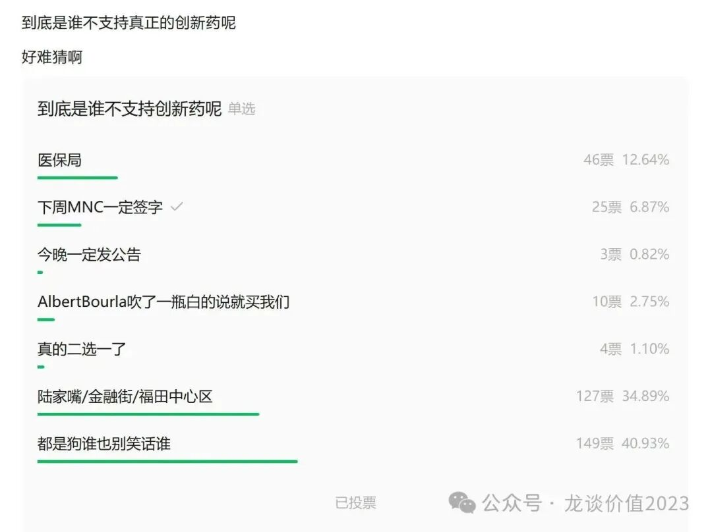
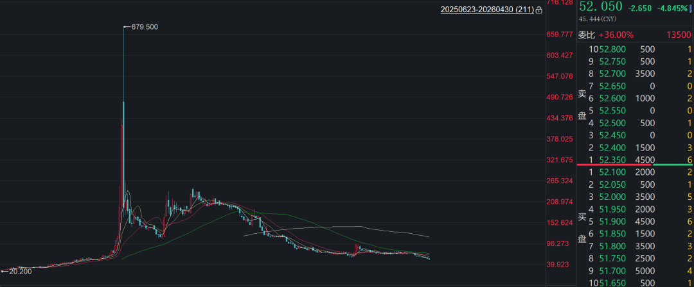
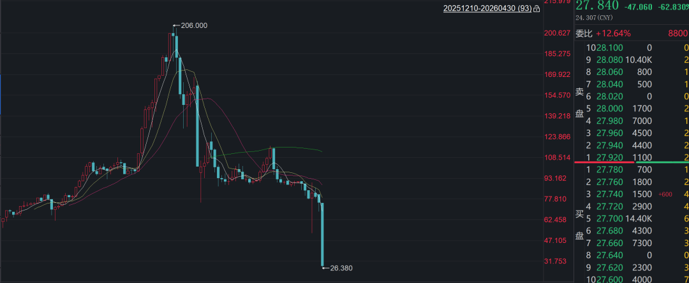
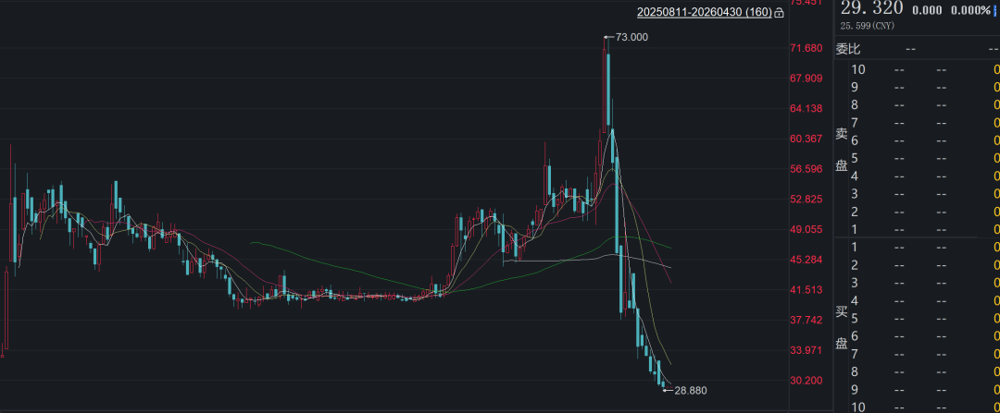

# 医药行业离谱事件4

提示：本文纯属虚构，如有雷同，纯属巧合。

1、百亿巨亏。。。

某公司，代理一款全球最大疫苗品种在国内市场的销售，9年时间中国市场累计代理疫苗收入达到1675亿，累计给海外MNC奉上千亿利润。

2025年业绩暴雷，净亏损147亿元，其中计提存货减值136亿元，计提信用减值5.1亿元，代理疫苗的历史累计盈利一下被亏掉大半，账上还有百亿应收账款。

医药行业历史上除了财务造假的康美药业以外，正常经营的公司年度亏损历史记录是百济神州在2022年亏损136亿，但百济烧钱烧出一个血液瘤全球头部biopharma，恭喜某公司超越百济神州登顶医药行业年度亏损榜首。

从2024年1月的文章《[医药行业离谱事件](https://mp.weixin.qq.com/s?__biz=MzkyMzQ3MDc3Mw==&mid=2247483848&idx=1&sn=aa0791f438ad4b17069d48348913448b&scene=21#wechat_redirect)》开始，我们在该系列第一篇文章提到该公司应收账款和存货的问题，应该算是全市场最早的“吹哨人”，该公司2024年二季度开始收入断崖式下跌，直到2025年年报暴雷资产减值，24年1月以来股价又跌了70%。

2、双三十的增长

某公司年初疯狂路演宣传，其2026年要通过全面价格战抢占低端市场，提高产能利用率的同时裁员降本增效，目标实现全年收入和利润的双30%增长。

经过一番“乾坤大挪移”，26Q1收入增长1.4%，归母净利润增长1.6%，扣非归母增长1.3%。

真是一场酣畅淋漓的业务扩张。

公司在3月下旬宣布将老板体外的几家跨行业的公司收购进上市公司体内。

3、连续20个季度坚持不懈的下滑

一家公司的营业收入可以连续多少个季度下滑？医药行业公司给了你答案——可以连续20个季度，曾经的“化学发光小黑马”之一。

同行业公司，连续下滑十几个季度的公司比比皆是。永远不要轻视在国内市场逆政策周期的行业。

4、医药最佳蹲狗

某公司与某顶级跨国MNC签下185亿美元超级BD大单，突破中国创新药BD历史纪录，在全球也能排进前三。股价两天大跌14%。

5、谁会嫌手上钱多呢

某公司，2025年上半年做了一个超大BD交易，拿到90亿现金，从7倍PE无人问津的边缘公司一跃成为万众瞩目的创新药明星公司。

2025年下半年，公司配售融资30亿港币，分拆子公司独立上市，同时增加借了7亿有息负债，截至25年底在手现金超过200亿，同时还减少了2025年分红金额。

6、创新药里的割总

某公司，老板增持完股票，猛夸自家药物、顺便贬低领先得多的行业先驱，向投资人表示自己愿意借钱增持，目标500亿市值。

股价高位临发数据数据之前老板突击减持、数据miss，股价大跌，然后两个重点项目的数据发布时间全部推迟，股价进一步下跌，老板又做了增持，增持完放数据、开会目标1000亿市值。

7、经营随缘，利润随机

某公司，千亿市值的行业寡头，完全无法预测自身经营情况，在2025年初指引2025年全年经营利润持平、经调整净利润下滑，实际25年全年归母利润增长29%、经调整净利润增长36%。现在又指引26年净利润持平。

8、肆无忌惮，为所欲为

如图：

某公司上市仅半年，坐庄做进港股通，进通不到1个月股价跌60%，2025年报难产，停牌核查。

***......***

五一节前最后一篇，轻松一点，节后回来为各位读者梳理各细分领域和重点公司的年报、一季报总结~

月底了开一次赞赏，各位读者随心随意，各位的支持是我们持续分享的动力。

（所有赞赏的读者均可获赠《中国主要创新药企创新药收入汇总2021-2026》文件，在后台私信留下邮箱，龙哥后续一一发送）

祝大家五一假期愉快~

***再次提示：本文纯属虚构，如有雷同，纯属巧合。如有更多虚构的离谱事件，欢迎私信交流。***

<!-- wxmp-comments-begin -->

---

## 留言（16 条，含回复共 29 条）

- **修炼出关** 👍4 · 2026-04-30 14:57
  我只知道第1家是自费生物，其它是谁？
- **喻力** 👍3 · 2026-04-30 14:55
  投资医药太难了，药明这种浓眉大眼的都起不来，资金还是喜欢不赚钱的公司
  - ↳ **作者** · 2026-04-30 15:03
    药明康德A股今年涨了21%，H股今年涨了38%，对应今年A股医药指数-1%，港股医药指数+2%，这都算起不来啊。
- **卓** 👍3 · 2026-04-30 15:11
  恒瑞不语，只是一味下跌，哭了
  - ↳ **作者** · 2026-04-30 15:16
    恒瑞今年AH股YTD都是-9%左右，百济今年A股YTD是-13%，H股是-3%，两家创新药龙头公司都跑输行业指数[捂脸]
- **Tony** 👍3 · 2026-04-30 15:11
  恒绿月线7连阴，退市的票都没怎么惨
  - ↳ **作者** · 2026-04-30 15:18
    你别说，你还真别说
- **尘缘** 👍3 · 2026-04-30 15:19
  H司在业绩高歌猛进的同时，月线7连阴，目前A股暂无敌手。
- **fisher** 👍2 · 2026-04-30 15:02
  课代表呢
  - ↳ **作者** · 2026-04-30 15:05
    <a class="js_mention_entry wx_at_link" data-biz="Mzk0NzY4MjM5MA==" data-username="gh_63f7f08149c4" target="_blank" href="">@元宝</a>帮我分析本篇文章中讲到的案例分别是什么公司？
- **观海青林** 👍1 · 2026-04-30 14:47
  天坛生物废了，去年高光4月份，打那以后喋喋不休再创新低
  - ↳ **作者** · 2026-04-30 15:01
    血制品行业的下行，目前还没看到拐点，仍处于左侧。
- **雪山之巅8866** 👍1 · 2026-04-30 14:55
  诺泰生物没有差到连跌九个月的程度啊，摘帽最大的风险去除了，现金流很不错，却依然要死不活的
  - ↳ **作者** · 2026-04-30 15:02
    一个是还在ST着，机构会被限制买入，另一个是确实业绩不太行。
- **JMTerry** 👍1 · 2026-04-30 15:11
  龙哥龙哥，爱博[抠鼻]
  - ↳ **作者** · 2026-04-30 15:16
    相对来说爱博不算离谱了，Q1也有企稳的迹象了
- **叶小满** 👍1 · 2026-04-30 15:40
  三个截图分别为药捷安康、宝济生物、中慧生物，觅瑞的年报也难产停牌了[偷笑]
  - ↳ **作者** · 2026-04-30 15:45
    是的，癌症早筛俩公司，一个先驱已经财务造假退市，另一个又是财报难产停牌，这行业彻底被玩坏了
- **赵故事** · 2026-04-30 14:50
  信立泰很不错
  - ↳ **作者** · 2026-04-30 15:01
    打入了不低的JK07海外预期，今年股价也是博弈较多了
- **修炼出关** · 2026-04-30 14:59
  我还知道第8家是姚姐安康，B
- **适意** · 2026-04-30 15:10
  龙哥，听说康方生物五月会出重磅数据，影响整个创新药？
  - ↳ **作者** · 2026-04-30 15:15
    康方生物将在ASCO上发布AK112首个一线肺癌的III期OS结果，这事市场已经反复博弈了快俩月了，你咋才听说[捂脸]
- **墨** · 2026-04-30 15:34
  龙哥，投了第7家的散户，是不是可以期待意外之喜了？
  - ↳ **作者** · 2026-04-30 15:45
    我觉得今年不至于持平的，哈哈
- **知行** · 2026-04-30 15:34
  1061037382@qq.com，谢谢龙哥
  - ↳ **作者** · 2026-05-03 00:53
    已发送
- **丁山** · 2026-04-30 16:07
  龙哥，买了很多创新药ETF，相信龙哥的专业性和判断力。接下来创新药的走势的核心点是什么呢？
  - ↳ **作者** · 2026-04-30 16:13
    后面一个多月核心是几个重点品种的数据读出

<!-- wxmp-comments-end -->
