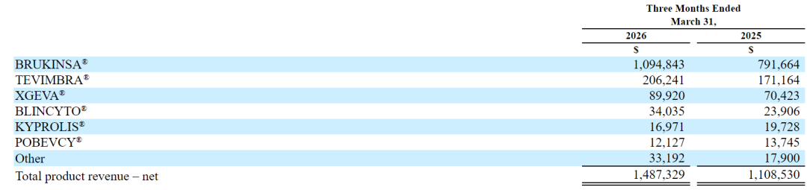
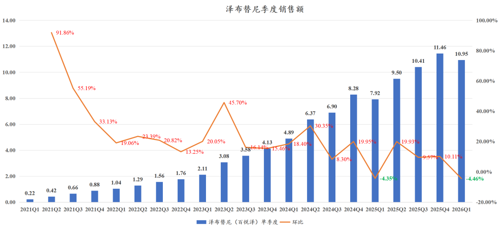
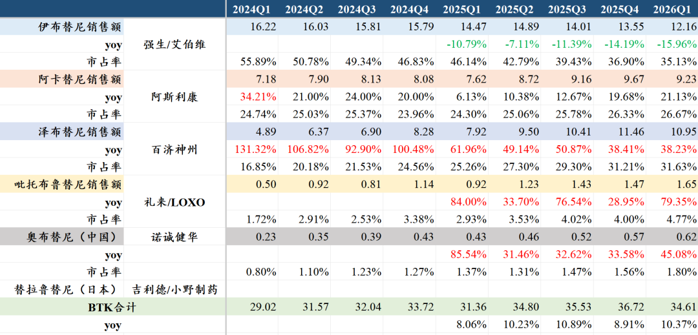
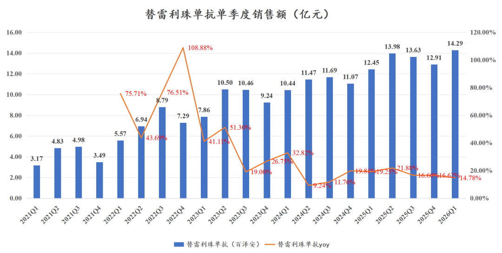
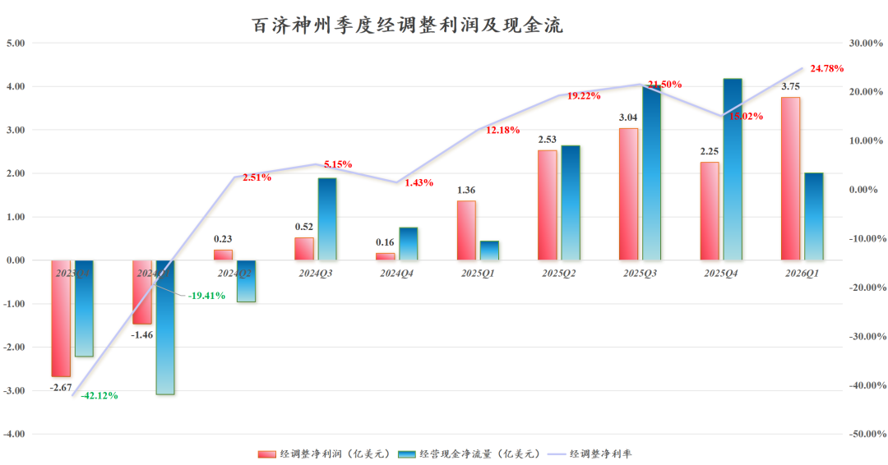
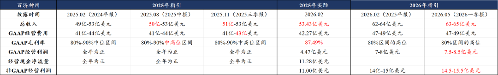

# 药王的魅力

大家好，我是龙哥。

百济神州今晚发布2026一季度业绩，一季度收入符合预期，利润超预期，公司小幅上调全年业绩指引。

2026Q1收入105.44亿+31%，产品收入103.21亿+29.3%，其中：

- 泽布替尼收入75.98亿+33.5%（10.95亿美元同比+38.23%、环比-4.46%），泽布替尼美国收入52.83亿+30.73%（7.61亿美元同比+35.17%，收入占比69.51%），欧洲收入12.66亿+51.44%（1.82亿美元+57.24%，收入占比16.66%），中国收入6.51亿+10.34%。

泽布替尼在全球市场份额进一步提升至31.63%，与伊布替尼的差距已经缩小到1.21亿美元，泽布替尼有望在2026Q2登顶全球BTK抑制剂销售冠军宝座，继Carvykti后又一款国产BIC药物在同类竞品中登顶。

泽布替尼2026年全球销售额有望达到48-50亿美元，同比增长25%左右。

- 替雷利珠单抗收入14.29亿+14.78%，再创季度销售新高，替雷利珠单抗在2026年有望挑战60亿元销售额，仍未达峰。

- 代理品种收入12.94亿+23.50%，其中代理安进产品收入9.89亿元+20.9%，地舒单抗销售0.9亿美元同比增长27.7%。

大品种的魅力在百济神州的利润表中更明显的显现出来，2026Q1公司实现归母净利润16.08亿元同比扭亏，净利润率15.25%为历史最高水平，百济神州正式进入利润加速释放的阶段。

其经调整归母净利润3.75亿美元，经调整净利率24.78%，也是创历史新高，而这显然还不是百济神州利润率的巅峰，每年一季度实际上是血液瘤药物销售基数最低的一个季度，2025Q1-Q4的经调整净利率分别为12.2%、19.2%、21.5%、15.0%。

后续几个季度的利润率更值得期待，全球重磅炸弹药物的盈利能力将逐步显现。

公司小幅上调2026年指引：收入自62-64亿美元上调至63-65亿美元，毛利率和费用维持指引，经营利润自7-8亿美元上调至7.5-8.5亿美元，非GAAP经营利润自14-15亿美元上调至14.5-15.5亿美元。

年报分析时我们写到，公司指引是一个相对保守的指引，从2025年的指引及实际业绩来看也是给了相对保守的指引、后逐季度小幅上调和超预期兑现。

以公司Q1的利润水平推算，百济神州全年利润端有望进一步超预期。如以GAAP经营利润指引计算，2026年估值约为5.6倍PS、24倍PE，公司已经切换到PE估值，而公司仍处于利润快速释放阶段。

[创新药之王新征程](https://mp.weixin.qq.com/s?__biz=MzkyMzQ3MDc3Mw==&mid=2247485661&idx=1&sn=a8e7b6f76ec129f81007a8a778e61987&scene=21#wechat_redirect)

[PD-1四小龙都长大了](https://mp.weixin.qq.com/s?__biz=MzkyMzQ3MDc3Mw==&mid=2247485818&idx=1&sn=143ca55fa645e7f24a9dedd1fec5c92c&scene=21#wechat_redirect)

[创新药出海，面对现实](https://mp.weixin.qq.com/s?__biz=MzkyMzQ3MDc3Mw==&mid=2247485890&idx=1&sn=023f5c09a432630036ac09645c161403&scene=21#wechat_redirect)

[高效biopharma，已是参天大树](https://mp.weixin.qq.com/s?__biz=MzkyMzQ3MDc3Mw==&mid=2247485932&idx=1&sn=76a9f391f0da75f550e9c689bb92efe5&scene=21#wechat_redirect)

风险提示：本文仅讨论行业/公司经营情况，投资需综合考虑公司经营、估值、管理层等多方面因素，建议读者审慎参考，本文不作为投资依据，不建议大家根据本文做出投资计划。

<!-- wxmp-comments-begin -->

---

## 留言（8 条，含回复共 16 条）

- **喻力** 👍2 · 2026-05-06 23:39
  估计还是个股行情，带不动创新药板块，高开低走？
  - ↳ **作者** · 2026-05-06 23:42
    创新药本身就是个股间差异极大，为啥老想一个公司带行业呢，去年那样鸡犬升天的行情，最后下来一地鸡毛，有意思嘛。美股百济今晚还是稳定的，AH百济今天白天应该有提前反映。
- **廖书豪** 👍2 · 2026-05-06 23:50
  比预约一季报提前了一周，然后又是提前拉完晚上就出业绩，明天继续博弈，医药这个行业投资性价比太低真遭不住了
  - ↳ **作者** · 2026-05-06 23:52
    没有提前，A股完整一季报还是预定的时间，今天发布的是美股的一季度业绩。
  - ↳ **作者** · 2026-05-07 00:18
    是的，血液瘤一季度是全年低基数，看去年q1环比也是4%的下降
- **大海** 👍2 · 2026-05-06 23:52
  感谢龙哥，终于等到你的第一时间解读，这个季报不枉我的等待[玫瑰]
- **'AAA雪碧爱可乐** 👍1 · 2026-05-07 07:57
  谈谈恒瑞
  - ↳ **作者** · 2026-05-07 07:59
    往前翻历史文章
- **zh-wh** · 2026-05-07 01:22
  不是应该在5月前公布一季报吗？为什么推迟了一周左右
  - ↳ **作者** · 2026-05-07 09:44
    百济神州是A股、港股、美股三地上市的企业，在上科创板的时候有豁免，可以和美股一样在45天内发布季报，而不用像绝大部分A股公司一样在30天内发布季报。
- **杨志高** · 2026-05-07 06:54
  除了泽布替尼和替雷利珠单抗，百济的其他管线有什么进展吗？什么时候有像修美乐，替尔泊肽这样的药王，百济的股价才能一飞冲天
  - ↳ **作者** · 2026-05-07 08:06
    谁都知道修美乐和替尔泊肽这样的药能成就千亿美金以上市值的药企，但在全球创新药历史上也就四五个这样的品种，对药企来说可遇而不可求
- **吴哲-Ethan** · 2026-05-07 08:30
  谈谈复兴医药[呲牙]
  - ↳ **作者** · 2026-05-07 09:41
    可以参见3月9日的文章。复星医药的创新药管线高度依赖核心子公司复宏汉霖，既然如此就不如直接关注复宏汉霖。
- **杨词银** · 2026-05-07 09:21
  龙哥，能分析下泰格的一季报吗？
  - ↳ **作者** · 2026-05-07 09:39
    泰格医药的一季报出来后股价大跌，市场反应的比较负面，应该还是市场对行业修复的预期比较高，尤其是药明系和凯莱英这些在前面有不错的业绩表现顶着，更显得泰格的一季报一般。那从具体业绩和订单来说，收入双位数是正常水平，符合订单趋势和公司业绩指引，公司到现在还没完全消化完周期低点时候的低价订单，从25年报交流到26一季报交流公司也都在强调业绩的显著改善会出现在Q3Q4，包括昭衍在内的临床前CRO实际上也是这样的口径，所以毛利率和扣非利润端都要看下半年，归母口径的话由于有投资收益，需要单独看投资收益部分，泰格今年还是会有不少投资项目兑现收益的。
    所以总体来说泰格医药在内的临床CRO的业绩修复只是时间问题，只是时间节奏上各家头部CXO公司确实不同步，和其业务结构有较大关系。

<!-- wxmp-comments-end -->
