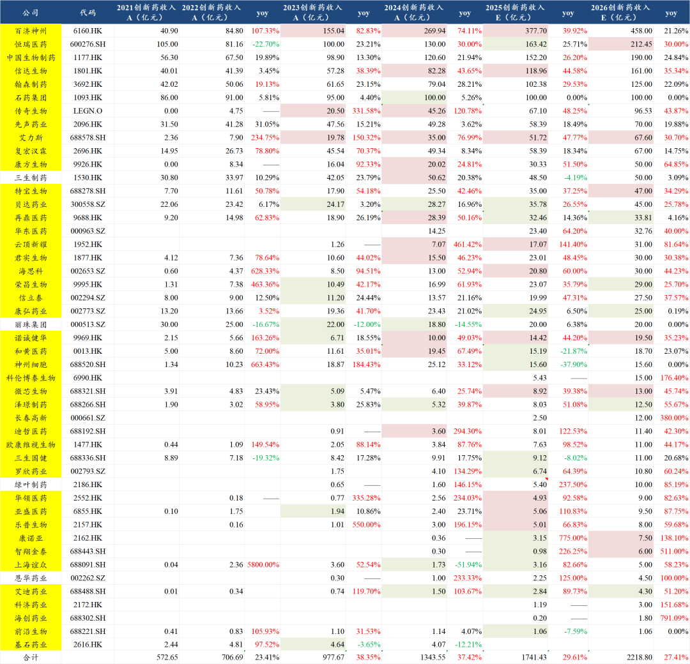
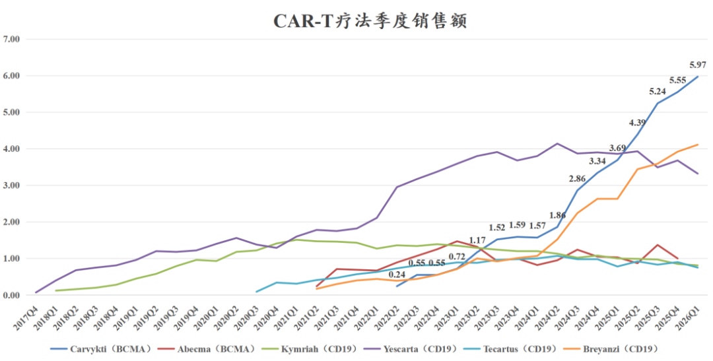
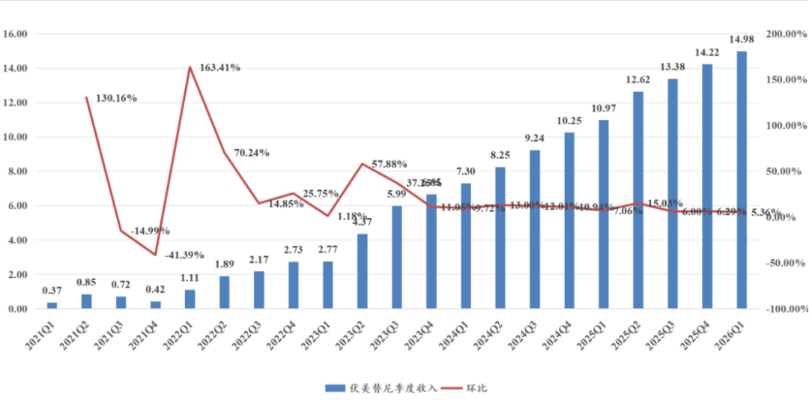
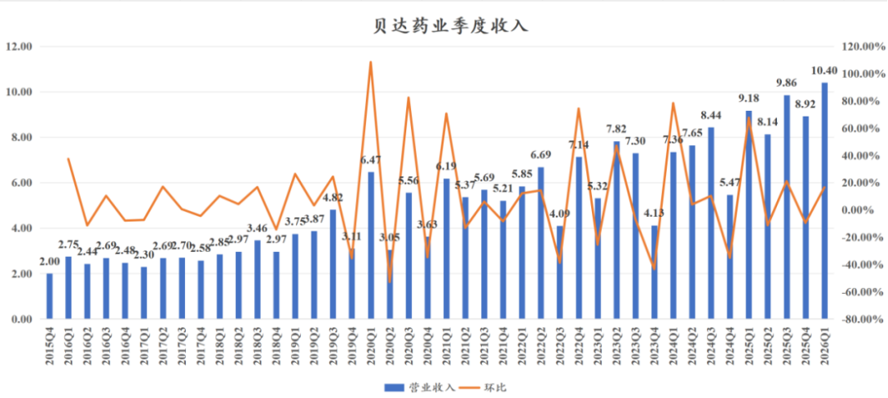
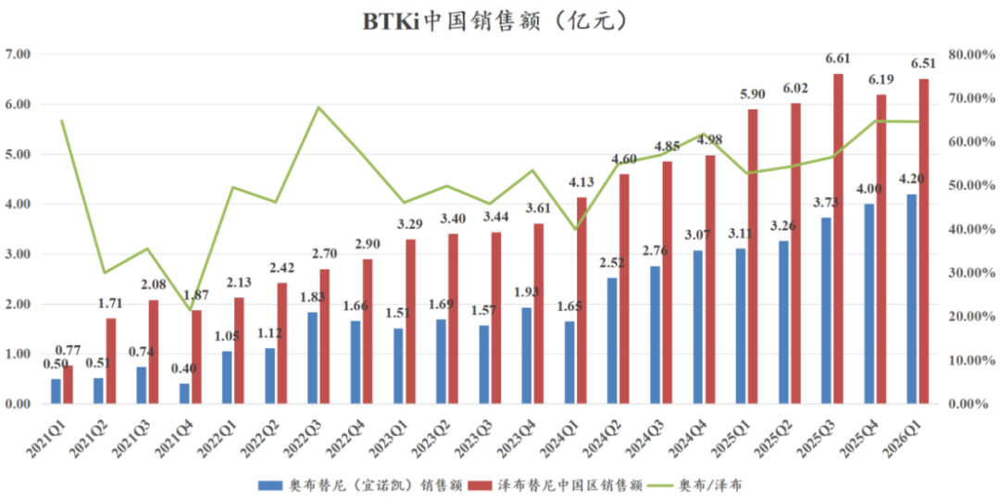
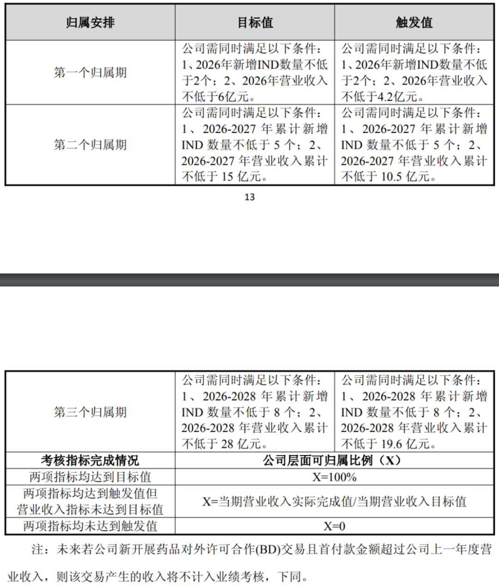
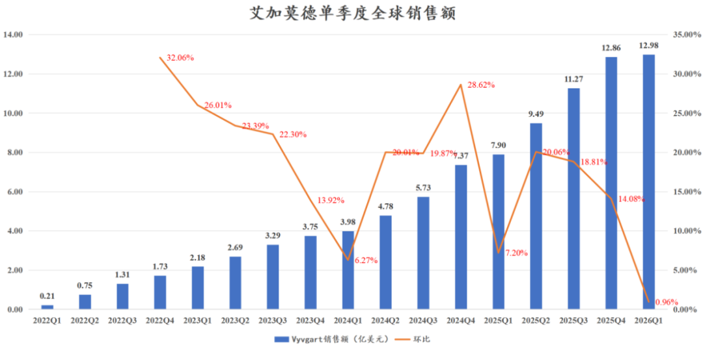
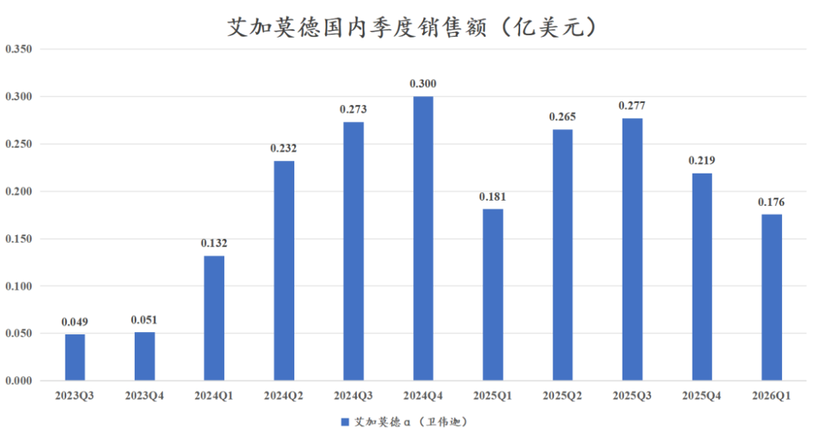
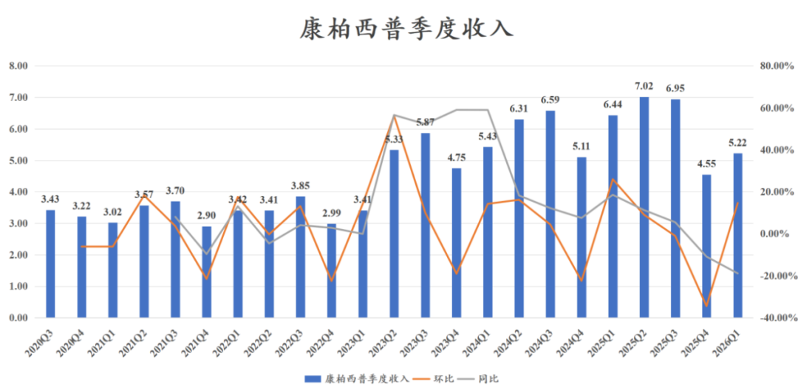
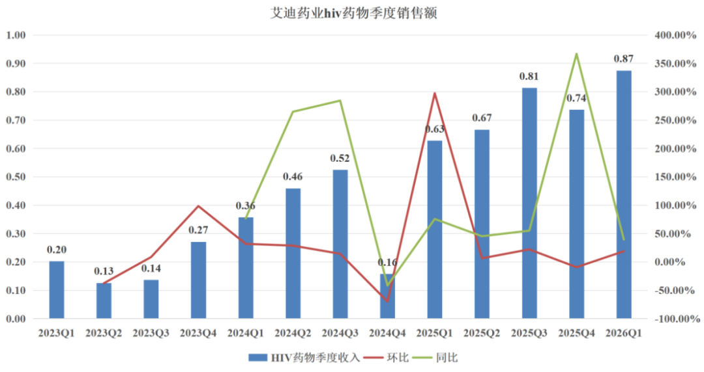

# 创新药大分化！

大家好，我是龙哥。

这两天百济和再鼎披露一季报后，创新药行业一季报基本披露完毕，我们本文来梳理一下创新药行业一季度超预期和低于预期的表现。

行业总量维持高速增长，但内部分化依然非常显著，行业龙头总体表现稳健或增长较好，中游公司则呈现更明显的分化，有些是因为产品周期，有些是重磅品种的放量，有些是季度间调控，还有些是一如既往的拉垮。

我们统计的47家国内创新药企业的全球创新药+生物类似药销售额，预计2026年合计达到2219亿元同比增长27.4%，虽然这个增速相较2025年的29.6%有小幅降速，但在全行业以及医药行业内各个子板块横向比较来说，都是非常惊艳的增长速度。

1、头部pharma、biopharma

百济神州、恒瑞医药、传奇生物符合预期，信达生物、艾力斯超预期。

- 百济神州：一季报具体分析见《[药王的魅力](https://mp.weixin.qq.com/s?__biz=MzkyMzQ3MDc3Mw==&mid=2247485963&idx=1&sn=0e4bd47c04d86e7fe33093b1202a2b29&scene=21#wechat_redirect)》，公司小幅上调了26全年的收入和盈利指引，收入小幅上调是在我们预期之内，一季度的盈利端确实超出我们的预期。
- 恒瑞医药：一季报具体分析见《[创新药一哥，一季报寡淡](https://mp.weixin.qq.com/s?__biz=MzkyMzQ3MDc3Mw==&mid=2247485930&idx=1&sn=8bfe77f6307d5a75baef21db23c6c1dd&scene=21#wechat_redirect)》，在上图中我们把恒瑞医药全年创新药增长预期从25%上调到了30%，此前也有读者问过我们对于恒瑞医药全年预期的判断来源，公司的股权激励考核是25%的增长，25年也是勉强做到25%，因此在年报后我们是相对保守的给了26全年25%的增长预期，从恒瑞医药一季报的表现来看，在10款创新药新进入医保、一季度应该是以进院为主的情况下实现了25%以上的创新药销售增长，那么全年还是比较有机会实现30%的加速增长的，因此一季报后我们有信心上调对恒瑞全年的增长预期。
- 传奇生物：公司还没披露一季报，根据强生一季报可见CARVYKTI一季度销售5.97亿美元同比增长61.8%、环比增长7.57%，全年有望实现27-28亿美元的全球销售额同比增长45%左右。

强生凭借CD38单抗+BCMA CART+BCMA\*CD3双抗+GPRC5D\*CD3双抗的产品组合，后续还有进一步自我迭代的BCMA\*GPRC5D\*CD3三抗，预计26年将在全球多发性骨髓瘤的创新药市场占据80%的份额，为绝对统治地位。传奇的药物疗效固然重要，选择对的强悍MNC合作方也至关重要。

- 信达生物：2026Q1产品销售超38亿元，同比增长超50%，信达生物目前有18款创新药+生物类似药处于商业化阶段，尤其是非肿瘤领域的PCSK9单抗、玛仕度肽等给公司贡献重要增量，在2025年底的医保谈判中，信达生物有6款新药首次纳入医保。

2024年还有很多投资人质疑信达生物可以在2027年做到200亿产品收入，2025年依然有一些质疑的声音，随着逐季度的超预期兑现，现在应该没有多少人认为信达生物在2027年做到200亿产品收入是难以实现的事情了吧。

- 艾力斯：2026年一季度收入15.84亿同比增长44.2%、环比增长10.1%，其中伏美替尼销售14.98亿元同比增长36.5%、环比增长约5%，戈来雷塞销售0.62亿元。伏美替尼这漂亮的放量趋势是多少药企梦寐以求的曲线，是多少医药投资人梦寐以求的曲线。更难能可贵的是，艾力斯在国内已经有11款三代EGFR获批、竞争者包括石药、翰森、贝达、强生、华东、AZ等一众强者的背景下实现这样的成绩。

2、二三线biopharma

贝达药业、诺诚健华、微芯生物、康诺亚超预期，智翔金泰股权激励考核指标超预期，再鼎医药、康弘药业、泽璟制药、艾迪药业低于预期。

- 贝达药业：公司26Q1收入10.4亿元同比增长13.3%，创单季度收入的历史新高；一季度归母净利润2.36亿元，一季度研发费用仅0.97亿元。相较艾力斯这种比较线性的大品种放量曲线，贝达药业的季度间业绩波动极大，季度间的业绩调控已经成为公司过去几年的常态。发布亮眼的一季报后没几天，在公司任职多年的董秘离职。

- 诺诚健华：一季报具体分析见《[高效biopharma，已是参天大树](https://mp.weixin.qq.com/s?__biz=MzkyMzQ3MDc3Mw==&mid=2247485932&idx=1&sn=76a9f391f0da75f550e9c689bb92efe5&scene=21#wechat_redirect)》，2026Q1收入5.29亿元同比+38.65%，其中产品收入4.50亿元同比+44.54%。公司现有商业化品种快速增长，后续还有4款产品完成III期临床患者入组在随访中，2027-2028年公司将进入创新药行业化从1到N的跨越。奥布替尼在国内的商业化，即便近年面对强大的百济神州的竞争、一线CLL/SLL大适应症的欠缺之下，凭借差异化的R/R MZL适应症也实现不落下风。

- 微芯生物：2026Q1收入2.57亿元同比+58.41%，创新降糖口服药西格列他那在2025年实现123%的增长至3.12亿元销售，2026年有望再度翻倍增长，贡献公司核心的销售增量。
- 康诺亚：公司年报时指引2026年产品收入约7.5亿元同比增长138%，根据我们多方调研交流到的情况来看，公司一季度的销售应该是非常亮眼，一季度末已经完成全年50%的入院目标。过敏性鼻炎在国内有上亿级别的患者人群，不少患者在长期使用抗组胺药和鼻喷激素的效果不佳，司普奇拜单抗给了患者新的选择，又有医保覆盖，销售火爆也是情理之中。
- 智翔金泰：2026Q1产品销售0.67亿元同比增长233%、环比增长191%，之前IL-17A单抗卖不好可以说是没有医保，2026年没有理由再卖不好了。公司还发布了2026年的2026年的股票激励计划，对收入的考核目标来看，如不考虑BD收入，对应2026-2028年分别做到6亿、9亿、13亿。

- 再鼎医药：2026Q1收入0.996亿美元同比下降6.48%，新产品销售持续miss，屋漏偏逢连夜雨，尼拉帕利受到竞品奥拉帕利集采冲击，一季度销售0.3亿美元同比下降39.46%，尼拉帕利的收入占比从46%掉到30%。一季度艾加莫德的收入0.176亿美元同比下降3.03%，艾加莫德在国内和海外的销售表现差异之大，同一个世界、同一款药物，公司之间的悲观各不相同。

- 康弘药业：2026Q1收入10.57亿元同比下降12.7%，其中康柏西普销售5.22亿元同比下降18.87%，康柏西普在6-7亿元的季度销售额之间震荡了两年时间，去年Q4到今年Q1压力较大。康柏西普的竞争格局意味着其确实不具备持续增长的能力，康弘药业账上超过67亿元的现金储备，创新药管线推进速度却一直偏慢，至今尚未有下一款创新药进入III期临床，收入端已经亟待下一款承接的创新药重磅品种。

- 艾迪药业：HIV药物2026Q1销售0.87亿元同比增长39.4%、环比增长18.7%，作为目前唯一一款国产的HIV口服复方制剂，商业化放量却也老是不尽如人意，公司指引今年全年HIV药物实现4.8亿销售额，目前来看也是难度不小。

......

很多投资人希望看到行业全面的高景气度才愿意投资，但可惜，创新药的股价可能会因为某些因素出现阶段性的同涨同跌，但行业内公司的基本面从来都不是能鸡犬升天的，由于创新药开发的超长周期，使得大部分创新药公司都存在各自的产品周期、细分领域的技术周期，各公司间的效率和执行力差异也非常巨大，原本看起来具有领先优势的公司由于效率低下或研发方向选择的重大偏离而可能过个几年就变得平庸，少部分的执行力超强的公司则是可以逐渐呈现复利效应。

但不论如何，仅从行业总量逻辑来看，创新药行业商业化收入的高增长仍在持续，行业的快速扩张尚未到达高峰，行业的机会还在层出不穷。

风险提示：本文仅讨论行业/公司经营情况，投资需综合考虑公司经营、估值、管理层等多方面因素，建议读者审慎参考，本文不作为投资依据，不建议大家根据本文做出投资计划。

<!-- wxmp-comments-begin -->

---

## 留言（14 条，含回复共 28 条）

- **大海** 👍4 · 2026-05-08 13:00
  拿创新药真要靠信仰，看着大科技一骑绝尘，凡人没有不动心的[裂开][凋谢]
  - ↳ **作者** · 2026-05-08 13:02
    问题是，投资本来不就要多行业配置吗，这两年除了职业医药投资人以外我也没见多少人all in创新药的，你完全可以一部分投科技啊。
- **袁超林** 👍2 · 2026-05-08 12:23
  龙哥兴齐眼药前景如何
  - ↳ **作者** · 2026-05-08 12:25
    兴齐眼药短期增长趋势和利润兑现都还是不错的，不过他独家的格局可能即将结束，预计今年下半年可能恒瑞和兆科的竞品就要上来了，先发优势还在，但竞争格局恶化总归是会有影响。
- **泪珠吻叶儿** 👍2 · 2026-05-08 12:27
  龙哥，映恩生物怎么看呢
  - ↳ **作者** · 2026-05-08 12:28
    映恩的小非减持就像上海六月的雨，一直下个不停。
- **杨思宁** 👍1 · 2026-05-08 12:16
  医药代表合规改善带来的成本增长，对恒瑞业绩影响，分析一下
  - ↳ **作者** · 2026-05-08 12:19
    这个是对行业性的影响，短期必然是会形成对所有药企的压力，不管是合规成本，还是销售本身的压力。中长期来说还是有利于行业健康发展的，干死带金销售为主的利益品种，减少行业劣币驱逐良币（垃圾药给的回扣更多，医生更有动力开）。
- **Passerby** 👍1 · 2026-05-08 12:20
  恒瑞的股价对不起他一哥的称呼，从牛市开始拿到牛市快结束了，不亏不赚。
  - ↳ **作者** · 2026-05-08 12:49
    你不该反思你买贵了吗
- **xyc** 👍1 · 2026-05-08 12:26
  再鼎医药好像已经彻底没戏了，回回miss
  - ↳ **作者** · 2026-05-08 12:29
    海外引进品种这两年的销售的确是拉的没话说，已经是连续5个季度miss。后续看点就是他自研管线能不能支棱起来了。
- **小鱼** · 2026-05-08 12:10
  感觉三生制药自从去年BD爆了以后，再也没有什么拿的出手的业绩可以吸引资金眼球了
  - ↳ **作者** · 2026-05-08 12:17
    三生制药原本也没有什么特别拿得出手的业绩吸引眼球啊，创新药像PD-1*VEGF这种大品种本身就是具有偶然性的，公司的研发能力、执行力都没因此改变，所以也无法线性外推他后续其他品种的成功或者BD出海。核心逻辑还是在于707的海外临床推进，以及公司账上保留200亿现金准备干嘛。
- **9527568** · 2026-05-08 12:18
  龙哥别研究药了，搞科技搞ai
  吧
  - ↳ **作者** · 2026-05-08 12:35
    AI是工具，我们在积极学习和使用，但不代表全世界的投资人都要去投资AI，过去几年公众号后台给我建议看这个搞那个的留言多的很，我只能说，术业有专攻。
- **潇湘落木** · 2026-05-08 12:19
  咋不分析荣昌生物和君实生物呢
  - ↳ **作者** · 2026-05-08 12:23
    创新药公司太多，不可能一一去讲，所以每次财报季后的行业梳理，基本还是以比较明显超预期或者低于预期的公司拿出来特别的讲。
    荣昌由于25年底有医保谈判降价，26Q1的产品销售就正常符合预期的水平。君实生物Q1确实卖的还不错，特瑞普利一季度同比增长39%、环比增长8.7%，不过也没有特别超预期。
- **撸铁小哥** · 2026-05-08 12:19
  荣昌bd了四个，为啥一直不提他？去年涨幅也是最大的
  - ↳ **作者** · 2026-05-08 12:23
    雪球有KOL天天喊，为啥老想让我提，不差我一个啊。
- **大浪淘沙** · 2026-05-08 12:33
  请问华东医药如何？跌跌不休了
  - ↳ **作者** · 2026-05-08 12:38
    华东医药我也有关注，业绩是比较稳定的，但他当前阶段确实有点显得平平无奇，在GLP-1领域有丰富的布局，但普遍进度不算领先，肿瘤和自免领域引进一系列品种的国内商业化权益，但缺少了国际市场也让人有点兴趣缺缺。ADC管线已经搭建起来，又尚未证明自己。
- **平凡人兜兜转转** · 2026-05-08 12:54
  有没有AI制药领域的推荐？
  - ↳ **作者** · 2026-05-08 12:56
    AI制药的标杆票大家都知道，就是英矽智能、晶泰控股。CXO现在普遍也都会应用AI工具，A股资金炒的比较多的像成都先导、泓博医药，港股还有个和英伟达合作的维亚生物是无人问津。
- **有意无意** · 2026-05-08 13:00
  小先生，什么时间讲讲AI对药物研发的影响吧。
  - ↳ **作者** · 2026-05-08 13:04
    AI在新药研发中“量变”的影响是确实已经出现的，各家创新药企和CXO企业基本都在积极的使用AI工具提高研发效率，但“质变”的影响还未出现，商业化路径与当前估值的匹配度仍不算高，还是饱含对未来的超高预期。
- **赶路的** · 2026-05-08 19:29
  康方生物不值一提吗
  - ↳ **作者** · 2026-05-08 20:57
    兄弟，康方不发一季报啊，而且康方现在核心矛盾也不是AK104和112短期国内卖多少。

<!-- wxmp-comments-end -->
