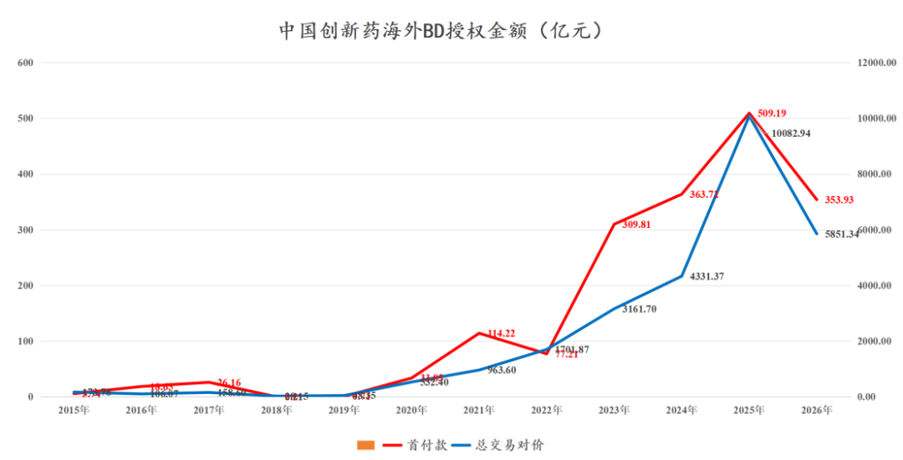
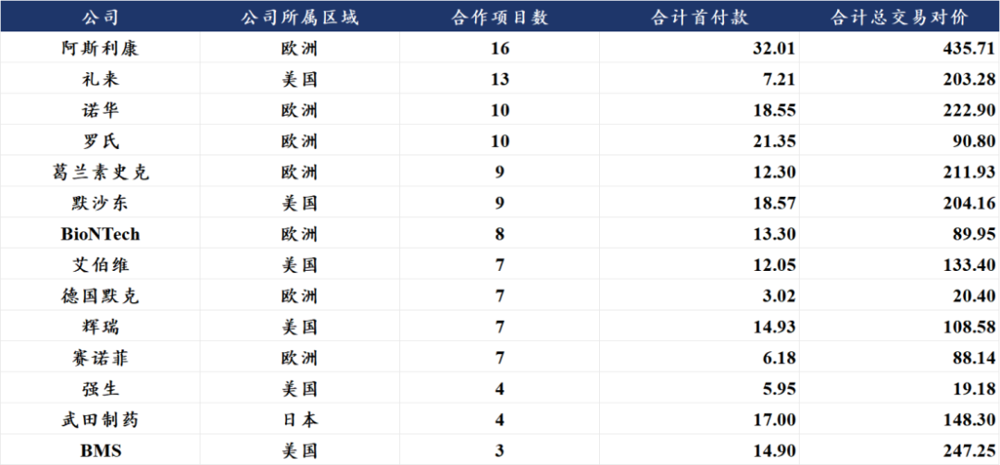
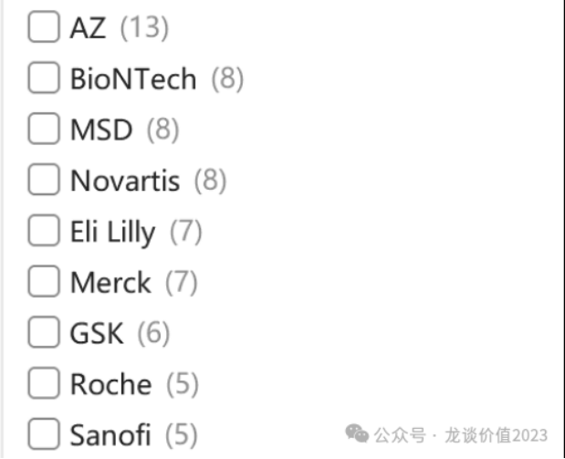
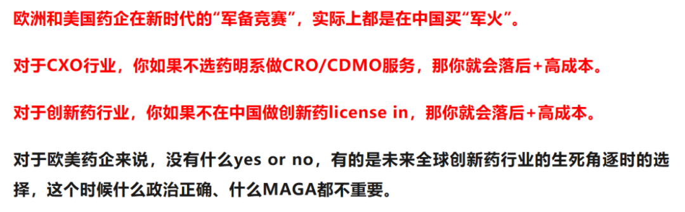
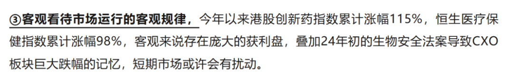
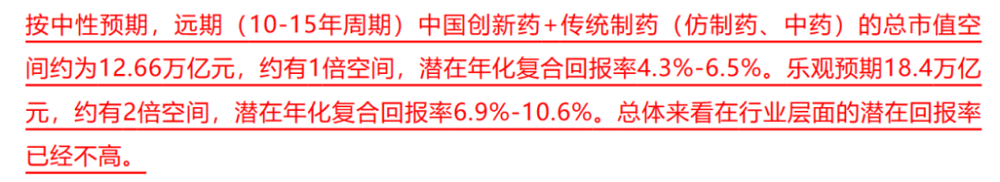

# 政治风险永无止尽，产业发展生生不息

大家好，我是龙哥。

5月21日，美国众议院中国问题特别委员会主席John Moolenaar致信美国财政部长，要求财政部把biotechnology纳入Comprehensive Outbound Investment National Security Act（COINS Act）下的prohibited technology范围，其中提及恒瑞最新与BMS的总包152亿美元的交易。

这里我们分几个方面来讨论这个问题：①这个消息，用人话说，到底是怎么回事？②落地的可行性如何？③长期影响如何？

1、事情原委

当大家看到“中国问题特别委员会主席”，就能知道这个部门是干什么的，其经常会针对我国可能对其形成威胁或影响的领域提出各种意见或法案，而本次针对的领域“生物技术”也不是其第一次提到，也算是我们的“老相识”了。

其中提到的COINS Act，也既《综合对外投资国家安全法案》，是在2025年底签署并纳入美国《2026财年国防授权法案》的一项法案，以立法的方式限制美国资本在某些领域的对外投资，这个法案包括两类管制：一类是Notifiable Technology，就是不完全禁止投资，但是需要向财政部申报，另一类是Prohibited Technology，也是本次的消息中提到的，其意在完全禁止对相关实体开展受管制的交易（如股权投资、技术授权或共享等）——除非特殊豁免。

所以简单说就是，如果这项提议被通过，那就意味着：①美国的MNC和投资机构可能难以对中国biotech进行股权投资；②中国公司license in美国公司开发的药物、美国公司license in中国公司开发的药物可能都会受到限制，未来常规的BD交易乃至co-co合作可能受到不小的影响。

2、落地可行性及长期影响

中国创新药海外BD的爆发是在2022年底开始，以ADC为首的、高度反映中国创新药产业工程化能力和效率的赛道，开始出现密集的BD交易，随后逐渐扩散到小分子、CAR-T、双抗/多抗、双抗ADC、多肽、小核酸等赛道。

中国创新药出海的爆发已经历经3年半的时间，尤其是2024年中国创新药BD交易总额突破全球BD交易总额的30%、2025年上半年进一步达到50%，已经引起了美国产业界的关注。

因此早在2025年上半年我们就意识到，随着BD交易规模的快速爆发，创新药行业潜在需要面对的政治风险也在与日俱增，实际上2025年我们已经用多篇文章来解读相关的信息——没错，这类政治风险的消息并不是初现，甚至这次的消息都不是最严重的一次。

回顾2025年9月份，当时纽约时报报道的一份行政命令的草案（看上去总比这次的“一封信”要靠谱），草案的核心内容中包括了对美国制药公司从中国药企购买研发阶段的药物的交易进行更严格的审查、对来自中国患者的临床试验数据进行更严格的审查、并收取更高的监管费用。

这个消息以来，国产创新药的海外BD反而有所加速，8个多月的时间实现超过70笔BD交易，合计首付款76亿美元，合计交易总包1256亿美元，BD交易总包谈的是一个比一个大，荣昌/艾伯维是56亿美元，信达/礼来是88.5亿美元，信达/武田是114亿美元，恒瑞/BMS是152亿美元，石药/AZ是185亿美元。

去年以来我们对待这样的所谓政治风险，一直采取的应对方式都是“战术上重视——积极关注边际变化，战略上轻视——长期基于第一性原理判断”。

这里先解释一下：

战术上重视：意味着我们要保持对政策面和政治因素的敏感性和关注度，事情在动态变化，对方也并不总是理性的，因此投资也是要随机应变，假如真的出台了极其不可控的政策，也需要及时应对。

战略上轻视：对于包括本次在内的“一封信”、“一个电话”、“一个草案”、“某某媒体报道”，我们的应对总体会是战略上轻视，也既认为此类消息绝大部分是“难成气候”。

我们以上判断有两个基本前提：

①我们认为美国、欧洲和日本药品市场至少在目前来说还是一个自由竞争的市场，这个自由竞争指的不是针对中国公司，而是指的对于欧美传统MNC来说是自由竞争的市场。

②我们认为中国创新药、尤其是早研项目，在全球具有不可替代的效率和领先性，我们看到越来越多的项目是MNC“竞购”而不是国内公司低价甩卖。

在这两个基本前提下，美国公司不买中国创新药，自然有欧洲公司买、有日本公司买，甚至有中国已经成功走出去的百济会买。最终的结果只会是美国政府强制让美国MNC放弃了一个具有高效率、低成本、领先性的早研分子来源。

而相较于几十亿到百亿美金级别的BD金额，全球上万亿美金的创新药终端市场的诱惑力显然大得多，不论是对于MNC来说还是对于美国政府来说。

实际上我们的确看到，欧洲药企在这几年呈现更加迫切、甚至可以说疯狂的从中国BD引进创新药项目：

（单位：亿美元）

可以对比一下去年9月时候的数据：

截至目前，共有11家MNC或biopharma从与中国公司的BD合作超过5项，其中来自欧洲的包括阿斯利康、诺华、罗氏、GSK、德国默克、赛诺菲等5家欧洲顶级传统MNC，以及在新冠中赚了200多亿美金的德国BioNTech。

这6家欧洲公司过去几年合计与中国公司签订了67项BD合作，支付了107亿美元的首付款和1160亿美元的总交易对价。

而另外5家美国MNC则是合计签订了36项BD合作。

其中阿斯利康、诺华、默沙东、辉瑞、武田制药可以称得上是出手极其阔绰。

这样快速的在中国创新药行业“扫货”，我们理解是多方面因素共振的结果，包括但不限于：

①MNC众多大药在这几年或未来几年的专利悬崖压力。

②MNC削减早研团队控成本，转而大量选择高效率的中国创新药早期项目来填补早期管线。

③创新药技术迭代越来越快，单个药物的生命周期可能被缩短，MNC需要更庞大的管线来支撑其未来的收入体量。

④国产创新药中陆续出现一些优质项目，对于MNC来说也颇具吸引力，需要快速、高价引进，乃至竞购，中国创新药在国际BD中的话语权也是在明确提升的。

欧洲药企在近5-10年掉队掉的更加明显——相较美国本土药企，欧洲药企也呈现出对中国创新药更大的兴趣。

因此，正如我们去年9月的文章所言：

创新药行业很现实，性价比并不是国产创新药唯一的竞争力，以前国产创新药极其便宜的时候求着MNC人家都不要——进度较慢的me too、me worse的药对MNC来说更多是拖累，但是真的有领先的好药、大药的时候，MNC下手也是非常果断且阔绰的，类似辉瑞、艾伯维。MSD买PD-1\*VEGF，武田买PD-1\*IL-2α，BMS买EGFR\*HER3双抗ADC，手起刀落、眼都不眨一下。

......

好的地方在于，去年9月份政治风险初现的时候，行业总体处于高位，当时我们说到：

而在当下，行业经历半年多的回调，行业估值已经有明显回落，同样是参照去年9月的分析估值的文章：

我们也会在近期的文章中再给大家更新一篇行业估值的文章，帮助大家更好的理解当前行业估值所处的位置。

......

近期重点文章：

[哪些医药公司在持续回购和增持](https://mp.weixin.qq.com/s?__biz=MzkyMzQ3MDc3Mw==&mid=2247486007&idx=1&sn=f8e42e381401ab4c293c3a750634ab57&scene=21#wechat_redirect)

[向医药内幕交易投降](https://mp.weixin.qq.com/s?__biz=MzkyMzQ3MDc3Mw==&mid=2247485991&idx=1&sn=ebe3cfe62cc5986270306a4c74704a12&scene=21#wechat_redirect)

[创新药大分化！](https://mp.weixin.qq.com/s?__biz=MzkyMzQ3MDc3Mw==&mid=2247485979&idx=1&sn=bfde6947f700a62ed88e9e7d6b372a4f&scene=21#wechat_redirect)

[高效biopharma，已是参天大树](https://mp.weixin.qq.com/s?__biz=MzkyMzQ3MDc3Mw==&mid=2247485932&idx=1&sn=76a9f391f0da75f550e9c689bb92efe5&scene=21#wechat_redirect)

[创新药出海，面对现实](https://mp.weixin.qq.com/s?__biz=MzkyMzQ3MDc3Mw==&mid=2247485890&idx=1&sn=023f5c09a432630036ac09645c161403&scene=21#wechat_redirect)

[什么样的项目在出海时能成为超大deal](https://mp.weixin.qq.com/s?__biz=MzkyMzQ3MDc3Mw==&mid=2247485788&idx=1&sn=72df75c9012c898283035bc74a59acdf&scene=21#wechat_redirect)

[医药TOP20变迁，十五年的轮回](https://mp.weixin.qq.com/s?__biz=MzkyMzQ3MDc3Mw==&mid=2247485777&idx=1&sn=ba8657fd715a74ce3c30b09fca229635&scene=21#wechat_redirect)

风险提示：本文仅讨论行业/公司经营情况，投资需综合考虑公司经营、估值、管理层等多方面因素，建议读者审慎参考，本文不作为投资依据，不建议大家根据本文做出投资计划。

<!-- wxmp-comments-begin -->

---

## 留言（18 条，含回复共 33 条）

- **田霖** 👍10 · 2026-05-27 19:56
  美国不买，除非它联合全世界一起不买BD，只要有一个MNC买中国BD，其他不买的国家就会被卷死，这是阳谋无解
- **小1** 👍5 · 2026-05-27 18:54
  读了全文后，我就想说看来可以慢慢加仓创新药了[捂脸][捂脸]
  - ↳ **作者** · 2026-05-27 18:58
    后台也不少读者问为什么最近更新的少一点，一方面是最近调研很多，另一方面是最近行业确实各种乱七八糟的利空一个接一个，有行业的，有个别公司的，数都数不过来，那我们能怎么办呢，我们也很无奈，只能安静一点等待行业度过这段“多事之秋”，这不代表我们不看好行业，已经陆续有一些公司跌到我们认为比较便宜的水平了，所以这篇文章后面才说会给大家更新一下估值。
- **JeFF** 👍3 · 2026-05-27 18:58
  龙哥，康龙A这样跌性价比如何？同等条件是不是药明康德更有空间？或者博一下泰格？[捂脸]
  - ↳ **作者** · 2026-05-27 19:01
    药明系三家显然是要确定性有确定性、要成长有成长、要估值低有估值低，康龙A股谈不上性价比，康龙H还是比较有性价比的，但AH溢价嘛也客观存在。泰格的话现在处于左侧，泰格H确实也很便宜了，但是这种实控人被立案的情况，大部分机构来说都会拉进黑名单，所以机构持仓的退出导致现在这样的股价惯性下跌。
- **天野源** 👍3 · 2026-05-27 19:01
  期待估值的文章[礼物][庆祝][庆祝]
  - ↳ **作者** · 2026-05-27 19:05
    最近实在是调研比较多，这篇文章其实周一就写好了，但大家知道我的文章不但要写正文，每篇文章回复留言还要半小时到一小时，由于这两天没空回复留言，所以就一直拖着到现在，估值那个文章也是一样。
    另外还要说一下，大家留言的话尽量不要删，如果你不想被公开出来你就备注一下，有的留言我打字回复两三百字，是想把观点展示给大家的，删了就大家都看不到了。
- **相逢即是袁先生** 👍3 · 2026-05-27 19:13
  恒瑞拿住等80，原来是希望破前高的，还是太乐观了
- **知行** 👍2 · 2026-05-27 19:13
  回调8个月了，指数30%跌幅，太难熬了。
- **雪山之巅8866** 👍1 · 2026-05-27 18:46
  石药集团的季报怎么看呢？今天市场反应那么激烈？[捂脸]
  - ↳ **作者** · 2026-05-27 18:53
    今天在外面调研，石药的业绩还没详细拆，中午简单看了一下感觉还是符合预期的，可能是同比百分号下滑有点吓人吧。
- **冰太阳** 👍1 · 2026-05-27 19:27
  龙哥，信达生物 最近有什么利空消息吗
  - ↳ **作者** · 2026-05-27 19:39
    要说最近的话主要就是那个上海加强了对线下药店的GLP-1处方的监管，让大家关注到最新实施的药品管理条例，担心GLP-1这种广泛的以降糖适应症开处方、实际用于减重需求的行为可能受到影响。
- **ALL-IN** 👍1 · 2026-05-27 19:42
  跌懵逼了，不是新低就是在新低路上 。大盘还新高绝望
- **在远方** 👍1 · 2026-05-27 19:46
  龙大，分析分析迈瑞医疗吧，器械龙头一直跌也要关注下 里面散户很多的
  - ↳ **作者** · 2026-05-27 19:51
    迈瑞我自己是判断已经比较接近或者已经是业绩底部了，只不过就26-27年来看业绩弹性还起不来，所以在这种科技极其强势的情况下迈瑞就呈现现在这样的阴跌。
- **郭郭郭** · 2026-05-27 18:50
  龙哥，最近想买一些创新药的Etf，能不能推荐几个，谢谢
  - ↳ **作者** · 2026-05-27 18:51
    我在这直接给代码也不合适，但是基本上我们历史文章里把能满足大家需求的各种AH股的覆盖创新药的、CXO的、创新器械的、互联网的ETF都介绍过
- **张Z** · 2026-05-27 19:05
  龙哥，现在直接恒生医药ETF，估值算是合理区域偏下一点点吗？
  - ↳ **作者** · 2026-05-27 19:12
    ETF也是由一个个公司组成的，尤其是权重成分股，如果成分股的估值都比较低，那行业指数和ETF的估值自然不会高。
- **嘀嗒** · 2026-05-27 19:17
  泰格最近是怎么了，和别的CRO走势不一样呢。
  - ↳ **作者** · 2026-05-27 19:18
    平时的文章可以多翻翻评论区。泰格实控人因为信披违规被立案，会导致其被很多机构纳入禁投名单。
- **HUYH** · 2026-05-27 19:22
  纳入不是坏事，不被针对，政府不重视[捂脸]
  - ↳ **作者** · 2026-05-27 19:37
    真要纳入肯定是利空啊，行业出海逻辑会受损的，怎么能说不是坏事呢。
- **骑着小猪看月亮** · 2026-05-27 19:34
  怎么看博腾股份被诺华起诉违约
  - ↳ **作者** · 2026-05-27 19:41
    影响还是不太好的，这种有较长期的与MNC合作经验的CMO公司，一般来说不至于撕破脸的，弄得这么难看，对博腾来说肯定是很大的损失，不论是短期的资产损失和潜在赔偿，还是说未来与其他MNC合作也不好说会不会受到影响。
- **lee** · 2026-05-27 19:42
  龙哥，重仓药明三杰。 怎么看待近期药明合联卖空占比44%，尾盘成交量异常放大的情况？
  - ↳ **作者** · 2026-05-27 19:48
    如果你抛开个股，看整个香港市场，会发现这几个月做空规模在快速攀升，这和个股的关系不大，这个时候流动性好的个股更容易被上空仓。
    药明康德、生物、合联三家都已经陆续宣布回购计划，康德已经在回购，合联计划回购1亿美元，生物计划回购4亿美元。我只能说，多看看三家的基本面趋势、以及药明系管理层的态度。
- **吕智峰** · 2026-05-27 20:22
  龙哥，迈威生物的估值合理不，2821的数据怎么样，bd预期是不是被夸大了？
  - ↳ **作者** · 2026-05-27 21:02
    2821不是说这个药不好，迈威确实做了一些差异化的适应症，但问题是早已经错过了BD的窗口期，在主要的大适应症一线UC上海外已经批了一线的PD-1+Nectin4-ADC，后面的玩家就基本不会愿意用同类的分子去和现有一线疗法做头对头了。
    迈威的管线丰度还是有的，现在新发的H股才90亿人民币出头的市值也说不上贵，但这公司的市值弹性要起来，确实是缺少一个在全球具有亮眼数据及进度领先性的产品。
- **Shuang** · 2026-05-27 21:57
  欧洲日本市场不够大
  - ↳ **作者** · 2026-05-27 22:11
    你没看懂文章的意思。以及，欧洲日本市场也不小。
  - ↳ **作者** · 2026-05-29 12:01
    欧、日有很多大药企，美国政客不让美国药企买，但欧日药企可以买中国管线去美国市场卖药啊

<!-- wxmp-comments-end -->
