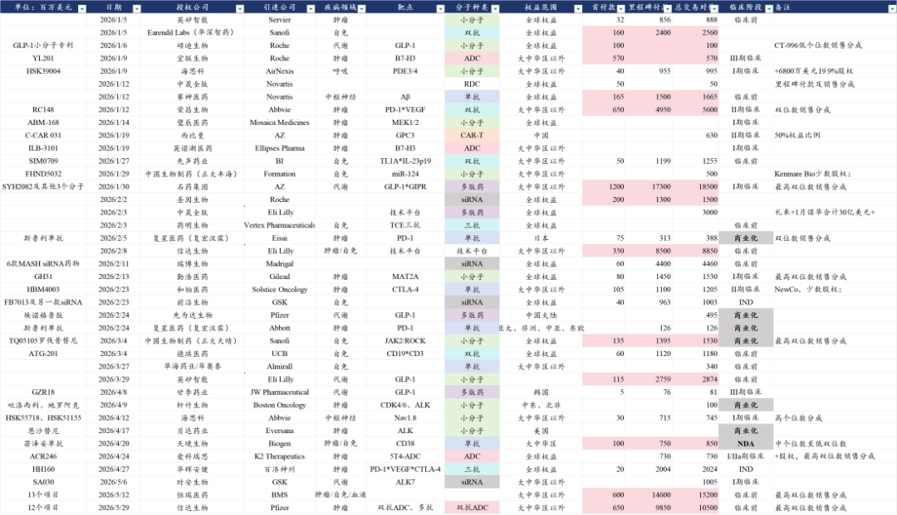
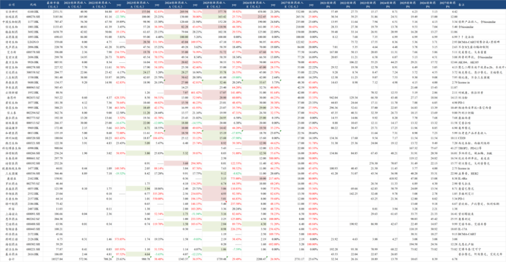
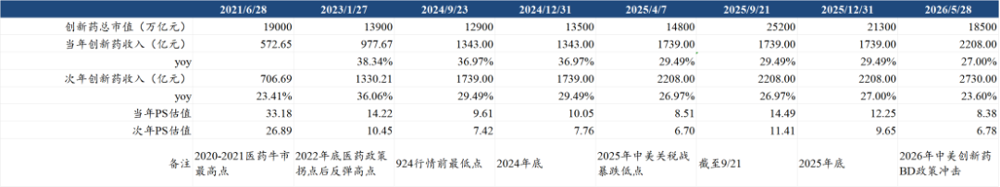

# 创新药目前处于什么估值水平？

大家好，我是龙哥。

本文来给大家更新一下创新药行业估值水平。

行业又到了艰难的日子，从24年的924以来，创新药最艰难的时刻是昨天，不仅是股价的下跌，更是政策面与信心的双重影响。

在最近一个月的时间里，行业及行业内公司的利空以每1-2天出现一个的速度曝出，再坚定的医药投资人都忍不住叹息。很多投资人说是被科技抽流动性，可又何止是被抽的问题，行业及公司自己出各种问题，又如何单单说是被别人抽。

行业层面，医疗反腐的五一新政大家还在观察短中期影响，GLP-1药店处方监管趋严，美国对中国创新药投资和BD审查，中国对中国创新药海外BD审查，美国加息预期提升，富途、老虎的监管导致港股流通性进一步收紧。

公司层面，泰格信披违规实控人被立案，博腾海外工厂违规被诺华追责，信立泰潜在重磅药物JK07临床II期数据暴雷，万邦德被ST、董秘跑路，港股一系列庄股来回崩，还有的公司发完好的数据趁机配股，有的公司发数据之前减持，实在是难以评说。

这其中值得我们重点聊聊的就是中美对创新药BD的政策变化，周三的文章我们解读了美国这边对BD相关的问题《[政治风险永无止尽，产业发展生生不息](https://mp.weixin.qq.com/s?__biz=MzkyMzQ3MDc3Mw==&mid=2247486018&idx=1&sn=f55e284c0843a5a1d2a6495db5751b3f&scene=21#wechat_redirect)》，今天这篇文章原本的主题是讨论行业估值，但我们想在前面先用一段来聊聊国内BD的监管问题。

1、国内BD

首先，我们认为监管部门关注的事情并不是BD本身，创新药海外授权本身是从上到下都非常喜闻乐见的事情。

我们以前也讲到过，BD这种模式，一个知识产权卖出去，不用管复杂的临床设计和执行、不用管生产、不用管商业化销售和市场竞争，失败了不用承担风险、成功了可以拿销售分成，再叠加上中国创新药产业的高效率，简直就是天生的吸金利器，进一步的讲这是产业从CXO向后延伸的表现。

今年来的很多“基于”技术平台的项目授权，意味着从2018-2022年前后我国主要靠CXO来参与全球创新药产业价值链，到现在不但通过CXO、还可以通过从早期到后期项目全面海外BD的方式，在全球创新药产业这块蛋糕上切下更大的一块。

监管关注的是什么呢，我们认为主要是三种情况：

- 第一种是卖技术平台、国内不再开发，也就是说你借助国内的工程师红利开发了一个技术平台，老板扭头把技术平台卖出去了、国内团队大部分解散了、不再进行后续开发了，这个是不太能接受的。
- 第二种是产品全部权益都卖给海外企业了，海外企业开发后在国内市场的商业化定个高价来卖，对于没有充分竞争的产品来说国内患者和医保没有足够的议价权。
- 第三种就是考虑数据安全问题。

当然这背后还有没有其他利益相关方的因素，我们这里不方便展开讨论。

今早信达生物与辉瑞又刚刚宣布签署总包105亿美元、涉及12个项目的BD交易，我们也倾向于认为，如果真的有较为严格的管制，不太可能出现这种马上落地超大规模BD的情况。

仅在2026年以来，我国创新药海外授权的首付款已经达到56.4亿美元（390亿人民币），交易总包达到930亿美元（6400亿人民币）。25年以来也有越来越多公司可以收到里程碑付款。

不可否认的是所有出海的项目里能有20%最终在欧美成功上市就已经是不低的比例，所以在这里也要提前给大家打预防针→BD授权项目越多、未来看到的退货和终止开发也会越多。

但就目前国内创新药海外授权的趋势来看，哪怕20%的成功率也会对应至少30%以上的全球市场份额，也会在未来带来恐怖的商业化分成的现金流。没有人会傻到放弃这么大的蛋糕，要尊重基本的常识。

2、行业估值处于什么水平

在去年9月行业处于高位的时候，我们来分析行业估值，作为医药投资人，处于一种“希望行业继续涨、但算出来的空间又让人迟疑”的状态。而近期虽然行业表现的偏弱，但聊估值这个事情就变得相对轻松一些。

从创新药全行业来算估值这个事情本身有非常大的难度和局限性，我们目前可以看到的一个指标就是以行业内重点公司的商业化收入计算PS估值。

这个表大家应该都很熟悉了，2025年报后我们先大致更新了对2026-2027年的药品商业化收入预测，我们统计的48家中国创新药公司的2026年创新药（含部分biosimilar）收入合计约为2200亿同比增长接近27%，且预计2027年会达到2700亿以上同比增长23%以上。

在整个药品行业总量基本不增长的情况下，2023-2027年行业规模增长了接近3倍，行业复合增速约为30%，即便是26-27年依然有25%左右的行业增速，在医药行业所有大类细分行业里是绝对领先的增速。

然后基于一个横向可比的PS指标来评估行业估值水位：

我们选取了一些极具代表性的时间点，包括2021年6月底的上一轮医药牛市最高点的估值水平，大概是对应当年33倍PS、次年27倍PS；然后是2022年底医保政策向好、2023年初行业反弹的高点，对应当年14.2倍、次年10.5倍PS，2025年9月的高位，对应的是当年14.5倍PS、次年11.4倍PS，与2023年初那个高点的估值基本一致。

再来看几个低点的估值水平，2024年924之前最低点的估值大概是对应当年9.6倍PS、次年7.4倍PS，2025年4月7日贸易战导致的暴跌低点，对应当年估值8.5倍PS、次年估值6.7倍PS。

而截止到昨天，最新的估值是对应当年8.4倍PS、次年6.8倍PS，与2025年4月7日的低点基本一致，已经低于2024年924时候的PS估值。虽然这个不能完全静态的比较——毕竟行业增速在降速，估值中枢也该随之下移，但也可以大致作为一个横向比较的指标，就绝对估值来说也是处于一个相对低位。

当然有些投资人可能对PS估值不是很能理解，更希望从PE角度来看，我们假设以创新药商业化平均的利润率25%来计算，最新估值当年8.4倍PS、次年6.8倍PS对应的大概是当年34倍PE、次年27倍PE。

换成PE可能有些投资人就会觉得这个估值是不是也没有很便宜？这就是以上指标更多用于横向比较的原因，因为除了以上测算以外，还需要考虑的问题是创新药出海。

上文中计算的估值，除了百济、传奇、和黄三家公司以外，其他绝大部分公司的收入都是来自国内市场，我们知道创新药从25年以来的一轮大行情，其中包含了很高的出海的预期，出海的权益大部分在短期内不会马上转变为收入，从2015年以来的10年间我国累计实现创新药海外授权总规模3939亿美元，对应超过2.7万亿人民币。

我们对海外部分做如下假设：

①每年首付款100亿美元，②首付款占总包6%-7%（参照历史平均6.6%），③授权项目成药概率15%、里程碑付款兑现10%，④销售分成平均中高个位数7.5%（随着co-co模式增加，这个比例会提升），⑤全球创新药市场规模按1.2万亿美元计算，实际每年还有中低个位数增长。

在当前1.2万亿全球创新药市场的基础上计算，对应的我国创新药行业的海外部分每年的收入大概是：首付款100亿美元+里程碑付款140亿美元+270亿美元销售分成=510亿美元≈3500亿人民币（2025年中国医药工业企业利润合计约为3400亿元）。创新药出海部分能贡献的是3.5万亿以上的估值。

如上图中统计的49家创新药上市公司合计市值是1.85万亿，如果扩大到合计400家A股+H股+美股的中国医药工业企业最新的合计市值约为5万亿元。

2025年9月高位时统计的374家医药工业企业合计市值是6.74万亿元，8个月的时间行业总市值跌去约26%。最后可参照《[创新药宏大叙事，行业估值处于什么水平？](https://mp.weixin.qq.com/s?__biz=MzkyMzQ3MDc3Mw==&mid=2247484956&idx=1&sn=015c13dab5e66b4a6ca8d66ff8791921&scene=21#wechat_redirect)》、《[创新药目前处于什么估值水平？](https://mp.weixin.qq.com/s?__biz=MzkyMzQ3MDc3Mw==&mid=2247484651&idx=1&sn=170b1d665b283894fb722e7daeb885a7&scene=21#wechat_redirect)》。

......

月底了，照例开一次赞赏

风险提示：本文仅讨论行业/公司经营情况，投资需综合考虑公司经营、估值、管理层等多方面因素，建议读者审慎参考，本文不作为投资依据，不建议大家根据本文做出投资计划。

<!-- wxmp-comments-begin -->

---

## 留言（28 条，含回复共 53 条）

- **小1** 👍20 · 2026-05-29 10:58
  白嫖了龙哥的文章这么久，今天表示一下心意，到留言区许个愿，希望创新药和医疗器械大涨。[得意][得意][得意]希望大家都赚到钱！
  - ↳ **作者** · 2026-05-29 10:58
    赞赏第3次啦，感谢支持[抱拳][抱拳]
- **晚叙** 👍19 · 2026-05-29 10:56
  这一个月简直是创新药的末日[捂脸] 再坚定的投资者都会动摇..
  - ↳ **作者** · 2026-05-29 11:00
    尤其是另一边天天大涨是吧，必然是每天都有不少投资人完全放弃消费医药投入科技的怀抱的，包括大的机构。
  - ↳ **作者** · 2026-05-29 11:25
    是的，尤其是现在的硬件科技如日中天 不知道涨了多久，药被丢弃在角落。再加上港股目前的定位有点尴尬，导致各方资金对它很谨慎，甚至大范围做空，估值啥的可能需要大周期才能修复
- **Elio** 👍10 · 2026-05-29 10:58
  感觉就不是估值的事，港股被外资做空，没资金关注了
  - ↳ **作者** · 2026-05-29 11:02
    嗯，我们也看到今年港股总体确实做空比例在显著提升，港股市场的优势资产有三类，互联网、创新药、高股息，这三类资产恰恰都不在今年的风口上。
- **小朱钱币礼品13861155920** 👍8 · 2026-05-29 11:44
  龙哥：说实在的医疗行业的钱一般人真的不好赚，太难了，国内国外产业政策一直这样那样的。19年到21年我重仓了CXO，资产翻了几番，天真的认为（药明举例吧）只要业绩能够扛住，即使杀估值业绩增长也能磨平，21年当时100倍市盈率最后居然能够杀到10倍市盈率，而且还是在业绩增长的情况下（当然了后来是外部原因）做投资几十年第一次遇到这样杀估值的。后来亏了一两百个全部退场的，纸上富贵了一下。每次看您文章看您认真分析医疗，我的内心有一种说不出来的感觉，主要是心伤的太深了，这几天又看您文章小资金买了点恒瑞和泰格[捂脸]
  - ↳ **作者** · 2026-05-29 11:46
    可是可是，创新药和CXO，看我的文章不应该买百济和药明吗[捂脸]
- **沙风骆驼** 👍6 · 2026-05-29 11:11
  只能略表心意了，牛市亏惨了[捂脸]，持仓都是互联网，消费和医药。心态不好。
  - ↳ **作者** · 2026-05-29 11:13
    感谢感谢[太阳][太阳]
- **逆风飞行** 👍6 · 2026-05-29 11:25
  刚看完就看到创新性拉起来了[破涕为笑]
  - ↳ **作者** · 2026-05-29 11:30
    文章没白发！
- **HungMan🍓🍒** 👍5 · 2026-05-29 11:16
  大佬，今年持有老登完全没赚钱，幸好之前跑了亏得少，只能略表心意，等该死的药走好赚钱一定来谢
  - ↳ **作者** · 2026-05-29 11:19
    感谢支持[抱拳][抱拳]
- **yaya** 👍5 · 2026-05-29 11:39
  创新药Etf上市定投到现在，由赚到亏，无语
- **低碳哥** 👍4 · 2026-05-29 10:54
  龙哥，互相打气
  - ↳ **作者** · 2026-05-29 11:07
    借这条留言说一句，机构同行、产业的朋友，如果希望加个微信交流的，可以后台留下联系方式，有机会也可以来陆家嘴找龙哥喝喝茶聊一聊。关注比较久、互动比较活跃的老读者也可以留。
- **旧忆难寻** 👍3 · 2026-05-29 11:11
  禁止出海这个小作文是假的
  - ↳ **作者** · 2026-05-29 11:13
    首先没有禁止出海的说法，只是可能会有所审查。第二确实是有监管部门关注和在酝酿政策，文中有讲到几种可能的场景，对绝大部分BD是不影响的。
- **海上华尔兹** 👍3 · 2026-05-29 11:14
  在最黑暗的一天，又是龙哥出来做心理按摩。上钟了。
  - ↳ **作者** · 2026-05-29 11:19
    [加油][加油][加油]
- **好好说话** 👍3 · 2026-05-29 11:15
  哥们，你没给代码和结论啊。我不知道能不能买、买哪个
  - ↳ **作者** · 2026-05-29 11:18
    结论其实给了呀，短期政策影响、行业目前的估值水平都已经讲的比较清楚了。标的嘛，可以翻翻历史文章里介绍的一些ETF资产，选择适合自己的。
- **R9-牛牛** 👍3 · 2026-05-29 11:48
  估值还是有点高动态Pe45倍，叠加如果牛市结束，和25%的行业利润增速，起码要跌大概30%才是重大投资机会！一直在等！
  - ↳ **作者** · 2026-05-29 11:51
    A股创新药估值确实是要显著高于港股的，你看AH同步上市的这些公司的AH溢价就知道了。另外看当前的PE确实意义不大，因为25%是收入增速不是利润增速，创新药放量阶段利润是非线性释放的。
- **Rose@RTS | LED Factory | 13Years** 👍3 · 2026-05-29 12:32
  龙哥 之前我重仓创新药和创新药械五六年，走了最黑暗最挣扎的路，去年八九月回本并且40%收益，最高点朋友提醒我但是我不卖一直坚持持有，我相信自己现在吃的了大苦，以后也配得大甜，截止几年最高点亏一半了！这时AI来了，这次ai是革命大事件，挪1/3到海力士三星这些HBM核心股了，最近心情涨得好舒服哟。这就是一个真实苦逼在创新药挣扎了五六年的投资者遇到革命性AI的历程。持有创新药/药械太苦逼啦，太难啦[流泪][流泪]
- **吴志华** 👍3 · 2026-05-29 12:48
  相信产业发展趋势，找到优质公司，等到价格相对便宜，一定会有合理回报
- **赵宏阳** 👍2 · 2026-05-29 11:05
  龙哥跟踪过纳微科技吗，属于卖水人吗，竞争格局和替代空间有吗
  - ↳ **作者** · 2026-05-29 11:10
    纳微科技确实是卖水人，和赛分科技两家是国内填料领域的头部公司。一方面是现在新分子结构越来越复杂，对分离纯化的要求实际上是越来越高的，另一方面国产替代也是在进行的。从行业容量来看，填料也是生物制药产业链上价值量比较高的细分。
- **喻力** 👍2 · 2026-05-29 11:11
  是医药资金太垃圾了吗？
  - ↳ **作者** · 2026-05-29 11:16
    医药资金这个事情，也有他的历史背景，医药行业本身在全市场来是说除了2020-2021年那波大牛市以外，行业本身并不算是那么那么出众，但医药行业有着全市场最大的行业主题基金，主动管理和被动管理规模都很大，被动基金ETF先不谈，主动管理的这一两千亿的规模就只能在这里面拼命卷，一旦全基不来，医药主动基金这两年的趋势又是持续减量，那整个行业面临的就是减量博弈。
- **davi** 👍2 · 2026-05-29 11:23
  创新药在我国消费属性大于科技属性，是不是创新药的牛市在去年9月已经走完了，后面就是一些反弹而已。
  - ↳ **作者** · 2026-05-29 11:24
    问题是本身创新药就得基于全球的逻辑去看，仅看国内逻辑的话3-4年前就该转行了，哈哈
  - ↳ **作者** · 2026-05-29 11:34
    标普生物映射我们创新药，标普生物木有行情，我们创新药也难有起色吗？
- **谢群** 👍2 · 2026-05-29 12:09
  创新药太伤我了，施一公的业绩又骗了我一次[流泪][流泪][流泪][流泪][流泪]
  - ↳ **作者** · 2026-05-29 12:11
    他那个还好啦，诺诚业绩确实不错，研发推进效率很高，ASCO发布的数据也不错，短期没啥关注嘛，我24年在港股4-5块的时候抄底等了几个月才涨，那时候A股都涨了很久了
- **fengzhy** 👍2 · 2026-05-29 13:45
  龙哥，估值图不是原图看不清[撇嘴]
  - ↳ **作者** · 2026-05-29 13:46
    确实不清楚。我放的是原图，上传了就不清楚了，奇怪
- **雷大炮** 👍1 · 2026-05-29 11:51
  龙哥，智翔金泰和复星交易MM适应症的GR1803怎么看，感觉和外资BD起码可以再榨一榨产品的海外价值，内资之间BD有点挖自己墙角的意思。
  - ↳ **作者** · 2026-05-29 12:04
    额不是，智翔金泰这个分子的海外权益之前已经卖出去了，这次和复星合作是把国内商业化权益给复星了，毕竟复星有好几个血液瘤的药嘛，可以同科室协同的卖，智翔金泰自己应该就主要做自免药物的商业化吧。
- **琪** 👍1 · 2026-05-29 12:32
  龙哥博腾这次事件对未来业绩影响大吗？
  - ↳ **作者** · 2026-05-29 12:41
    我理解是影响确实不小，后续与其他MNC谈合作不知道会不会受到影响
- **海** · 2026-05-29 11:00
  龙大，钱钱都跌没了，只能1块也是爱了[旺柴]
  - ↳ **作者** · 2026-05-29 11:01
    累计赞赏5次的最早一批老读者，爱的很深了[太阳]
- **田霖** · 2026-05-29 11:05
  目前港药etf估值到低分位了吗？
  - ↳ **作者** · 2026-05-29 11:11
    不如好好读读正文呢
- **叶恒辉** · 2026-05-29 11:13
  有些小的生物科技公司，可否按潜在的管线预期销售峰值来估值，比如类似胃癌、胰腺癌这种竞争暂时没那么激烈的，而研发跑得比较前头的或者即将上市的。
  比如科济的CT041即将获批上市，确定比较高，目前100亿左右市值，跟这个药在东亚地区的市场竞争力，市值是否低估了？
  还有劲方的胰腺癌的，请龙哥帮忙解解惑
  - ↳ **作者** · 2026-05-29 11:28
    科济药业做的CAR-T在国内的商业化路径还是问题比较多的，毕竟对于胃癌患者来说用100多万来增加2个月的PFS，这个账不太能算的过来。科济过去两年最大的看点一直都是他的通用CART的技术平台能不能跑通的问题，你也可以更多关注这块。
    劲方的话在RAS赛道算是国内相对领先的，但国内的市场容量毕竟有限，还是需要在海外有进一步的进展。
- **frank** · 2026-05-29 11:18
  感恩龙哥，作为卫生行业人员很认可，专注就是力量
- **泪珠吻叶儿** · 2026-05-29 11:21
  龙哥，对于礼来的口服GLP-1药物Orforglipron怎么看呢，礼来昨晚创出了新高，港股创新药是真的羡慕
  - ↳ **作者** · 2026-05-29 11:23
    O药商业化还是能卖的不错的——相较大部分药物，但我们认为和替尔泊肽还是不可比的，毕竟O药在减重上是没打过口服司美的。礼来也不仅是O药，替尔泊肽持续超预期的同时，公司的GLP-1/GIPR/GCGR三靶点减重效果也非常强，前阵子刚读出III期结果，估计也快要申报上市了。我觉得国内三靶点做的领先的公司还是可以关注的。
- **阿宝** · 2026-05-29 11:40
  今年对港股占比比较高，收益还不如沪深300，确实很难受，希望横有多长竖有多高吧。美国嘴硬加息，如果新人上任后有所改变，应该对港股流动性有所改变。

<!-- wxmp-comments-end -->
