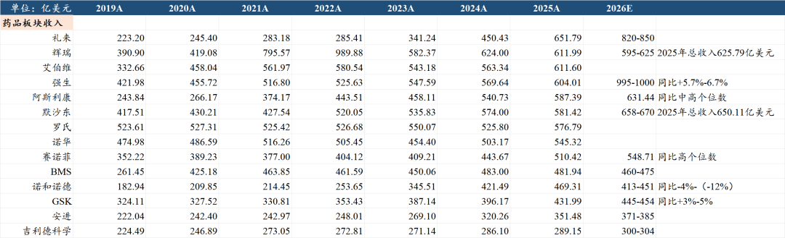
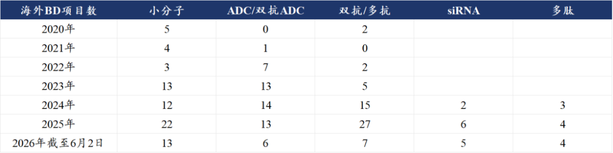
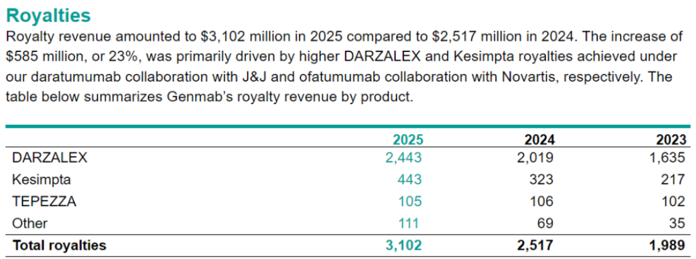
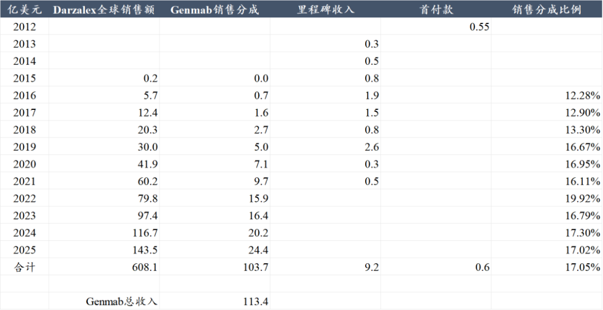
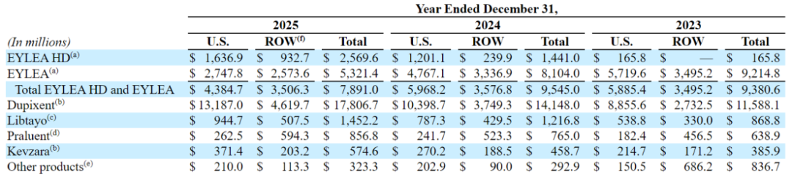

# 中国创新药的天花板

大家好，我是龙哥。

今天的文章讨论一个问题，中国当前创新药BD出海模式下估值的天花板在哪里。另外趁着行业回调之际，我们也来纠正一个行业里一直存在、我们认为与现实有一定偏差的预期，股价反映的是对未来的预期，有些预期根本无法兑现，最终反而会对股价形成负面影响，不如趁着行业回调时及早纠正。

1、中国没有MNC

中国现在没有MNC，未来也极难出现MNC。

不是做了国际化就能叫MNC，不是有几个临床管线数据好就叫MNC，也不是有1-2个大药就叫MNC。

要成为MNC，需要实现对欧美的多个疾病领域资源的寡头垄断，这些资源包括但不限于临床、审批、渠道、政府关系、品牌。

在创新药行业技术迭代如此迅猛的时代，过去几十年里全球top10药企名单几乎没有变化，只是先后排名有所变化→欧洲MNC有所掉队，美国MNC表现更好、位次提升。

不说成为具有垄断资源能力的MNC，即便是成为有全球产品开发、注册、商业化能力的国际化Biopharma也是千难万险。

站在当前时点来看，自21世纪以来真正具备以上能力实现跨越的biopharma也屈指可数——吉利德科学、福泰制药、Argenx、Alnylam、百济神州、Neurocrine、Madrigal。

这些公司里只有吉利德科学真正验证了后续品种持续开发能力，但在抗病毒药物以外的疾病领域吉利德的扩张也不尽如人意。其他公司基本都是只在单一品种上实现全球领先。

历史上靠单一大品种发展起来的公司，要么被MNC并购，其他大多在后续与MNC的竞争中慢慢沉寂。

这其中百济神州算是站在一个比较高的起点上→有中国工程师红利下的高研发效率做基台，有成熟商业化大品种贡献的现金流，有美国MNC安进作为大股东撑腰。

......

市场上一直有种声音，中国创新药BD交易批量的“卖青苗”，导致无法再成长出“下一个百济”或者“下一个MNC”。

如果大家跟踪国内企业的研发管线时间足够久、足够广，就知道所谓的“青苗”迭代速度有多么快，大部分所谓的“青苗”过上个几年可能就变成“杂草”。

中国创新药的BD授权能够在2023-2026年经久不衰的持续做大规模输出，靠的是持续跟随全球创新药技术和靶点的更新迭代，不断发掘推出新分子，而不是捂着手里的“青苗”不舍得卖。

由于中国在全球创新药产业中的参与度提升，已经使得全球创新药的竞争明显趋于加剧，后期卖给MNC可以获得好的价格，早期卖给MNC可以获得更快的海外临床推进。我们认为，“能否成药”的优先级一定是高于“分多少钱”，能在全球市场保证前者的情况下再去追求更高的后者才是明智之选。

2、BD交易向co-co“升级”

中国创新药出海项目累计超过300项，绝大部分BD都是传统的license out模式→首付款+里程碑+个位数到双位数销售分成，越临近商业化的项目在乐观情况下或许能谈到15%-20%的销售分成，大部分项目都是10%左右的销售分成，由于销售分成是不需要承担开发和销售费用的近乎纯利，按照商业化大品种30%-50%的净利率来计算，相当于是大品种20%-30%的价值分配。

全球license out交易的天花板是Genmab。

Genmab核心产品达雷妥尤单抗授权给强生，2025年达雷妥尤单抗全球销售额143.5亿美元，Genmab从中获得了24.4亿美元的销售分成，销售分成比例为17%。另外公司还有自诺华Kesimpta（CD20单抗，用于多发性硬化，25年全球销售44.26亿美元+37.3%）获得的4.43亿美元销售分成，以及自AZ/Horizon的Tepezza（IGF-1R单抗，用于甲状腺眼病，25年全球销售19.03亿美元+2.8%）获得的1.05亿美元销售分成。

Genmab的市值巅峰是2021年曾达到320亿美元总市值，大概2000亿人民币，这是全球创新药license out模式的市值巅峰。

从2012年-2025年间，Genmab合计从强生基于CD38单抗获得的首付款+里程碑+销售分成为113.4亿美元，其中包括103.7亿美元的销售分成，销售分成占产品累计销售额的17%，销售分成占Genmab在CD38总收入的91%。

公司的市值巅峰大概相当于1.6倍的CD38单抗的peak sales，也就是大家所谓的销售峰值的PS估值，那再考虑公司还有其他几个没那么大的品种，实际的CD38单抗给Genmab贡献的巅峰估值可能就是1.2-1.4倍的peak sales，这是全球最顶级大药在高双位数销售分成下给授权方贡献的估值。

......

这些年，国内创新药产业发展成果的确斐然，即便是面对MNC时，议价能力提升已经是明确趋势，企业不再局限在以license out方式做创新药出海，而是愿意选择co-co模式（开发及商业化费用共担、利润共享）的模式，这样授权方可以拿到50%：50%（或者其他约定比例）的全球权益。

中国做co-co交易的鼻祖是传奇生物，Carvykti也是授权给强生做商业化，2025年Carvykti全球销售额为18.87亿美元，传奇生物从中拿到9.45亿美元的销售分成。

co-co交易对企业最大的考验来自资金压力，大药一般要伴随着巨额的临床开发费用，在费用共担的情况下biotech通常难以承担连续多年的巨额费用，因此co-co模式本身需要企业有一定的资金实力——要么有相对坚实的现金流业务基本盘，要么有丰富的融资渠道，当然如果条件允许的话也可以让MNC垫付研发费用——后再以销售分成偿还。

2023年以来，百利天恒的EGFR\*HER3双抗ADC、映恩生物的B7-H3 ADC、信达生物的PD-1\*IL-2等大品种陆续以co-co模式交易，近期恒瑞与BMS的152亿美金BD交易、信达与辉瑞的105亿美金BD交易，也分别约定了可以选择部分重点项目以co-co模式开发。

全球co-co交易的天花板是再生元。

再生元做成功了两款超级大药——眼科的阿柏西普和“自免一哥”度普利尤单抗，度普利尤单抗2025年收入178.07亿美元+25.86%，2026Q1再度实现30%以上增长，赛诺菲与再生元对于度普利尤单抗的权益分配，在美国市场是50:50，美国以外市场是55：45；阿柏西普在2022年达到销售峰值96.5亿美元，2025年销售下滑17%至78.9亿美元，拜耳与再生元对于阿柏西普的权益分配，在美国市场是独属于再生元，美国以外市场是50:50。此外再生元还有一款自研的PD-1单抗在2025年实现14.5亿美元的全球销售额。

2024年再生元的市值巅峰是1200亿美元，大概8000多亿人民币，这是全球创新药co-co模式的市值巅峰，这个天花板相较普通的license out要高的多，但前提还是再生元本身是一家美国本土biopharma，对于中国公司与MNC做co-co合作来说不太可能获得类似“独享美国市场”这样的权益。

我们中性来看这个事情，按照常规license out模式下获得药物20%-30%的价值分配，co-co模式下获得药物50%的价值分配，则co-co模式下的价值分配比例大概要高一倍，意味着市值天花板高一倍→约为4000亿元。

以上分析，仅针对少数在全球市场取得临床开发成功+商业化成功的超级大品种而计算的市值天花板，实际上绝大部分公司都达不到该水平。

好的地方在于，我们也看到全球重磅药物的数量在持续增加，大单品的销售峰值也在持续突破，2020年全球突破百亿美金的大单品只有3个，top100品种合计销售额3545亿美元，而到2025年已经有13个百亿美金大单品，top100品种合计销售额达到5586亿美元，这是全球创新药产业的发展，也是中国创新药产业未来的机遇。

......

近期重点文章：

[创新药目前处于什么估值水平？](https://mp.weixin.qq.com/s?__biz=MzkyMzQ3MDc3Mw==&mid=2247486028&idx=1&sn=099a5b53ae612db9745267c91194028f&scene=21#wechat_redirect)

[政治风险永无止尽，产业发展生生不息](https://mp.weixin.qq.com/s?__biz=MzkyMzQ3MDc3Mw==&mid=2247486018&idx=1&sn=f55e284c0843a5a1d2a6495db5751b3f&scene=21#wechat_redirect)

[哪些医药公司在持续回购和增持](https://mp.weixin.qq.com/s?__biz=MzkyMzQ3MDc3Mw==&mid=2247486007&idx=1&sn=f8e42e381401ab4c293c3a750634ab57&scene=21#wechat_redirect)

[创新药大分化！](https://mp.weixin.qq.com/s?__biz=MzkyMzQ3MDc3Mw==&mid=2247485979&idx=1&sn=bfde6947f700a62ed88e9e7d6b372a4f&scene=21#wechat_redirect)

[高效biopharma，已是参天大树](https://mp.weixin.qq.com/s?__biz=MzkyMzQ3MDc3Mw==&mid=2247485932&idx=1&sn=76a9f391f0da75f550e9c689bb92efe5&scene=21#wechat_redirect)

[创新药出海，面对现实](https://mp.weixin.qq.com/s?__biz=MzkyMzQ3MDc3Mw==&mid=2247485890&idx=1&sn=023f5c09a432630036ac09645c161403&scene=21#wechat_redirect)

[中国创新药出海，新的里程碑](https://mp.weixin.qq.com/s?__biz=MzkyMzQ3MDc3Mw==&mid=2247485797&idx=1&sn=e287b1e60d27ce529415dc7afae6a8ce&scene=21#wechat_redirect)

风险提示：本文仅讨论行业/公司经营情况，投资需综合考虑公司经营、估值、管理层等多方面因素，建议读者审慎参考，本文不作为投资依据，不建议大家根据本文做出投资计划。

<!-- wxmp-comments-begin -->

---

## 留言（26 条，含回复共 46 条）

- **Vincent 韩👀🐲** 👍9 · 2026-06-03 15:32
  龙哥去年好像再说创新药熬过了寒冬，幸亏没转行，今年有没有感觉，这医药行业的一年四季怎么是春冬冬冬[捂脸]
  - ↳ **作者** · 2026-06-03 15:38
    投资本身是全市场横向比较做选择，创新药的基本面不算差，肯定是大幅跑赢大部分行业的，只是横向比较比不过最牛的方向，这在历史上并不少见，相对于2021-2022年的基本面下行、行业杀估值杀业绩的阶段，现在是基本面上行的杀估值。
- **sunnyfok** 👍6 · 2026-06-03 15:44
  创新药不确定性太高了，而且国内的政策和支付环境一言难尽，还是盯着卖铲子的cxo康德和生物比较稳
  - ↳ **作者** · 2026-06-03 15:55
    CXO的确定性必然是高于创新药的，创新药个股的魅力在于成功一个大药的弹性可以非常大，但成功的大药少之又少，对应的是投资难度要大的多，所以也是个选择的问题。
- **雨夜落无声** 👍6 · 2026-06-03 15:45
  创新药当个人吧，哈哈哈，我全部身家在药名和恒瑞，再跌再加，怕个毛
  - ↳ **作者** · 2026-06-03 15:56
    公司都是好公司，但投资我从不建议以身家all in个别公司，甚至不建议all in单个赛道。当然你有你的节奏也不用听我说。
- **小年** 👍5 · 2026-06-03 15:28
  绝望的创新药多头
- **-AIUIA-** 👍3 · 2026-06-03 15:33
  今天跌了三个点，这个板块要比白酒还差了，业绩好有订单也没用
- **王熙** 👍3 · 2026-06-03 15:40
  医药，医疗器械，从国家的层面来看，民生大于利润，特别是咱们社会主义国家，所以我觉得生物医药行业的天花板远远低于AI、机器人、新能源。不知道我理解的是否正确？
  - ↳ **作者** · 2026-06-03 15:43
    还是那句话，如果你纯看国内医药市场，那你可以直接放弃这个行业，不需要看了。只有从全球视角去看这个产业，才有中长期的价值。市场容量比不过你说的这几个行业也是客观存在的，但不代表行业没机会。
  - ↳ **作者** · 2026-06-03 16:51
    其实你没必要来留言的，就你说的话就能看得出来，你连文章都不读，就是为了来反驳而留言的话，也没啥必要，浪费你也浪费我的时间
- **希真书童 (Terence Fang)** 👍3 · 2026-06-03 15:40
  龙哥，您好，作为一名医药从业者和医药二级投资人，以目前视角来看，复盘前几年的医药投资过程，2023-2024年，那个阶段是低估阶段，也是投资最佳时机，2025年中期暴涨，是不是可以认为是估值修复的过程，只是这个过程修复太多，个股涨幅太大。从去年9月到现在，又是一个回调的过程。目前是不是处于脱敏BD的过程？如果现在以归零状态，现在重新投创新药公司，你会给哪些建议？什么类型的或者什么方向的？谢谢
  - ↳ **作者** · 2026-06-03 15:52
    BD出海倒不是脱敏，而是不应该一步到位打满估值，如果一步到位打满估值，那在产品全球临床开发和商业化这个阶段怎么提估值呢？
    虽然每年创新药的驱动逻辑有所差异，但总体从个股层面的投资框架变化并不大：①选择具有全球竞争力（至少进度top3）的品种，②处于II期或者III期验证阶段，估值有跨越式提升的契机，值得搏成功率提升，③商业化超预期、估值显著低估的公司。
    从疾病领域来说，我今年更倾向于自免和代谢领域，肿瘤、尤其IO双抗我今年几乎没参与，大家知道我前两年是非常看好IO双抗的，但今年来对IO双抗的高度内卷还是比较害怕的，尤其是对医药投资人的内卷害怕。
- **执着如呆** 👍3 · 2026-06-03 16:05
  恒瑞基本 A 杀，确实不是单一公司的问题，目前市场好像不太感冒，连康方这么超预期的数据，都没带动创新药，高开低走成惯性了……
- **R9-牛牛** 👍2 · 2026-06-03 15:29
  今天又创新低了，前几天留言说，综合估值和历史行情走弱，至少跌30%，才能介入，看来预计的没错。今天详细对比了港股通创新药和恒生创新药的夏普比率等，做好长期抗战，战略投资的准备
- **Zg** 👍2 · 2026-06-03 15:34
  心态有点崩了
- **HungMan🍓🍒** 👍1 · 2026-06-03 15:27
  创新药这样走真的是不能蛮干啊
- **黄敏** 👍1 · 2026-06-03 15:31
  目前这种极端的市场，创新药还有救吗？
- **田霖** 👍1 · 2026-06-03 15:36
  Asco会议胰腺癌有新进展了，武田买的那个BD不会还没走完三期就被干掉了吧？
  - ↳ **作者** · 2026-06-03 15:40
    你指的是武田买的信达的Claudin18.2-ADC吗，那个本来就是搭售的，也没给多少海外预期，边走边看吧。
- **贾选锋** 👍1 · 2026-06-03 15:40
  龙哥，君实生物怎么看？
  - ↳ **作者** · 2026-06-03 15:47
    君实生物也是我们老生常谈的公司了，公司主要问题还是效率偏低、管线以fast follow为主，这两年的积极变化主要是国内特瑞普利的商业化的确是靠着一些领先大适应症的布局而起来了，至少保证公司基本的现金流。中长期来看需要等待公司拿出一款具有全球竞争力的分子来，目前还看不到，在这波IO双抗BD出海的浪潮里公司也没能实现突破。
- **简单一点** 👍1 · 2026-06-03 15:48
  创新药受集采影响太大了
  - ↳ **作者** · 2026-06-03 15:58
    2025年6月2日关注的，至今满一年，为什么会说这种话。创新药过去2年上涨和下跌的逻辑都和集采基本没任何关系。
- **墨** 👍1 · 2026-06-03 15:54
  龙哥，百济神州跌麻了
  - ↳ **作者** · 2026-06-03 16:02
    百济最近也被动的跟着行业回调，但这个回调幅度相较其他公司真的是比较少的了，百济强大的海外现金流还是支撑了其估值的。
- **十里春风不入秋** 👍1 · 2026-06-03 16:08
  龙哥能心理按摩下嘛，从上次看ps值历史低位后就开始加仓。伴随着一个个利好，创新药etf一次次新低，麻了[流泪]
  - ↳ **作者** · 2026-06-03 16:10
    上周五发文到今天也就3个交易日，市场底部从来不是判断出来的，是市场合力走出来的，我们只能判断一个相对低位的区间，但无法精准判断哪天哪个点位，应对方法就是分散分批的投。
- **谷人** 👍1 · 2026-06-04 00:06
  看龙总的号，说实话一直没敢太说话，一个是因为真的太专业了，一个也是一位特别敬重的大佬推荐的。看龙总这几天的文章回复就能看出最近还是比较焦虑，也许是因为我是空仓所以心态比较好，但是说实话我相信龙总的判断。前段时间还记得龙总提到一个低估的龙头-传奇生物，结果你看昨天不就爆发了嘛，而且是那种打破世界的爆发。我相信龙总的专业。
  龙总的文章还没全部看完，我也有一些问题想问，康方的数据在专业投资者看来是否符合预期，为何这两日这种跌幅，我的意思是这种跌幅往往表示某个方面不符预期。另外，如果我想求稳又想有所攻击性，把药明合联作为入选标的，有没有未考虑到的潜在风险？感恩龙总的回复！
  - ↳ **作者** · 2026-06-04 15:03
    康方相信在国内来说是少有投资人会认为低于预期，这种跌幅，一方面是海外专家的质疑（当然从我们客观分析来说海外专家的质疑基本无道理），另一方面是前期的资金博弈过于复杂，过于过去复杂，最后变成医药资金的利好落地后的多杀多。
    合联如果考虑风险，主要关注两个，一个是公司商业化项目订单的确认，另一个是海外政治风险还是否会有扰动，其他我觉得没太大问题，目前康德、生物、合联三家都在港股回购。
- **sym** · 2026-06-03 15:26
  哥，创新药的股价还有机会么？我想补仓智翔金泰了！
  - ↳ **作者** · 2026-06-03 15:33
    智翔金泰虽然管线多，但基本上都是国内为主的fast follow或者slow follow的管线，也就是纯国内市场、竞争激烈的管线，且并不领先，这类公司需要执行力很强、商业化做的非常出众，才有机会有不错的回报率。
- **金淼** · 2026-06-03 15:29
  谈谈泰格医药
  - ↳ **作者** · 2026-06-03 15:34
    翻翻历史文章评论区，泰格近期回复比较多次了。
- **滚雪球** · 2026-06-03 15:42
  龙总华东是怎么了，还有希望吗
  - ↳ **作者** · 2026-06-03 15:54
    华东之前也回复过，公司还是国内为主，license in为主的模式，在当前国内这样的环境下还是吃亏的，估值承压，但你要说短期这个走势，和行业β还是有关系的，也不是公司自己在跌。华东后续自研管线也还没展示出全球竞争潜力，依然局限在国内市场。
- **胡言胡语hws** · 2026-06-03 15:47
  龙哥，美众议院提议禁止引入中国的BD,然后又说中国收紧生物技术平台出海，这落地的可能性大吗？
  - ↳ **作者** · 2026-06-03 15:57
    见上周的文章。
- **钱景无限🍀** · 2026-06-03 15:50
  龙哥你好请问一下迪哲，这两天跌了20的你个点，真的是跌懵了。医药这块我不懂，迪哲看好吗，谢谢！！
  - ↳ **作者** · 2026-06-03 16:26
    主要原因是science in设计上极高的交叉治疗率超90使得OS无法成为判断疗效的指标，并且报告出来的OS只比一般的化疗多了个把月，OS成熟度极低，量化指标又参考不大，然后市场不好就直接闷棍了。反正现在无所谓大家都一起砸，不好是不好，好也是不好。还是买点正规市场吧，传奇就挺好的[微笑]
- **孙泽华** · 2026-06-03 15:51
  龙哥怎么看最近国内的出口管制政策？这两天创新药下跌，跟这个有关系么？
  - ↳ **作者** · 2026-06-03 16:00
    见上周文章~
- **泪珠吻叶儿** · 2026-06-03 15:54
  龙哥，今年看来是不是出海有突破的器械会更好点，创新药的话感觉今年趋势想反转太难了，反倒是南微 心脉 联影这些器械有企稳迹象，筹码结构也比创新药要更好
  - ↳ **作者** · 2026-06-03 16:02
    器械出海是我们年初确定的今年三大方向之一，也就是创新药、CXO、器械出海。
    不过器械出海的速度没有那么快，不像创新药的爆发力那么强，从今年来看可能还是少数公司的机会，今年也有一些器械出海的文章有提到具体的公司，可以去翻看一下。
- **PBalu 一颗尘埃** · 2026-06-03 16:14
  你还看好创新药的未来吗？ 好多股票调整近10个月了
  - ↳ **作者** · 2026-06-03 16:35
    看不看好不是一段留言一句话说明白的，我给你一个结论没任何意义，毕竟任何一个投资人都避免不了犯错。我的观点都在每篇文章里，是基于数据和逻辑的、有连贯性的，我提供的逻辑你认可就可以保持关注，你认为我的逻辑都是扯淡都不对那就没必要再关注，这不就是这个公众号对各位读者的价值。

<!-- wxmp-comments-end -->
