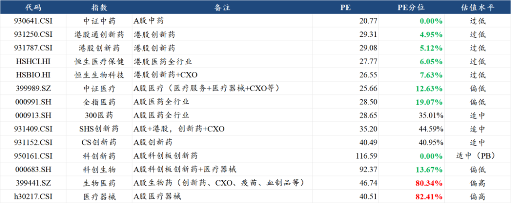
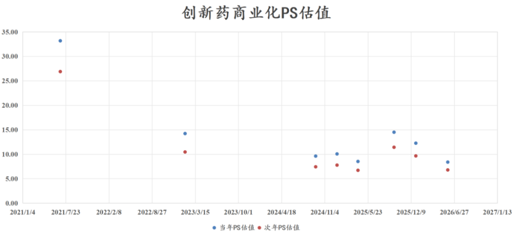
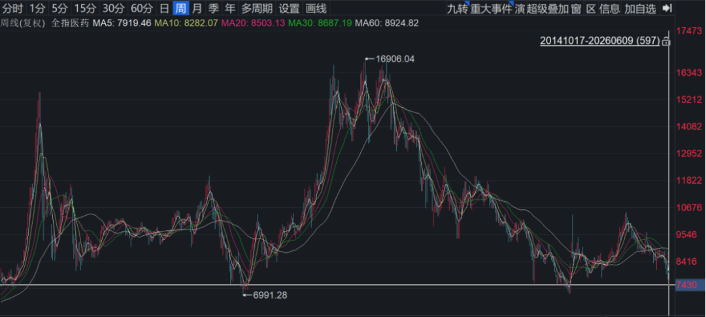
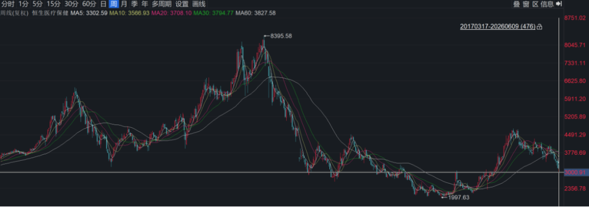
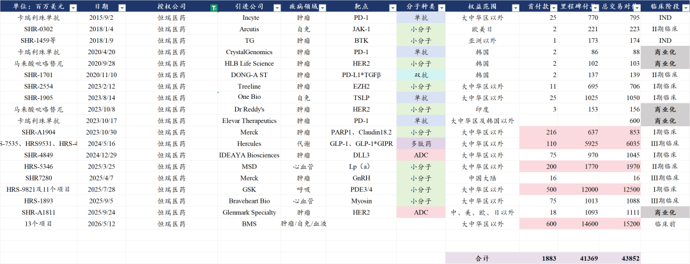
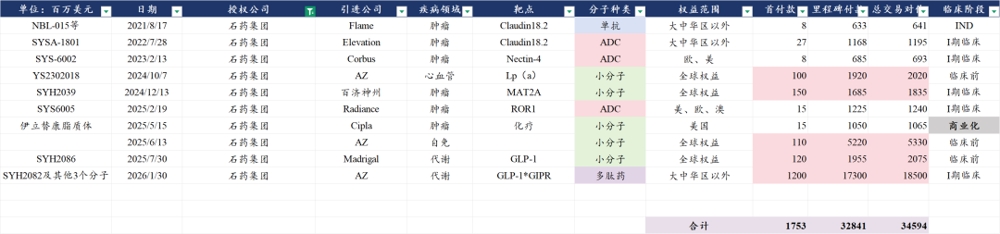
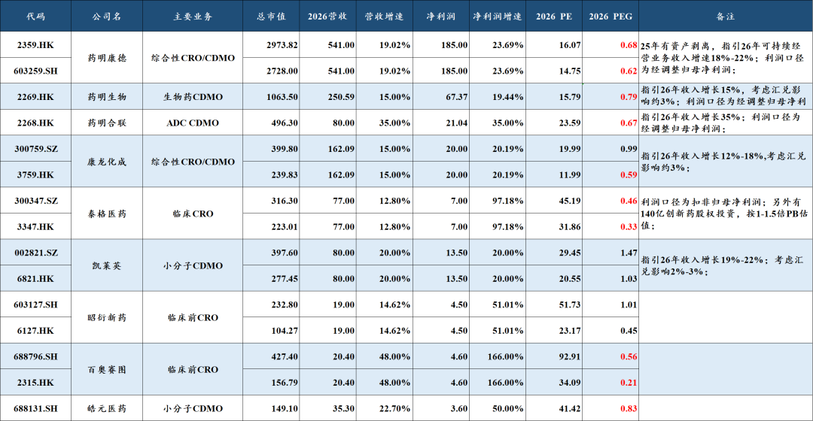
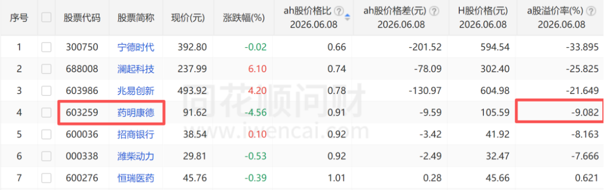
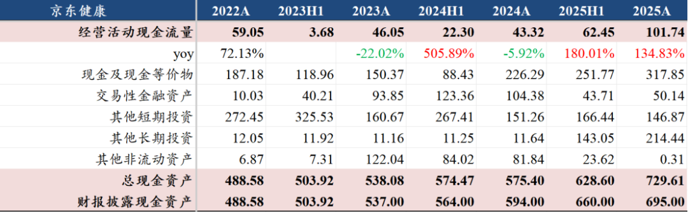
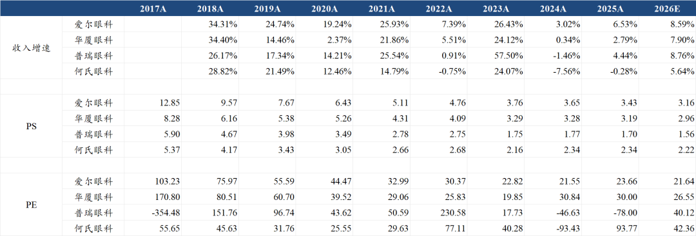

# 医药行业目前处于什么估值水平？

大家好，我是龙哥。

前面一篇文章和大家聊了创新药行业目前的估值水平《[创新药目前处于什么估值水平？](https://mp.weixin.qq.com/s?__biz=MzkyMzQ3MDc3Mw==&mid=2247486028&idx=1&sn=099a5b53ae612db9745267c91194028f&scene=21#wechat_redirect)》，但不少读者问创新药以外行业的估值水平，本文我们来梳理一下行业指数以及行业内各赛道重点公司的估值水平。

1、行业估值

在红色火箭的指数浏览器里可以很方便的看到医药行业指数及各个子行业指数的PE估值和PE估值的历史分位，这里为了方便大家查看，我把指数浏览器里最具代表性的医药指数摘出来放到一个表格里（截至本周二）：

另外在指数浏览器里还可以比较清楚的查看各个指数的财务状况、权重股变化、估值变化、跟踪基金等，在过去其他文章中我们也多次引用，例如有行业代表性的全指医药指数历史估值：

我们就具体行业的估值来看：

①估值处于历史分位10%以下的：A股中药、港股创新药、港股医药全行业、科创板创新药。

创新药行业看PE估值实际上会比较特殊，因为大家知道在过去几年除了传统药企以外，绝大部分的创新药公司都是亏损的，因此过去行业的表观PE估值会相当高。

随着这两年头部创新药公司陆续实现盈利，甚至如百济等公司的利润释放非常迅猛，使得行业开始可以看PE估值，但PE估值的绝对值还是会偏高，而如果你看PE分位数的话，相较历史上亏损时期的PE又会显著的低，因此我们在此前的文章中选用PS估值。

从PS估值角度我们在5月底分析过，行业基本处于24年924之前低位的估值水平附近，而进入6月以来估值又是大幅下行。

中药板块虽然是历史估值的0%分位，但绝对估值仍然有20倍PE，过去品牌中药的估值中枢过高，例如片仔癀长期维持在50-100倍PE估值区间，至今估值业绩双杀却仍有30-40倍PE，同仁堂也是长期维持在35倍-50倍PE估值区间，至今估值业绩双杀却仍有30倍PE。

②估值处于历史分位20%以下的：A股医疗、A股医药全行业、A股科创板医药。

A股的医药全行业、医疗、科创医药都处于历史估值较低水位。残酷的是，A股的全指医药指数已经相较24年924之前的最低点、以及2018年底医药集采至暗时刻的最低点都仅有一步之遥，只差几个点。

相比之下，恒生医疗虽然回撤也很大，也已经回到24年10月的高点附近，但指数相较24年924之前的底部还是有50%的涨幅。

③估值水位仍然较高的行业：A股生物药、医疗器械

生物药里的疫苗、血制品和生长激素等板块，以及医疗器械板块，估值高企倒不是说真的提了估值，主要是杀了业绩，这些板块从业绩到估值是真正的经历了5年的下行期几乎没怎么扑腾的（除了22年底管控放开时）。

期间，医疗器械板块我们看到如迈瑞这样的大白马的崩塌，看到爱博医疗这样的公司用了5年时间辛苦消化完100多倍PE的高估值后却面临业绩趋势转而向下，看到微创机器人这样的公司从濒临破产到出海取得卓著突破，看到九安医疗这样的公司以新冠中赚到的百亿现金投资AI。

在当前时点，我们对医疗器械的关注是逐渐增加的→行业β还未完全转向，但越来越多的器械公司国内负面冲击陆续落地和出海占比逐渐提升。

疫苗板块是值得我们写一篇《医药行业价值毁灭之王》系列文章的板块，当前少量的创新管线还不足以带来行业的转向。

2、公司估值

1）创新药行业

创新药公司大部分还是参照上一篇文章中的PS估值，这里我们只分析几个可以用PE估值的头部pharma。成熟pharma虽然用的是PE估值，但也要注意，PE只能反映当下的业绩，如当前时点的海外估值是很难通过PE来反映的。

①恒瑞医药：恒瑞的利润结构比较复杂，我会从三个角度来看，第一是公司报表端的利润，第二是扣除BD贡献后的利润，第三是扣除BD贡献并加回研发投入资本化后的利润，其中第三个利润是公司真实的药品商业化的利润水平。

以2025年的业绩为例，报表利润77.11亿元，扣除BD后的利润约为48.27亿，扣除17.63亿的研发投入资本化后的利润为30.64亿。

当然，当前的恒瑞的确也不能再全部扣除BD收入来看，公司已经在“某种意义”上实现了长期可持续的BD收入。

因此看恒瑞的真实利润，也可以按照报表利润减去研发投入资本化来计算，这样对应25年真实利润大概是59.48亿。

按照目前市场对26年报表利润的一致预期大概是95亿，对应30倍左右PE，扣掉约20亿的研发投入资本化，报表利润大概75亿，对应恒瑞AH股约40倍PE。

另外，我们老读者也都知道，我已经不止一次呼吁，行业龙头应该带头把研发投入全部费用化，毕竟从MNC到国内其他头部药企、biopharma都少见研发投入资本化，二流公司才喜欢玩这种财技。

②翰森制药：公司目前市值大概1500亿人民币，是恒瑞医药的一半，但翰森的创新药产品收入占药品收入比重预计到26年将超过80%。其利润中也包含不少的BD收入，这个未来会是中国很多创新药公司业绩中比较常见的一块，因此对翰森我们也不再剔除BD收入部分。

目前市场一致预期的26年利润大概是59亿，比我们的预期要高一点，毕竟25年确认的BD收入高达21亿，26年利润端有不错增长的难度是很大的，更可能是持平或略有增长，27年应该可以恢复不错的增长。这样对应26年的估值大概是26-27倍PE。

③中国生物制药：公司目前市值大概750亿人民币，是翰森制药的一半，中国生物制药的创新产品收入占比在26年预计也会达到54%，但中生的创新产品收入并不全是创新药，还包括生物类似药等“公司定义的创新产品”。中生26年的归母净利润预期在35亿-40亿元，对应26年19-21倍PE。

中生另一个目前还偏弱的地方就是还缺少大的BD验证其in house研发能力，当然此前做了一笔将罗戈昔替尼全球权益授予赛诺菲的BD已经是有初步的突破。

④石药集团：公司目前市值700亿人民币，略低于中国生物制药，这两年石药集团在海外BD方面也算是如鱼得水，做了几笔规模庞大的交易，包括今年初一笔震惊市场（后续股价走势也震惊市场）的总包达到185亿美元的交易。

石药在25年的报表利润是38.82亿，25年的授权费收入是17.9亿，扣除该部分后的利润大概是24亿，相较其60亿+的巅峰利润水平已经是跌去60%。26Q1扣除授权费后的利润约为7.4亿，已经明显企稳，成药和原料药业务都已经基本见底。

26年石药的BD收入确认会比较可观，表观估值会比较低，如果按扣除BD的利润计算估值在25倍PE左右，包含BD收入的话则可能会在10倍PE以下了，具体要看公司对BD收入的确认节奏。

2）CXO行业

在190家AH股同步上市的公司中仅有6家公司目前呈现A股比H股折价，其中包括药明康德，目前A股折价约9%。折价最夸张的那家大家都知道，就是宁德时代。此前恒瑞医药也是H股溢价，现在基本已经抹平溢价。

目前药明系三家、康龙都是低于1倍PEG的，CXO行业由于政治风险会长期存在，这两年的绝对估值一直还是存在天花板，市场始终还是给政治风险折价的，这点我们也充分理解。

目前估值来看，26年药明康德A股、H股估值分别约为15倍和16倍PE，药明生物大概16倍PE，药明合联大概24倍PE，当然合联的增速是要显著高不少的。

康龙化成的AH溢价还是比较大，A股估值20倍PE、H股只有12倍PE。凯莱英也存在明显的AH溢价，A股接近30倍PE，市场给了不低的减肥药供应链公司的业绩增长预期，H股则是只有20倍左右。

泰格医药由于此前实控人被立案，近期股价跌幅较大，以上表格中我们对泰格的利润预测是基于扣非口径，泰格医药另外报表上还有140多亿的创新药股权投资，一般会按照PB分部估值，假设按1倍PB扣除后，剩余部分AH股PE估值大概是24倍和11倍。

3）医疗器械、服务及其他

①迈瑞医疗：公司仍然是目前国内第一大市值器械企业，目前约1720亿元，巅峰市值6000亿元。26年迈瑞医疗报表端预计80-85亿利润，对应20-21.5倍PE，迈瑞经历两年的估值业绩双杀，目前的估值也只能说是合理水平。

②联影医疗：目前市值930亿元，接近迈瑞医疗的一半，预计26年报表利润23亿-24亿，目前估值仍在接近40倍PE。市场对其在高壁垒的大型医学影像设备领域的全球竞争力给足了估值溢价，但这也导致联影过去几年也是一直在消化高估值。

③京东健康：目前市值约为1030亿元，2025年报中京东健康披露的现金资产约为700亿元，大致推算到26年报时公司的现金资产大概750亿-800亿元。京东健康在2024年8月港股最极端的时候曾跌到580亿元市值，24年中报公司报表现金资产是564亿元。

不过，对于一家有着高双位数增长和充沛现金流、双寡头垄断格局的互联网医疗公司，还能再跌回净现金的估值吗？公司最新公布了10亿美元的回购计划，相较24年时的“一毛不拔”已经是有所改变。

④爱尔眼科：当前市值760亿元，是今年又一家跌破千亿市值的医药公司，相较巅峰时期的3800亿市值缩水了约80%。在高个位数收入增长预期和低双位数利润增长预期下，爱尔眼科的26年估值在22倍PE左右。

5）中药

云南白药是目前中药公司市值第一，目前880亿元市值，26年估值为16倍PE。

片仔癀目前700亿元市值，26年估值为32倍PE。

华润三九目前400亿元市值，26年估值为11倍PE。

同仁堂目前340亿元市值，26年估值为25倍PE。

......

从以上行业和公司的估值来看，A股的一些细分赛道头部公司哪怕跌了七八十下来，由于业绩增速偏低，也只能说是堪堪合理，结果就是A股医药指数已经临近新低。可比的港股行业指数位置更高（相较24年底部），叠加流动性的因素，仍显得便宜得多。

为什么我们近期要花费很多篇幅来聊估值？实际上在2022-2023年那种行业基本面向下的阶段聊估值实际上是没有意义的，但我们认为行业目前处于基本面向上的阶段，尤其是创新药和CXO板块的基本面上行趋势比较明显，器械出海也开始有趋势，由此使得行业呈现前所未见的行业基本面上行与估值下行的背离。

这种背离从短期来看有多种因素，包括行业比较中有AI科技这样更具比较优势的行业，同时医药行业自身在近一个多月的确是利空不停。但对于估值水位，是可以有一个基本的定性分析。

哪怕是比较优势再差，大不了就是要么科技涨到足够贵，要么其他行业跌到足够低估。资本市场待久了，各个行业都有周期，宏观环境也有周期，投资人要做的是穿越周期。

......

另外，一直提到的指数投资工具红色火箭，近期推出了一个“火伴计划”会员体系，从红色火箭进入ETF会员中心免费登录下成为会员，登录成功后会自动显示自己的等级，会员可以根据等级来每月领取包括滴滴快车代金券、星巴克代金券、京东E卡。

可以点击图片进入“ETF会员"中心查看，或是直接进入“红色火箭”小程序点击“ETF会员"中心，完成实名认证后，就能看到自己的“ETF华夏”的会员身份。

......

近期重点文章：

[中国创新药的天花板](https://mp.weixin.qq.com/s?__biz=MzkyMzQ3MDc3Mw==&mid=2247486043&idx=1&sn=1f878d739f4cd3ae259115356da1c99d&scene=21#wechat_redirect)

[政治风险永无止尽，产业发展生生不息](https://mp.weixin.qq.com/s?__biz=MzkyMzQ3MDc3Mw==&mid=2247486018&idx=1&sn=f55e284c0843a5a1d2a6495db5751b3f&scene=21#wechat_redirect)

[哪些医药公司在持续回购和增持](https://mp.weixin.qq.com/s?__biz=MzkyMzQ3MDc3Mw==&mid=2247486007&idx=1&sn=f8e42e381401ab4c293c3a750634ab57&scene=21#wechat_redirect)

[创新药大分化！](https://mp.weixin.qq.com/s?__biz=MzkyMzQ3MDc3Mw==&mid=2247485979&idx=1&sn=bfde6947f700a62ed88e9e7d6b372a4f&scene=21#wechat_redirect)

[创新药出海，面对现实](https://mp.weixin.qq.com/s?__biz=MzkyMzQ3MDc3Mw==&mid=2247485890&idx=1&sn=023f5c09a432630036ac09645c161403&scene=21#wechat_redirect)

[什么样的项目在出海时能成为超大deal](https://mp.weixin.qq.com/s?__biz=MzkyMzQ3MDc3Mw==&mid=2247485788&idx=1&sn=72df75c9012c898283035bc74a59acdf&scene=21#wechat_redirect)

[医药TOP20变迁，十五年的轮回](https://mp.weixin.qq.com/s?__biz=MzkyMzQ3MDc3Mw==&mid=2247485777&idx=1&sn=ba8657fd715a74ce3c30b09fca229635&scene=21#wechat_redirect)

风险提示：本文仅讨论行业/公司经营情况，投资需综合考虑公司经营、估值、管理层等多方面因素，建议读者审慎参考，本文不作为投资依据，不建议大家根据本文做出投资计划。

<!-- wxmp-comments-begin -->

---

## 留言（14 条，含回复共 28 条）

- **枫林** 👍9 · 2026-06-11 12:47
  现估值处于历史分位10%以下，
  是因为2021年之前医药没“集采”。
  如将“集采”之前的估值修正÷2，
  那么现时现价的历史分位大于在60％左右。
  - ↳ **作者** · 2026-06-11 12:53
    我就寻思啊，集采不是2018年就杀完估值了吗，怎么2021年还没集采呢
- **davi** 👍8 · 2026-06-11 12:42
  龙哥分析非常理性，尤其是基本面上行与估值下行背离，对于重仓创新药心安了很多，我担心的一个风险是一旦美加息，国内牛市走完了，创新药本来就木有涨还会再杀一次估值。
  - ↳ **作者** · 2026-06-11 12:44
    是的，实际上流动性在5月以来已经非常明显的对港股造成冲击。
- **Jack** 👍7 · 2026-06-11 12:37
  龙大之前好像有提到过，器械会在26年底引来业绩拐点。现在是否还持相同观点？
  - ↳ **作者** · 2026-06-11 12:43
    之前说从政策拐点到业绩拐点大概1.5年左右，到股价拐点大概1.5-2年，如果从25年7月算作正式的政策拐点的话，27年大概率是能看到行业基本面的拐点的。不过具体公司来说也要出海取得不错的突破。
- **唐人唐又唐** 👍3 · 2026-06-11 12:43
  我那天和ai聊了下，他给了我一个观点，就拿康德来说，估值是不高，但是那个生物法案就是压制估值的因素。[汗]
  - ↳ **作者** · 2026-06-11 12:45
    这是结论，不是判断，换句话说，如果没有生物安全法案，你觉得康德和生物有可能给你这个估值不，可以看看lonza和三星生物什么估值，更不用说三星生物还搞罢工。
- **文风子211** 👍3 · 2026-06-11 12:47
  历史百分位是不高，但pe依然很高。
- **邱立卓** 👍2 · 2026-06-11 12:37
  最近有开电话会的每个药企基本都是上来就说我们被低估了…挺惨的。
  石药分红好，q1开会老板说今年分红的绝对金额还会增加，有分红比较容易穿过这次的黑暗。
  - ↳ **作者** · 2026-06-11 12:39
    嗯，石药今年收阿斯利康12亿美金首付款，肯定是财大气粗，增加分红也正常
- **种花家一员** 👍2 · 2026-06-11 13:09
  分批买是不是最优策略？
  - ↳ **作者** · 2026-06-11 13:11
    那肯定，底部都是市场交易出来的，我们没有能力判断哪里是绝对底部，只能判断一个明显低估的区间，在区间里去分散投资。
  - ↳ **作者** · 2026-06-11 13:13
    尤其是港股的左侧惯性会非常大，还记得24年底部大量公司跌到净现金的时候，又迎来最后一波加速下跌，但对应的收复失地也是飞快了。
- **Raven轩🧐** 👍1 · 2026-06-11 12:51
  龙哥，微创机器人算低位还是高位，拿着很折磨
  - ↳ **作者** · 2026-06-11 12:54
    微创机器人属于比较吃流动性的，基本面是非常强劲的增长，我前阵子刚参加过他们年度股东大会，近期到6月底前后应该公司也会更新一些经营数据。
- **定风波** 👍1 · 2026-06-11 12:52
  恒瑞最大的问题还是贵了点，增速不够匹配估值，但对比ai还是便宜
  - ↳ **作者** · 2026-06-11 12:56
    市场对于恒瑞，还是长期给了比较高的管线估值的，管线的兑现确实是长周期的。
- **游子** 👍1 · 2026-06-11 12:56
  龙大，像泰格，博腾黑天鹅应该是机会大于风险吧，毕竟已体现，不影响公司正常经营
  - ↳ **作者** · 2026-06-11 12:58
    核心是，如果行业龙头都很便宜，就是都能看到市值空间，那肯定优先确定性，如果黑天鹅导致市值弹性远大于确定性龙头，那也可以选择高弹性。不过这种黑天鹅的出清周期还是客观存在的。
- **田霖** 👍1 · 2026-06-11 15:45
  美联储一旦进入加息周期，港股那边是不管你估值百分位的
  - ↳ **作者** · 2026-06-11 16:03
    估值水位还是有意义的，港股又不是没经历过加息周期，过去加息周期+基本面下行都走过来了。
- **Richard 孙玉叶** · 2026-06-11 12:39
  基本面不重要 关键是宏观！再跌60%都可能
  - ↳ **作者** · 2026-06-11 12:44
    宏观是基本面的一部分，只不过在不同阶段有不同阶段的主要矛盾，任何只看单一因素就能做出判断的投资人都不可能长期有效的在市场上赚钱。
- **luohu** · 2026-06-11 12:56
  龙哥，为啥泰格享受更高的pe估值呢？哪怕去掉投资部分？
  - ↳ **作者** · 2026-06-11 12:57
    他也没享受啊，主要是他主业之前周期下行里业绩被杀太狠了，CDMO实际上价格波动没有那么离谱的，所以你可以认为CRO的利润率现在还是不正常的。
- **墨** · 2026-06-11 13:03
  龙哥，聊聊百济的估值？
  - ↳ **作者** · 2026-06-11 13:06
    百济之前有单独分析他的财报，翻看一下历史文章吧，他估值还是比较容易算明白的

<!-- wxmp-comments-end -->
