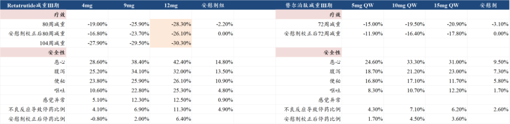

# 那些低估到离谱的医药公司1

大家好，我是龙哥。

最近看到不少港股公司又开始奔着极端和离谱的低估值去了，因此开启一个新的系列文章，本篇及未来会陆续用几篇文章和大家聊一些极度低估的资产，各位读者也可积极提供一些素材。

港股市场嘛大家都知道，由于流动性折价，低估是常见的，极端低估也是常见的，甚至有不少是所谓的“低估值陷阱”。但极端低估如果能对应还不错的业绩增长、较高的股东回报，中长期来看是能创造不错的投资回报率的，甚至港股市场的回报率相当大一块都来自从“极端低估”到“低估或合理”的修复。

我们此前一直说，香港市场相较A股有三类优势资产——高股息、互联网和创新药——投资人在港股可以找到一系列显著优于A股同类标的的资产。

什么样的资产可以说是低估到离谱？核心是现金+可持续的现金流，简单说就是从现金和现金流这种很直观的指标，对于非专业投资人都能一眼看出公司市值已经显著低于“合理估值”，甚至是显著低于“低估估值”。

短期看在手净现金可以作为公司基本估值底部区间，中期看公司合理估值更大程度取决于可持续的现金流和成长性，因此从这两个角度看哪些公司严重低估。

①京东健康：

AI时代所有软件公司都面临不小的考验，过去一年不仅是国内的互联网公司，哪怕是美股的互联网公司，没能站立在AI潮头顶端的公司股价也都是压力山大。

京东健康曾是我们在2024年中挖掘的低估值标的，那时候京东健康的市值跌到580亿人民币，24年中报时的在手净现金564亿，每年的经营现金流40亿+，作为互联网医疗双寡头之一，现金流充沛，24年一季度消化完此前疫情的业绩高基数，恢复到双位数的增长，只有净现金的估值。随后在估值修复+业绩超预期+AI主题三重共振下股价底部至最高涨幅260%+，然后在最近这不到半年的时间里股价又腰斩。

当前京东健康最新市值960亿元，截至2025年报披露的现金资产是695亿元，2025年的经营现金流102亿元，以此推算，京东健康目前的市值大概相当于25年底在手现金+2026-2028年的经营现金流，这是一个互联网医疗双寡头之一+高双位数增长的公司。

过去公司手上现金虽多，但没有任何股东回报的动作，现金估值还要折价，而现在公司启动10亿美金的回购注销，截至6月16日累计回购7.36亿港元，未来还有可能启动分红。

②三生制药：

25年巅峰市值达到900亿港币/820亿人民币，最新市值已经跌到417亿港币/360亿人民币，作为去年创新药领域的明星公司，股价跌去55%，有行业β的因素，也有其自身因素：

一方面，公司在拿到辉瑞90多亿的BD付款后，公司非但没有选择提高股东回报，反而选择配股募资、增加有息负债、分拆曼迪独立上市。另一方面，公司原有主业也开始承压，特比澳的销售从2024年的50亿+掉到2025年的40亿左右，后续承接的管线大多是三生国健那边的自免管线。

截至2025年报，公司在手现金204亿元，有息负债25.5亿元，净现金178亿元，净现金已经占当前市值的一半。

创新药核心资产SSGJ-707目前合作方辉瑞已经启动了一线NSCLC、一线结直肠癌、一线胃癌、一线ES-SCLC、子宫内膜癌等5个全球III期临床。

由于康方/Summit的AK112目前仍未能卖给MNC，在IO双抗的MNC竞争中目前主要就是BMS/BioNTech和辉瑞/三生两家在快速推进，这两家MNC未来必然是要在IO双抗领域切下不小的一块蛋糕的，随着一系列III期临床的推进、以及行业里包括AK112在内披露的数据越来越多，成药性和未来的市场潜力也在逐渐提升。

③联邦制药：

联邦是抗生素原料药/中间体龙头之一，并延伸到仿制药制剂领域，原有主业所属行业属于典型的周期性行业，前两年周期向上的时候赚的也是盆满钵满，23-24年利润都在27亿左右，但周期高点在24年出现，随后25年呈现周期快速下行，一些核心中间体产品像6-APA价格从24年高点320-330元/kg降到180-190元/kg，从而使得25-26年利润端压力较大。

公司传统主业属于典型的重资产行业，固定资产摊销较多，2025年公司利润合计20.86亿（包含创新药BD收入2亿美元），经营现金流达到37.5亿元，固定资产达到116亿，折旧摊销6.5亿元。

公司目前市值在140亿元左右，截止2025年底公司在手现金106亿元，扣除有息负债后的净现金63亿元，公司预计26年全年净利润约6-8亿元，其中包含预计下半年可从诺和诺德获得的2500万美元里程碑收入。主业曾经跌到的历史最低市值大概在50亿左右，那个时候联邦制药账上的净现金大概在24亿左右。

公司创新药核心管线是UBT251，在6月15日和6月17日分别启动了减重和降糖的中国III期临床，也是除了礼来以外全球第二款进入III期临床的GLP-1/GIPR/GCGR三靶点激动剂。礼来此前刚刚披露了三靶点的减重III期临床80周的数据，高剂量组已经接近30%的减重幅度，用药104周后减重幅度超过30%，基本已经达到减重药的天花板水平。

公司预计2028年完成这两项III期临床并申报上市，预计2029年可以获批上市。另一边诺和诺德目前在进行海外减重Ib/IIa期临床、预计27年读出结果，且今年还会开降糖的海外II期临床，诺和诺德最新的指引是2030年递交上市申请，这样推算大概比礼来晚4年时间。仅UBT251一款创新药的国内外价值也将远高于当前市值。

④医脉通：

公司是医药行业线上精准营销的小龙头，在上一轮医药牛市顶峰时上市，IPO融资融了很多钱（40亿元+），上市以来收入从2-3亿增长到2025年的6.4亿，扣除利息收入后的主业利润从3000多万增长到2025年的1.5亿（另外还有1.8亿利息收入），市值从IPO时的200多亿跌到现在的43-44亿元，近三年维持每年2亿左右分红，截至25年底在手现金45.85亿。

短期来看公司受到双重的压力：一方面是AI对这种互联网小平台公司是机遇也是很大的挑战，中长期经营现金流能否持续有不确定性，这是当前估值折价的核心原因，类似上文中的京东健康；另一方面则是26年以来再次强化的医疗反腐，对于药企的销售费用投入的动力也有影响，不过我们也看到，2023年那次更加严重的医疗反腐，带来的是医脉通线上营销收入的加速增长。

......

近期重点文章：

[医药行业目前处于什么估值水平？](https://mp.weixin.qq.com/s?__biz=MzkyMzQ3MDc3Mw==&mid=2247486073&idx=1&sn=fb1abb99722c2a876586c39b6c009e3b&scene=21#wechat_redirect)

[医药公司确实急了](https://mp.weixin.qq.com/s?__biz=MzkyMzQ3MDc3Mw==&mid=2247486049&idx=1&sn=4e0e4daeedb7f67eb9c6effc54c61b21&scene=21#wechat_redirect)

[中国创新药的天花板](https://mp.weixin.qq.com/s?__biz=MzkyMzQ3MDc3Mw==&mid=2247486043&idx=1&sn=1f878d739f4cd3ae259115356da1c99d&scene=21#wechat_redirect)

[创新药目前处于什么估值水平？](https://mp.weixin.qq.com/s?__biz=MzkyMzQ3MDc3Mw==&mid=2247486028&idx=1&sn=099a5b53ae612db9745267c91194028f&scene=21#wechat_redirect)

[哪些医药公司在持续回购和增持](https://mp.weixin.qq.com/s?__biz=MzkyMzQ3MDc3Mw==&mid=2247486007&idx=1&sn=f8e42e381401ab4c293c3a750634ab57&scene=21#wechat_redirect)

[政治风险永无止尽，产业发展生生不息](https://mp.weixin.qq.com/s?__biz=MzkyMzQ3MDc3Mw==&mid=2247486018&idx=1&sn=f55e284c0843a5a1d2a6495db5751b3f&scene=21#wechat_redirect)

[高效biopharma，已是参天大树](https://mp.weixin.qq.com/s?__biz=MzkyMzQ3MDc3Mw==&mid=2247485932&idx=1&sn=76a9f391f0da75f550e9c689bb92efe5&scene=21#wechat_redirect)

风险提示：本文仅讨论行业/公司经营情况，投资需综合考虑公司经营、估值、管理层等多方面因素，建议读者审慎参考，本文不作为投资依据，不建议大家根据本文做出投资计划。

<!-- wxmp-comments-begin -->

---

## 留言（29 条，含回复共 58 条）

- **JMTerry** 👍43 · 2026-06-18 12:10
  今年的行情割裂得有点恶心人
  - ↳ **作者** · 2026-06-18 12:18
    前两天有朋友复盘了互联网泡沫时期，也曾出现过科技对消费医药的严重抽血，行情极度割裂。
- **yaya** 👍26 · 2026-06-18 12:17
  又要马跑得快，又不给马吃草，能有几家医药公司能好得起
  - ↳ **作者** · 2026-06-18 12:27
    马儿现在能自己去海外找草吃，只要别限制马儿奔跑就行了。
- **carrie** 👍8 · 2026-06-18 12:27
  长春高新这种即便核心产品大降价，也不至于快到破净了吧？
  - ↳ **作者** · 2026-06-18 12:42
    国企的净资产你看看就好，核心还是看业务发展和现金流。
- **峥嵘岁月** 👍8 · 2026-06-18 12:40
  a股这边似乎没有便宜到离谱的医药公司？
  - ↳ **作者** · 2026-06-18 12:50
    港股普遍是有流动性折价，所以会给你看到离谱的低估。A股是流动性溢价，自然比较难看到低估到离谱的资产。
- **土土的木** 👍5 · 2026-06-18 12:12
  联影医疗[捂脸][捂脸][捂脸]
  - ↳ **作者** · 2026-06-18 12:17
    联影医疗一直以来的问题还是绝对估值偏高，需要时间消化估值，公司今天又大跌，最新市值对应今年还是有35倍以上的PE。
- **纵有疾风起** 👍5 · 2026-06-18 12:32
  药明康德呢
  - ↳ **作者** · 2026-06-18 12:44
    药明系三家成长性不错，PE也都不高，三家都在积极回购股份。
- **哈巴达依达拉** 👍4 · 2026-06-18 12:14
  三生的问题是临床和依沃西同质化严重，等数据出来，市场早被k药和依沃西瓜分差不多了
  - ↳ **作者** · 2026-06-18 12:22
    ①在成药性上应该并没有太大差距，主要是有辉瑞这个全球顶级MNC推进，很多人还是不理解MNC与biotech/biopharma的差别，我就这么说吧，依靠在临床、zf关系、渠道等方面的资源，MNC甚至可以把不那么好的药推上市卖的不错，更何况707目前来看本身并不是一个差的药。
    ②从全球市场来看，IO未来大概率要成为一个千亿美金的市场，当然这其中的竞争不仅限于PD-1/L1和PD-1/L1*VEGF，还会包括其他靶点的竞争，但总体来说市场容量是够大的，且不说AK112目前在海外临床推进速度没那么快，即便Summit突然特别有钱、临床推的很快，辉瑞、BMS也有能力切下一块蛋糕，不存在什么市场早被瓜分完的问题。
- **sym** 👍4 · 2026-06-18 12:20
  智翔金泰股价长期于发行价之下 我给他翻倍股价
  - ↳ **作者** · 2026-06-18 12:28
    有没有可能是发行价定的不合理，这在科创板并不少见。
- **尘缘** 👍4 · 2026-06-18 12:20
  正打算入手京东健康，最近有个线上药店的规则出来，使得京东健康又连续跌了20%+，准备越跌越买了。
- **曾宏程** 👍3 · 2026-06-18 12:10
  也有像迈瑞这种越跌看着估值也就将将比较合理的[捂脸]
  - ↳ **作者** · 2026-06-18 12:18
    是的，由于这两年的业绩承压，迈瑞估值从25倍左右回落到20倍左右，但股价跌的更多，主要是杀业绩，26年应该能大致看到迈瑞业绩趋于企稳，但仍缺乏弹性。
- **光未竟东方白** 👍3 · 2026-06-18 12:16
  很多板块 牛尾甩，会轮动起来 再翻倍预期（那可能是科技的大四浪调整开启的节点[呲牙]三四季度盯好走势即可，资本市场没有新鲜事/叠加老美降息，或者降息呼声巨大 可能更好）
- **ÉTINCELLE** 👍3 · 2026-06-18 13:31
  龙哥 手术机器人怎么看？
  - ↳ **作者** · 2026-06-18 14:13
    手术机器人我们今年还是比较看好的，作为一个医疗学术界已经高度认可临床价值的领域，真实的美国以外市场的渗透率并不高，国产手术机器人出海还处于一个快速抢市场的阶段，微创机器人大家也看到昨天刚更新了图迈的订单数量，短期没有盈利、在港股被抽流动性的背景下股价承压，还是给买点的。
- **JeFF** 👍2 · 2026-06-18 12:05
  最近关注到百利天恒，老大对他评价咋样，有没有看头[发呆]
  - ↳ **作者** · 2026-06-18 12:08
    百利天恒的核心管线成药已经是没太大问题了，但百利天恒现在接近1000亿的市值中包含了不低的海外估值部分，而BMS在开全球III期的进度上还是稍微慢了点，应该还处于广泛的探索IO联合疗法中，公司的市值要有进一步的抬升，还是要看到BMS快速、大规模开多个适应症的全球大III期的决心。
- **樱桃可可** 👍2 · 2026-06-18 12:07
  老师 我想请问一下为什么我看京东健康的市值是1125亿元呢
  - ↳ **作者** · 2026-06-18 12:09
    你看到的是港币，我是给换算成人民币计价，方便和他财务报表做对比，他财报也都是人民币口径的。
- **A000金茂璞逸缦湖 | 于沛楠👍** 👍2 · 2026-06-18 12:11
  龙大，新诺威的市值和母公司石药集团，差距不大，是母公司低估还是新诺威高估了？
  - ↳ **作者** · 2026-06-18 12:15
    新诺威今年跌了比较多，目前只有330多亿的市值了，和石药差了一倍多，还是有差距的。新诺威那边的资产主要是石药的ADC、生物类似药，以及今年1月给AZ的185亿美元的授权里有部分权益，估值差距一倍以上也是正常的。
- **田霖** 👍2 · 2026-06-18 12:12
  刚看到康方6月3号致股东信中说“个别受立场、既往经验和认知局限的医生所发表的观点，既不符合临床数据客观事实，也不符合普遍临床实践”，应该是说的很尖锐了。康方对自己是很有信心的
  - ↳ **作者** · 2026-06-18 12:13
    那个海外的医生的发言的确是具有很强的立场偏向，观点可参考性并不高，还是那句话，我们要承认国内有些临床试验的确会有点水分，但即便有点水分也不影响H6的确是一个非常成功的验证性III期临床。
- **Sid张** 👍2 · 2026-06-18 12:15
  龙哥觉得康弘药业怎么样，治疗黄斑病变的康柏西普毛利率高市占率高，销售团队优秀，还有一些生物药的临床管线，公司几乎还没负债[抱拳][抱拳]
  - ↳ **作者** · 2026-06-18 12:24
    康弘有67亿现金，没有有息负债，资产负债表很干净，目前180多亿市值。公司的主要问题是：
    ①康柏西普接下来要面临阿柏西普专利到期后的生物类似药的竞争，而康柏西普此前在海外临床中没能达到头对头阿柏西普的非劣。
    ②后续管线承接偏慢，这么多年没有第二个创新药管线承接上来，眼底病的下一代基因疗法也还没开III期，出海也没那么快。
    所以康弘属于比较干净和清晰、但可能要熬时间等后续管线进展的公司。
- **特别稳** 👍2 · 2026-06-18 12:17
  龙哥，皓元医药为啥这么强呢？后续看好吗？
  - ↳ **作者** · 2026-06-18 12:27
    ADC CDMO目前的景气度是维持较高的，皓元也是ADC CDMO新产能增量比较多，但今天的走势未必是因为ADC CDMO吧，或许有些其他逻辑。
- **熊新粮** 👍2 · 2026-06-18 12:26
  兆科眼科也很夸张，市值13亿，账上现金13亿，三个即将获批大品种
  - ↳ **作者** · 2026-06-18 12:31
    市场对于不认可管线的biotech，跌到净现金倒是也常见，主要是因为biotech还在持续烧钱，商业化又不像pharma一样有确定性。实际上2024年大量的biotech跌到净现金以下甚至0.5倍净现金，然后后面管线估值得到认可后股价可以翻几倍到十几倍。
- **张炳强** 👍2 · 2026-06-18 12:31
  龙大 谈谈AI制药领域的晶泰控股啊
  - ↳ **作者** · 2026-06-18 12:43
    AI制药行业的文章在写了，下周如果有空的话会发的。
- **蔡** 👍2 · 2026-06-18 12:37
  龙大，君实生物呢？港股160多亿市值，商业化已经改善，现金流回正，JS212和207进度也算第二梯队吧
  - ↳ **作者** · 2026-06-18 12:51
    只能算是国内第二梯队，问题是国内第二梯队的意义没那么大，海外第二梯队还有些价值。广谱的肿瘤药在海外还是需要MNC的临床开发能力+资金支持。
- **彗心** 👍2 · 2026-06-18 13:14
  龙大，A股哪些医药医疗低估呢
  
  您尽管说就行了，说了也没人买的[呲牙]
  - ↳ **作者** · 2026-06-18 13:16
    哈哈，那不多余说嘛[捂脸][捂脸]
- **阿尔帕ALPA  周** 👍2 · 2026-06-18 13:48
  老师。皓元和合联的业务有竞争关系吗？adc cdmo市场能容下他们俩都好吗？另外，合联的客户以欧美为主吗？皓元的客户类型呢？谢谢
  - ↳ **作者** · 2026-06-18 14:09
    ADC CDMO现在我理解还是处于全球缺产能的阶段，你看合联把国内为数不多的产能——东曜——也给收购了，海外找了很久都没找到合适的并购标的，所以现阶段还不是竞争的问题吧，当然要说竞争，同行业肯定会有客户的重叠。
    客户结构方面，合联25年大概76%的收入来自欧美，15%来自中国区。皓元不只是CDMO，他工具化合物这块收入占比很高，所以拆业务结构的意义不大，但总体皓元的国内客户占比还是更高的。
- **Zg** 👍1 · 2026-06-18 12:22
  市场给皓元这么高的估值和预期，为什么就不能对合联温柔点[流泪]
  - ↳ **作者** · 2026-06-18 12:29
    毕竟港股，极端市场
- **游子** 👍1 · 2026-06-18 12:31
  l龙大，请教诺诚健华现阶段刚刚开始盈利还是高估吧，后期是不是要看商业化进程？
  - ↳ **作者** · 2026-06-18 12:44
    H股的诺诚还是比较低估的，有充沛的现金，国内未来2年陆续增加三四个创新药商业化项目，海外去年今年也会陆续有一些进展。
- **胡言胡语hws** 👍1 · 2026-06-18 12:33
  长春高新跌成这样，金赛的研发管线和进度就这么差吗[发呆]
  - ↳ **作者** · 2026-06-18 12:46
    参照前面4月22号的文章，公司基本面还没见底，早期管线又普遍太早，需要时间。
- **雨泽** 👍1 · 2026-06-18 12:34
  龙哥最近泰格医药是因为回购企稳吗？现价是不是很有性价比
  - ↳ **作者** · 2026-06-18 12:48
    应该是机构该卖的卖差不多了，加上回购的消息给市场信心。不过最近跟踪行业来看，临床CRO的价格恢复还是有点慢，公司口径是下半年业绩大幅修复，我们感觉也不排除会到27年，但总体趋势肯定是向上的。
- **钢铁侠** 👍1 · 2026-06-18 12:42
  微创医疗跟威高股份还有戏么？
  - ↳ **作者** · 2026-06-18 12:53
    参照3月9日的文章
- **顽石不空** 👍1 · 2026-06-18 12:56
  京东健康，这种本质是不是可以当做一种“渠道商”或者“平台”？
  - ↳ **作者** · 2026-06-18 12:57
    天花板和终局就是挤压 大森林 这类？
  - ↳ **作者** · 2026-06-18 12:58
    互联网电商的商业模式不都是这样嘛
  - ↳ **作者** · 2026-06-18 12:59
    连锁药店目前还是比较分散的行业，行业龙头的市占率也只有5%左右，线下药店明显过剩。互联网医疗是寡头行业，行业龙头40%+市占率。

<!-- wxmp-comments-end -->
