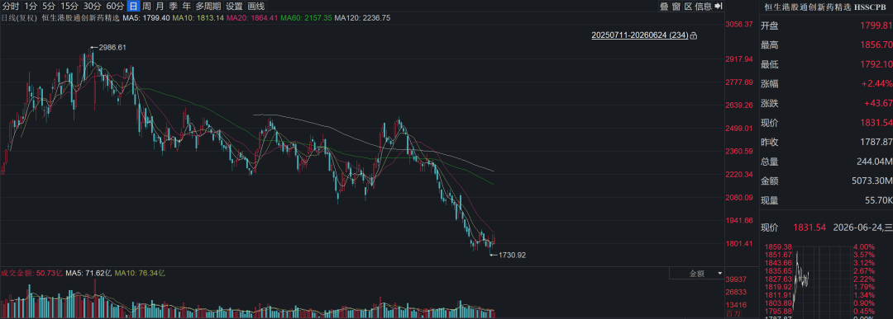
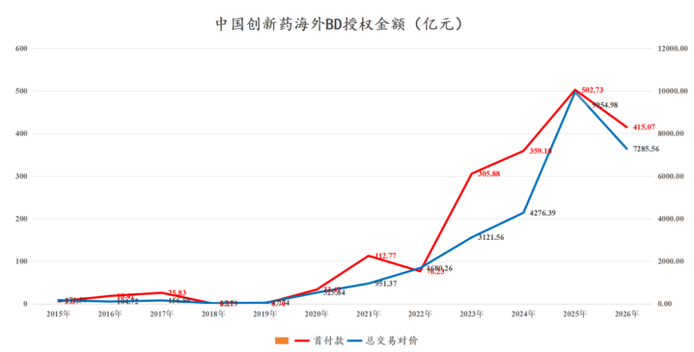
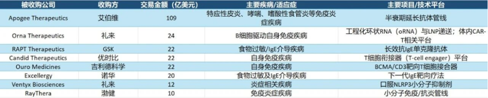
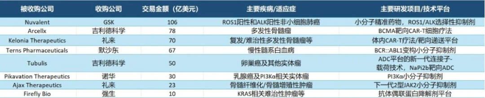
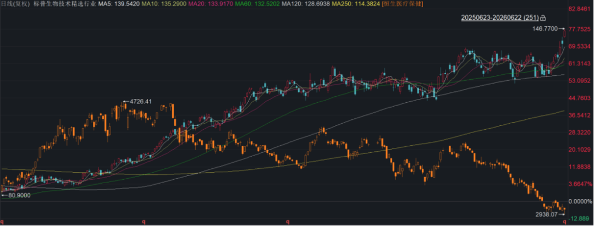
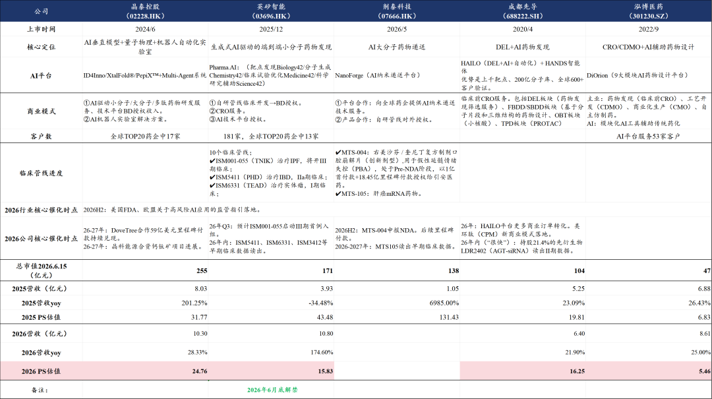
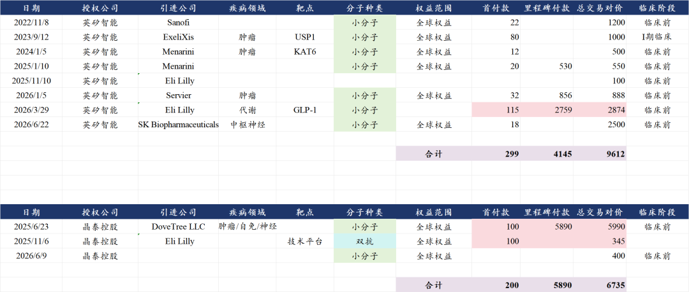
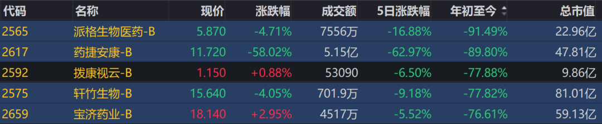
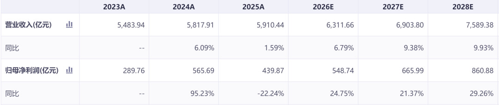
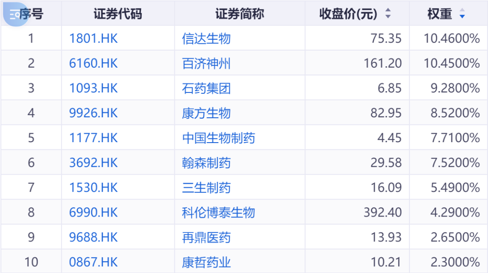

# 创新药行业积极变化已经出现

大家好，我是龙哥。

最近用了多篇文章和大家聊行业估值《[医药行业目前处于什么估值水平？](https://mp.weixin.qq.com/s?__biz=MzkyMzQ3MDc3Mw==&mid=2247486073&idx=1&sn=fb1abb99722c2a876586c39b6c009e3b&scene=21#wechat_redirect)》、《[创新药目前处于什么估值水平？](https://mp.weixin.qq.com/s?__biz=MzkyMzQ3MDc3Mw==&mid=2247486028&idx=1&sn=099a5b53ae612db9745267c91194028f&scene=21#wechat_redirect)》、《[那些低估到离谱的医药公司1](https://mp.weixin.qq.com/s?__biz=MzkyMzQ3MDc3Mw==&mid=2247486079&idx=1&sn=ae549cdde469d1b1319f4b2de70ec226&scene=21#wechat_redirect)》。大家也知道，估值低不是上涨的理由，但估值低与持续上行的、不错的基本面的大幅背离，用常识判断也终将出现修复。

恒生港股通创新药精选指数（HSSCPB）自25年9月见顶后至今累计跌幅接近40%，但其中四分之三的跌幅是在近2个月的短时间内被多个行业/个股利空+极致的科技行情抽血中实现的，情绪面、资金面都已经比较充分的反映在指数表现中。

当前时点对于港股创新药，结合我们此前文章对基本面的解读，以及近期对估值的分析，的确不应该悲观。本文我们再来聊聊我们最近看到的行业出现的一些积极的变化。

1、美国药品降价政策改善

上周CMS发布的文件显示，在原本的《通胀削减法案》（IRA）框架下调整规则，总体政策面趋于温和：

①将每年谈判药品总数固定为20个，远低于法案原定逐年扩容至40个的计划。我们知道美国FDA目前每年批准的创新药数量大概在50-60个，而价格谈判药品数量从40个降到20个，意味着从远期来看，全生命周期中被价格谈判的药品数量占所有药品的比重大概会从70%-80%左右下降至30%-40%左右。

②明确已有仿制药或生物类似药上市的品牌药可退出谈判并恢复自由定价，且相关界定宽松。

③放宽谈判药品资格认定，区分复方药物、扩大孤儿药豁免范围，十余款药物因此豁免或推迟谈判。

对于IRA法案降药价，美股的MNC和biopharma/biotech反应一直都不算很激烈，反倒是国内的投资人担心的比较多→国内过去降药价的政策给投资人留下深刻印象，如今美国IRA法案下的降药价政策也有所改善，不知能否缓解国内投资人的焦虑？

2、MNC大幅扩张资本开支

全市场的投资人都看到了AI产业庞大的资本开支，沿着AI巨头们capex投入的方向挖掘各种投资机会，却未注意到跨国药企们也在进行规模庞大的资本开支。2026年上半年即将结束，半年间，MNC在BD交易和并购方面均下了重注。

BD交易方面，中国创新药海外授权在2026年上半年再创新高，不到半年时间实现了近50笔交易、涉及上百个项目分子，合计首付款59.3亿美元，合计总交易对价1041亿美元，即便是其中只有20%的成功率，也将给中国企业贡献250亿美元以上的首付款+里程碑收入、以及远期数百亿美元的销售分成，这仅是2026年半年的成果。

BD交易还只是开胃菜，根据药明康德发布的行业媒体STAT的统计数据，2026年上半年生物医药领域达成了34起估值在10亿美元以上的生物技术公司收购交易，交易总金额超过1300亿美元，已经超过2025年全年的水平，MNC在面对切实的专利悬崖时呈现非常狂热的capex支出，多笔重磅并购交易甚至都是以我们都不太能理解的高价达成。

这其中就包括首个中国创新药biotech的海外newco公司被收购，此前我们专门撰文分析过《[中国创新药出海，新的里程碑](https://mp.weixin.qq.com/s?__biz=MzkyMzQ3MDc3Mw==&mid=2247485797&idx=1&sn=e287b1e60d27ce529415dc7afae6a8ce&scene=21#wechat_redirect)》，康诺亚直接获得2.57亿美元现金+吉利德这个大型MNC合作方，newco的商业模式从几乎不给估值到重新被市场看到其价值。

这种密集的、规模庞大的并购交易也推升了美股的生物科技指数创下本轮新高（XBI指数VS恒生医疗保健）：

3、AI制药新的里程碑

AI制药领域，武田制药曾花费40亿美元首付款引进AI药物发现的Zasocitinib（TYK2抑制剂），在6月中旬宣布头对头战胜BMS的全球首款TYK2抑制剂Deucravacitinib，有望重塑口服自免药物市场。

AH股的AI制药板块近两个月的回调幅度也非常之大，受整个医药行业β影响较大，但这个阶段我们反而花了一些时间重点梳理相关标的，在明确的产业趋势面前，行业大幅度的回调是很好的研究和选择标的的时间。

国内AI制药领域大致分为两个商业模式，一种是类似晶泰控股、英矽智能、剂泰科技这样的创新药biotech+类CRO的商业模式，另一种是成都先导、泓博医药这样的纯CRO/CDMO的商业模式。

英矽智能与晶泰控股在创新药海外BD方面这两年也是斩获颇丰：

国内AI制药临床管线推进最快的是英矽智能的特发性纤维化新药ISM001-055，在前几天刚刚召开了III期临床试验研究者会议，26年下半年将会正式启动III期临床。

AI制药的产业趋势带来的另一个机会，就是AI赋能下药物开发周期缩短、新分子数量爆发，带来的是对工艺开发和CDMO/CMO生产的需求增长。

4、公司层面的积极变化

除了行业层面，在部分公司层面近期也有一些积极变化，部分国产创新药在一些新技术领域已经呈现快速追赶乃至已经达到国际一线水平：

①恒瑞医药：第二代AR抑制剂瑞维鲁胺在联合ADT一线治疗mHSPC的国际多中心III期临床显示显示mOS为78.8个月VS 44.8个月（HR=0.59），以此数据为基础，恒瑞医药申报了瑞维鲁胺在欧盟EMA的上市申请。

恒瑞医药在创新药出海方面不仅是做BD交易，其自主管线也在脚踏实地的向前推进。

另外恒瑞医药的达尔西利在近期还获批了新的大适应症→HR+/HER2-乳腺癌术后辅助治疗。口服GLP-1也有望成为国产首家申报上市。

②百利天恒：全球首款双抗ADC药物→伦康依隆妥单抗（EGFR\*HER3 ADC）在中国获批上市用于3L+治疗鼻咽癌。另外百利天恒还有全球开发进度第二的DLL3-ADC启动全球III期临床，进度第一的也是中国的分子→再鼎医药的ZL1310。

③科济药业：全球首款实体瘤CAR-T疗法→舒瑞基奥仑赛（Claudin18.2-CART）在中国获批上市用于3L+治疗晚期胃或胃食管结合部腺癌。

④信达生物：全球首款Claudin18.2-ADC→IBI-343在6月初申报上市，信达生物后发先至，不断验证公司超强的执行力和效率。

⑤联邦制药：全球第二款GLP-1/GIPR/GCGR三靶点激动剂UBT251在近期启动减重和降糖两项III期临床，诺和诺德明确2030年实现UBT251全球申报注册的时间表。

5、港股通次新庄股基本跌残

去年9月和今年3月入通的几家次新庄股，基本已经陆续迎来限售股解禁，股价也逐渐回归，药捷安康成功达成“9个月股价跌98%”的成就，从另一个角度来看，这批公司对行业指数的负面影响以及对ETF的拖累都已经进入尾声。

......

最后，以我们此前多次讲到的一个港股创新药指数→恒生港股通创新药精选（HSSCPB）为例，再次明确港股创新药的基本面趋势：

从成份股的机构一致盈利预测来看，行业收入端在2026-2028年呈现高个位数的加速增长，收入端表观的增速没那么快主要是因为其中也包含了个别医药流通企业（成份股权重占比很低，但收入体量很大），从利润端来看增长会更加显著，预计未来3年利润端维持20%-30%的增长。

这是从指数总体层面来看的利润增速，但实际上我们知道指数中各公司的权重差异很大，恒生港股通创新药精选指数的成份股对港股创新药标的的覆盖很全，但同时龙头效应比较显著，如200亿以上市值公司权重占比达到91%，可以很好的反映中大型biopharma的趋势。

权重占比较高的信达生物、百济神州、石药集团、康方生物、科伦博泰等凭借重磅产品的商业化放量、BD收入的大增，未来1-3年的利润增速显然还要快的多，对指数的贡献将会更大。

......

近期重点文章：

[中国创新药的天花板](https://mp.weixin.qq.com/s?__biz=MzkyMzQ3MDc3Mw==&mid=2247486043&idx=1&sn=1f878d739f4cd3ae259115356da1c99d&scene=21#wechat_redirect)

[创新药大分化！](https://mp.weixin.qq.com/s?__biz=MzkyMzQ3MDc3Mw==&mid=2247485979&idx=1&sn=bfde6947f700a62ed88e9e7d6b372a4f&scene=21#wechat_redirect)

[医药行业离谱事件4](https://mp.weixin.qq.com/s?__biz=MzkyMzQ3MDc3Mw==&mid=2247485950&idx=1&sn=de01271f04bee93678fd143383324ad8&scene=21#wechat_redirect)

[当政策面大力支持医药](https://mp.weixin.qq.com/s?__biz=MzkyMzQ3MDc3Mw==&mid=2247485902&idx=1&sn=cf0803ffcdfc7640780f35042213c901&scene=21#wechat_redirect)

风险提示：本文仅讨论行业/公司经营情况，投资需综合考虑公司经营、估值、管理层等多方面因素，建议读者审慎参考，本文不作为投资依据，不建议大家根据本文做出投资计划。

<!-- wxmp-comments-begin -->

---

## 留言（8 条，含回复共 16 条）

- **天行健** 👍6 · 2026-06-24 11:15
  药明涨成了一股清流[破涕为笑]
  - ↳ **作者** · 2026-06-24 11:24
    药明系三家一起大规模回购，还是很能说明问题的。
- **陈星星** 👍5 · 2026-06-24 11:15
  再涨几天才能说积极变化已经出现
  - ↳ **作者** · 2026-06-24 11:19
    变化指的是行业基本面变化，不是涨起来了才说变化，涨起来了谁不知道有积极变化，傻子也知道。
- **DUO** 👍3 · 2026-06-24 11:22
  看好AI制药的话，英矽智能是不是算一个好的公司
  - ↳ **作者** · 2026-06-24 11:25
    英矽智能算是文中表格里的几家公司里比较值得关注的，但是要注意6月底限售股解禁哦。
- **朱益民** 👍3 · 2026-06-24 11:27
  创新药已经被医药集采扼杀
  - ↳ **作者** · 2026-06-24 11:50
    2026年了还有人不知道创新药不集采？
- **尘缘** 👍2 · 2026-06-24 11:20
  龙哥，恒瑞的自主出海不声不响，知道有上市申请了才知道。另外达尔西利的乳腺癌辅助治疗有多大规模呢？
  - ↳ **作者** · 2026-06-24 11:24
    自主出海没那么快，每一个全球3期都要花费大量的时间和资金的。
- **wy-video-record** 👍2 · 2026-06-24 12:35
  请教下龙哥，AI制药导致新药开发周期缩短，新药数量大增，对CDMO这个生产环节确实是利好，但对前端CRO会不会因为新药研发门槛降低，导致竞争格局恶化？
  - ↳ **作者** · 2026-06-24 12:39
    前端CRO实际上总体都要面对AI制药公司的冲击，这是必然要面对的挑战
- **听雨** 👍1 · 2026-06-24 11:20
  这个指数有合适的etf吗龙哥
  - ↳ **作者** · 2026-06-24 11:28
    之前有文章也解读过的，520880港股通创新药ETF
- **鲲鹏** 👍1 · 2026-06-24 11:32
  龙哥，医疗器械出海要到Q4嘛，熬了9个月了[苦涩]
  - ↳ **作者** · 2026-06-24 11:34
    还是那句话，器械出海今年只能看少数的具体公司，我们之前重点讲的那几家，中报都还是值得期待的，全行业的话，还要等。

<!-- wxmp-comments-end -->
