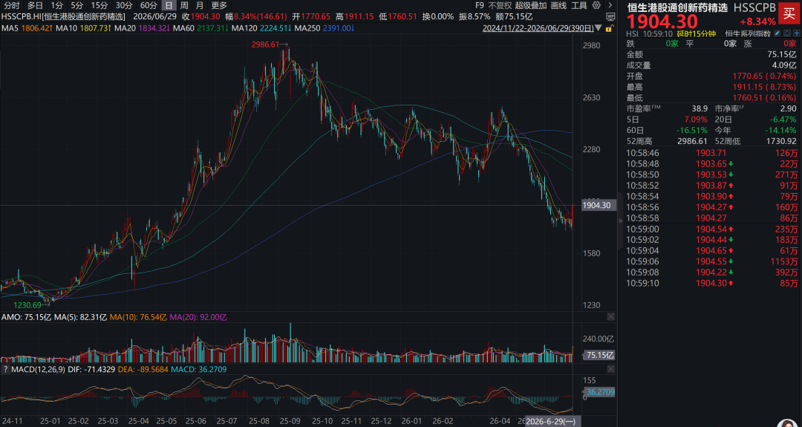
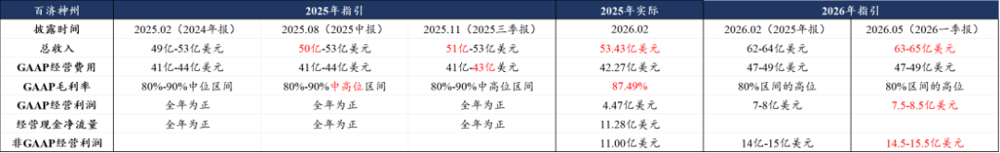
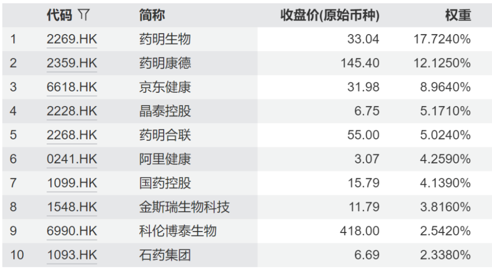

# 哪些医药公司的中报有望超预期

大家好，我是龙哥。

医药今天扬眉吐气，近期文章已经用尽全力为各位读者按摩《[创新药行业积极变化已经出现](https://mp.weixin.qq.com/s?__biz=MzkyMzQ3MDc3Mw==&mid=2247486097&idx=1&sn=25006719f79df6b7f4f69e8d32f1d63b&scene=21#wechat_redirect)》、《[那些低估到离谱的医药公司1](https://mp.weixin.qq.com/s?__biz=MzkyMzQ3MDc3Mw==&mid=2247486079&idx=1&sn=ae549cdde469d1b1319f4b2de70ec226&scene=21#wechat_redirect)》、《[医药行业目前处于什么估值水平？](https://mp.weixin.qq.com/s?__biz=MzkyMzQ3MDc3Mw==&mid=2247486073&idx=1&sn=fb1abb99722c2a876586c39b6c009e3b&scene=21#wechat_redirect)》、《[医药公司确实急了](https://mp.weixin.qq.com/s?__biz=MzkyMzQ3MDc3Mw==&mid=2247486049&idx=1&sn=4e0e4daeedb7f67eb9c6effc54c61b21&scene=21#wechat_redirect)》、《[中国创新药的天花板](https://mp.weixin.qq.com/s?__biz=MzkyMzQ3MDc3Mw==&mid=2247486043&idx=1&sn=1f878d739f4cd3ae259115356da1c99d&scene=21#wechat_redirect)》、《[创新药目前处于什么估值水平？](https://mp.weixin.qq.com/s?__biz=MzkyMzQ3MDc3Mw==&mid=2247486028&idx=1&sn=099a5b53ae612db9745267c91194028f&scene=21#wechat_redirect)》。

来到6月底，即将迎来中报季，我们来梳理一下中报比较值得期待的公司。

1、创新药行业

由于大部分国内销售为主的创新药公司在5-6月都要面临今年更加严苛的医疗反腐的影响，二季度的销售情况目前是看不太清的，我们认为最终销售超预期的公司应该还是会蛮有一些，但只有少数公司是在当前时点来看相对明确的，后续如果有更多公司可以相对清晰的判断，我们也会对这个系列文章做更新。

我们上篇文章《[创新药行业积极变化已经出现](https://mp.weixin.qq.com/s?__biz=MzkyMzQ3MDc3Mw==&mid=2247486097&idx=1&sn=25006719f79df6b7f4f69e8d32f1d63b&scene=21#wechat_redirect)》提到的恒生港股通创新药精选指数（HSSCPB）今天也是气势如虹，涨幅超过8%：

①百济神州

收入端，泽布替尼在Q2的同比增长依然不错，根据国泰海通跟踪的美国BTK抑制剂样本医院销量，泽布美国4月单月同比增长34.85%，5月单月同比增长30.88%，考虑美国以外市场的增速还要更高，泽布替尼总体全球销售额同比增速在Q2可能会在接近30%的水平，环比增长可能在11%-13%，泽布替尼全年的销售预期可能也会更加接近50亿美元。

利润端，Q1归母口径的净利润是16.1亿元，经调整口径的净利润3.75亿美元/25.5亿元，Q2归母口径预计至少在18-22亿，不过公司刚刚公告需要补税4.46亿元，不管是在Q2-Q4哪个季度补，对单季度的利润端都会有一些影响。

不过百济全年来看经调整口径的净利润可能会在17-18亿美元，大概对应115亿-120亿元的利润，4亿多的补税占其全年利润比例已经很小。百济H股的估值目前在2100亿左右，对应经调整净利润的估值已经不到20倍PE。

②康诺亚

康诺亚将在二季度后的7月初披露季度销售数据，预计是类似信达生物每个季度单独披露非审计的、大致的产品销售额的模式，主要是港股公司不强制披露季报，只有半年报和年报，公司为了让各位投资人获得的信息更加透明，因此选择未来会每个季度后公布季度产品销售额。

公司有信心这么做，也是因为其国内核心商业化产品司普奇拜单抗作为国内第二款、国产第一款IL-4Rα，又有独家的过敏性鼻炎适应症，且去年底纳入国家医保，今年的确是卖的非常不错。公司年初对司普奇拜单抗的全年销售指引大概是7.5亿元，中报后也有望看到公司根据中报销售数据而大幅上调全年指引。

2、CXO行业

CXO行业的景气度提升是全行业性的。药明系三家公司分别受益于GLP-1等多肽药、双抗/多抗、ADC三类药物的全球高景气，体量远大于行业内其他公司、却可以维持高于行业的增速，尤其是康德和合联今年的业绩增长都会比较亮眼，药明生物也在受益于产能利用率的持续提升。

凯莱英落后于药明系，但在GLP-1和大分子领域也在奋起直追、新兴业务增速非常快，康龙化成今年在CMO领域也有所突破，CMC业务有望看到明显加速增长。CRO板块总体呈现景气度逐季度复苏，临床CRO和安评的业绩复苏在下半年可能会更显著。

①药明康德

药明康德在CDMO/CMO领域的竞争优势在持续强化，GLP-1领域的全球高景气持续，药明康德是最大赢家，手握礼来两款超级大药的商业化生产订单：

替尔泊肽→全球首款GLP-1/GIPR双靶点激动剂，26Q1全球销售128亿美元，26全年有望超过560亿。

Orforglipron→全球首款口服小分子GLP-1，但减重III期数据不及口服司美，市场销售预期有所下调，但仍是百亿美金潜力的超级爆品。

25年初药明康德指引全年可持续经营业务增长18%-22%至513亿-530亿元，Q1业绩后我们的模型上调至540亿元，GLP-1 CDMO高景气下Q2报表端收入预计维持高双位数增长，中报后收入预期可能进一步上调。

利润端，年报后经调整口径利润预期为160亿，一季报后市场预期大幅上调至180-190亿，我们的模型预测也上调至190亿元，中报后不排除进一步上调。

②药明合联

药明合联是ADC CDMO的全球龙头之一，在全球ADC在研管线中的份额达到40%，也是药明系三家公司中预计26-30年收入增速最快的一家，药明合联给了2026-2030年这5年实现30%-35%复合增速的目标，但是合联目前对应26年的估值也只有不到30倍PE，市场显然还是没有计入合联可以实现该复合增速的预期，核心原因在于合联尚未像药明康德这样证明自己可以获得海外大品种的商业化生产订单，而后续可以期待公司逐渐验证该逻辑。

公司年报后对2026年全年的指引是美元计价全年收入增长35%，我们预计26H1收入增长在35%-40%，不过还要具体看汇兑的影响是否会进一步超预期。上半年并表一个季度的东曜，下半年并表2个季度，下半年并购东曜带来的收入增量也会更显著。

3、医疗器械出海

①微创机器人：

订单：6月21日公告图迈累计商业化订单达到300台，相较3月26日公告商业化订单达到220台，一个季度增加80台商业化订单，4月单月新增12-13台，也既5-6月新增67-68台，平均单月新增超过30台商业化订单，相较Q1的单月新增订单20台左右进一步加速。

装机：6月25日公告图迈累计商业化装机达到200台，相较3月26日公告商业化装机达到140台+，一个季度增加接近60台商业化装机，4月单月装机10台出头，也既5-6月新增商业化装机在45台左右，平均单月新增装机22-23台，相较Q1的单月新增装机10台左右有显著提速。

总体微创机器人全年图迈新增装机（确认收入）原本预期在200台左右，半年度累计新增商业化订单140台左右，半年度累计新增商业化装机100台左右，因此可预期的是在中报后对公司全年的装机和收入预期都会有所上调。如果往2027-2028年去看，微创机器人的PS估值已经将显著低于直觉外科→但收入增速是直觉外科的几倍。

......

CXO和港股医疗领域，也有一个不错的指数→932069港股通医疗主题，这个指数有意思的地方在于：

①成份股高权重给到药明系三家在内的龙头CXO公司。

②覆盖了京东健康等估值已经非常低的互联网医疗龙头《[那些低估到离谱的医药公司1](https://mp.weixin.qq.com/s?__biz=MzkyMzQ3MDc3Mw==&mid=2247486079&idx=1&sn=ae549cdde469d1b1319f4b2de70ec226&scene=21#wechat_redirect)》。

③给港股核心头部创新药biopharma、pharma给了部分权重（石药、科伦博泰、百济、信达、康方、翰森、中生等）。

④覆盖了微创机器人、时代天使等器械出海核心标的。

⑤覆盖了AI制药的港股双龙头之一的晶泰控股。

总体算是目前非常全面的覆盖创新药、CXO、器械出海、AI制药、互联网医疗等景气度不错的多赛道的指数。

......

月底了，开一次赞赏，感谢各位一直以来的陪伴和支持。

风险提示：本文仅讨论行业/公司经营情况，投资需综合考虑公司经营、估值、管理层等多方面因素，建议读者审慎参考，本文不作为投资依据，不建议大家根据本文做出投资计划。

<!-- wxmp-comments-begin -->

---

## 留言（23 条，含回复共 46 条）

- **吕执着** 👍8 · 2026-06-29 12:27
  先赞再看
  - ↳ **作者** · 2026-06-29 12:34
    公众号现在推送方式改变，大家多点点再看或者转发，以及给公众号加个星标，可以更容易刷到我们的精选文章哦。
- **越丛从** 👍4 · 2026-06-29 13:52
  今天终于能说话了。
  回看了龙哥非常多文章，感觉价值观非常正，研究非常深入，非常有定力，下跌期间还在回复很多人明显带有情绪的问题，非常佩服！
  - ↳ **作者** · 2026-06-29 13:54
    毕竟经历过2021-2024年这几年大熊市的，相对那时候的全市场之悲观，读者的情绪宣泄，现在真的不算啥了[破涕为笑]
- **汪容大** 👍3 · 2026-06-29 11:43
  看好药德康明[跳跳][跳跳][跳跳]
  - ↳ **作者** · 2026-06-29 11:49
    李哥的回购非常有代表性
- **喻力** 👍3 · 2026-06-29 11:56
  龙哥，贝达药业这波很强势，是什么原因？
  - ↳ **作者** · 2026-06-29 12:02
    贝达主要是两个逻辑，一个是前阵子GSK刚刚100多亿美金收购了各ALK/ROS1抑制剂，肿瘤中实体瘤慢病化的逻辑在强化，贝达的ALK抑制剂已经实现海外上市。另一个是他合作开发的超长间隔给药的眼底病新药EYP-1901将在今年8月前后读出wAMD的海外III期临床结果，眼底病也是全球诞生百亿美金大药的领域。
- **小侯** 👍2 · 2026-06-29 11:44
  康方生物的有预期吗？夏博士给了今年50亿营收的预期
  - ↳ **作者** · 2026-06-29 11:50
    康方生物，国内收入可以作为市值兜底，海外的临床开发和SMMT的能否再BD/被MNC收购决定康方的上限。但就今年国内商业化来说，确实目前市场没有什么预期。
- **xin** 👍2 · 2026-06-29 11:50
  CMO感觉今年问题不大，就看临床CRO接下来中报和三季报的恢复情况了。
  - ↳ **作者** · 2026-06-29 11:53
    CMO比较早就迎接全球各创新药景气赛道的景气度提升，确实是已经进入放业绩的阶段。临床CRO中报可能还是边际改善，要看到绝对值的大幅改善估计还是要下半年甚至明年。
- **spurs** 👍1 · 2026-06-29 11:36
  药明生物业绩不会超预期吗？
  - ↳ **作者** · 2026-06-29 11:41
    药明生物业绩也会不错，如文中所说，药明生物的产能利用率也在爬坡，只不过他的业绩弹性可能不如康德和合联，胜在估值是很便宜的。
- **听雨** 👍1 · 2026-06-29 11:37
  龙哥，这个指数有etf吗，和上周说的那个520880哪个好？
  - ↳ **作者** · 2026-06-29 11:39
    首先ETF是工具，不存在哪个一定更好，主要看你的投资需求。上周说的520880港股通创新药ETF是比较纯粹的港股创新药ETF，这次说的这个港股通医疗主题指数对应的ETF是159137港股通医疗ETF，优势在文中已经比较详细的介绍。
- **🍄亨Hēng🍄** 👍1 · 2026-06-29 11:59
  祝龙哥大赚，求问凯莱英最近连续大涨且在cxo中涨幅也算前排，是因为业绩方面还是什么其他方面?感谢感谢[抱拳]
  - ↳ **作者** · 2026-06-29 12:05
    凯莱英一季度如果剔除汇率因素后其实是非常不错的，二季度预计也能延续这个趋势，如文中所言，凯莱英虽然落后于康德，也逐渐在高景气赛道里渐入佳境了。
- **乐尽天真h** 👍1 · 2026-06-29 12:58
  龙哥，博腾的官司到底影响如何？
  - ↳ **作者** · 2026-06-29 13:15
    博腾这个影响还是蛮大的，跟着β涨一涨，但现在CDMO行业是结构性的缺产能，在几个景气赛道还不错，传统小分子就那样吧。
- **红旗飘飘** 👍1 · 2026-06-29 13:59
  龙哥，请问康龙化成怎么看，和凯莱英比哪个更好看一眼？
  - ↳ **作者** · 2026-06-29 14:00
    药明系以外，这俩算是都比较好的，凯莱英确定性高一些，康龙估值折价多一些，北京市对康龙的支持也比较强力。
- **小明成长笔记** 👍1 · 2026-06-29 14:23
  海思科的财报也会挺好看吧，今年上半年好几个BD
  - ↳ **作者** · 2026-06-29 14:26
    嗯，加上BD的话那好多公司都会很漂亮了
- **FadeToBlack** · 2026-06-29 11:37
  龙哥，创新药终于站起来了
  - ↳ **作者** · 2026-06-29 11:40
    极端的行情对应极端的波动，市场上专业投资人都知道医药的基本面并不差，在科技以外的行业里算是比较优势不错的，所以一旦被抽流动性的因素有所缓解，也就很容易看到这种大幅度的回补。
- **王宁** · 2026-06-29 11:43
  诺泰生物什么时候能困境反转
  - ↳ **作者** · 2026-06-29 11:49
    摘帽的吧要
- **心宁静与自由** · 2026-06-29 11:45
  重仓微创机器人，时代天使和创新药中[捂脸][捂脸]不知道下半年能吃到肉，港股跌到我没有脾气了，不是我选的公司不行。是港股太拉胯。烦躁
  - ↳ **作者** · 2026-06-29 11:50
    确实，公司都是好公司，港股的β影响太大
- **October Sky** · 2026-06-29 11:50
  关注很久，不知道是不是第一次留言？持有的创新药etf差点就要放弃了，不知道医药板块会不会走出波段趋势行情？谢谢龙哥！
  - ↳ **作者** · 2026-06-29 11:52
    确实是第一次留言。我们判断科技行情还会有比较多的机会，其他板块的波动应该还是会不小，但正如我们过去所言，创新药及产业链以及器械出海至少在基本面趋势上还是非常不错的，积极向上的基本面+快速的杀估值，这种背离必然不可持续。
- **小军** · 2026-06-29 11:58
  A股的器械公司山外山业绩应该也不错，上半年招标继续大幅增长，股价也是一塌糊涂...
  - ↳ **作者** · 2026-06-29 12:03
    纯国内市场的器械都会比较艰难。
- **Mac** · 2026-06-29 11:58
  龙大，创新药终于反弹了一下，就是不知道是不是一日游了……
  - ↳ **作者** · 2026-06-29 12:04
    投资人有能力判断的是底部区间，没能力判断的是精准低点，在当前位置定性分析比精准定量分析重要的多。
- **未全说** · 2026-06-29 12:30
  恒瑞应该也会略超市场预期，现在对恒瑞的预期蛮低的
  - ↳ **作者** · 2026-06-29 12:33
    恒瑞主要是他现在也会调节一下季度放利润的节奏，因为他BD的金额也比较大，会分摊到每年和各个季度去确认收入，平滑一下收入利润。
- **王伟祥** · 2026-06-29 12:44
  手术技术医疗器械的标的还有吗[呲牙]
  - ↳ **作者** · 2026-06-29 12:48
    精锋医疗，也是这两年猛做出海的腔镜手术机器人。
- **凌晨** · 2026-06-29 12:55
  第一次赞赏龙哥[呲牙][呲牙]
  - ↳ **作者** · 2026-06-29 13:16
    感谢感谢，也是新读者，一起努力[握手]
- **阿杨** · 2026-06-29 13:47
  记得龙哥在泰格医药的利空消息出来时点评过，请问泰格的半年报有可能超预期吗？谢谢
  - ↳ **作者** · 2026-06-29 13:52
    中报不太会吧，临床CRO上半年主要还是消化去年前年的低价订单，就是边际有改善吧，应该还不会大幅放业绩，不算投资收益的话。
- **黑红梅方** · 2026-06-29 17:23
  龙哥好，再鼎怎么看，短期是不是还看不到拐点
  - ↳ **作者** · 2026-06-29 17:25
    最近准备单独写一篇再鼎，可以关注下

<!-- wxmp-comments-end -->
