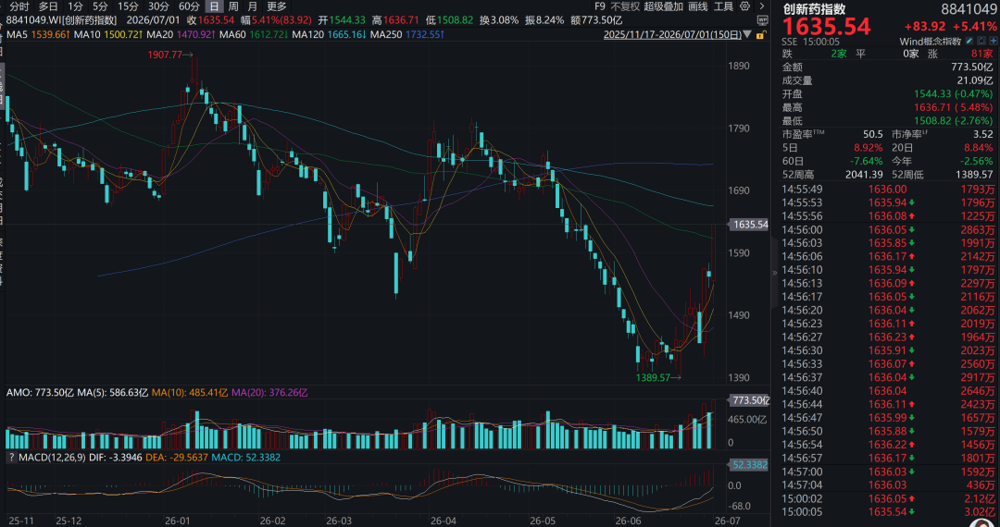
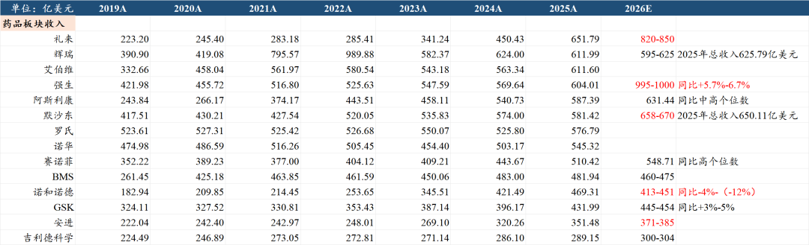
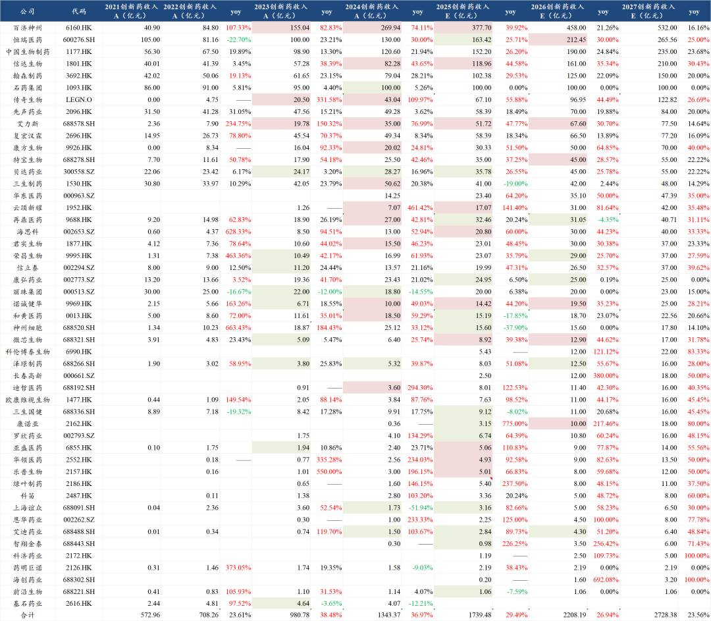
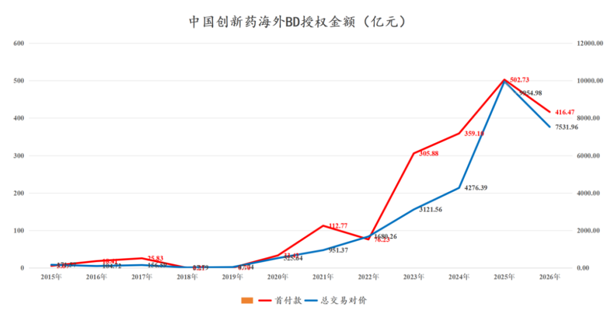
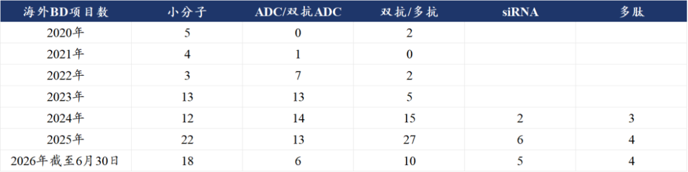
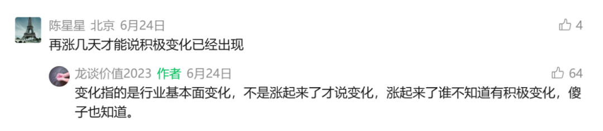

# 医药浴火重生，半年度总结

大家好，我是龙哥。

2026年上半年已经结束。上半年的行情也是颇为让人唏嘘，尤其是5月以来不到2个月的时间行业指数快速下跌→行业内部多个利空+被科技加速抽流动性，使得不少投资人破防。

正如《[做困难且正确的事](https://mp.weixin.qq.com/s?__biz=MzkyMzQ3MDc3Mw==&mid=2247485646&idx=1&sn=a9530ea0f59ac32afc0157a7f29b0442&scene=21#wechat_redirect)》所言，医药行业分享本身就不容易，在极端行情里我们更是要承接广大读者的负面情绪，如今行业已经有否极泰来之势，不枉我们近期坚持以常识分享行业估值和基本面变化。

本文我们想来总结一下医药行业上半年的一些变化，包括一些超预期和不及预期的东西。

另外次篇龙哥还给大家奉上了历史文章分类合集，方便大家分行业、分内容查看我们过去几年分享的文章内容。

1、政策面

上半年对行业有一定影响的政策主要集中在海外，这也是国内创新药械产业全球化逻辑下的必然趋势。国内政策面也有一些变化，边际影响相对可控。

①美国IRA法案：1月份美国CMS公布了第三批药品价格谈判目录，合计纳入15款药物，前三批合计纳入40款药物，这40款药物在2024年的全球销售额高达2020亿美元，其中占美国创新药市场约20%。但在IRA法案逐步推进之下，今年1月份XBI和MNC均连创新高。

到今年6月，CMS最新的文件对于IRA法案框架规则调整，政策面明显趋于温和，收缩谈判药品数量，放松已过专利期药品谈价，扩大豁免价格谈判范围，美国MNC的影响力不容小觑。

②美国限制海外创新药BD和投资：5月底的文章给大家做了详细解读，结果是后续MNC加快大规模BD的节奏，。

③美国临床监管放松：IND和注册临床的审批要求都有望放松，目的是支持美国本土创新药biotech研发和美国本土临床研究，对国内的创新药biotech形成竞争，但对国内头部CDMO公司来说是好事，下游客户推的更快了、项目更多了。

④创新药国内支持政策：创新药行业今年有两个大的政策面利好，一个是在政府工作报告中首次将生物医药与集成电路、航空航天、低空经济并列为“新兴支柱产业”，行业定位拔的很高。另一个是发布了《关于健全药品价格形成机制的若干意见》，首次公开提出“医保外市场定高价”的可能性（药品价格双轨），以及商保在内多元化支付。

⑤BD出海审查：作为5月以来行业快速下跌的原因之一，实际上也是被过度解读，比较明确的是国内开发的新技术平台直接连根卖掉、解散国内团队的这种行为是不被支持的，其他BD交易并没有任何约束。

⑥医疗反腐：今年5.1新政被称为历史最严医疗反腐，短期必然是要冲击所有院内市场，包括相当多的一些创新药的放量也可能会短期受到影响。但我们也一直认为，医疗反腐对于减少劣币驱逐良币、实现创新药在用药结构中的“腾笼换鸟”是具有长期意义的，短期的阵痛并不影响产业中长期逻辑。

2、国内外创新药行业化

海外创新药行业：一季报后礼来、强生、默沙东、诺和诺德、安进等MNC上调了全年业绩指引。

代谢领域礼来的替尔泊肽和诺和诺德的口服司美都实现超预期的放量增长，强生在多发性骨髓瘤领域的竞争优势持续强化，CD38单抗+与传奇合作的BCMA-CART细胞疗法+2款TCE双抗在MM领域所向披靡，艾伯维的IL-23p19利生奇珠单抗继续大幅增长30%，将成为全球第二个突破年度销售额200亿美元的自免超级大药，赛诺菲的IL-4Rα度普利尤单抗一季度也加速增长30%，与艾伯维争夺自免药王之位。

代谢、肿瘤、自免等领域的大药不断创造历史的同时，ADC、TCE和小核酸等新技术领域的商业化品种也在维持高速增长。

国内创新药行业：一季度信达生物、艾力斯、贝达药业、诺诚健华、微芯生物、康诺亚等收入超预期，百济利润超预期，恒瑞、海思科等表现稳定向好。

行业回调之际，很多读者喜欢甩一句“医保没钱”来否定我们的逻辑分析。但大家要知道，就研究医保的时间长度和深度而言，龙哥可以自信的说，全市场的投资人比龙哥的研究和理解更深刻的绝对是少数，这在过去七八年的文章中都可以验证。我们比大部分投资人更早意识到医保资金的压力，也比大部分投资人更早意识到在医药行业里，这两年的政策面全面向创新药倾斜。

我们用真实数据告诉大家行业到底呈现什么样的增长趋势，我们统计的49家创新药公司的创新药收入预计将在2026年突破2200亿元，同比增长约27%，2023-2027年的增速及预期增速分别为38.5%、37%、29%、27%、24%，如果叠加未统计到的部分以及非上市公司，总的创新药商业化销售规模可能已经接近3000亿元，要知道这其中大部分都是国内收入，我们尚未计入规模庞大的BD收入。创新药行业是医药行业中非常明确具有α的细分赛道。

3、创新药械出海

创新药出海已经是老生常谈的东西，上半年累计BD出海首付款416亿元，交易总包超过7500亿元，以此推算全年可能是近千亿首付款+1.5万亿元总包。

就BD数据来说我们不再花太多时间赘述，从2023-2025年的每一年我们都看到“今年BD规模一次性爆发，明年就没那么多了”的观点，现实则是跟随创新药的新技术领域的蓬勃发展，这些年在ADC、TCE/IO等双抗/多抗、小核酸、细胞治疗、多肽药等领域均实现了快速发展和抢占全球BD份额，在小分子和单抗等传统领域也呈现经久不衰，甚至在AI辅助药物发现之下实现“老树开新花”。

今年创新药行业出海还有另一个大的惊喜或者说“破冰”，就是康诺亚的海外Newco公司被MNC高价收购，BCMA\*CD3这个管线原本对于康诺亚来说是市场完全不给估值的分子，没想到不但带来2.57亿美元的现金收入，还增加了一个极其重视该分子的MNC作为合作伙伴。

今年MNC的现金收购规模已经达到1300亿美元，花费重金高价收购了不少我们都理解不了估值的资产，MNC的职业经理人在面临专利悬崖时也没那么从容淡定，而是借助当前大药的充沛现金流快速买入优质资产，未来或许我们还能看到更多Newco项目被并购，并给国内biotech带来类似的意外惊喜。

创新药以外，创新器械领域的出海也在如火如荼，只不过区别在于，器械不像创新药可以直接BD授权出去就能拿到一大笔钱、并取得一个颇具潜力的未来期权，绝大部分的创新器械的出海，产品的放量、医生的教育、品牌的搭建都需要时间，因此海外收入占比的提升是线性的。

当然我们也看到一些赛道，如隐形正畸和手术机器人，海外收入占比以非线性的速度提升，快速的将其从国内器械商业化逻辑变为在竞争尚为蓝海的全球市场攻城略地的出海逻辑，从而拉动报表业绩和估值的提升。

4、创新药研发管线进展

2026年以来国内创新药企业的研发管线也是可圈可点，由于创新药公司和管线数量庞大，我们仅以几个代表性公司为例：

- 恒瑞医药：2026H1有3款新药首次获批上市、4款新药有新适应症获批上市，4款新药首次申报上市，2款新药首个适应症达到III期终点，并新开了5款新药的首个III期临床。近期更是有一款AR抑制剂→瑞维鲁胺凭借全球多中心III期临床优秀数据在欧盟申报上市。
- 百利天恒：全球首创FIC新药EGFR\*HER3双抗ADC在国内获批上市首个适应症，百利天恒在2026年新开了4款ADC药物的10个III期临床，其中包括一项全球III期临床。
- 诺诚健华：2026H1完成了BCL2抑制剂、TKY2/JAK1抑制剂、TYK2-JH2抑制剂等三款新药的首个III期临床患者入组，3个新分子IND，在biopharma中展现了超强的执行力和临床效率。

美国监管部门着急放松IND和注册临床审批，就是已经看到中国创新药企业在国内的临床研究中展现出的超高的强度和效率。

5、前所未见的行业大规模回购

个别公司的回购可能基于多种目的，可能出现在其股价的不同阶段，但行业性的大规模回购非常少见，通常会出现在产业资本普遍性的认为公司显著低估的时候。

6月份以来我们就看到这样的趋势《[医药公司确实急了](https://mp.weixin.qq.com/s?__biz=MzkyMzQ3MDc3Mw==&mid=2247486049&idx=1&sn=4e0e4daeedb7f67eb9c6effc54c61b21&scene=21#wechat_redirect)》，行业几乎每天都有多家公司宣布回购，有些公司的回购规模高达大几亿、十几亿，药明康德这种甚至可以连续几天每天回购2-3亿。

有些读者和我们讨论认为行业估值并未达到足够低估的水平→表观估值会骗人，上市公司这些人精的真金白银的掏钱回购和注销不会骗人。

......

各位投资人的投资框架和理念各不相同，但在极端行情里能基于基本的常识做出判断，是投资人应该具备的基本素养，是我们给大家分享内容的基本前提。

......

近期重点文章：

[哪些医药公司的中报有望超预期](https://mp.weixin.qq.com/s?__biz=MzkyMzQ3MDc3Mw==&mid=2247486106&idx=1&sn=f9b457fd222aa7ee15ea886fbc6fad4f&scene=21#wechat_redirect)

[创新药行业积极变化已经出现](https://mp.weixin.qq.com/s?__biz=MzkyMzQ3MDc3Mw==&mid=2247486097&idx=1&sn=25006719f79df6b7f4f69e8d32f1d63b&scene=21#wechat_redirect)

[医药行业目前处于什么估值水平？](https://mp.weixin.qq.com/s?__biz=MzkyMzQ3MDc3Mw==&mid=2247486073&idx=1&sn=fb1abb99722c2a876586c39b6c009e3b&scene=21#wechat_redirect)

[中国创新药的天花板](https://mp.weixin.qq.com/s?__biz=MzkyMzQ3MDc3Mw==&mid=2247486043&idx=1&sn=1f878d739f4cd3ae259115356da1c99d&scene=21#wechat_redirect)

[创新药目前处于什么估值水平？](https://mp.weixin.qq.com/s?__biz=MzkyMzQ3MDc3Mw==&mid=2247486028&idx=1&sn=099a5b53ae612db9745267c91194028f&scene=21#wechat_redirect)

[创新药大分化！](https://mp.weixin.qq.com/s?__biz=MzkyMzQ3MDc3Mw==&mid=2247485979&idx=1&sn=bfde6947f700a62ed88e9e7d6b372a4f&scene=21#wechat_redirect)

风险提示：本文仅讨论行业/公司经营情况，投资需综合考虑公司经营、估值、管理层等多方面因素，建议读者审慎参考，本文不作为投资依据，不建议大家根据本文做出投资计划。

<!-- wxmp-comments-begin -->

---

## 留言（15 条，含回复共 31 条）

- **汪容大** 👍9 · 2026-07-01 16:44
  [跳跳][跳跳][跳跳]医药也是科技，创新药是科技中的科技
  - ↳ **作者** · 2026-07-01 16:47
    确实是生物科技，但核心在于产业趋势，不是因为他是科技，有产业逻辑、有成长、有业绩、有现金流，科不科技的也不重要。
- **奇奇** 👍8 · 2026-07-01 16:49
  生物技术比芯片更难突破，港股创新药，一直拿着
  - ↳ **作者** · 2026-07-01 16:50
    虽然我看好创新药，但我认为生物技术并不比芯片难突破。
  - ↳ **作者** · 2026-07-01 17:00
    中国创新药海外BD都已经达到全球50%以上的份额了，未来你会看到大量的中国创新药分子在全球商业化的，即使依然不如美国，但真的是不差了。
- **严丹** 👍3 · 2026-07-01 16:51
  不少个股创出了历史或者去年8月以来新高 艾力斯 等
  - ↳ **作者** · 2026-07-01 16:53
    艾力斯、泽璟制药、海思科等A股创新药标杆公司创下历史新高，还有一系列公司已经接近历史新高，市场信心已经在快速修复。
- **逍遥自在的精致角落** 👍2 · 2026-07-01 16:48
  创新药集采企业只能关门大吉
  - ↳ **作者** · 2026-07-01 16:49
    那你可就失望咯，创新药不集采，国家还大力支持，还列为新兴支柱产业，还出海赚几百亿美金，不知道谁关门大吉呀，倒是外资药企怎么越来越重视中国市场了，疯狂追加投资。
- **甘文武** 👍2 · 2026-07-01 16:54
  龙哥，后面还会更新 低估到离谱的医药公司吗?
  - ↳ **作者** · 2026-07-01 16:58
    会啊，说了那会是一个系列。
    对了，那篇文章是龙哥写公众号8年以来第一篇10w+的文章~
- **白立新** 👍2 · 2026-07-01 17:39
  疫苗公司算生物科技吗？为什么比房地产公司跌的还惨
  - ↳ **作者** · 2026-07-01 17:40
    缺少创新，重复研发，恶性竞争，需求减少
- **Tony** 👍1 · 2026-07-01 17:03
  海思科艾力斯历史新高了可怕
  - ↳ **作者** · 2026-07-01 17:05
    是的，中大市值公司涨停创历史新高，很有代表性。
- **阿尔帕ALPA  周** 👍1 · 2026-07-01 21:07
  老师。如果百济神州未来在实体瘤方面没有建树，只是泽布➕索托克拉➕16673这三个药在美国和全球商业化卖药，那么如今百济的市值还有翻倍的空间吗？或者能有多大增长前景？
  - ↳ **作者** · 2026-07-01 21:18
    这三个药大概就是100亿美元多点的峰值，可能300多亿美金的市值，就比较难再翻倍。还是需要实体瘤有一些进展的。
- **竹日门** 👍1 · 2026-07-01 23:54
  不算创新药，医药指数还有希望吗。我想的是普通仿制药能卖海外吗[捂脸]
  - ↳ **作者** · 2026-07-02 08:22
    普通仿制药也能卖海外，还是价值量差的多，海外本身也有仿制药巨头，也比较难颠覆人家，市值天花板偏低。
- **A.L** · 2026-07-01 16:52
  龙哥，今天港股休市，港股通创新药ETF溢价4.5%，明天港股开盘是不是机构会套利抹平溢价
  - ↳ **作者** · 2026-07-01 16:55
    今天ETF肯定是有套利空间的
- **Mac** · 2026-07-01 16:54
  龙大，我国创新药公司加起来的总收入，能闯进全球药企top10不
  - ↳ **作者** · 2026-07-01 16:58
    26年全球药企TOP10应该是BMS，26年收入指引是460亿-475亿美元，大概3000亿人民币多一点，大概相当于2026年中国创新药企业的创新药收入之和。不过从国内药品全行业收入来看大概1.8-1.9万亿人民币。
- **Chester** · 2026-07-01 17:02
  龙大，再来一根阳线，我看医药就火了[呲牙]
  - ↳ **作者** · 2026-07-01 17:03
    三根阳线改变信仰是吧
- **阿飞** · 2026-07-01 17:03
  龙大，科创创新药指数质地你觉得怎么样？
  - ↳ **作者** · 2026-07-01 17:04
    翻翻我次篇的历史文章合集，应该是去年分析过的
- **专坑队友123** · 2026-07-01 17:04
  龙哥，怎么看tiger[皱眉][皱眉]
  - ↳ **作者** · 2026-07-01 17:06
    泰格医药下半年到明年业绩修复，目前实控人被立案导致机构多头会比较谨慎，因此处于一个底部震荡的阶段。
- **快车** · 2026-07-01 17:19
  龙哥，为什么医药都在下面，科伦凭什么能走成这样？它是创新药嘛？
  - ↳ **作者** · 2026-07-01 17:32
    科伦博泰和川宁生物是他的控股子公司。

<!-- wxmp-comments-end -->
