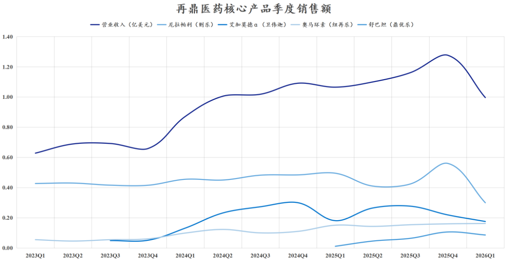

# 再鼎医药，黎明前的黑暗

大家好，我是龙哥。

去年11月，我们写了一篇《[再鼎医药，何至于此](https://mp.weixin.qq.com/s?__biz=MzkyMzQ3MDc3Mw==&mid=2247485150&idx=1&sn=ae1a51db12e8de25b676cd3c9aa3b2c7&scene=21#wechat_redirect)》，大家知道我们很少专门写文章吐槽一家公司，毕竟我们是主观多头投资人，没有机会的公司直接放弃就好了，没必要浪费太多时间，但再鼎属于让人“爱之深、恨之切”的那类公司，始终有看点，又经常在miss。

2026年对于再鼎医药来说依然是艰难的一年，但已经接近黎明的曙光，在这个黎明前最黑暗的时刻，我们来聊聊公司未来可能的变化。

1、国内商业化

2026年国内创新药商业化销售对于再鼎医药来说依然是艰难的一年，2026Q1收入1亿美元同比下降6.48%，这是再鼎医药首次出现单季度的收入同比下滑。

2025年的商业化已经足够拉垮，没想到26年还更差。

其中：

- 尼拉帕利受到竞品奥拉帕利集采的影响而在Q1大幅下滑39%，下半年可能情况会有所好转，但尼拉帕利的天花板已经被锁死。
- 艾加莫德医保谈判双位数降价，销售额连续第二个季度同比下滑，全年预计也难有增长，往27-28年展望，即便能有所增长，但由于低价竞品出现，天花板也已经大大降低。
- 舒巴坦钠-度洛巴坦钠（鼎优乐）今年做地产化。
- TF-ADC刚获批上市，今年不会贡献什么收入。
- KarXT是大家预期较高的大品种，的确是精分领域难得的创新疗法，但国内要到今年底谈医保，公司目前定价较高，进医保前的销售预计也是可以忽略。

公司在商业化方面给人的感觉就是始终有些与中国市场的现实脱节，虽然在选品眼光上非常优秀，在定价和商业化策略上却总是差强人意，或许也与其海外引进品种的成本偏高有关。

基于以上重点品种来看，即便难以给很高的期待，但在预期较低的情况下，27年大概率还是能看到显著改善：

- ①尼拉帕利的拖累在今年消化完。
- ②艾加莫德恢复双位数以上增长。
- ③舒巴坦完成地产化，预计有所放量。
- ④KarXT纳入医保后上量。
- ⑤TF-ADC如能纳入医保也能在27年有所销售。
- ⑥IgA肾病领域潜在BIC疗法Pove将申报上市。

投资人已经对再鼎医药的国内商业化不抱期望，只希望27年不再大幅miss就好。

2、自研管线

2026-2027年，可能是再鼎医药的估值真正从BD引进商业化管线为主向自有管线为主切换的时间。

DLL3 ADC：

公司首个自有管线ZL-1310（zocilurtatug pelitecan），以全球第一的进度启动了2L+复发难治性小细胞肺癌的全球多中心III期临床，该适应症计划在全球入组665例患者，公司预计将在2027年进行III期临床的期中分析、并申报BLA，2028年可以开启全球商业化，很可能成为全球首款商业化的DLL3-ADC，也将成为全球在DLL3靶点上除了安进的塔拉妥单抗（DLL3\*CD3双抗）外的第二款药物。

在一线治疗方面再鼎医药今年增加了一个潜在竞争对手，也就是国内ADC领域头部公司之一的百利天恒，其BL-M14D1（DLL3 ADC）在2024年7月才首次获批临床，2026年6月就跳过二线疗法和海外II期临床，直接启动了联合阿替利珠单抗一线治疗广泛期小细胞肺癌的全球多中心III期临床。

再鼎医药的ZL-1310预计也将在2026年底开出联合阿替利珠单抗一线治疗SCLC的全球III期临床。ZL-1310的给药剂量显著更低，三级以上TRAE只有不到15%，安全性表现显著优于竞品，未来在推进一线疗法时可能会获得优势。

海外现有竞品、也是未来可能的合作方→安进的塔拉妥单抗，在商业化第二年实现6.27亿美元的全球销售额，市场预期26年突破10亿美元、销售峰值25亿美元以上。

再鼎医药在今年4月份分别与DLL3\*CD3双抗的两家MNC公司→安进和勃林格殷格翰（BI）签署了临床合作协议，共同探索DLL3\*CD3双抗联合DLL3 ADC在一二线治疗中的潜力，未来有望推进IO+TCE+ADC的三联疗法，由此，DLL 3 ADC有望在小细胞肺癌的一线、二线、TCE后序贯治疗中分别拿下部分市场，其市场潜力可以对标Talar。

2027年，DLL3 ADC或许将成为再鼎医药估值的绝对支柱，届时国内商业化部分可能就没那么重要了。

IL-13\*IL-31双抗：

ZL-1503是再鼎在皮肤科的一款自有管线布局，2026年1月首次进入临床，2026年预计将会读出临床前以及临床I期的人体数据。

......

截至2026一季度末，再鼎医药在手现金7.6亿美元，净现金5.5亿美元，账上有钱、有现金流、管理层有卓越的选品眼光，对于创新药biotech/biopharma来说就会走出低谷的机会。

再鼎医药DLL3 ADC的国际化，同样可能会有所波折，国内创新药公司真正有管理全球多中心III期临床能力的公司很少，有海外商业化能力的公司更是屈指可数，而一旦取得成功，潜在的回报也会是丰厚的。

......

近期重点文章：

[医药浴火重生，半年度总结](https://mp.weixin.qq.com/s?__biz=MzkyMzQ3MDc3Mw==&mid=2247486118&idx=1&sn=d4059a9da28e951a5227975a6c0aa684&scene=21#wechat_redirect)

[哪些医药公司的中报有望超预期](https://mp.weixin.qq.com/s?__biz=MzkyMzQ3MDc3Mw==&mid=2247486106&idx=1&sn=f9b457fd222aa7ee15ea886fbc6fad4f&scene=21#wechat_redirect)

[中国创新药的天花板](https://mp.weixin.qq.com/s?__biz=MzkyMzQ3MDc3Mw==&mid=2247486043&idx=1&sn=1f878d739f4cd3ae259115356da1c99d&scene=21#wechat_redirect)

[创新药大分化！](https://mp.weixin.qq.com/s?__biz=MzkyMzQ3MDc3Mw==&mid=2247485979&idx=1&sn=bfde6947f700a62ed88e9e7d6b372a4f&scene=21#wechat_redirect)

风险提示：本文仅讨论行业/公司经营情况，投资需综合考虑公司经营、估值、管理层等多方面因素，建议读者审慎参考，本文不作为投资依据，不建议大家根据本文做出投资计划。

<!-- wxmp-comments-begin -->

---

## 留言（14 条，含回复共 28 条）

- **DRAGON** 👍4 · 2026-07-09 11:57
  很少看到你专门写一个公司的，我短期不太看好这个公司[呲牙]
  - ↳ **作者** · 2026-07-09 11:58
    我单独写的公司好像基本就两类，一类是行业主要的龙头公司，关键时间点和关键业绩期会聊一聊，另一类就是关注度比较低、未来可能有些边际变化的公司。
- **老刘杂谈365** 👍3 · 2026-07-09 11:46
  还得黑到什么时候？[流泪]
  - ↳ **作者** · 2026-07-09 11:50
    今年业绩肯定是差到底了，业绩和管线都主要看27年。
- **daibing** 👍2 · 2026-07-09 11:49
  港股看着真是吐了还想吐，哎
  - ↳ **作者** · 2026-07-09 11:51
    其他市场是偶尔给你极端低估的估值，港股是日常给你极端低估的估值。
- **嘒彼小星** 👍2 · 2026-07-09 11:52
  医药医药，医院在倒闭、在缩薪、在控费、在收缴罚款，药的机会在哪？
  - ↳ **作者** · 2026-07-09 11:56
    基本上每篇文章都有这样的评论，要么多读读历史文章，看看我们在讲哪些逻辑，要么就坚定你的看法，不投这个赛道就是了，干嘛让自己那么内耗呢。
  - ↳ **作者** · 2026-07-09 12:36
    悲观者正确，乐观者挣钱，标普生科和恒医目前都是挣钱中
- **但愿如此？** 👍2 · 2026-07-09 12:03
  再鼎总是miss啊？我感觉这管理层要么眼高手低，要么净吹牛皮！虐你千百遍，你还看好？
  - ↳ **作者** · 2026-07-09 12:07
    国内商业化常态化miss是现实，也是我们过去一直说的，但如果真能诞生一个具有全球竞争力的大单品，为什么不值得期待？我只是客观描述公司的基本面和未来可能出现的变化，看不看好要根据公司变化情况，投资从来不是静态的。
- **Bryan** 👍2 · 2026-07-09 13:56
  再鼎陆续持有好几年了，确实经常miss，但估值也经常跌到底，近期跟其他biotech比甚至因为跌的早而没怎么涨跌，就是看ZOCI的催化了，值博率还是可以的，属于可以小仓位玩玩
- **颜君** 👍2 · 2026-07-09 15:25
  三生制药市盈率个位数了，今天医药股涨，它却跌，是利好都兑现了吗？未来还值不值得期待呢？
  - ↳ **作者** · 2026-07-09 15:32
    三生制药的个位数市盈率是反映的去年从辉瑞达到的大额的BD授权首付款，今年不会那么低的表观估值的，并且这个公司现在也不是很适合单看PE，毕竟他相当一部分估值来自707的海外预期。后续肯定还是值得期待的，要看辉瑞的临床推进情况，包括新开更多全球III期，数据读出的话则是时间会比较久。
- **COKE** 👍1 · 2026-07-09 11:50
  能不能谈谈英矽智能
  - ↳ **作者** · 2026-07-09 11:55
    AI制药在前几天的一篇文章里有简单梳理，英矽智能毫无疑问是其中比较优质的一家，公司今年做了4笔海外BD授权，合计首付款达到2.25亿美元，这也是为什么昨晚发的中报预报非常好的原因。
    英矽智能今年还是需要谨慎看待他限售股的解禁，毕竟大股东的持股比例偏低，一级机构减持意愿可能比较强。
- **举止由心** 👍1 · 2026-07-09 12:05
  医药etf更安全吧？
  - ↳ **作者** · 2026-07-09 12:08
    还是那句话，写ETF的时候一些读者问我个股，写个股的时候一些读者问我ETF，没有什么所谓更好更安全的投资标的，你要做的是选择符合你投资目标、选择更适合你的标的。
- **小谭铁匠** 👍1 · 2026-07-09 12:12
  龙哥，血制品行业的至暗时刻，周期底部过去没有？
  - ↳ **作者** · 2026-07-09 12:13
    血制品目前看不到边际变化，纯国内的品种我们普遍不是很有信心。
- **sampleHu** · 2026-07-09 11:53
  目前资金上也是外资加注，港股通占在减少
  - ↳ **作者** · 2026-07-09 11:57
    港股通持股略有下降，总体还是稳定的，持股比例也很高。
- **天野源** · 2026-07-09 11:55
  龙哥，泰格医药的业绩应该在预期里吧？有点怕股价本来这么低了，业绩还要暴击。国内临床CXO的基本面能有更大改善就好了
  - ↳ **作者** · 2026-07-09 11:59
    他只是业绩绝对值还不会像CDMO那么强，季度环比应该是向好的，我感觉业绩不太会暴击了。
- **gaiw** · 2026-07-09 15:03
  他家的dll3 adc能比安进的tce做出更好的os吗？adc是不是不擅长延迟os呀？如果做不出更长的os，是不是就有点尴尬了
  - ↳ **作者** · 2026-07-09 15:07
    现在普遍是认为TCE对OS延长更强，不过在一线治疗里现在也在探索联合用药，也可能会变成IO+TCE+ADC的三联。再就是再鼎的DLL3 ADC对于talar经治患者还有40%的ORR，至少做后线或者序贯应该没太大问题。
- **听雨** · 2026-07-09 15:30
  龙哥，看你低估值那篇文章买了联邦制药，买在最低点了，想问下今年抗生素周期还会下行吗
  - ↳ **作者** · 2026-07-09 15:34
    抗生素原料药中间体在今年初基本见底回升，但现在回升幅度还并不算很大，联邦今年原料药中间体这块的业绩还是会比较一般，公司给的全年的指引是包含BD在内大概6-8亿利润，中报业绩利润会比下半年差。

<!-- wxmp-comments-end -->
