# 医药重回潮头之上

大家好，我是龙哥。

AH医药指数再度大涨，恭喜各位在医药行业坚持至今的读者朋友，前段时间重点提到的恒生港股通创新药精选指数表现突出：

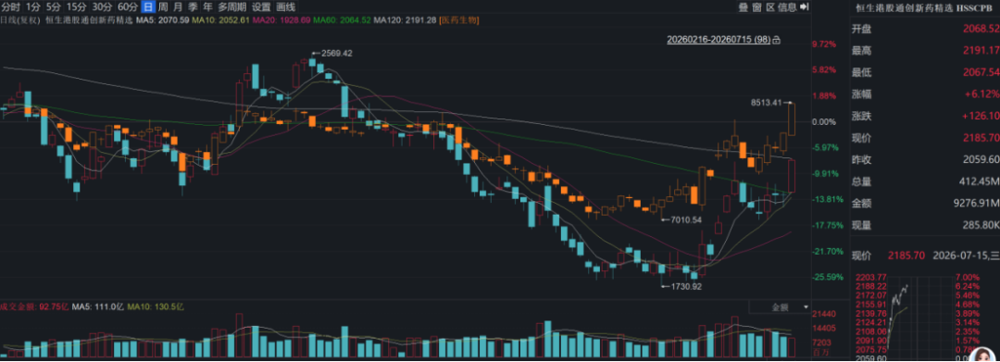

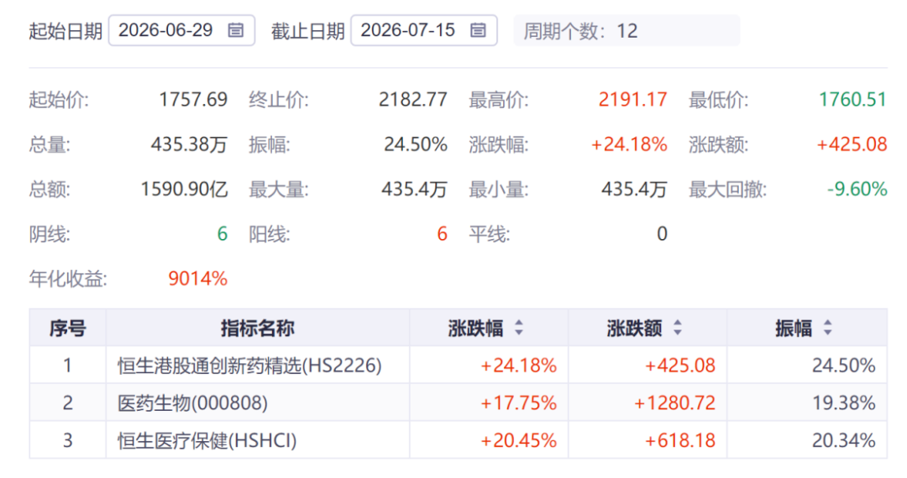

在此前行业下跌时，我们多篇文章把想聊的行业基本面和估值都聊得差不多了：《[医药行业目前处于什么估值水平？](https://mp.weixin.qq.com/s?__biz=MzkyMzQ3MDc3Mw==&mid=2247486073&idx=1&sn=fb1abb99722c2a876586c39b6c009e3b&scene=21#wechat_redirect)》，尊重常识、挖掘医药行业中基本面强劲向上的方向并能与大伙一同坚持，是龙哥和这个账号存在的最大意义。

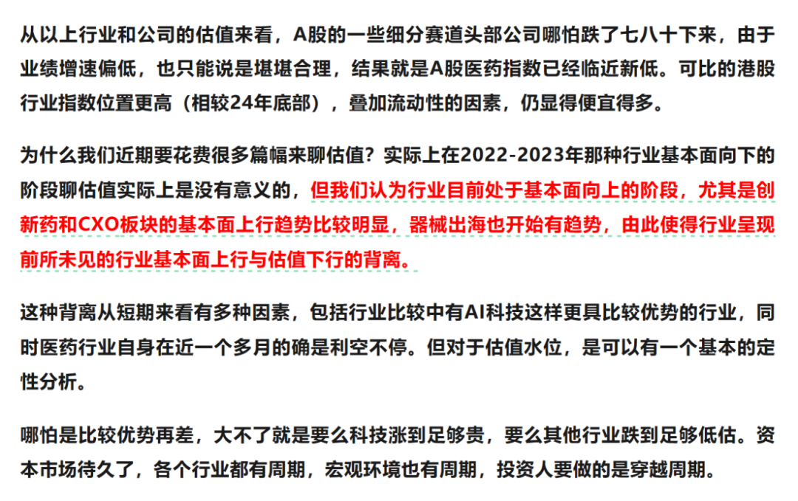

本文我们主要聊两个方面，第一个是从历史表现来看美股科技与生物医药曾有过的严重背离与反转，第二个是再聊聊行业近期的一些变化。

1、科技VS生物医药

偷个懒，借用安捷资管宋老师拉的数据：

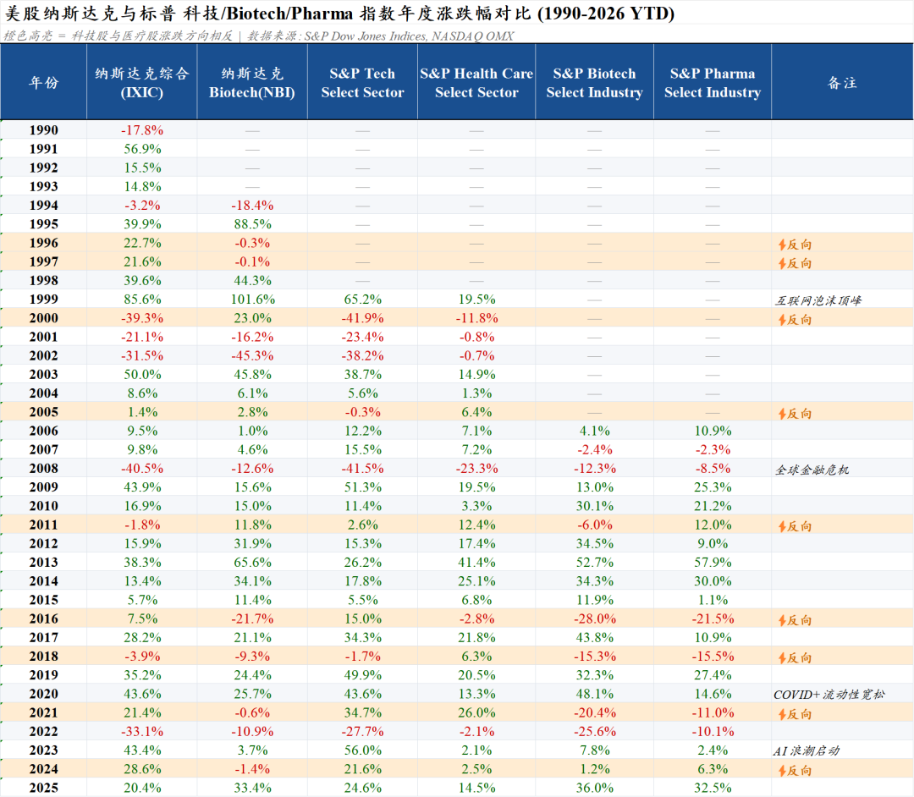

历史数据表现来看，美股的确出现过科技与生物医药的年度反向背离，在一些关键的泡沫破裂历史性时刻，美股生物医药展现了极强的防御属性。

最典型的1996-2000年的5年间有3年都出现了严重反向背离，1996-1997年连续两年生物科技大幅跑输纳斯达克综合指数，在互联网泡沫破裂后的2000年，纳斯达克综合指数下跌39%，而纳斯达克生物科技指数反而逆势大涨23%。

2008年金融危机时，纳斯达克综合指数全年暴跌40.5%，生物科技指数则是仅下跌12.6%，防御属性拉满。

在上一轮美国加息周期的2022年，纳斯达克综合指数年度下跌33.1%，生物科技由于2021年提前下跌，在2022年仅下跌10.9%，依然是防御属性较强。

我们不在此做出对AI科技行情所处阶段的判断，从历史表现来看，美股生物科技的确出现过在科技大行情中被抽血、在科技行情告以段落后跑出显著超额收益的情况，不过由于数据量偏少，也只能做大致参考。

2、CXO全面兑现业绩

药明康德、凯莱英等在GLP-1减重药主线上的CDMO龙头，业绩高增长的确定性自然不必多言，目前CXO行业已经从少数景气赛道龙头CDMO的业绩爆发，转向一二三线公司全面的业绩兑现。

康龙化成周一晚公布中报业绩预报，2026Q2收入同比增长约19.38%（中位数计算），相较Q1的15.48%有所加速，也要高于公司指引的全年12%-18%的收入增长；Q2经调整归母净利润4.97亿元同比+21.52%，相较Q1的16.24%也有所加速。更重要的是其2026年上半年新签订单同比增长超过30%，其中小分子CDMO新签订单同比增长50%。

昭衍新药昨晚公布中报业绩预报，2026Q2单季度生物资产公允价值变动贡献利润4.57亿-5.31亿元，而Q1生物资产盈利2.46亿元，猴子涨价领先于实验室服务的业绩反映在公司报表中。前文讲到的康龙化成也有规模不小的猴场，只不过康龙在财务处理上并未将猴子涨价计入当期利润，也就是康龙化成的表观利润实际上未计入猴子涨价的贡献。

天道好轮回，医药投资人开始教育市场：

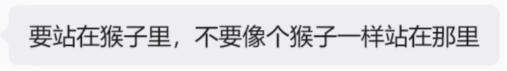

3、创新药出海BD交易深化

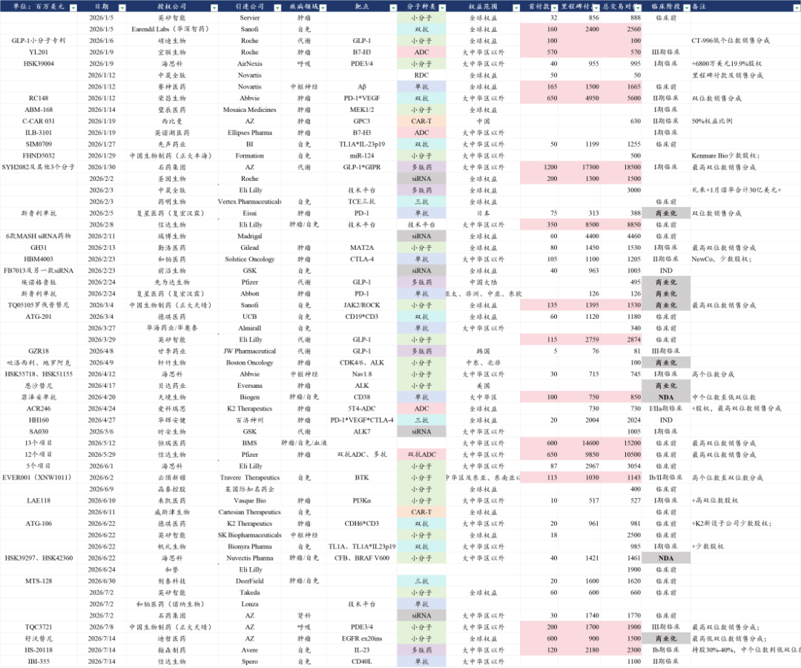

2026年以来，我们统计的57笔创新药海外BD交易，合计达成70亿美元首付款、1168亿美元总交易对价，相当于接近500亿元首付款、接近8000亿元总交易对价。

其他行业的投资人可能很难想象我们医药投资人看到炬光科技签署一个1300万美元技术授权时股价能20cm的感受：

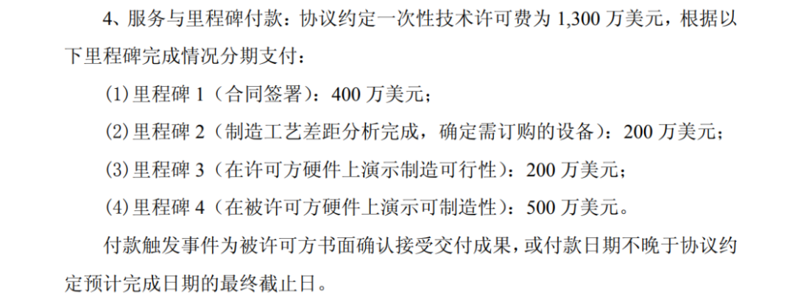

在这些金额巨大的行业总量数据以外，我们还看到一些特别的变化：

①欧洲药企在中国做BD交易愈发狂热：

自中国引进创新药项目数最多的TOP5的MNC有4家都是欧洲顶级MNC→阿斯利康、诺华、罗氏、GSK，还有一家美国MNC是在减肥药上赚到超级丰厚利润、财大气粗的礼来。

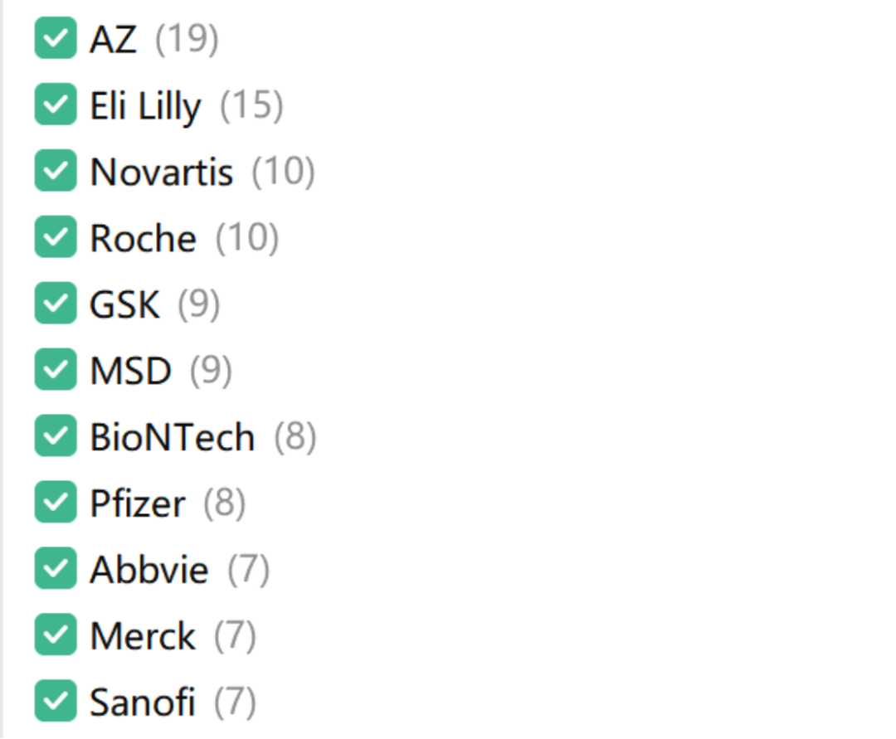

近年欧洲MNC中排名提升最明显的阿斯利康，同时也是MNC里在中国区收入规模最大、占比最高的一家，不论zz因素有多大程度的影响，AZ目前展示出来的就是已经对中国创新药完全“上头”，从2023年开始全面投入中国创新药的怀抱，累计与中国公司签署了接近500亿美元的BD交易，其中首付款已经付了超过40亿美元，且陆续支付一些里程碑付款。阿斯利康在2023年自康诺亚引进的Claudin18.2-ADC预计也将在26年三季度读出首个全球III期临床结果。

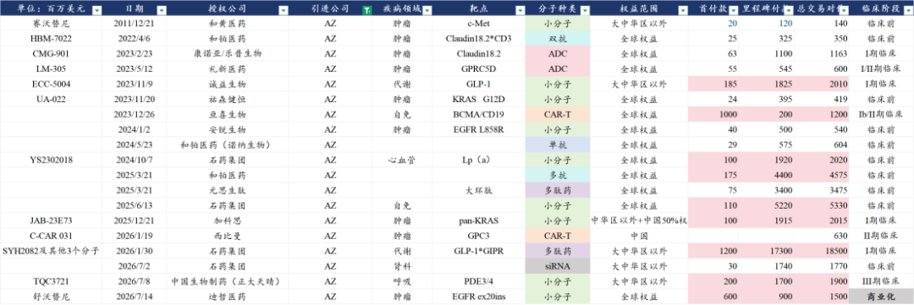

美国有强大的生物科技产业链，叠加美国顶级MNC、美国超强支付能力的市场，可以实现“内循环”，但是欧洲药企面对的是欧洲本土市场与美国市场的规模在拉开差距、欧洲创新药早研能力、早期biotech孵化能力远不及中美，因此欧洲传统MNC会有显著更强的动力全面投入中国创新药的怀抱，这已经成为现实，而不是仅停留在讲故事的阶段。

②越来越多重磅靶点的竞争成为中国biotech/biopharma的进度比拼：

上周中国生物制药与阿斯利康达成PDE3/4抑制剂的大中华区以外权益授权，交易对价为2亿美元首付款+17亿美元里程碑付款。多年前给大家聊呼吸科药物的时候就曾提到，全球呼吸科是欧洲传统三巨头（AZ、GSK、BI）寡头垄断的市场，在当下来看，除BI全面转向肺纤维化（开发PDE4B），在COPD新型作用机制靶点上，GSK引进恒瑞、AZ引进中生的PDE3/4项目，默沙东作为新进入者100亿美金收购Verona，海外形成新三巨头格局，另外还有海思科的PDE3/4以Newco方式做了海外授权。

在小分子、ADC、TCE、IO双抗、自免双抗等诸多传统或新兴药物形式领域都能看到类似的表现。

③创新药出海交易形式百花齐放：

今年大家最关注的就是基于技术平台的组合打包项目授权，这种“CRO化”的授权方式一开始就饱受争议，但我们从年初就曾重点分析这种BD交易趋势《》，我们认为其本质在于中国创新药产业链从全球创新药产业中切下更大的一块蛋糕，无论如何也不能将其作为利空看待。

实际上这种打包BD交易的方式的确给包括信达、恒瑞、石药等pharma/biopharma公司带来了丰厚的现金流，使得这些头部公司的现金储备大幅增加，在不需要依靠资本市场融资的情况下可以更从容的推进广阔的在研管线。

Newco交易在今年出现两个新的变化：

其一是康诺亚的Newco公司被MNC收购，这是中国创新药海外Newco项目首次被MNC收购，康诺亚一次性获得2.57亿美元的现金，且项目开发转为MNC负责，还可继续获得后续里程碑付款和潜在销售分成。

其二是昨天翰森制药的IL-23R口服环肽的海外授权，其海外投资公司Avere直接与NextCure合并，翰森制药将持有合并后公司30%-40%的股权，且翰森获得1.2亿美元首付款+21.8亿美元里程碑付款+最高低双位数销售分成。这是新形式的newco授权，持股比例更高、首付款金额更大。

最后我们还是想再强调一句，对于创新药出海，过去几个月也看到市场观点的剧烈变化，股价涨了就“中国biotech晋升MNC”，股价跌了就“BD交易卖青苗”，我们还是希望行业投资人能客观理性的看待创新药出海，同样是需要尊重常识、尊重客观规律《[中国创新药的天花板](https://mp.weixin.qq.com/s?__biz=MzkyMzQ3MDc3Mw==&mid=2247486043&idx=1&sn=1f878d739f4cd3ae259115356da1c99d&scene=21#wechat_redirect)》。

......

除了行业基本面因素以外，恒生港股通创新药精选指数过去5年的7月胜率都很高，创新药资产本身是流动性敏感资产，而国内资本市场又历来有“五穷六绝七翻身”的说法。

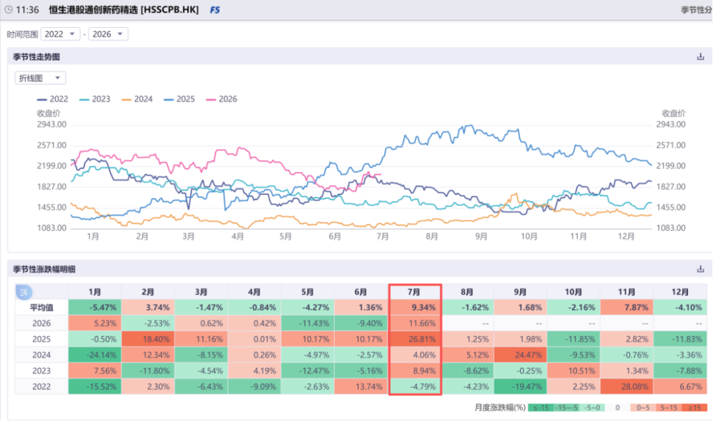

这个行业指数的特点过去我们介绍了比较多了，最后再更新下最新的指数权重股，对港股优质创新药资产是覆盖的非常充分了：

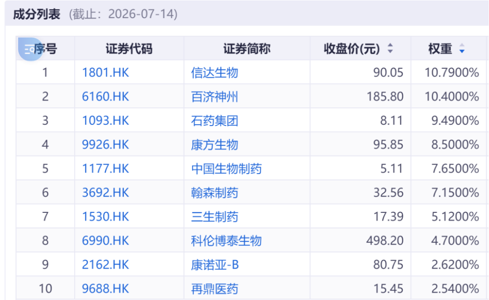

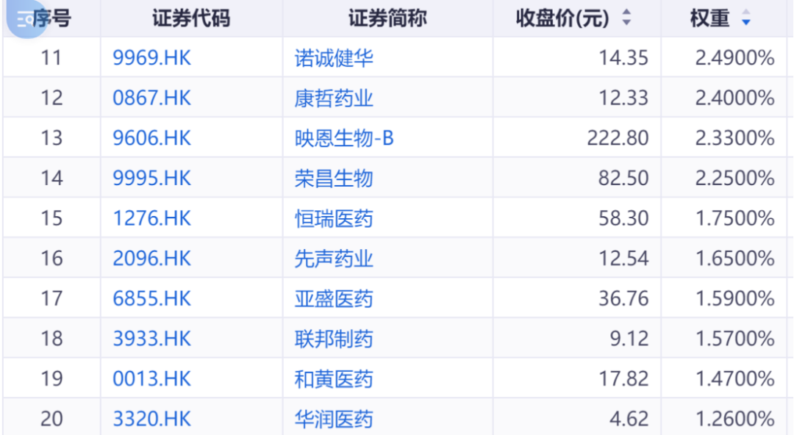

......

近期重点文章：

[中国人均预期寿命每年增加4个月](https://mp.weixin.qq.com/s?__biz=MzkyMzQ3MDc3Mw==&mid=2247486139&idx=1&sn=267d1876c9fd8b4b2701386e970ac0d7&scene=21#wechat_redirect)

[再鼎医药，黎明前的黑暗](https://mp.weixin.qq.com/s?__biz=MzkyMzQ3MDc3Mw==&mid=2247486135&idx=1&sn=dff0be84c4b71d4cbacfad74857de1a0&scene=21#wechat_redirect)

[医药浴火重生，半年度总结](https://mp.weixin.qq.com/s?__biz=MzkyMzQ3MDc3Mw==&mid=2247486118&idx=1&sn=d4059a9da28e951a5227975a6c0aa684&scene=21#wechat_redirect)

风险提示：本文仅讨论行业/公司经营情况，投资需综合考虑公司经营、估值、管理层等多方面因素，建议读者审慎参考，本文不作为投资依据，不建议大家根据本文做出投资计划。

<!-- wxmp-comments-begin -->

---

## 留言（30 条，含回复共 57 条）

- **登** 👍9 · 2026-07-15 12:29
  龙哥，我认为本次触底反弹属于价值回归逻辑，不会像芯片那样整个板块四倍的涨幅。好事底部建仓了，坏事仓位太少。
  应该不会一蹴而就吧？中间找低点加仓
  - ↳ **作者** · 2026-07-15 12:39
    前期被抽血导致的流动性折价修复，与行业强劲的基本面形成共振了。
- **谢工** 👍7 · 2026-07-15 12:32
  康龙化成吃了50%，这波走势...严重怀疑是科技资金拉的
- **听雨** 👍6 · 2026-07-15 12:35
  看好这个指数买的520880，已经起飞了
  - ↳ **作者** · 2026-07-15 12:40
    是的，指数跑赢恒生医疗和A股申万医药指数的，底部起来就是要选择弹性大的指数。
- **caoguoan** 👍5 · 2026-07-15 14:13
  如果没有龙哥的陪伴即使持有创新药etf也有点坚持不住。在最难的时候把龙哥的文章翻出来一遍又一遍看
- **sym** 👍4 · 2026-07-15 12:44
  龙哥，我这该死的操作，之前满仓梭哈单吊智翔金泰亏稀巴烂，好不容易回本挣了10%，一把梭哈清了，没接回来后又心慌买了其他的，结果赔了15%，里外里20%没了，要不然我就可以吹吹牛逼了。我这该死的操作啊！
  - ↳ **作者** · 2026-07-15 12:49
    如我另一条留言里说的，要反思交易习惯，要有对称性，要能“截断亏损、让利润奔跑”，而不是“截断利润、让亏损奔跑”。
- **南山** 👍3 · 2026-07-15 12:29
  坚定持有港股通创新药
  - ↳ **作者** · 2026-07-15 12:40
    正如我们反反复复讲的，对于个人投资者，在景气度加速向上的赛道里耐心持有行业指数，肯定是跑赢绝大部分投资人的。
- **littlehl** 👍2 · 2026-07-15 12:30
  能否点评一下迪哲跟阿斯利康的交易
  - ↳ **作者** · 2026-07-15 12:43
    迪哲医药本身是阿斯利康的中国团队出来搞的公司，在张江甚至还和阿斯利康在同一幢楼里办公，阿斯利康又是他的并列第一大股东，这笔交易很早大家就觉得大概率给AZ了。舒沃替尼按现在的市场潜力来看，在海外大概是10亿美金的分子，这个6亿美金首付款+9亿美金里程碑的对价也是与其市场潜力相符的。
- **漾阳** 👍2 · 2026-07-15 12:31
  [强][强][强]
- **Tony** 👍2 · 2026-07-15 12:33
  怕高了
  - ↳ **作者** · 2026-07-15 12:45
    爬高没毛病，核心是交易要具有对称性，大部分投资人都是截断盈利、让亏损奔跑，所以长期下来都是亏钱居多，反过来截断亏损、让盈利奔跑，才更有可能形成长期复利。
- **樵人** 👍2 · 2026-07-15 12:41
  坚持自己的能力圈，耐得住寂寞才会有今天的繁华
  - ↳ **作者** · 2026-07-15 12:47
    确实，读者们如果经常看评论区，就能知道在行业底部，我们不但要面对市场走势的“拷问”，要面对净值回撤的压力，还要面对读者们疯狂输出的负面情绪，更是诸多读者“苦心劝说”龙哥转行。但我们不止经历过一轮行业周期的，有基于常识和能力圈的基本判断的。
- **黄钊** 👍2 · 2026-07-15 12:45
  从顶一直买到底，虽然七月大涨，现在还亏11个点。
  - ↳ **作者** · 2026-07-15 12:50
    如果是从顶部买下来的话，恒生医疗高位以来还跌21%。
- **JMTerry** 👍2 · 2026-07-15 12:46
  爱博近期小反弹了一波，是业绩上有拐点的迹象嘛？
  - ↳ **作者** · 2026-07-15 12:51
    应该是行业β，消费老登也在修复，眼科下游Q2还并不算好，只不过股价有时候会提前基本面见底。
- **Thierry葛** 👍2 · 2026-07-15 12:53
  虽然我也持有，但文峰明天开盘必砸，我们都是文峰的养料
  - ↳ **作者** · 2026-07-15 12:54
    对单日行情的判断也没太大意义，毕竟你也知道文峰的厉害，靠短线交易能战胜文峰吗？
- **天启** 👍1 · 2026-07-15 12:29
  龙哥
  a股降脂药龙头是哪个？
  - ↳ **作者** · 2026-07-15 12:37
    降脂领域在新靶点、新技术领域，A股公司里可以关注的主要是恒瑞医药和京新药业。
- **张洪亮** 👍1 · 2026-07-15 12:49
  今天看上海出了一个推动商业健康险的文件，感觉是在加大对创新药的支持。
  - ↳ **作者** · 2026-07-15 12:51
    推动商业健康险的发展对于创新药械的支付端确实是有意义的，只不过此前保险公司的兴趣缺缺，还是需要系列配套政策的支持的。
- **丁山** 👍1 · 2026-07-15 12:51
  龙哥，专业性强，我也一直定投创新药和CXO。龙哥怎么看待下半年的医药呢？主线还是科技和医药？
  - ↳ **作者** · 2026-07-15 12:58
    最近行业涨的比较快，导致有些投资人可能比较畏高，这也正常，但从今年的YTD来看，在行业如此强劲的基本面之下，今年A股医药指数最新的YTD是2%-3%，恒生医疗还是负的，我觉得还没到需要担心下半年的时候。
- **求索者** 👍1 · 2026-07-15 13:14
  首付款都太低了，占比也低，总包就是好看而已，而且国内石药恒瑞这种又喜欢打包多款分子撑门面；未来看维立志博吧，有望打破首付记录。
  - ↳ **作者** · 2026-07-15 13:18
    MNC在BD交易定价上有成熟的体系，例如辉瑞买707的价格，AZ买舒沃替尼的价格。我们要允许市场有各种不同的交易形式，并且都能拿到丰厚的现金，真正顶级的分子在成药、适应症拓展、优秀的BD交易合作等都是有一定偶然性因素的，264在BD之初也没几个人想到是这样的潜力。
- **zhz** 👍1 · 2026-07-15 13:16
  英矽智能解禁影响这么快结束了吗，可惜被吓的抛掉了。另估值低到离谱系列经过这波大涨看来没法更新了[捂脸]
  - ↳ **作者** · 2026-07-15 13:27
    确实，A股市场可能比较难找特别低估的资产，港股还是时常会有的，不用担心，哈哈
- **峰回路转** 👍1 · 2026-07-15 13:17
  老师，乐普医疗的基本面最近有没有变化
  - ↳ **作者** · 2026-07-15 13:24
    国内器械还是比较弱。
- **BO** 👍1 · 2026-07-15 13:17
  然而 我康方还套在数据出来那天 悲剧
  - ↳ **作者** · 2026-07-15 13:23
    今年的IO双抗是一言难尽
- **郑用平** 👍1 · 2026-07-15 13:19
  在底部守了两年多了，终于守来了  [呲牙]
  - ↳ **作者** · 2026-07-15 13:23
    为啥是底部守了两年多，2025年以来行业真正比较艰难的不就是今年5-6月份算是个阶段性的至暗时刻嘛。
  - ↳ **作者** · 2026-07-15 13:36
    你说去年涨了一点，说明你买的A股医药，你关注三年，我们过去三年基本都在讲港股创新药。
- **WISCHUANG** 👍1 · 2026-07-15 13:25
  龙哥，医疗企业的温度有好一些了吧，迈瑞医疗的海外表现可以对冲国内的冲击，利润出现拐点吗？
  - ↳ **作者** · 2026-07-15 13:26
    医疗设备国内市场并没有改善，反而是招标压力依然很大。海外部分还算稳健。总体迈瑞的利润端应该是底部区域了。
- **糕糕fire** · 2026-07-15 12:26
  沙发，本轮值得期待
- **鲲鹏** · 2026-07-15 12:46
  我还是老老实实等器械出海吧。创新药实在太强了，不敢追了，君实生物还没咋涨，6月3日看您评论区回复好像公司效率低，那公司有前景，当下相对低估嘛。
  - ↳ **作者** · 2026-07-15 12:59
    器械出海还是个股逻辑，半年之内应该比较难形成板块共识，所以需要更多耐心等个股业绩兑现，这个也是我们反复强调了。
    君实生物总体管线来看确实不算强，后续主要就是观察二代IO+ADC能不能追赶一下。
- **谢群** · 2026-07-15 12:50
  龙哥，施一公太太拉胯了，上上下下折腾坐电梯一直坚持到今天，走势太弱了，今天满屏的20cm，竟然涨不过板块指数
  - ↳ **作者** · 2026-07-15 12:53
    诺诚拉长来看股价弹性并不小，只不过创新药公司在不同阶段缺少催化剂的时候股价是会弱一些，总体诺诚H股还是很便宜的。
- **some～some～some** · 2026-07-15 13:41
  新出了一个科创新药，走势好的一笔
  - ↳ **作者** · 2026-07-15 13:44
    科创新药也不是新出的啊，我们以前有专门文章解读过的
- **阿宝** · 2026-07-15 13:55
  葛大妈这个月又是女神了，基金遥遥领先啊[机智]
  - ↳ **作者** · 2026-07-15 13:57
    今年YTD终于进入医药主动基金前30%了，别再叫葛大妈了，得叫兰姐了。
- **Bryan** · 2026-07-15 14:54
  龙哥好，之前主要看了肿瘤，管辖扎堆后IO双抗是这轮反弹也走得很不行。手里套的各类老登板块多，CXO都涨一些出掉回血了没拿住[捂脸]。想起一年前牛鬼蛇神都涨的时候就说起，这个市场能带走盈利的始终是少数。
  我也不擅长交易“截断亏损、让利润奔跑”，这里再说一遍以后大方向就是ETF，先避免暴雷，这样才好留着”亏损“甚至底部加仓
  - ↳ **作者** · 2026-07-15 14:59
    其实医药赚的最多的就是24-25的CXO，ETF（还有个康方），那时候估值是真便宜，所以也就没去各板块折腾被套[捂脸]
- **胡同** · 2026-07-16 06:06
  龙哥 药明康德怎么看 安全风险影响还大不大 要是真的落地会不会踢出供应链甚至倒闭
  - ↳ **作者** · 2026-07-16 08:52
    过去几年基本验证落地不了了，美国MNC的政治游说能力，是国内很多人理解不了的
- **童岩** · 2026-07-16 08:48
  龙哥，今年技术平台合作的BD规模很大，明年开始BD总额应该很难持续了吧？后面一方面应该关注成药进展，一方面应该追着NEWCO规模去看了吧？
  - ↳ **作者** · 2026-07-16 08:53
    是的， 临床推进和里程碑付款会越来越多的

<!-- wxmp-comments-end -->
