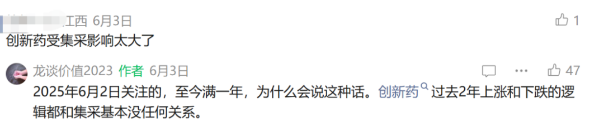
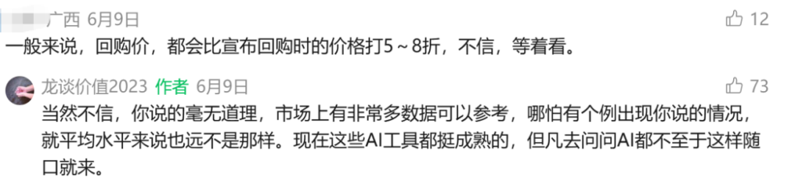
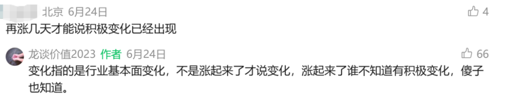
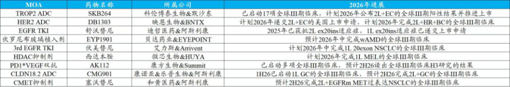
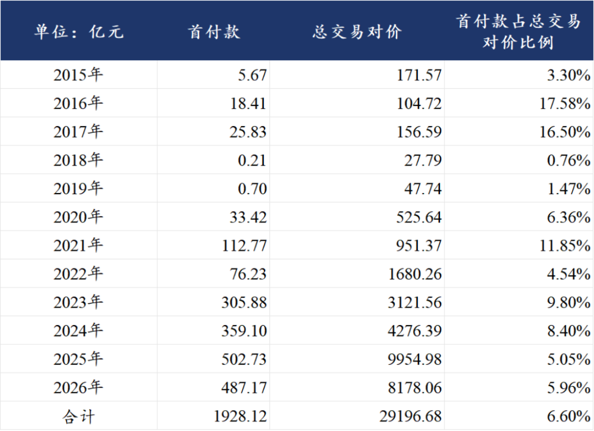
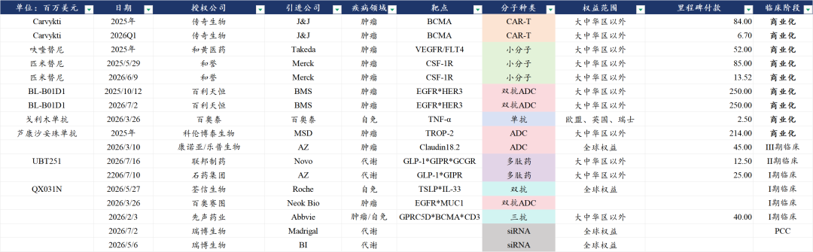
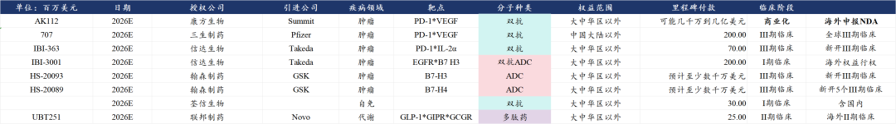

# 创新药，戴维斯双击

大家好，我是龙哥。

经常关注文末留言区的读者都知道，过去几个月我们经历了怎么样的市场悲观情绪，在用常识判断行业估值很低的时候有人告诉我们估值还能腰斩，在我们分析产业资本密集回购增持的时候有人告诉我们股价还能打5-8折，还有不少不研究行业、不看文章的新读者每天告诉我集采影响多大。

如今行业否极泰来，又有不少读者担心是不是短期火热几天就又要熄火，不少投资人认为今年创新药“还是炒BD，和去年逻辑一样的老故事”，但我们认为，今年创新药的中长期产业逻辑相较2025年已经有进一步的强化，如果不是被科技抽流动性，原本26年的创新药及产业链是可能出现“戴维斯双击”的，并且随着近半年一系列临床进展和数据发布，我们认为在下半年这种可能性仍在提高。

1、全球注册临床和商业化加速

以下为国泰海通医药团队统计的内容：

2026年有9款国产创新药将读出或已经读出全球III期临床数据，并且目前这9款药物已经全部与海外MNC、biopharma、biotech达成合作，包括就在上周刚刚与AZ达成6亿美元首付款的迪哲医药研发的舒沃替尼。

9款药物中包括3款ADC、1款双抗、1款新型超长效植入制剂、4款小分子，9款药物在达成全球III期临床关键节点后有望陆续提交海外上市申请，这其中大部分药物有望登录美国和欧洲主流发达国家市场。

目前国内公司已经累计在欧美市场获批了20款国产创新药产品，但自传奇生物的Carvykti（BCMA CART）和百济神州的泽布替尼（BTK）两款血液瘤药物后，还未出现下一款重磅产品在海外上市（[创新药出海，面对现实](https://mp.weixin.qq.com/s?__biz=MzkyMzQ3MDc3Mw==&mid=2247485890&idx=1&sn=023f5c09a432630036ac09645c161403&scene=21#wechat_redirect)），如多款PD-1/L1单抗、长效升白、和黄的呋喹替尼等都不具备重磅炸弹药物的潜力。

而我们看到将在2026年完成III期临床的9款药物中，有2款具有数十亿乃至百亿美金销售潜力的药物→康方生物/Summit的AK112、科伦博泰/MSD的SKB264，5款药物具有10-30亿美金销售潜力→康诺亚/阿斯利康的CMG901、贝达药业/EYPOINT的EYP1901、迪哲医药/AZ的舒沃替尼、映恩生物/BioNTech的DB1303、艾力斯的伏美替尼。

从市场表现来看，以上9个项目中有6个项目相关的7家公司在今年上半年的股价表现有明显超额收益（显著跑赢指数），包括科伦博泰/科伦药业、迪哲医药、艾力斯、贝达药业、康诺亚、微芯生物，当然，另外映恩生物、康方生物、和黄医药等3家跑输指数。

2、里程碑付款增加

在中国创新药出海的十多年间，累计签署的BD交易总包高达2.92万亿元，但实际拿到的首付款大概是1928亿元，首付款占总包的比例是6.6%，从2023-2026年来看分别是9.80%、8.40%、5.05%、5.96%（2023-2024年包含部分大额并购），也就是说总体还有90%-95%左右的交易对价是里程碑付款。

如果按照里程碑付款中只有10%-20%能兑现，那么未来兑现的里程碑收入规模也会是首付款的2-4倍，这个影响会越来越多的反映在各家做海外BD授权的创新药公司财报中。

与海外临床推进向对应的，就是里程碑收入的增加，里程碑收入包括：

- 临床前及临床关键时间点里程碑→PCC完成、I期临床启动/首例入组、II期临床、III期临床、多适应症拓展。通常全球III期临床启动的里程碑金额会偏大。
- 注册里程碑：产品完成全球注册临床后向美国、欧洲、日本等重点市场的监管部门提交上市申请，产品正式获批上市，尤其是大适应症正式获批上市的里程碑付款金额一般会较大。
- 商业化里程碑：产品获批上市后，年度销售额或累计销售额达到某个里程碑后可以获得商业化里程碑付款。

随着国产创新药的还未临床推进，创新药出海BD不再局限在首付款收入，研发、注册及商业化里程碑逐渐增加。从2025年以来部分公司获得里程碑收入的情况来看，部分海外推到III期临床的大品种，如科伦博泰、百利天恒这些标杆企业已经陆续获得不少的里程碑收入，商业化阶段的传奇生物、和黄医药也有每年持续的里程碑收入。

上图统计的只是少数公告数据的公司的里程碑收入，实际上大部分公司的里程碑收入不会专门公告，还有更多biotech/biopharma在陆续收到里程碑付款。

从部分头部biopharma的情况来看，随着核心项目的海外研发进展，预计2026年会收到规模不小的里程碑付款，例如信达生物授权武田的IBI-363新开III期临床，以及对IBI-3001可能会行权；翰森制药授权GSK的两款ADC在全球的开发进度都还算较为靠前，其中B7-H4 ADC从2025年底以来已经新开了4项全球III期临床，GSK目前已经规划了5项全球III期临床。

总体来看，2025年创新药的行情主要来自：①三生等重点项目BD使得全行业管线出海BD预期提升→全行业管线价值重估。②行业从极低估值向合理估值修复。

2026年以来，创新药出海走向纵深，更多海外项目的III期临床取得成功，研发和商业化里程碑进入密集兑现期，部分创新药公司的海外管线成药性提升，对应潜在估值也该提升，虽然仍是创新药出海，但实际行业逻辑相较2025年有所强化，而并非单一复制2025年的“BD出海逻辑”。

......

近期重点文章：

[医药重回潮头之上](https://mp.weixin.qq.com/s?__biz=MzkyMzQ3MDc3Mw==&mid=2247486156&idx=1&sn=daea4227df32e6a7977093f68de5886d&scene=21#wechat_redirect)

[医药浴火重生，半年度总结](https://mp.weixin.qq.com/s?__biz=MzkyMzQ3MDc3Mw==&mid=2247486118&idx=1&sn=d4059a9da28e951a5227975a6c0aa684&scene=21#wechat_redirect)

[中国人均预期寿命每年增加4个月](https://mp.weixin.qq.com/s?__biz=MzkyMzQ3MDc3Mw==&mid=2247486139&idx=1&sn=267d1876c9fd8b4b2701386e970ac0d7&scene=21#wechat_redirect)

[哪些医药公司的中报有望超预期](https://mp.weixin.qq.com/s?__biz=MzkyMzQ3MDc3Mw==&mid=2247486106&idx=1&sn=f9b457fd222aa7ee15ea886fbc6fad4f&scene=21#wechat_redirect)

风险提示：本文仅讨论行业/公司经营情况，投资需综合考虑公司经营、估值、管理层等多方面因素，建议读者审慎参考，本文不作为投资依据，不建议大家根据本文做出投资计划。

<!-- wxmp-comments-begin -->

---

## 留言（41 条，含回复共 87 条）

- **我在楼脚搂实喊你** 👍11 · 2026-07-24 11:25
  龙哥，鉴于医药行业基本面已经具备全球研发变现的能力（研发变现对中国企业太难得），我对医药行业非常有信心，并不因股价表现不好而放任发泄负面情绪，我相信时间最终会回答众人的疑虑。
  我持有恒瑞两年以上，虽然我知道不少研究比较深入的专家更推荐药明康德和百济神州，但我觉得这是对最近一两年的直观理解，我愿意把收获周期再多放长五年，赌恒瑞海外商业化成功，并从众多管线中，脱颖而出一两款爆款。如果到时候恒瑞辜负了我的期望，问题也不大，我相信它的表现总可以超过医药板块的平均值。
- **宇。** 👍10 · 2026-07-24 11:07
  别吹了.最近没戏了[捂脸]
  - ↳ **作者** · 2026-07-24 11:09
    1️⃣科技回调之际，最近一个月医药的超额非常显著。
    2️⃣你投资只看最近？按天交易是吗？投资逻辑都不准讲？只能涨了吹？
- **郑用平** 👍10 · 2026-07-24 11:09
  这批在底部极度悲观的人，和在顶部极度乐观的人是同一批人。底部找利空，顶部找利好。人才啊！[旺柴]
- **累了就睡** 👍9 · 2026-07-24 11:10
  医药真是最难的投资赛道之一
  - ↳ **作者** · 2026-07-24 11:17
    确实，这是我们过去两年重点讲etf的原因，行业基本面快速向上的阶段，耐心定投或者拿住etf总归能赚钱，个股就不一定了。
- **也无风雨也无晴** 👍8 · 2026-07-24 11:11
  应该是21年开始就关注博主了，蛰伏了那么多年，终于能看到你的价值，看清行业周期的兴衰，经历过磨难才会变得更加强大，经历过平淡才能拥抱星辰大海
- **ZZY** 👍7 · 2026-07-24 12:12
  看了你对网友的回复，感觉你的脾气真好。一直没评论过，感谢你提供了那么详细的信息，尤其那个估值表，和那个政治风险永远在，产业进步生生不息的文章，很有启发。
  - ↳ **作者** · 2026-07-24 13:19
    在我这只要不是人身攻击，大家啥都能说，虽然我也会回怼就是了，但可以展示出来给大家看到不同的观点[呲牙]
- **黄启昌** 👍6 · 2026-07-24 11:12
  美元加息在即，会不会影响创新药？
  - ↳ **作者** · 2026-07-24 11:15
    上半年我们是担心过这个问题的，但美股MNC和XBI用屡创新高告诉我们美股投资人似乎毫不在意
  - ↳ **作者** · 2026-07-24 12:03
    这就是行业最大的预期差，总有人觉得BD是国内公司求着他们BD，那美国一系列政策都推出来了怎么还加快BD了呢。
- **DRAGON** 👍5 · 2026-07-24 11:05
  我的恒瑞利好不断，但股价就是趴着不动，管他呢拿几年再说，已经拿了几年了不在乎多拿几年[呲牙]
  - ↳ **作者** · 2026-07-24 11:08
    恒瑞的利好频传是真的，但表观业绩还没加速，并且研发费用资本化导致的利润虚高，使得其还在持续消化估值。
  - ↳ **作者** · 2026-07-24 12:29
    凯莱英是在高景气度的减重药赛道上，所以股价和估值提前反映了今年业绩超预期的可能性，康龙的话小分子CDMO也会加速，今年主要是估值修复，之前H股康龙的估值才12倍PE。
- **dzw** 👍5 · 2026-07-24 11:10
  我感觉目前医药行业最大的利空是AI的发展，可能颠覆传统创新药的专利周期，研发新药的速度越来越快，可能创新药专利还没到期，同类更优的创新药就上市了，这个可能性大吗？
  - ↳ **作者** · 2026-07-24 11:18
    嗯，这个是值得关注的问题。我们目前看下来：1️⃣AI是工具，大部分公司已经在积极使用这个工具，26年以来我国海外BD的项目超过三分之一都是AI深度介入的。2️⃣你说的这种情况比较利好CXO。
  - ↳ **作者** · 2026-07-24 11:48
    ai是提效的，主要在临床前发现分子环节，进入临床ai用处就大打折扣，123期临床几年时间雷打不动，不是ai能颠覆的，ai对创新药是利好不是利空
  - ↳ **作者** · 2026-07-24 13:31
    现在也有用AI来进行临床设计规划这些的，但确实临床试验的时间目前还比较有限的能缩短。后续还有审批时间等等。
- **antti** 👍4 · 2026-07-24 11:23
  哈哈，老关注者忍不住来留个言。龙大你大可不必跟新人争辩，新韭菜都是恨不得按小时交易的，必须每天都赚钱。--我们很多人也是从这个阶段走过来的[呲牙]
- **怿** 👍4 · 2026-07-24 12:48
  不必上火，如果每个投资者都是高认知，哪来的超额，有这些人应该感恩，本质上赚的就是他们的钱，是衣食父母
  - ↳ **作者** · 2026-07-24 13:15
    医药单边下跌的时候喷我我也就忍了，医药最近一个月超额还是比较明显的，还是喷我，那我得回几条[偷笑]
- **方甘林** 👍3 · 2026-07-24 11:30
  龙大，接下来像楚天，东富龙这种制药装备公司有机会不，谢谢
  - ↳ **作者** · 2026-07-24 11:33
    这个和生命科学上游有一定关联，边际上是改善的，只不过这波我感觉对新建产能的需求没有那么强，上一波牛市建设的过量的产能很多还在消化，可能行情不会太大吧。
- **R9-牛牛** 👍2 · 2026-07-24 11:02
  最大的风险，是ai主导的牛市结束，系统性风险，泥沙俱下，大幅度回撤。不可不察！！！
  - ↳ **作者** · 2026-07-24 11:11
    这不就是我们写上一篇文章的原因？
- **和** 👍2 · 2026-07-24 11:15
  贝达药业业绩也狂砸[疑问][疑问][疑问]现在业绩有毛用
  - ↳ **作者** · 2026-07-24 11:22
    有没有可能，你猜猜看贝达为什么前面涨这么多。他没业绩的话凭什么前面这样涨。
- **老席的迭代复利手记** 👍2 · 2026-07-24 11:17
  创新药，医疗服务，中药，医疗器械，没发现有人说医疗器械的未来一片光明的，我重仓的医疗器械ETF，亏损得有20个点了，但是还是有想加仓的想法[捂脸]
  - ↳ **作者** · 2026-07-24 11:22
    医疗器械肯定比医疗服务和中药要好，只不过器械出海还没到那个量产引发质变的阶段。
  - ↳ **作者** · 2026-07-24 11:34
    感谢，哈哈，这个观点让我很温暖
- **刘亮** 👍2 · 2026-07-24 11:23
  龙哥，康龙化成看到你上次提到过，它家的猴子是自用，所以没有计入到利润中，昭衍您怎么看
  - ↳ **作者** · 2026-07-24 11:25
    猴子的价格已经来到上一轮新冠时期医药超高景气度时候的价格，同时供给端想较那时候是开始放开进口，需求端一方面是各种新技术发展带来的需求，另一方面是FDA开始降低对动物试验的要求。因此从炒猴子的角度我们不太认为有大的空间。
- **天野源** 👍2 · 2026-07-24 11:25
  龙哥，皓元医药啊有什么利空呀？感觉比其他CXO走得弱得太多了，还是药明，泰格等稳
  - ↳ **作者** · 2026-07-24 11:31
    皓元前面走的强，是跟着科技和涨价链炒了一把电子化学品和氧化锆，实际上他们只有g级和公斤级氧化锆，然后后面就短期炒作的跑了就走的弱了，实际今年基本面是不足以支撑前面炒作时候这么高估值的。
- **豆包** 👍2 · 2026-07-24 11:57
  现在有比较推荐的创新药etf吗龙哥
  - ↳ **作者** · 2026-07-24 13:29
    你这名字和头像看得我一愣，哈哈
    创新药etf之前给大家分析过不少，可以翻翻历史文章，另外大家最近问的多，我可以下周抽空再写一篇全行业所有etf梳理的文章给大家
- **Touch🍀** 👍2 · 2026-07-24 12:24
  请问创新药以及cxo板块的个股未来会分化么，头部企业对同行的营收业绩及股价造成挤压，从而导致创新药类etf整体不涨呢？
  - ↳ **作者** · 2026-07-24 13:17
    现在创新药行业的问题恰恰不是你说的这个，现在问题是行业内竞争者太多导致国内太卷，龙头的行业集中度提升是有，但是还不够明显，实际上etf里头部公司权重占比高，如果真的像你说的那样，那etf会是非常好的选择，而不是像现在这样我们还是得尽力选α。
- **雲一** 👍2 · 2026-07-24 14:19
  我是看了2025年8月28日那篇买了爱博医疗，至今深套，没别的意思，博主的文章还是很认可，也感觉能在这里免费学习。想问问爱博还有机会回本吗，或者说能不能再出一期
  - ↳ **作者** · 2026-07-24 14:23
    你别再删了，我回你好几次，写一大段你删了，我回复也没了。
    从投资方向上我们很早转向出海的资产，爱博医疗是去年我们为数不多认为国内消费医疗里还有机会通过业务横向拓展来抵消行业负β的，结果其证明行业β影响还是太大，此前的判断与实际有较大偏离，这个确实要说声抱歉。
    爱博我们目前仍看不清拐点，如果后续有大的基本面拐点我们会单独写一篇的。
- **逍遥游** 👍2 · 2026-07-24 15:47
  龙哥怎么看威高，一直在增持回购还有高股息，就是不知道业务会不会衰退
  - ↳ **作者** · 2026-07-24 16:28
    他股价走弱就是之前业绩大幅miss导致的，不过公司之前也是想低价回购做股权激励吧，港股很现实的，基本面向下的公司没有估值底的，会跌到离谱的低估值，但同时这类公司一旦基本面好转，弹性也特别大。
- **杨志高** 👍1 · 2026-07-24 11:03
  股价还没体现出来，感觉股灾要来了[流泪]
  - ↳ **作者** · 2026-07-24 11:12
    在这种市场环境下，美股的一众MNC股价创新高，美股CXO业绩上调、股价大涨。国内AH股的头部CXO临近新高，多个中等市值创新药公司创出新高。医药行业的表现已经远强于大部分行业，这还是流动性被抽的比较惨的背景下。
- **廖书豪** 👍1 · 2026-07-24 11:07
  SMO今年还是大幅度落后，甚至还是负涨幅。逻辑上看SMO劳动密集型人效比随着AI技术将大幅ROE收益，请教是因为复苏逻辑产业链靠后，需要看到切实的临床业绩拐点吗
  - ↳ **作者** · 2026-07-24 11:13
    因为SMO的业绩波动本来就不如大临床那么大，去年也提前修复了一把。
- **COKE** 👍1 · 2026-07-24 11:20
  被港股的流动性伤到了，微创机器人基本面改善那么大，往后预期也有，结果被埋伏砸成这样，伤心了
  - ↳ **作者** · 2026-07-24 11:23
    是的，微创机器人这个走势确实比较伤人，按理说不至于的
- **陈大文Edwin** 👍1 · 2026-07-24 12:37
  龙哥，怎么看博瑞？跌了这么多减肥药的国外市场这么大
  - ↳ **作者** · 2026-07-24 13:16
    博瑞主要是出不了海，国内市场又太卷，博瑞本身商业化能力相比恒瑞翰森这种也有差距。
- **夜游的熊** 👍1 · 2026-07-24 12:49
  龙哥，港股通创新药和国内的创新药现在那个更好一些？目前持有港股通创新药基金
  - ↳ **作者** · 2026-07-24 13:14
    看我们比较久的读者都知道哈，我们大部分讲etf都是讲港股创新药etf哦，可以翻翻历史文章，主页都给大家整理好了[呲牙]
- **星移无痕** 👍1 · 2026-07-24 13:58
  龙哥的文章很少很少提到荣昌啊，是已经高估了还是怎样啊？
  - ↳ **作者** · 2026-07-24 14:32
    偶尔也提，荣昌的管线肯定是可以的，股价确实反映了比较多，但这都不是核心，核心是大家也知道我一直不太喜欢讲太多这种雪球上的“网红票”。
- **泉涓涓而始流** 👍1 · 2026-07-24 16:22
  泰诺爱博这家公司咋样，单品刚开始走量
  - ↳ **作者** · 2026-07-24 16:34
    管线对我来说不是很有吸引力，RSV单抗过于能看下，但我感觉在国内也大概率起不了量。并且科创板发出来估值也很离谱。
- **雨夜落无声** · 2026-07-24 11:11
  迪哲的在手管线说好像很多都可以bd了他们没有选择bd，估计觉得价值确定吧，管理层说如果舒沃替尼之前卖了卖不到这个价
  - ↳ **作者** · 2026-07-24 11:21
    由于迪哲和AZ的关系，卖给AZ确实是大概率的，但BD这个事也讲究一个平衡，撑得久一点等待更多数据读出可以拿到更好的价格，但同时BD也有时间窗口期，错过时间窗口可能就没人要了，所以要平衡二者，迪哲这次的交易确实做的不错，而且不差钱了以后，后续管线更不用着急BD了。
- **Mr.Lee** · 2026-07-24 11:11
  龙大，创新医疗器械现在处于什么位置和状态，大概什么时候才能像创新药一样迎来戴维斯双击呢？不断阴跌，实在熬不住了。
  - ↳ **作者** · 2026-07-24 11:16
    器械今年是极少数个股的α，行业β我们推测最快27年，但也要对行业跟踪着看。
  - ↳ **作者** · 2026-07-24 11:18
    迈瑞和联影已经走出止跌趋势了，有资金介入就会快速拉起来，没有就是W筑底过程了
- **赚钱养宝子** · 2026-07-24 11:32
  按现在AZ对迪哲舒沃替尼的态度看，剩下的几条管线未来可期，潜力相当大
  - ↳ **作者** · 2026-07-24 11:33
    也不一定给AZ，但确实和AZ有很强的协同性，不管是BTK还是第四代EGFR
- **PAUL郑** · 2026-07-24 11:44
  请问从实操角度，是做创新药etf 还是龙头药企个股，对于小白来说
  - ↳ **作者** · 2026-07-24 13:32
    都可以，做行业ETF可以减少个股研究难度和个股暴雷风险，做行业龙头个股也需要理解行业的基本面，毕竟公司做到行业头部，多少会受到行业β影响。
- **davi** · 2026-07-24 11:51
  康方的AK112获批概率不大吧，龙哥今年创新药整体板块能否突破去年高点？
  - ↳ **作者** · 2026-07-24 13:30
    海外美国二线NSCLC能否获批我现在还真的说不好。
- **佘书鹏** · 2026-07-24 11:55
  请教 哈药是个什么存在，为啥感觉像妖股？还有海南海药也是，一涨起来连续几个涨停板。
  - ↳ **作者** · 2026-07-24 13:30
    哈药是中报预报很好。不过A股嘛这种公司每年都有不少，不要计较真实基本面逻辑，有些交易水平高的投资人也可以与庄共舞，也很舒服的。
- **思想的印迹** · 2026-07-24 11:56
  美债长端收益率上升。科技股全部承压。 双击什么？
  - ↳ **作者** · 2026-07-24 11:58
    对啊，做投资研究什么基本面啊，就看宏观单一指标就行啦[强][强][强]
  - ↳ **作者** · 2026-07-24 13:09
    这是一种很有代表性的留言，他们总是无限放大宏观的因素，却对于行业的基本面视若无睹
- **zhz** · 2026-07-24 12:05
  那是不是意味着映恩生物、康方生物、和黄医药反弹空间更大[憨笑]
  - ↳ **作者** · 2026-07-24 13:20
    便宜是投资逻辑之一，但便宜的不一定弹性更大，还是得看管线推进，当然你说的这几家除了和黄以外，管线都还是可圈可点的。
- **大海** · 2026-07-24 12:24
  纯技术面看，迪哲医药也到了可以入手的位置了吧？
  - ↳ **作者** · 2026-07-24 13:18
    技术面各位读者里很多高手比我厉害的[呲牙]
- **飜** · 2026-07-24 12:58
  这恰恰是为什么创新药现阶段不会大涨的原因
  - ↳ **作者** · 2026-07-24 13:13
    可惜微信公众号只能设置关注一周以上才能留言，要是能设置关注三个月以上才能留言就好了，就会少很多这种新读者莫名其妙的话
  - ↳ **作者** · 2026-07-24 13:21
    虽然我不认同你的结论，但是我认同你的分析及罗列的数据。能碰上这个专业的垂直细分的深度研究，也算是不错的。感谢作者[抱拳][抱拳][抱拳]
- **春风十里不如你** · 2026-07-24 13:49
  既然是探讨就得有利有弊的分析，只讲利好不讲利空，不合适吧
  - ↳ **作者** · 2026-07-24 13:53
    政治风险的问题我比全市场任何一个医药自媒体分析的都多都深入，行业风险我比谁都提示的多，所以除非你能提出新的问题，否则你的观点对我毫无意义。
  - ↳ **作者** · 2026-07-24 13:56
    在不同的阶段和估值有不同的主要矛盾，在去年9月行业高位时候我还通过数据测算告诉大家行业的预期回报率已经不高，这种关键时间节点的关键结论，你要有数据和充分论据支撑，而不是拿着一个我们反复分析过的逻辑来说。
- **建东** · 2026-07-24 15:07
  26年出海成药性能提升的也就几个公司吧  可能由公司还得暴雷出来 行业性的β逻辑偏弱啊
  - ↳ **作者** · 2026-07-24 15:23
    3期成功和提交注册的是9家，新开3期的有很多，读出1/2期数据的有更多，这些都会陆续拿到里程碑付款，成功率也都是提升的。
- **鹿大猫（左家塘廖凡🤑 ）** · 2026-07-25 07:29
  很奇怪医药不是科技股吗。要这么对立吗。开始加大对板块研究已经开始配置创新药etf，从科技股过来但是医药股宏观上国内医保局还是影响很大，目前开发投资不够感觉就像ai资本开资不够。
  - ↳ **作者** · 2026-07-25 11:15
    从市场表现来看科技和医药是阶段性反向的，从投资角度二者并不对立，我司也是向来投科技居多，但不可否认的是过去科技泡沫破裂的时期的确多次出现医药表现非常突出的情况，我们只是客观描述，并不是看空科技。

<!-- wxmp-comments-end -->
