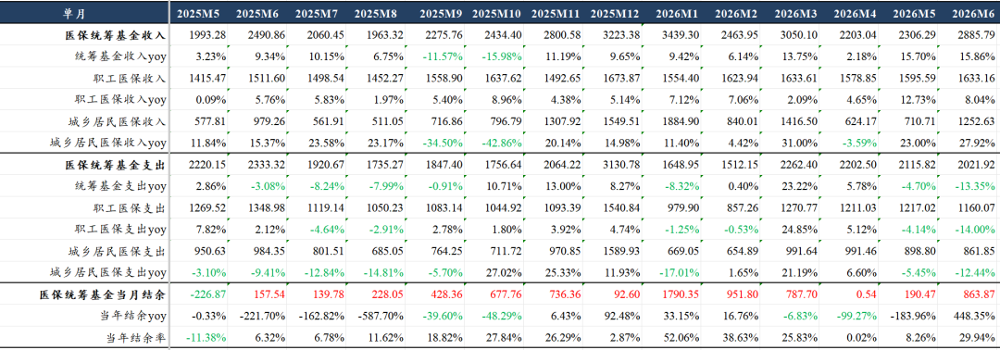

# 医疗反腐后劲很大

2026年5月医保统筹基金支出2115.82亿元同比-4.70%，其中职工医保统筹基金支出1217.02亿同比-4.14%，居民医保支出898.80亿元同比-5.45%。

2026年6月医保统筹基金支出2021.92亿元同比-13.35%，其中职工医保统筹基金支出1160.07亿元同比-14.00%，居民医保支出861.85亿元同比-12.44%。

国内市场为主的药械，在5月以来面对真正的【试金石】。

艾力斯、康诺亚等核心产品临床价值突出的公司，上半年销售进一步超预期。

带金销售产品，尤其是部分中成药，这次中报是山雨欲来风满楼。

风险提示：本文仅讨论行业/公司经营情况，投资需综合考虑公司经营、估值、管理层等多方面因素，建议读者审慎参考，本文不作为投资依据，不建议大家根据本文做出投资计划。

<!-- wxmp-comments-begin -->

---

## 留言（9 条，含回复共 17 条）

- **谢工** 👍14 · 2026-07-26 23:21
  出海才是出路，哪怕是创新药！
  - ↳ **作者** · 2026-07-26 23:22
    去掉“哪怕”，过去2年创新药主要的逻辑就是出海。
- **大魏** 👍13 · 2026-07-26 23:10
  带金销售产品，尤其是部分中成药，这次中报是山雨欲来风满楼。
  
  嘛意思？不及预期还是超预期呢！
  - ↳ **作者** · 2026-07-26 23:13
    带金销售产品肯定是中报会雷声一片呀。
- **喻力** 👍8 · 2026-07-26 23:20
  利好创新药
- **Zhao** 👍7 · 2026-07-26 23:26
  医药行业的投资机会只能在创新药和cxo了，对吧，其他实在也没啥看头。
  - ↳ **作者** · 2026-07-26 23:58
    从细分行业来说是这样。器械出海有一些个股也是值得看的。
- **wy** 👍6 · 2026-07-26 23:18
  反过来想，这么大的积余，那后面会不会宽松呢？更利于创新药和好产品的公司？
  - ↳ **作者** · 2026-07-26 23:20
    结余总体是为老龄化做准备的，但你说的也对，结余下来巨额的医保资金，后续对真正临床价值高的好产品定价就可以更宽容一些。
- **excite** 👍5 · 2026-07-26 23:17
  医械中的高值耗材中报预期也是在修复吧？
  - ↳ **作者** · 2026-07-26 23:21
    就现在医保这个情况，大部分国内为主的高耗，情况也不乐观。
- **丁山** 👍3 · 2026-07-26 23:09
  龙哥，综合赔率和概率来看，创新药和CXO哪个更高更好呢？
  - ↳ **作者** · 2026-07-26 23:13
    CXO是行业性的景气度修复，确定性已经比较高。创新药的弹性更大，但比较需要精选个股。
- **峥嵘岁月** 👍3 · 2026-07-26 23:23
  龙总怎么看眼科的爱博和欧普现在的情况，能算底部吗？另外有没有你说的这个带金销售问题
  - ↳ **作者** · 2026-07-26 23:59
    这种比较少吧，人工晶体都降价降成这样了还有啥带金的空间
- **梦想家一聚慧算小黄18149646087** 👍3 · 2026-07-27 10:20
  结余准确性高吗？我当地三甲出院后等第二个月才能报销的
  - ↳ **作者** · 2026-07-27 10:31
    以上都是官方发布的数据，至于准确性嘛，见仁见智，看怎么理解。

<!-- wxmp-comments-end -->
