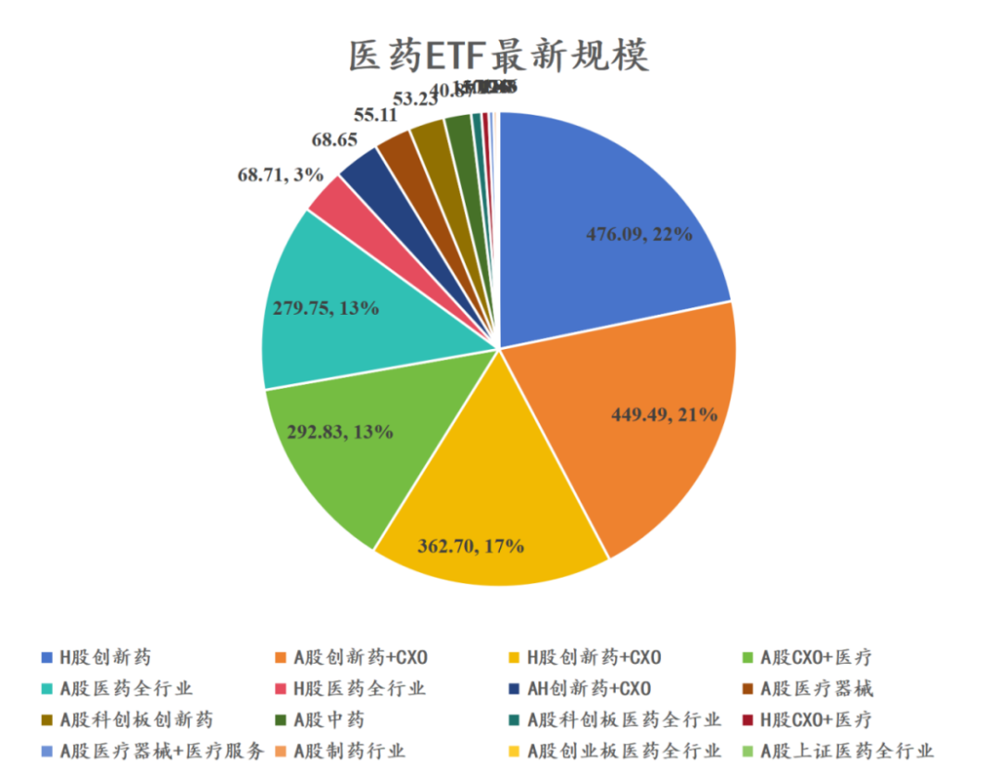
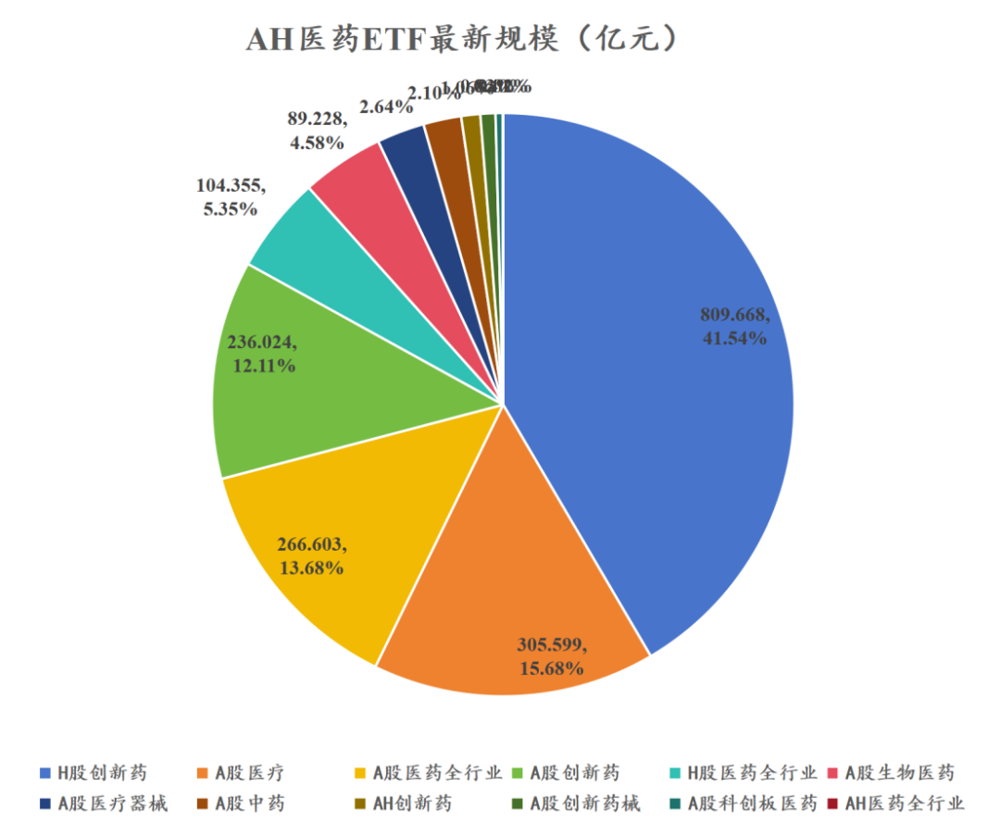
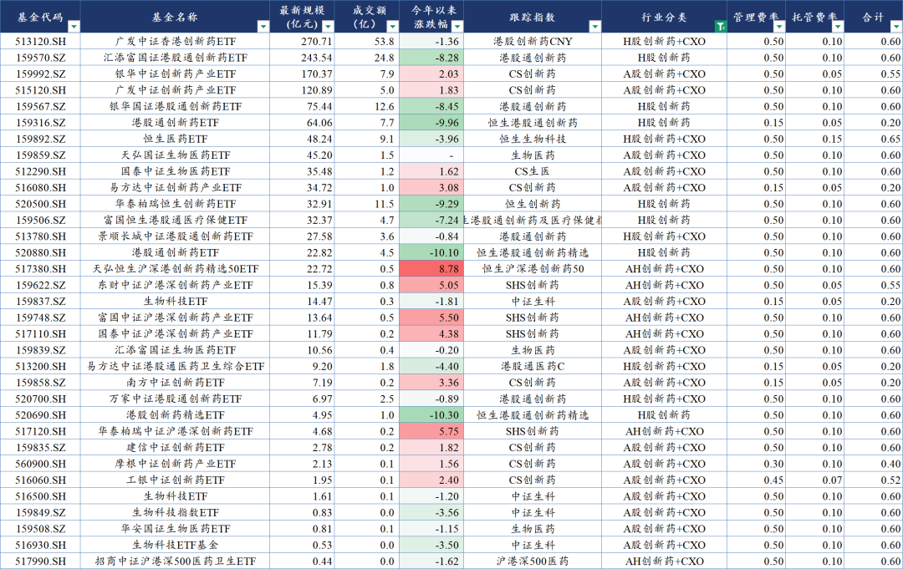
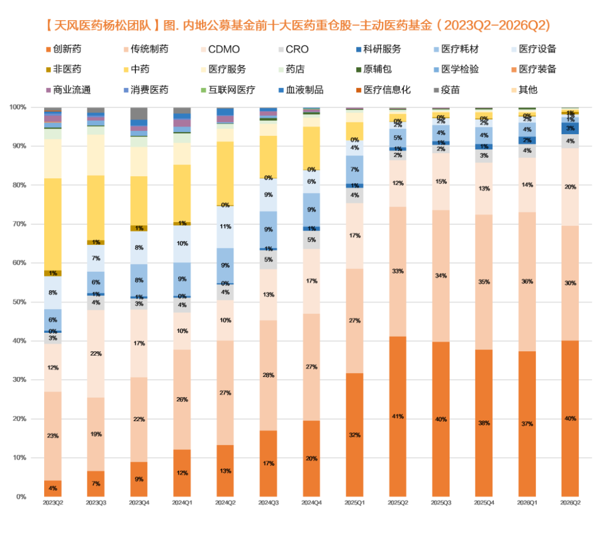
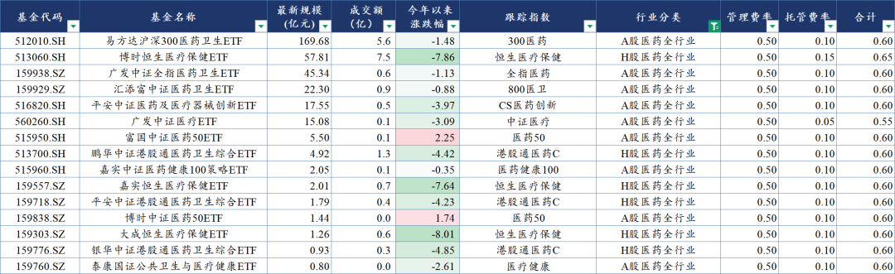
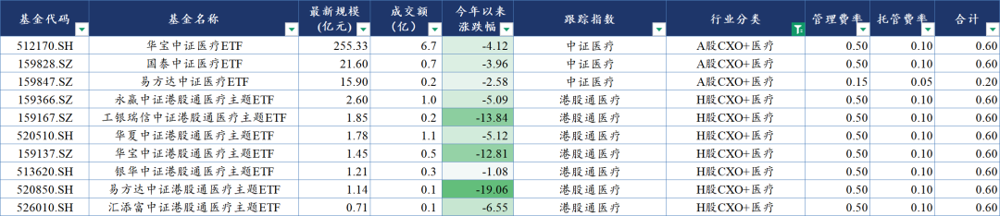
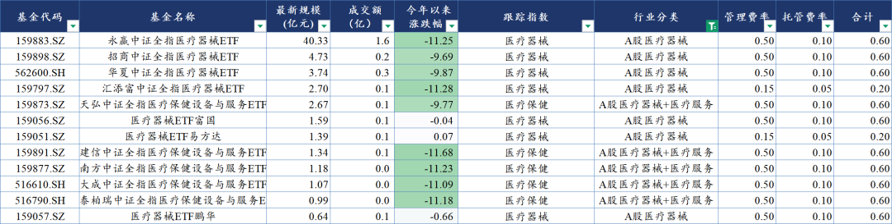
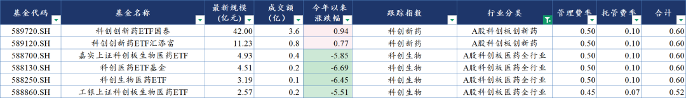

# 最全ETF梳理

大家好，我是龙哥。

最近大家问ETF的比较多，我们此前每隔半年左右给大家更新一次医药全行业的ETF《[最全ETF梳理](https://mp.weixin.qq.com/s?__biz=MzkyMzQ3MDc3Mw==&mid=2247484910&idx=1&sn=da49510d38deec63131e081599b4962e&scene=21#wechat_redirect)》，今天就再来给大家梳理一下医药行业所有ETF的情况。

文初还是先强调一下，ETF本身是工具，没有绝对的谁好谁坏，更多是基于大家对行业和细分领域的判断来做选择，对于同类的ETF可以再叠加一些选基金的基本原则如规模/流动性、费率等。

我们统计了合计84支医药行业ETF，如有不全之处也欢迎大家额外做补充。84支医药ETF合计的最新规模是2188亿元，相较2025年底的1950亿元的医药ETF规模增长12%，相较2025年9月历史高位的1832.5亿的ETF规模增长19%，相较2025年2月行业低位的1369亿元ETF规模增长60%。

在细分领域分类上我们做了进一步的细化，把过去的“H股创新药”细分为现在的“H股创新药”和“H股创新药+CXO”。

规模最大的H股创新药7支ETF基金合计规模达到476亿元，占比22%；其次是A股创新药+CXO的15支ETF基金合计规模449.5亿元，占比20%；H股创新药+CXO的5支ETF基金规模则是362.7亿元，占比17%，AH所有纯粹的创新药+CXO的ETF基金合计35支，合计规模1410亿元，是医药ETF的主力构成。

另外规模比较大的还有A股医疗ETF（CXO+医疗器械+医疗服务）、A股医药全行业ETF、H股医药全行业ETF。

大家也可以和2025年底时候的医药ETF结构做一个对比：

从今年以来涨跌幅来看，表现最好的是AH创新药+CXO，今年以来平均上涨5%-6%，表现最差的是A股医疗器械，今年以来平均下跌超过10%。

下面我们就几个主要的细分领域做介绍。

1、AH股创新药+CXO

2026年以来AH股创新药和CXO行业涨跌幅来看：AH创新药+CXO＞A股创新药+CXO＞A股科创板创新药＞H股创新药+CXO＞H股创新药。这与2025年全年的表现刚好反向，2025年是H股创新药＞H股全行业＞AH创新药＞A股创新药＞A股全行业。

也即2025年呈现的是创新药表现好于CXO、H股表现好于A股，今年以来则是CXO表现略好于创新药、A股表现略好于H股，但相比2025年那样H股创新药平均涨70%-80%、A股创新药平均涨幅只有20%-30%不同，2026年全行业缺少强β，指数间差异并没有那么大。

2025年Q2以来公募主动管理基金的医药持仓就已经高度集中在创新药和CXO行业，但2026年以来、尤其是2026Q2以来公募持仓更多偏向CXO，主动基金对CXO的持仓比例从去年底的16%提升到24%，对创新药的持仓比例从去年Q2-Q3巅峰时的74%左右下降至2026Q2的70%以下，医疗设备和医疗耗材的持仓比例从2025Q1的11%下降至2%，中药持仓也几乎被清仓，就医药行业内部来说这个持仓也算是相对比较极致的。

产业趋势与机构持仓的调整使得市场表现呈现为上文所述的今年以来CXO好于创新药、A股表现好于H股的情况→与创新药优质资产较多集中在港股不同，CXO优质资产全部都有在A股上市，因此对于更侧重CXO的投资人可以优先选择A股的创新药+CXO的ETF，而更侧重创新药的话则是更适合选择H股或AH股都覆盖的ETF。

2、AH股医药全行业

全行业ETF主要吃全行业β，全行业β则是会和总体宏观经济、国内医保资金等多方面宏观因素有较大相关性，去年创新药的大行情里就表现很弱，今年也没有多少超额。AH医药全行业ETF的费率基本一致，选择标的主要考虑流动性更好的标的。

医药全行业ETF跟踪的指数会略有差别，有偏大市值、成分股集中度更高的沪深300医药卫生指数、中证医药50指数，也有相对分散一些的、跟踪医药全行业的中证全指医药卫生指数。

3、AH股CXO+医疗

由于CXO也是广义上的医疗服务，使得CXO可以来拯救一下比较惨烈的AH医疗行业，这也是医药行业所有ETF里为数不多没有创新药/仿制药/中药的细分。CXO以外的医疗服务、医疗器械、互联网医疗等细分行业在今年来的表现总体还是比较惨淡，新发在1月相对高位的520850港股通医疗ETF易方达更是拿下今年医药行业ETF跌幅第一。

从流动性来看，目前只有跟踪中证医疗的3个ETF有一定规模和不错的流动性，尤其是512170华宝中证医疗ETF是目前整个医药行业规模第二的ETF，而跟踪港股通医疗的ETF大多是刚成立不太久，目前规模和市场认知度都还比较低，使得规模和流动性还比较小，7个ETF合计规模才10亿出头。

4、A股医疗器械+医疗服务

A股医疗器械和服务板块今年平均跌幅超过10%（图中3个持平附近的ETF是近期刚刚成立），是综合表现最惨淡的细分行业，医疗器械和服务今年缺少β也已经是老生常谈：

一方面是医疗器械、尤其是高值耗材的出海，大多是缓慢且长期的，且需要自行拓展海外渠道和市场，不像创新药做一个海外BD授权就可以拿到大量现金、打入部分远期海外预期、MNC或海外biotech负责产品开发和商业化。

另一方面是国内市场，创新器械的定价体系仍未清晰，没有创新药国家医保谈判这样的清晰明确的定价机制，同时今年以来医疗反腐进一步深化，对医疗器械的国内业务依然有不小的压力。

对于器械出海，我们的判断是今年是少数个别公司的α，例如隐形正畸、手术机器人、内镜下耗材等细分领域的个别龙头公司。对于行业β的向上，一方面是关注国内创新器械定价机制的变化，另一方面也需要看到越来越多的公司海外收入提速、海外收入占比达到一个不低的比例。

5、科创板创新药、医药全行业

还有一个相对独立的细分是科创板，科创板医药行业主要就是两类公司居多→创新药、医疗器械，以及还有个别小一点的CXO公司。由于创新药和医疗器械的高度分化，使得今年来科创新药的表现要好于科创生物，科创创新药ETF的规模也远大于科创生物。

......

月底了，开一次赞赏，感谢各位的支持。

以上医药ETF的汇总数据EXCEL可以免费分享给大家，公众号后台私信关键词“ETF”即可获得。

风险提示：本文仅讨论行业/公司经营情况，投资需综合考虑公司经营、估值、管理层等多方面因素，建议读者审慎参考，本文不作为投资依据，不建议大家根据本文做出投资计划。

<!-- wxmp-comments-begin -->

---

## 留言（6 条，含回复共 12 条）

- **灵感自在** 👍3 · 2026-07-31 12:10
  今天早上刚好看了一下，几个etf从24年924到现在居然涨幅都只有50%出头，完全跟不上基本面的蓬勃向上
  - ↳ **作者** · 2026-07-31 12:13
    医药全行业ETF表现并不好，医药行业内部分化很明显的
- **笑看风云** 👍3 · 2026-07-31 12:32
  龙哥，金斯瑞最近走势为何这么强，想不明白，帮忙分析一下，谢谢啦
  - ↳ **作者** · 2026-07-31 12:47
    金斯瑞现在作为AI制药的卖水人，做蛋白定制合成，总体还是我们之前的逻辑，AI制药增加了分子产出量，是利好CXO和生命科学上游的。
- **山城旧客 出岫知还** 👍2 · 2026-07-31 12:35
  目前持有cxo和器械的股票  器械感觉走势要弱些[让我看看][让我看看]
  - ↳ **作者** · 2026-07-31 12:48
    器械要弱的多，因为还主要是少数个股逻辑，CXO是行业β已经不错，龙头也比较强。
- **caoguoan** 👍2 · 2026-07-31 12:38
  龙哥对于爱美客、爱博、通策等偏消费方向的医疗公司，是不是跟消费走？
  - ↳ **作者** · 2026-07-31 12:48
    是的，总体还是跟消费的。
- **蔡虫羊** 👍1 · 2026-07-31 11:59
  从确定性角度而言，龙哥是看好CXO还是创新药。美国政策有步步收紧的趋势，这个不确定性有哪些家能跳过的吗？
  - ↳ **作者** · 2026-07-31 12:00
    两个板块都看好，行业基本面蓬勃向上都很确定。不同之处在于创新药的个股间差异要远大于CXO，当然CXO的个股间差异也不小，但行业大部分公司都还是能享受行业景气度向上的。
- **墨** 👍1 · 2026-07-31 12:10
  龙哥，药明合联最近走势不如药明生物，合联的成长性是不是应该更好些？
  - ↳ **作者** · 2026-07-31 12:14
    药明合联此前公司是给了30%的5年复合增长的目标，药明生物那边大概是20%的复合增速，所以你要从成长性的角度来说合联肯定是最好的，但今年上半年来看的话由于合联有收购和整合东曜的成本，利润端现在不太确定，可能是短期走的偏弱的原因，反观利润确定性非常强的药明康德就异常坚挺。

<!-- wxmp-comments-end -->
