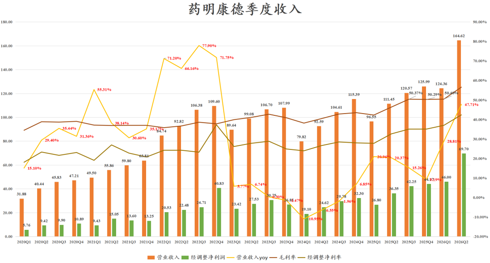
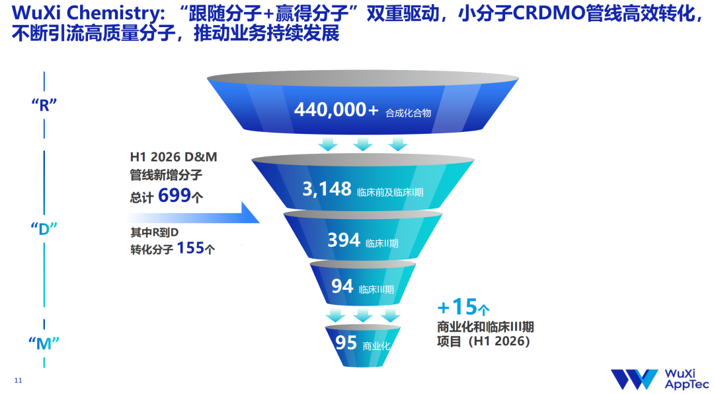

# 疯狂的药明康德

大家好，我是龙哥。

又到了财报季，我们的重点公司财报解读系列也正式开启。

今晚药明康德发布2026中期报告，业绩不可谓不惊艳，全市场都知道药明康德业绩会超预期，但没想到能这么超预期，我们本文详细拆分。

1、收入利润

药明康德2026Q2收入164.62亿元+47.71%创季度收入历史新高，毛利率56.56%同比提升10.21%、环比提升6.16%。另外，药明康德26H1总收入289亿元+39%，首次超过全球CMO第一大龙头Lonza的收入体量（26H1收入33.74亿瑞士法郎+11.2%→约282亿元）。

不需要太多描述，仅从下图就可看出其业绩增长之强劲。

2026Q1公司的收入利润表现已经初现端倪，由于历年Q1都是季度低基数，一般环比前一年的四季度会有所下滑，而26Q1的收入环比基本持平、利润环比微增，Q2则是全面爆发。

26Q1归母净利润64.29亿元+31.49%，扣非归母62.97亿元+93.57%，经调整归母净利润69.70亿元+91.76%，单季度经调整净利率42.34%同比提升9.73%、环比提升5.35%。

药明康德的毛利率和净利率水平已经直追制造业代工顶级企业台积电。

2、业务板块分拆

化学板块：小分子CDMO+TIDES业务+药物发现

①小分子CDMO业务Q2单季度收入80.60亿元+66.87%，预计口服GLP-1类药物全面拉动药明康德的小分子CDMO业务加速增长，这也使得公司小分子CDMO业务的收入体量已经大幅超越新冠大单时的高基数水平。

截至2026年中药明康德小分子CDMO项目数3731个同比+9.45%，药明康德的跟随分子和赢得分子战略依然强悍，其中商业化项目95个同比+25%，同比增加19个、环比增加6个。预计全年小分子CDMO收入有望达到300亿元。

②多肽及寡核苷酸CDMO业务（TIDES）Q2单季度收入48.80亿元+74.91%，相较Q1的23.80亿+6.25%有明显加速，预计受到发货节奏影响，公司上半年TIDES业务客户数增长39%、分子数增长68%，分子数达到561个，公司指引TIDES部门全年实现约45%收入增长，对应约165亿元收入。

③药物发现Q2单季度收入14.26亿元+10.53%，历经15个季度终于回到双位数增长，药物发现的单季度收入已经从2020年的25%以上降到现在不足10%，但仍作为R端仍然在向D端输出分子，上半年从R端向D端转化了155个分子，占公司上半年新增分子数量的22%。

总体化学板块上半年毛利率56.55%同比提升6.48%。

其他业务：测试业务+生物学业务。

①测试业务：药明康德自25Q3剥离临床CRO业务后，叠加行业景气度全面修复，测试业务开始恢复高增长，2026Q1-Q2测试业务分别实现收入11.27亿+28.10%、13.53亿+34.54%，整个上半年安评业务实现收入增长42.80%，测试业务毛利率37.95%同比提升11.32%。

②生物学业务：26Q2收入7.24亿+12.80%，也是过去12个季度首次回到双位数以上增长，生物学业务毛利率34.92%同比下降0.12%。

员工人数：历经3年重回增长

CDMO业务不像CRO业务那样需要大规模的堆人，所以人效可以提到很高，这也是公司利润率得以大幅提升的关键因素之一。截至2026中报药明康德员工人数35584人同比增长5.17%，单季度的人均产出达到46.16万元，26全年有望接近200万元，而在5年前药明康德的人均产出还只有60多万。

药明康德人员数量从2022年达到巅峰的44361人，最低2025年底仅有33834人，期间剥离了人效较低的CGT CDMO和临床CRO业务，以及也有AI应用带来的效率提升，相较高峰时人员数量减少24%，时隔三年到26H1员工人数重回正增长。

3、全年指引更新

①收入：

公司指引由513亿-530亿元上调至585亿-605亿元，持续经营业务收入增速由18%-22%上调至35%-39%。我们的收入预测还要略高于公司指引。

②经调整净利润：

公司未明确具体指引数字，表示“保持稳定且有韧性的经调整Non-IFRS归母净利率水平”，公司26H1经调整净利率40.04%，Q2单季度经调整净利率42.34%，全年如果按40%利润率计算经调整净利润可达到240亿元+，按38%计算也有230亿元+。

③现金流：

全年资本开支由65亿-75亿元上调至75亿-85亿元，其中26H1资本开支29.6亿元，Q2单季度资本开支17.67亿元。全年经调整自由现金流由105亿-115亿元上调至135亿-145亿元。

......

药明康德一方面凭借自身的能力和效率把握住GLP-1多肽药、其他多肽及核酸重磅药物、小分子口服GLP-1等领域的超级风口，实现CDMO业务远超行业的业绩增长，另一方面其也享受到了全球创新药景气度回升带来的对临床前CRO服务需求的增加，出现类似2020-2021年那样的各项业务百花齐放的场景。

除了药明康德以外，国内及海外的一众CRO/CDMO龙头公司也有在近期陆续披露中报或业绩预告，行业内一二线公司出现全面性的业绩修复或加速增长，行业β已经全面显现。

......

近期重点文章：

[最全ETF梳理](https://mp.weixin.qq.com/s?__biz=MzkyMzQ3MDc3Mw==&mid=2247486190&idx=1&sn=600bec8ec657f4f3fed8bdff4a3a9676&scene=21#wechat_redirect)

[创新药，戴维斯双击](https://mp.weixin.qq.com/s?__biz=MzkyMzQ3MDc3Mw==&mid=2247486170&idx=1&sn=df6376ee69620b9baf432903afe1fb64&scene=21#wechat_redirect)

[医药重回潮头之上](https://mp.weixin.qq.com/s?__biz=MzkyMzQ3MDc3Mw==&mid=2247486156&idx=1&sn=daea4227df32e6a7977093f68de5886d&scene=21#wechat_redirect)

[中国人均预期寿命每年增加4个月](https://mp.weixin.qq.com/s?__biz=MzkyMzQ3MDc3Mw==&mid=2247486139&idx=1&sn=267d1876c9fd8b4b2701386e970ac0d7&scene=21#wechat_redirect)

[医药浴火重生，半年度总结](https://mp.weixin.qq.com/s?__biz=MzkyMzQ3MDc3Mw==&mid=2247486118&idx=1&sn=d4059a9da28e951a5227975a6c0aa684&scene=21#wechat_redirect)

风险提示：本文仅讨论行业/公司经营情况，投资需综合考虑公司经营、估值、管理层等多方面因素，建议读者审慎参考，本文不作为投资依据，不建议大家根据本文做出投资计划。

<!-- wxmp-comments-begin -->

---

## 留言（11 条，含回复共 23 条）

- **Vcolder** 👍39 · 2026-08-03 20:36
  医药界的台积电
  - ↳ **作者** · 2026-08-03 20:52
    借你这条补充一个图，可持续经营业务在手订单664亿同比+25%。
- **好人张大仁** 👍20 · 2026-08-03 22:16
  利好出尽，跑路吧，涨了不少了
  - ↳ **作者** · 2026-08-03 22:19
    好的，跑吧
- **雨夜落无声** 👍16 · 2026-08-03 20:25
  爽啊，重仓的药名能不能见到钱啊
  - ↳ **作者** · 2026-08-03 20:28
    之前大家就知道康德Q2业绩会很好，所以你看最近不管大盘和行业怎么跌，康德就稳如泰山，但实际业绩出来还是比乐观预期还要好。
- **Aiolos** 👍13 · 2026-08-03 20:27
  cxo分为药明康德和其他，他的领先真是极度断层的
  - ↳ **作者** · 2026-08-03 20:32
    药明系和其他吧，合联和生物由于发展阶段以及并购等因素的扰动，可能上半年利润弹性没那么大，但像药明生物总体也呈现景气度提升的趋势，合联更是给了5年30%复合增长的目标。
- **肥锋  家诚哥** 👍11 · 2026-08-03 20:28
  没有最强，只有更强
  - ↳ **作者** · 2026-08-03 20:33
    别管割总怎么搞资本运作，最后还是业绩为王，药明系的运营管理实际上也呈现的是越来越向国际化巨头企业靠拢（除了加班以外）。
- **_** 👍7 · 2026-08-03 20:34
  龙哥 再回头看一眼凯莱英的一季报 天上地下一言难尽啊
  - ↳ **作者** · 2026-08-03 20:37
    凯莱英的一季报并不算差，扣除汇率之后已经比较不错了，汇兑的影响在今年是客观存在的，但剥离汇兑因素之后能更好的反映公司业绩的边际大幅提升。
- **陌上初薰** 👍6 · 2026-08-03 20:26
  龙哥，药明这样有地缘政治阴影的公司，应该给多少估值啊。。。
  - ↳ **作者** · 2026-08-03 20:30
    康德这两年除了第一波估值修复之后，后面主要是赚EPS的钱，药明系目前的估值水平仍然只有可比的lonza和三星生物的三分之二左右，本身就隐含了政治因素的估值折价了，而康德本次上调业绩之后PE估值只有其一半了。
  - ↳ **作者** · 2026-08-03 20:34
    虽然地缘的达摩克斯利之剑一直高悬，但其实药明这几年在业绩上一直在证明自己，牛逼公司真的是做全球生意的，好的商业关系甚至超脱政治关系，但估值这块市场还是有偏见，没给那么高
- **知足常乐** 👍4 · 2026-08-03 20:48
  龙哥好！请假一下，AI制药的成都先导，晶泰控股发展空间如何？壁垒如何？
  - ↳ **作者** · 2026-08-03 20:55
    AI制药目前各家各有特点，在前阵子的文章里我们把集中商业模式和国内主要的5家AI制药公司做了个对比，<a class="normal_text_link mp_article_text_link" data-itemshowtype="0" data-unique-id="msd8fdhi-14i9f7" target="_blank" href="https://mp.weixin.qq.com/s/_KvdkV2Cwf6Rf0OoSozIfg">创新药行业积极变化已经出现</a>
    壁垒目前还感受不到，但行业β的确已经显现，上游的卖水人已经开始受益于AI制药带来的分子数量的扩容。
- **卓月如初** 👍4 · 2026-08-03 21:23
  不知康龙化成如何
  - ↳ **作者** · 2026-08-03 21:31
    康龙化成此前已经披露预报，其CDMO业务还在从D到M的过渡期，没能享受到GLP-1和ADC等高景气赛道的超强风口，但CDMO业务也处于加速期，基本面也在向上，但肯定和康德比不了。康龙好在H股估值尤其低。
- **大庆** 👍3 · 2026-08-03 21:17
  龙少，时代天使业绩点评下[呲牙]，谢谢
  - ↳ **作者** · 2026-08-03 21:30
    时代天使案例数、收入、利润全面超预期，前两年主要是海外持续超预期，海外案例数和ASP双升，而从去年下半年以来国内的案例数也快速增长，国内业务的盈利能力也好于预期。此外公司上半年还做了每股4.99港元的特别股息，主要是海外投入已经看到成果，不再需要保留大量现金，且当前经营现金流也已经很不错，公司敢于积极回报股东了。
    公司已经连续几个财报季证明自己了，医药资金还在里面玩偷鸡摸狗的操作，南下资金的持仓比例从最高23.5%一路减持到13.6%，内资越少的地方股价走的越强，天使今年YTD已经58%，医药资金继续狗就是了。
- **谢工** 👍2 · 2026-08-03 20:32
  龙哥，九州这个财报怎么看
  - ↳ **作者** · 2026-08-03 20:36
    就还是一般吧，我最近没跟踪九洲的情况，从诺华那边的情况来看九洲药业可能还在消化诺欣妥专利到期的影响，上半年诺欣妥全球销售24.86亿美元同比下滑了46%，Q2单季度下滑50%，当然诺华的后续品种承接还不错，也会给九洲新的品种。

<!-- wxmp-comments-end -->
