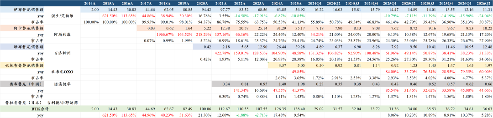
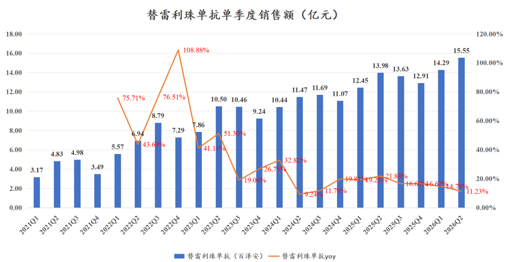
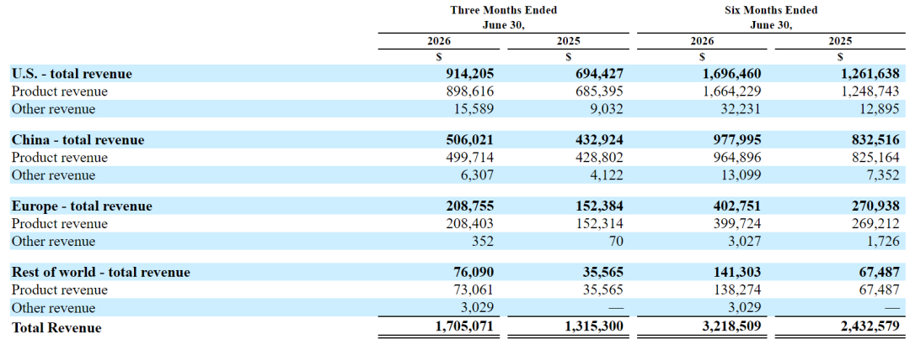
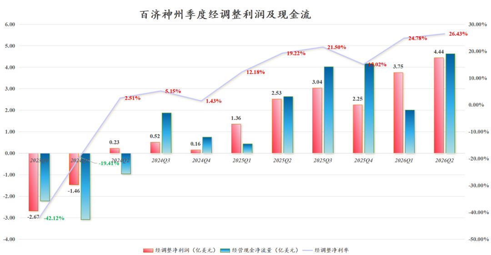
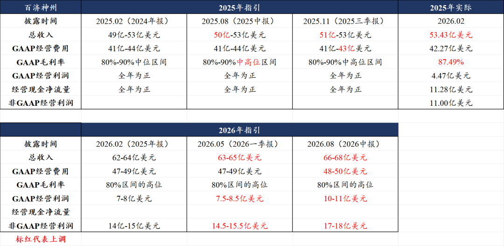
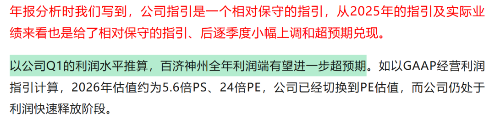
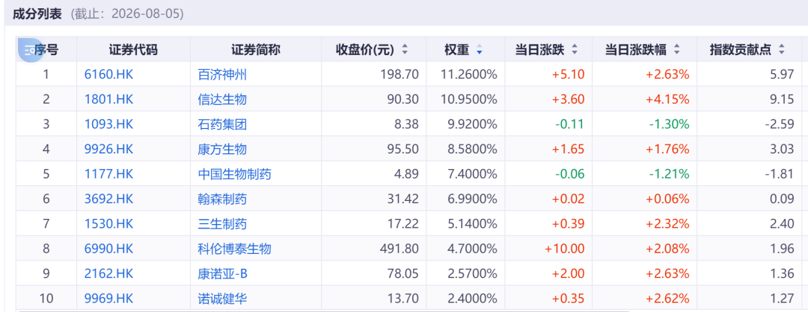

# 百济登顶，疯狂放利润

大家好，我是龙哥。

周一晚上更新了药明康德2026中报分析[疯狂的药明康德](https://mp.weixin.qq.com/s?__biz=MzkyMzQ3MDc3Mw==&mid=2247486197&idx=1&sn=5e367ebedb5e62cc0e59a59bb0434ff8&scene=21#wechat_redirect)，中报解读第二篇，创新药龙头百济神州，中报继续给惊喜，收入利润全面超预期，本文详细拆解。

1、收入端

百济神州2026H1收入32.19亿美元+32%，其中产品收入31.67亿美元+31%，Q2单季度收入17.05亿美元+30%，其中产品收入16.80亿美元+29%。

核心产品方面：

泽布替尼2026H1销售23.42亿美元+34.48%，Q2单季度销售12.48亿美元同比+31.35%、环比+13.96%，比我们此前的预期高2个点，其中美国收入8.93亿美元+30.56%，美国收入占比71.58%。

Q2单季度泽布替尼全球份额提升至34%，首次超越伊布替尼成为全球BTK抑制剂市场份额第一，继传奇生物的Carvykti后第二款国产的BIC创新药在全球市场实现同靶点竞品中登顶。随着伊布替尼的加速下滑，泽布替尼的全球份额还将持续提升。

泽布替尼今年取得一线套细胞淋巴瘤（MCL）适应症的全球III期临床成功，将成为全球首个在一线MCL中去化疗的创新疗法，也将继续贡献泽布替尼的销售增量。

替雷利珠单抗2026H1销售29.84亿元+12.90%，Q2单季度销售15.55亿元+11.23%，单季度收入再创历史新高，但总体替雷利珠单抗国内销售增速逐渐放缓，预计海外有贡献少量收入。

其他代理产品方面，2026H1代理产品销售合计约26.9亿元同比+22.7%，其中代理安进产品收入20.65亿元+19.6%，包括地舒单抗26H1销售1.94亿美元+28.13%，贝林妥欧单抗销售0.71亿美元+42.59%。

收入的区域分布来看，美国区收入占比52.7%，中国区收入占比30.4%，欧洲收入占比12.5%，公司宣布增加投资3亿美元扩建于美国新泽西州的旗舰临床及商业化生产与研发中心，新增小分子药物生产能力。

2、利润及现金流

百济神州全面进入利润释放期。2026H1净利润4.64亿美元+386%，Q2单季度净利润2.37亿美元+151%；2026H1经调整归母净利润8.20亿美元+111%，Q2单季度经调整净利润4.44亿美元+76%，Q2单季度经调整净利率26.43%同比提升7.21%、环比提升1.65%，单季度利润率再创历史新高。

Q2单季度经营现金流4.63亿美元，自2024Q3经营现金流转正以来，仅用4个季度就已经把经营现金流爬坡到单季度超4亿美元（约30亿人民币）的水平。Q2单季度自由现金流4.35亿美元。

3、全面上调全年指引

①收入端由63亿-65亿美元上调至66亿-68亿美元，中位数上调约5%，我们也将泽布替尼全年销售预期由49.5亿美元上调至51亿美元，收入占比约76%。

②利润端，经营费用预期上调1亿美元至48亿-50亿美元，GAAP经营利润由7.5-8.5亿美元上调至10亿-11亿美元，中位数上调约31%，非GAAP经营利润由14.5亿-15.5亿美元上调至17亿-18亿美元，中位数上调约16.7%。

我们预计全年经调整净利润也有望达到17-18亿美元，约120亿人民币，对应当前港股百济神州的估值仅有20倍PE。

一季报点评时（[药王的魅力](https://mp.weixin.qq.com/s?__biz=MzkyMzQ3MDc3Mw==&mid=2247485963&idx=1&sn=0e4bd47c04d86e7fe33093b1202a2b29&scene=21#wechat_redirect)）我们提到公司全年利润端将进一步超预期，Q2指引上调也是此前可期的，基于中报业绩表现来看，三季度公司仍有望继续上调利润端指引。

4、研发管线进展

除上文提到的泽布替尼在一线MCL取得的成功外，公司今年还取得了一系列研发和注册进展：

- 海外：索托克拉作为FDA批准的第二款Bcl2抑制剂在美国正式获批上市，替雷利珠单抗在日本获批一线胃癌，CDK4抑制剂启动一线HR+/HER2-乳腺癌的全球III期临床。
- 国内：HER2双抗泽尼达妥单抗在国内提交一线胃癌的BLA申请，DLL3\*CD3双抗塔拉妥单抗在国内获批上市用于2L+ ES-SCLC，BTK CDAC完成R/R CLL的国内III期患者入组。
- 另外百济还从华辉安健引进了一款PD-1\*CTLA-4\*VEGF三抗的全球权益，百济神州正式加入下一代IO多抗的竞争中。

下半年百济还将启动2款实体瘤创新疗法的全球III期临床→自映恩生物引进的B7-H4 ADC，用于一线卵巢癌维持治疗的全球III期临床，以及GPC3\*4-1BB双抗用于二线肝癌的全球III期临床。

这也意味着百济神州在2026年将新开3款实体瘤药物的全球III期临床，这也是百济作为全球新兴biopharma，能力圈从血液瘤向实体瘤全面拓展的关键年。

.....

创新药和CXO行业正在用业绩全面的证明自己。

过往几年由于CXO行业处于行业景气度低迷的阶段、创新药行业大部分公司尚且处于临床开发阶段，使得财报季对于创新药和CXO往往不太友好，这种情况在2025年有所改善，到了2026年，局面已经完全逆转，创新药和CXO凭借强悍的、持续超预期的业绩不断改变市场认知。

仅本次中报季，即便大部分公司还未发业绩、只有少数公司发预报，我们看到不论是CXO公司中的药明康德、康龙化成、昭衍新药等一二线公司，还是创新药公司中的艾力斯、康诺亚、信达生物、百济神州、荣昌生物等一二线公司，业绩大超预期的表现并不是个例。

此前多次提到的港股创新药指数→恒生港股通创新药精选指数（HSSCPB），从最新的成份股来看，今早发布产品销售数据超预期的信达生物，今晚发布中报超预期的百济神州，为指数的前两大权重股，合计超过22%的持仓占比，此前发布产品销售数据超预期的康诺亚也位列前十大。

创新药及CXO行业越来越多的公司，会用坚实的管线推进、强悍的业绩释放，向市场持续证明自己。

......

近期重点文章：

[疯狂的药明康德](https://mp.weixin.qq.com/s?__biz=MzkyMzQ3MDc3Mw==&mid=2247486197&idx=1&sn=5e367ebedb5e62cc0e59a59bb0434ff8&scene=21#wechat_redirect)

[最全ETF梳理](https://mp.weixin.qq.com/s?__biz=MzkyMzQ3MDc3Mw==&mid=2247486190&idx=1&sn=600bec8ec657f4f3fed8bdff4a3a9676&scene=21#wechat_redirect)

[医疗反腐后劲很大](https://mp.weixin.qq.com/s?__biz=MzkyMzQ3MDc3Mw==&mid=2247486176&idx=1&sn=bc21591f0df68febcb5e12207a3d3366&scene=21#wechat_redirect)

[创新药，戴维斯双击](https://mp.weixin.qq.com/s?__biz=MzkyMzQ3MDc3Mw==&mid=2247486170&idx=1&sn=df6376ee69620b9baf432903afe1fb64&scene=21#wechat_redirect)

[医药重回潮头之上](https://mp.weixin.qq.com/s?__biz=MzkyMzQ3MDc3Mw==&mid=2247486156&idx=1&sn=daea4227df32e6a7977093f68de5886d&scene=21#wechat_redirect)

风险提示：本文仅讨论行业/公司经营情况，投资需综合考虑公司经营、估值、管理层等多方面因素，建议读者审慎参考，本文不作为投资依据，不建议大家根据本文做出投资计划。

<!-- wxmp-comments-begin -->

---

## 留言（13 条，含回复共 22 条）

- **墨** 👍7 · 2026-08-05 21:22
  持有百济，一路颠簸，终于可以吃口肉了
- **山清水秀** 👍4 · 2026-08-05 20:49
  重仓百济和信达的这个指数有可投标的吗？
  - ↳ **作者** · 2026-08-05 20:54
    也说过好多次啦，520880港股通创新药ETF
- **胡同** 👍4 · 2026-08-05 20:52
  老师，请问康龙化成有潜力吗？有利好吗？
  - ↳ **作者** · 2026-08-05 20:55
    康龙化成的话也有潜力，短期业绩弹性可能不如药明系和凯莱英，但总体也是呈现受益于行业景气度回升和CDMO业务加速的。
- **caoguoan** 👍4 · 2026-08-05 21:20
  去年是BD引爆行情，今年基本面兑现。还记得龙哥说过，现在是创新药增速最好的3-5年，紧紧抓住[坏笑]
- **肥锋  家诚哥** 👍3 · 2026-08-05 21:21
  康德总于等到了正名，继续等待历史新高。下一步等生物下半年和明年发力
- **Orange** 👍2 · 2026-08-05 20:52
  恒瑞有没有惊喜
  - ↳ **作者** · 2026-08-05 20:55
    产品销售端应该比较难有大的惊喜，毕竟国内销售多少还是有可能受一些Q2医疗反腐的影响。总体业绩的话要看公司对BD收入的确认节奏了。
- **星移无痕** 👍2 · 2026-08-05 20:55
  信达和荣昌的业绩预告算是预期内吧
  - ↳ **作者** · 2026-08-05 20:56
    信达的业绩是略超预期的，荣昌因为主要是BD收入确认，产品收入的话估计是符合预期的。
- **Iven Ge** 👍2 · 2026-08-05 20:58
  龙大，再鼎医药8-6日的业绩说明会您预计会有什么利好消息释放吗？业绩的利空算是明牌了吧
  - ↳ **作者** · 2026-08-05 21:03
    利好估计没有吧，他业绩期能有啥利好，今年整个再鼎研发和商业化都是缺少一些催化的，只是说估值底部区间震荡，真要有大的利好的话感觉大概率要到27年。
- **吴天保** 👍2 · 2026-08-05 21:05
  龙哥能预测下明天再鼎的半年报吗，会不会还有惊吓？
- **_** 👍2 · 2026-08-05 21:09
  龙哥，接下来会不会和AI科技线一样，资金逐渐对药的超预期脱敏，给后面还没释放业绩的公司加压
  - ↳ **作者** · 2026-08-05 21:14
    问题是，你得像AI科技那样涨了那么多、全行业的估值和预期都提起来了，才会像你说的那样，现在今年医药指数都还是负的呢，属于和老登一样的地位呢，咋就这么高的预期了。
- **岁月静好** 👍2 · 2026-08-05 21:15
  龙大  泰格医药走势比较弱，还有潜力吗
  - ↳ **作者** · 2026-08-05 21:18
    泰格就是等俩事，一个是实控人被立案的事盖棺定论。另一个就是逐季度的业绩环比修复。去年CXO行业是预期修复，所以全行业估值先修复，今年就是谁业绩硬谁就走的强，纯拔估值就比较难。
- **阿尔帕ALPA  周** 👍2 · 2026-08-06 00:25
  老师。索托克拉的全球销售额是多少？公司没有披露？已经在美国获批一个适应症了，理应产生收入了吧？
  - ↳ **作者** · 2026-08-06 00:35
    索托克拉是5月份在美国获批的，批的小适应症R/R MCL，应该没卖多少，公司就没单独披露，估计今年全年可能在小几千万美元到中几千万美元之间吧。
- **fatty hooper** 👍1 · 2026-08-05 21:02
  龙哥 合联感觉今年业绩压力有点大？并购费用和转固有拖累
  - ↳ **作者** · 2026-08-05 21:04
    是的，对中期业绩会有些压力，所以短期股价表现就显著弱于康德。

<!-- wxmp-comments-end -->
