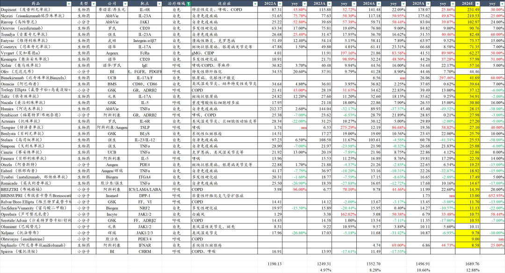
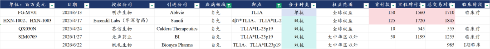
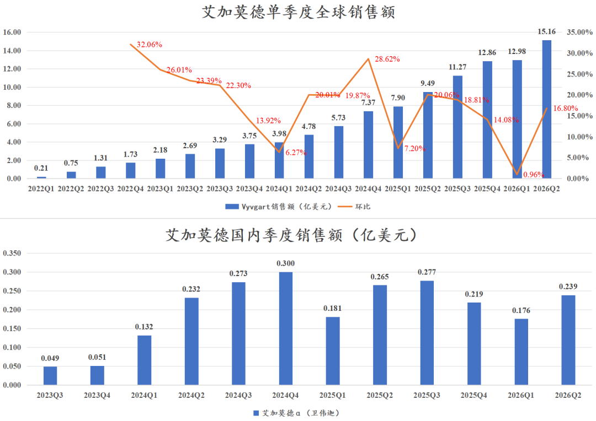
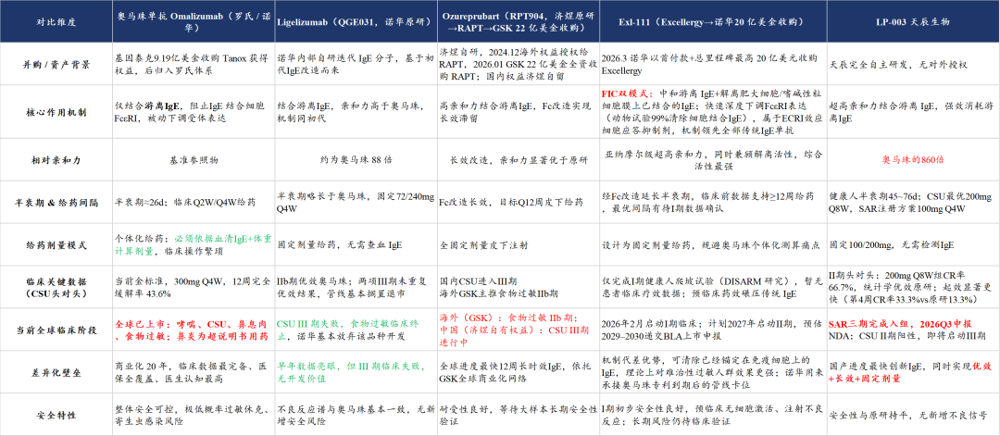
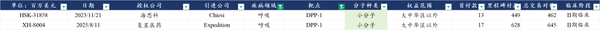
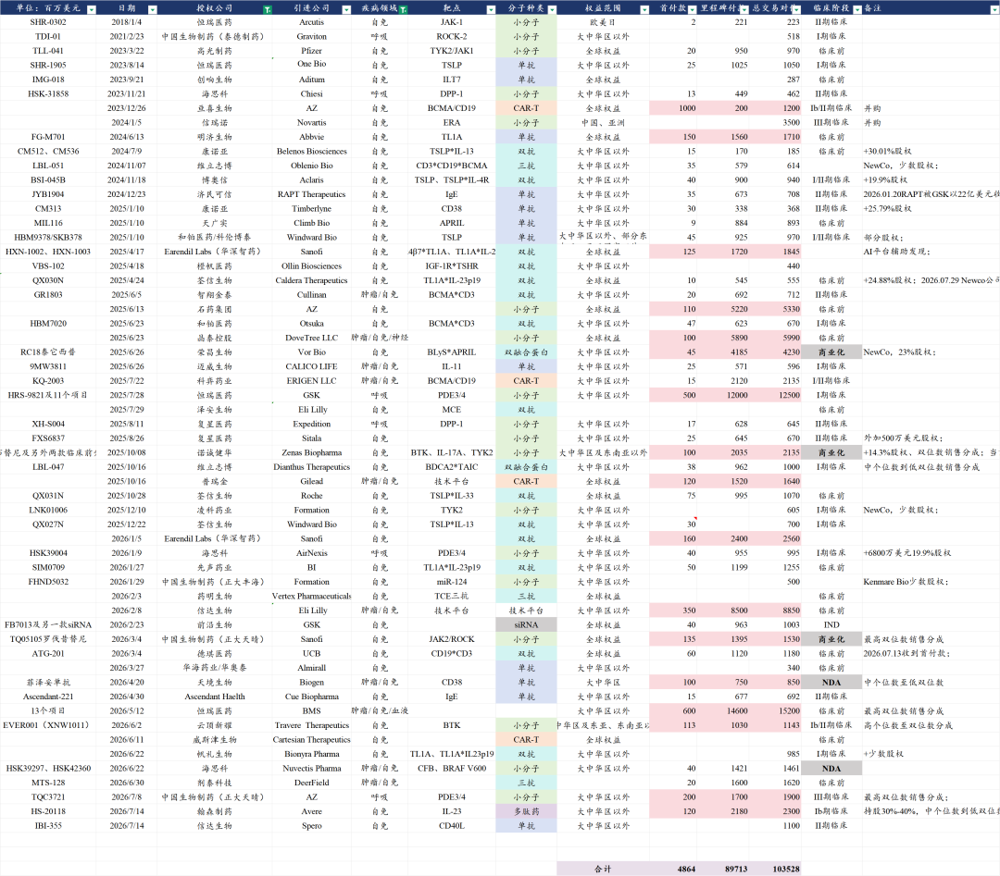

# 超级大药，全面超预期

大家好，我是龙哥。

海外顶级跨国药企（MNC）的中报发布已经结束，MNC业绩指引全面上调，继续验证全球创新药及产业链的景气度，近期我们会用2篇文章为大家梳理全球创新药市场情况。

2026年上半年全球创新药市场表现最为亮眼的行业除了大家已经熟知的GLP-1减肥代谢药物，就是自免呼吸药物，本文我们梳理全球自免大药在26年上半年的表现，以及国内自免领域的研发情况。

1、自免行业

过去10年自身免疫性疾病一直是仅次于肿瘤的全球第二大药物市场，曾经的自免超级大单品阿达木单抗在2012-2022年连续11年蝉联全球药王之位，直到2023年被帕博利珠单抗超越，2022年全球自免领域也仅有阿达木单抗一个200亿美金药物以及5个50亿美元+药物，而在阿达木单抗专利到期大幅下滑之后，2026年全球自免药物全面爆发，将诞生2个200亿美金和1个100亿美金的超级重磅炸弹药物，以及另外7个超50亿美金的重磅炸弹药物。

从我们统计的MNC自免/呼吸领域核心药物来看，2023-2026年的行业增速分别约为4.97%、8.28%、10.66%、12.88%，行业销售额持续加速，除2024年外（24年GLP-1、SGLT2等代谢类药物的贡献较大）的行业增速显著高于总体全球创新药行业增速，2026年预计38款自免/呼吸领域的重磅大药合计贡献约1700亿美元收入，平均单款药物收入45亿美元。

2、超预期大单品

赛诺菲IL-4Rα，优时比IL-17A/F，艾伯维IL-23p19、JAK1，强生IL-23p19，Argenx FcRn，Amgen/AZ TSLP等自免/呼吸大药在2026年上半年销售增长强劲。

1）IL-4Rα

赛诺菲2026中报收入221.06亿欧元+15.7%，美国区收入116.33亿欧元+29.9%，核心产品度普利尤单抗（IL-4Rα）收入93.24亿欧元+34.4%，Q2单季度收入51.54亿欧元同比+37.6%，环比Q1的41.7亿欧元增长23.6%，也是首次单季度销售突破50亿欧元。

过去大家熟知度普利尤单抗主要是源自中重度过敏性皮炎（AD），或者说湿疹，Dupi凭借较好的疗效和安全性拿下全球AD市场主要份额，在国内市场纳入医保后销售也有所爆发，但Dupi的能力不局限在AD，目前Dupi已经批准了包括慢性自发性荨麻疹（CSU）、中重度哮喘、慢阻肺（COPD）等超大适应症在内的9个适应症，尤其是作为首款获批COPD（全球超2亿患者、国内超5000万患者）这个超大适应症的生物制剂，从而带来Dupi的销售在2025-2026年得以加速增长。

赛诺菲将全年收入增长指引由高个位数上调至10%左右，将度普利尤单抗2030年销售目标由220亿美元上调至250亿欧元（接近300亿美元），但从目前的销售情况来看，预计2026年dupi销售大概率突破200亿欧元，2030年销售规模有望进一步上调。

国内市场，目前获批上市的有一款康诺亚的司普奇拜单抗，已经获批3个适应症（皮炎、鼻炎、鼻窦炎伴鼻息肉）和申报上市1个适应症（结节性痒疹），领先其他国产厂家2年纳入医保、并得以纳入基药目录，也是在皮肤科和鼻科唯一纳入基药目录的生物制剂。

IL-4Rα的后续竞争者众多，目前有5款IL-4Rα处于申报上市阶段，分别是康方生物的曼多奇单抗（2026.02）、三生国健的611（2026.02）、智翔金泰的泰利奇拜单抗（2026.02）、先声药业/康乃德的乐德奇拜单抗（2026.04）、康哲药业/麦济生物的柯美奇拜单抗（2026.04），另外还有3款处于III期临床阶段，分别是华东医药/荃信生物的QX005N、恒瑞医药的SHR-1819、中国生物制药的TQH2722。

赛诺菲的后续自免管线方面，去年以来有两款BTK抑制剂获批上市，第一款Rilzabrutinib获批ITP，第二款tolebrutinib获得欧盟批准SPMS（继发进展型MS）。公司在近期也连续终止OX40L单抗和IL-33单抗两款潜在重磅药物的开发，此前TSLP\*IL-13双抗治疗AD的II期临床失败，Dupi的全球主要市场专利将在2031年到期，而赛诺菲对下一代承接药物方面仍未明确，未来不排除会选择国内进展较快的项目进行合作，潜在合作方如康诺亚、信达生物等。

基于度普利尤单抗不足之处开发的下一代自免药物也已经陆续进入临床阶段，相较Dupi的每双周给药，下一代自免双抗在疗效上非劣或超越Dupi的基础上争取做到超长效给药（3-6个月给药间隔），国内康诺亚开发的CM512（TSLP\*IL-13）在赛诺菲的TSLP\*IL-13双抗AD失败后升至全球第一顺位，且即将读出首个适应症的国内II期临床数据，荃信生物/Windward的QX027N也在快速推进。信达生物的IL-4Rα\*TSLP双抗已经进入II期临床，康方生物的IL-4R\*ST2双抗也已经进入II期临床，再鼎医药的IL-13\*IL-31在今年进入I期临床。

2）IL-23p19

艾伯维2026H1核心自免管线利生奇珠单抗（Skyrizi，IL-23p19）销售99.88亿美元同比+27.3%，乌帕替尼（Rinvoq，JAK1抑制剂）销售46.44亿美元同比增长24.0%。以此推算26全年利生奇珠单抗销售有望达到220亿美元，乌帕替尼销售有望突破百亿美元，两款药物将为艾伯维在2026年贡献超过320亿美元收入，而曾经艾伯维的目标是这两款药物的销售峰值能超越阿达木单抗的210亿美元，在达峰尚有距离的2026年就已经远远超过。

强生的古塞奇尤单抗（Tremfya，IL-23p19）2026H1销售36.54亿美元+70.6%，26全年有望突破80亿美元，在乌司奴单抗专利到期后强生全力推古塞奇尤单抗，将成为强生下一个百亿美金大单品。

IL-23p19主要覆盖两大类自免疾病→银屑病和炎症性肠病。

对于银屑病，很多读者了解的多一些，主要是发病率高（全球患者超4000万，中国患者约700万）、直接影响外观（进而影响社交和工作生活）、大多伴随瘙痒或剧烈瘙痒，因此治疗意愿强且现有生物制剂的效果已经非常好，像上文提到的利生奇珠单抗在中重度银屑病适应症可以做到3个月给药一次，用药一年平均可以达到80%以上的PASI90（皮损缓解90%）和50%以上的PASI100（皮损完全清除），疗效好+超长效，几乎已经是银屑病这种慢病的一款“杀死比赛”的药物。

国内公司过去多年在银屑病领域的布局以IL-17A为主，IL-17A的布局企业超过20家，其中目前已经获批上市的厂家就有6家（4国产+2进口），还有3家处于申报上市阶段，司库奇尤单抗的生物类似药已经有2家申报上市。

而对于全球销售规模大的多的IL-23p19单抗，国内则是鲜有公司布局，目前进度比较快的只有信达生物的匹康奇拜单抗已经获批、翰森自荃信生物引进的QX004N处于III期临床阶段。

炎症性肠病了解的读者可能没那么多，主要是这类疾病在国内的发病率并不算很高（IBD合计不到100万人），诊疗率也偏低，总体还处于临床医生和患者教育的早期，但在海外市场，IBD已然成为一个超大药物市场，利生奇珠单抗约三分之一的收入（26年预计超70亿USD）来自IBD，乌帕替尼、古塞奇尤单抗均有相当一部分收入来自IBD，治疗IBD的维得利珠单抗销售额超70亿美元。

MNC在2023年花费巨额资金布局下一代IBD潜在创新疗法TL1A单抗→默沙东以108亿美元收购Prometheus、罗氏以71亿美元首付款+1.5亿美元近期里程碑收购Roivant、赛诺菲与TEVA达成5亿美元首付款+10亿美元里程碑付款的BD协议。

在该靶点上国内开发了多款双抗进行海外授权，包括先声药业、荃信生物等在国内自免领域有较深入布局的公司，也有AI制药的知名biotech华深智药。靶点布局上主要以TL1A\*IL-23p19为主，这两个靶点都已经验证在IBD上的疗效，希望通过双抗的药物形式争取实现进一步的疗效突破。

3）JAK抑制剂

包括上文提到艾伯维的乌帕替尼在内的5款JAK抑制剂全球销售额已经接近200亿美元，但这尚不是JAK抑制剂的全部实力，在斑秃、白癜风等潜在大适应症上，JAK抑制剂还在持续拓展市场。

国内诺诚健华开发的ICP-332（TYK2/JAK）治疗中重度特应性皮炎的III期临床成功、治疗白癜风的II期临床成功，通过双靶点的分子设计，希望兼具疗效和规避JAK抑制剂的安全性风险黑框警告。

4）其他靶点

①FcRn：

Argenx的艾加莫德（Vyvgart，FcRn）2026H1销售28.14亿美元+61.85%，预计全年有望超过60亿美元。FcRn主要覆盖罕见病为主，可以在海外定极高的市场价格，但在支付能力有限的国内市场的销售推广就遇到较大的瓶颈，同一款药物在国内和海外销售结果差距之大：

②IL-17A/F

优时比（UCB）2026中报收入42.7亿欧元+27%，其中核心产品比奇珠单抗（Bimzelx，IL-17A/F）销售15.28亿欧元/17.83亿美元同比增长91%，固定汇率下增速超过100%，美国销售11.44亿欧元同比增长110%。IL-17A/F虽然在银屑病适应症上展示了远超IL-17A的疗效，但其主要销售额实际上来自化脓性汗腺炎（HS）适应症的强劲需求。

化脓性汗腺炎(HS) 是毛囊闭锁驱动的慢性复发性炎症性皮肤病，以疼痛性结节、脓肿、窦道、瘢痕为核心特征，炎症期疼痛明显、分泌物异味，严重影响生活质量和社交，无根治手段，需长期管理，全球发病率接近1%，其中欧美发病率达到1%-2.1%，非裔发病率尤其高，患者群体庞大，全球患者群体约为8000万人，中国患者人群约为47万人。

目前全球HS疗法主要包括：①轻度患者口服抗生素治疗；②中重度患者目前全球仅有阿达木单抗、司库奇尤单抗、比奇珠单抗三款药物获批；③手术治疗，急性期切开脓肿引流、但无法阻止复发，慢性期可通过完整切除病灶+植皮治疗。

司库奇尤单抗在2024年实现销售加速增长，也是源自2023年10月获批HS适应症。

国内在IL-17A/F双抗开发进度最靠前的是丽珠集团，已经提交银屑病的上市申请，但没开发HS适应症；另外诺诚健华的IL-17A/F小分子在26Q2启动I期临床，HS是其探索方向之一。

③IgE

罗氏的奥马珠单抗2026H1销售16.73亿瑞士法郎（21亿美元）同比+27%，另外诺华销售7.3亿美元同比-19%，罗氏奥马珠单抗销售重回高增长，主要来自食物过敏适应症在美国放量。奥马珠单抗专利已经陆续到期，后续可能会面对部分生物类似药的竞争，由于IgE单抗在哮喘、CSU、食物过敏、鼻窦炎等大适应症的潜力，MNC也在积极布局下一代IgE抗体，GSK和诺华在2026年初分别以22亿美元和20亿美元的价格并购相关资产。

国内市场推进速度相对较快的主要是天辰生物，目前过敏性鼻炎适应症已经完成国内III期临床，CSU适应症已经完成头对头奥马珠单抗的II期临床并取得优效，将启动III期临床。

④TSLP

阿斯利康/Amgen共同开发的Tezspire（特泽鲁单抗）2026H1全球销售11.50亿美元+39%，其中Q2单季度销售6.57亿美元环比+33%、同比+44%，TSLP单抗可以覆盖非Th2介导的炎症，对于IL-4R、IL-5等靶点无效的患者人群也可以覆盖，对于患者群体庞大的哮喘和慢阻肺人群来说是个潜在重磅增量品种，预计2026年特泽鲁单抗有望超过25亿美元全球销售，且这是在目前全球仅获批哮喘和慢性鼻窦炎伴鼻息肉两个适应症的情况下，患者群体更大的COPD目前尚处于III期临床阶段。

国内对TSLP单抗的开发进度较为靠前的公司如恒瑞医药、和铂医药，都是开发长效抗体，目标相较特泽鲁单抗的Q4W给药可以大幅延长给药间隔。另外国内开发的一系列自免双抗，很多都是覆盖TSLP靶点，对于IL-4R/IL-13单抗来说就可以将原本只能覆盖嗜酸粒细胞升高人群的哮喘/COPD适应症扩大到覆盖全人群。

⑤DPP-1

Insmed开发的BRINSUPRI（布瑞索卡替）2026H1销售5.17亿美元，其中Q2单季度销售3.09亿美元环比+49%，这是该药物上市的第三个季度，2025Q4-2026Q2的单季度销售额分别为1.73亿、2.08亿、3.09亿美元，2026全年销售额有望达到13亿-14亿美元。

国内目前有两款DPP-1进行海外BD授权，其中海思科的HSK31858已经在开展非囊性纤维化支气管扩张症的III期临床。

......

不考虑生物类似药的情况下，2025-2026年这一年半多一点的时间里，我国创新药海外授权了超过40个自免相关的项目，交易总包超过1000亿美元：

自免相关的项目在BD交易时的首付款规模普遍不算特别大，但一些海外进展却是可圈可点，如：

- 荃信生物的TL1A\*IL-23p19双抗Newco授权公司Caldera刚在7月底获得2.78亿美元融资，估值达到8亿美元。
- 康诺亚的BCMA\*CD3双抗Newco授权公司Ouro在26年3月被吉利德科学以16.75亿美元首付款+5亿美元里程碑收购。
- 复星医药此前海外授权DPP-1抑制剂的Expedition在25年10月融资1.65亿美元、26年8月5日融资1.15亿美元，靠着仅用了1700万美元首付款引进的DPP-1在不到1年时间里实现合计2.8亿美元融资。
- 恒瑞医药海外授权TSLP单抗的Aiolos公司在2024年1月被GSK以10亿美元首付款+4亿美元里程碑收购。

对于全球创新药行业来说，自身免疫性疾病已经连续时间作为成熟的第二大药物领域，对于中国创新药行业来说，自身免疫性药物在国内刚刚进入商业化放量初期，在出海方面也是刚开始呈现部分临床进展，相信自身免疫性疾病可以在中国市场缔造几家兼具国内收入体量和出海价值的优秀biopharma。

......

近期重点文章：

[最全ETF梳理](https://mp.weixin.qq.com/s?__biz=MzkyMzQ3MDc3Mw==&mid=2247486190&idx=1&sn=600bec8ec657f4f3fed8bdff4a3a9676&scene=21#wechat_redirect)

[创新药，戴维斯双击](https://mp.weixin.qq.com/s?__biz=MzkyMzQ3MDc3Mw==&mid=2247486170&idx=1&sn=df6376ee69620b9baf432903afe1fb64&scene=21#wechat_redirect)

[医药重回潮头之上](https://mp.weixin.qq.com/s?__biz=MzkyMzQ3MDc3Mw==&mid=2247486156&idx=1&sn=daea4227df32e6a7977093f68de5886d&scene=21#wechat_redirect)

[医药浴火重生，半年度总结](https://mp.weixin.qq.com/s?__biz=MzkyMzQ3MDc3Mw==&mid=2247486118&idx=1&sn=d4059a9da28e951a5227975a6c0aa684&scene=21#wechat_redirect)

风险提示：本文仅讨论行业/公司经营情况，投资需综合考虑公司经营、估值、管理层等多方面因素，建议读者审慎参考，本文不作为投资依据，不建议大家根据本文做出投资计划。

<!-- wxmp-comments-begin -->

---

## 留言（18 条，含回复共 37 条）

- **十里春风不入秋** 👍7 · 2026-08-07 11:08
  昨天百济被内幕狗们又拉了下来，真的是太恶心了。不过今天创新药又在反包，整个个市场情绪都在好转，很有信心这波会拉到比去年更高的高度，相信龙哥[呲牙]
  - ↳ **作者** · 2026-08-07 11:12
    也不是内幕狗，就是百济这个之前确实有预期业绩会不错，尤其是利润端，然后你看前天就有资金提前进去了嘛，然后昨天就一顿博弈，不过这种短线的交易我觉得还是要钝化一点，毕竟玩短线现在绝大部分人也玩不过AI，还是要靠对中长期产业趋势的常识性判断以及对产业和公司的深入研究来赚超额收益。
- **Patrick** 👍7 · 2026-08-07 11:18
  要不说你们炒股的什么都懂呢
  - ↳ **作者** · 2026-08-07 11:20
    一时分不清你在夸我们还是在嘲讽我们[捂脸]
  - ↳ **作者** · 2026-08-07 11:24
    没有没有嘲讽意思，我只是惊讶你居然能做这么完善的整合[憨笑]
- **WUWEI** 👍4 · 2026-08-07 11:09
  中国生物医药龙头🐲恒瑞医药 强的没话说[强]
  - ↳ **作者** · 2026-08-07 11:16
    从管线上来说恒瑞的自免管线也是比较丰富的和强悍的，尤其是他们做的那个SHR1139（IL-23p10*IL-36R），可以做半年到一年一针的超长效给药，此前发布的早期临床数据疗效也非常惊艳。恒瑞也在从follow往前迈一步。至于股价估值嘛，短期报表端的药品增速还没那么高，所以一直还在消化估值，等一个爆发的时间点。
- **风的影子** 👍4 · 2026-08-07 11:27
  感觉再鼎医药中报很一般啊，今天咋突突上去了[捂脸]
  - ↳ **作者** · 2026-08-07 11:39
    <a class="normal_text_link mp_article_text_link" data-itemshowtype="0" data-unique-id="msiecc30-buseb9" target="_blank" href="https://mp.weixin.qq.com/s/Qt2uqzxN6d0lVpZSFFy9HQ">再鼎医药，黎明前的黑暗</a>
- **WISCHUANG** 👍3 · 2026-08-07 11:14
  龙哥出品，先攒再看
  - ↳ **作者** · 2026-08-07 11:16
    这篇长文真是内容很丰富了，可以收藏的[抱拳]
- **蚂蚁** 👍3 · 2026-08-07 12:25
  太专业了，根本看不懂
  - ↳ **作者** · 2026-08-07 12:35
    天天讲行业观点搞的不少人老说我吹，这不得讲点专业的让大家知道我不是瞎吹[叹气][叹气]
- **Asherl.W** 👍2 · 2026-08-07 11:44
  龙哥，可以给人看病了吧[偷笑]
  - ↳ **作者** · 2026-08-07 11:49
    那可不敢，术业有专攻，我全行业研究这么多年，相比专业的医生也就是点皮毛，医生光在学校就得学8年，加上规培轮岗，我这完全不是一回事。
    借这条也想说一句，现在国内的医疗市场大家也都知道，希望大家平时还是对医生多点包容、多点理解，不要真搞的未来无人愿意学医了，那大家找谁看病去呢，真的都靠豆包吗？
- **鲲鹏** 👍2 · 2026-08-07 11:52
  羡慕创新药，继续熬着出海器械，大盘3700刚回本，大盘3900亏麻了；南微有潜在雷嘛，安杰思中报业绩不咋地
  - ↳ **作者** · 2026-08-07 11:55
    南微之前一直说中报之后应该可以集采出清，但当时一季报超预期嘛，打乱了节奏，中报之后会考虑和几个出海器械公司一起写一篇文章分析一下的。
- **Touch🍀** 👍2 · 2026-08-07 12:01
  无意冒犯，好奇问下，因为医药行业对于普通人来说门槛较高，专业性极强，我们对于行业的理解和信息搜集能力远不如您这样的专业人士。如果行业里有一些负面消息，或是整体基本面向下，你是否也会在文章里分享并提示风险呢？
  - ↳ **作者** · 2026-08-07 12:15
    你翻翻我的历史文章就知道了，重大风险点也会解读或者展示数据的。
- **周周** 👍2 · 2026-08-07 12:06
  请教一下，泰格这种CRO业绩拐点也到了吧？
  - ↳ **作者** · 2026-08-07 12:16
    业绩拐点肯定是已经出现了，但他还没有像其他CXO那样业绩爆发，季度环比改善肯定是能看到的。
- **钱景无限🍀** 👍2 · 2026-08-07 12:37
  龙哥你这太专业了，我们都看不懂啊，我就是死拿着。[捂脸][捂脸]
  - ↳ **作者** · 2026-08-07 12:45
    看得多了就懂了，把公众号加星标，多看多提问[加油]，我好多读者都是看了好几年慢慢变专业的
- **笑看风云** 👍2 · 2026-08-07 13:21
  龙哥，金斯瑞科技半年报是不是也不错啊，最近强的很呢
  - ↳ **作者** · 2026-08-07 13:22
    金斯瑞是AI制药上游产业链的逻辑，包括今天一众生命科学上游公司大涨都是。
- **🇪 🇪 🇦 🇸 🇹** 👍1 · 2026-08-07 12:45
  大A:管你这那的先把减肥药批量顶涨停[衰]
  - ↳ **作者** · 2026-08-07 12:46
    减肥药放下一篇，减肥药大家比较容易理解。其实这篇是前几天写好的，今天得空发~
- **文子姐姐** 👍1 · 2026-08-07 14:17
  我家孩子的特炎就是用了司普齐拜才好的，这个药真好，我一直都在搜索厂家，不知道是不是上市公司，今天终于找到了，谢谢龙大，买入做中线。
  - ↳ **作者** · 2026-08-07 14:27
    为啥会不知道厂家，药品包装上都有厂家啊。康诺亚的司普奇拜单抗现在覆盖的特应性皮炎和过敏性鼻炎，确实是患者群体超大、用药刚需性强的。
- **求索者** 👍1 · 2026-08-07 14:32
  龙哥，我又来立flag了，上次立肿瘤，这次立自免的，在不远的将来，自免领域也会出一款具备停药治愈潜力的超级大单品，如同肿瘤领域的LBL024一样[呲牙]。
  - ↳ **作者** · 2026-08-07 14:35
    代码：
- **第二十条正当防卫** 👍1 · 2026-08-07 16:14
  三生国建为什么估值如此之低？[握手]
  - ↳ **作者** · 2026-08-07 16:16
    三生国健市值比母公司三生制药还高，哪里估值低了[破涕为笑]
- **长海伯伯樱桃园** · 2026-08-07 14:45
  我想问，目前有没有能够清除HPV的药
  - ↳ **作者** · 2026-08-07 14:48
    亚虹医药有一款治疗HPV感染引起的宫颈癌前病变的光动力疗法。
- **着火了** · 2026-08-07 15:22
  高血压有没有在研的医药或者疫苗？
  - ↳ **作者** · 2026-08-07 15:35
    高血压在研的药物目前比较值得关注的主要是AGT siRNA。

<!-- wxmp-comments-end -->
