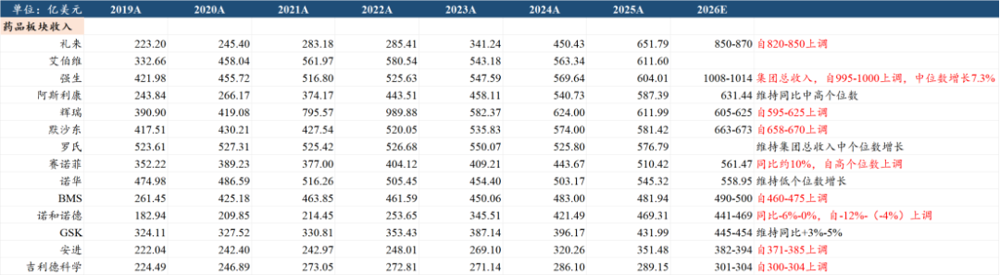
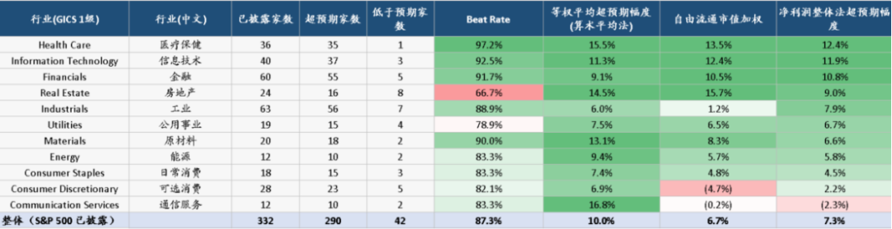
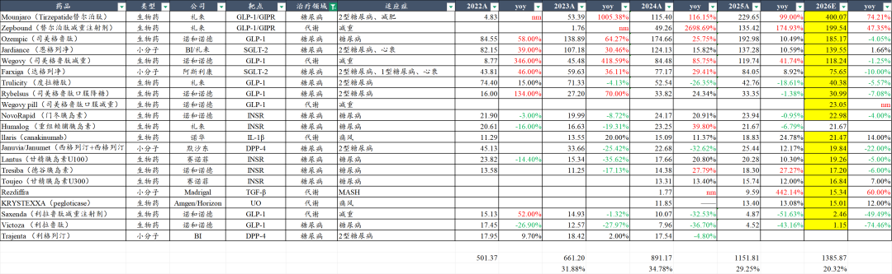
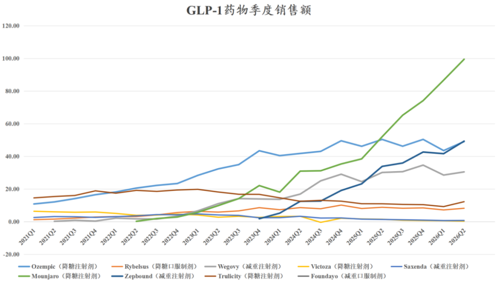
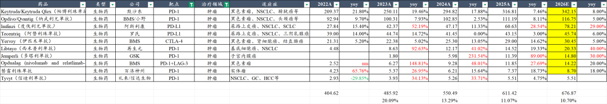
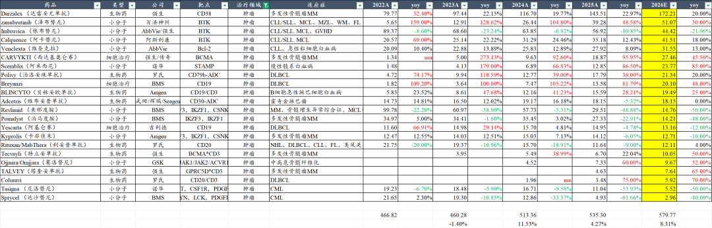
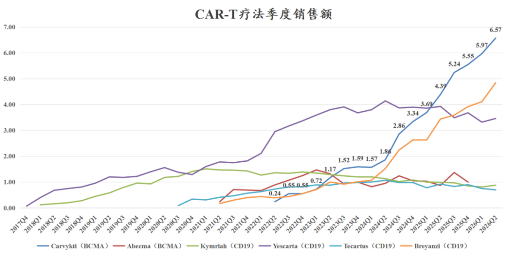

# 全球创新药，景气度全面提升

大家好，我是龙哥。

MNC中报梳理第二篇，前面第一篇我们聊了自免这个超大赛道《[超级大药，全面超预期](https://mp.weixin.qq.com/s?__biz=MzkyMzQ3MDc3Mw==&mid=2247486223&idx=1&sn=d3ac3221cd42a704e485548e60518cd6&scene=21#wechat_redirect)》，本文我们主要聊聊全行业的情况以及代谢和肿瘤这些自免以外的重点大赛道。

1、全球创新药行业景气度全面提升

创新药行业的景气度提升已经在切实反映在全球MNC公司的财报中，不再是“预计”和“预期”，而是可以用切实的数字来证实。

从我们梳理的14家全球头部跨国药企的中报收入指引来看，除了艾伯维外，另外13家MNC中有9家上调指引、4家维持指引，没有公司下调指引。

其中上调比较多的，礼来从820亿-850亿美元上调至850亿-870亿美元，上调了20亿-30亿美元，BMS从460亿-475亿美元上调至490亿-500亿美元，上调了25亿-30亿美元，诺和诺德也上调了4%-6%，大概对应20亿-30亿美元，强生、赛诺菲等也上调超过10亿美元。

张亿东统计的美股公司中报情况来看也是类似的结论，截止到上周二的数据显示，美股医疗保健行业披露财报的36家公司中有35家公司的业绩超预期，业绩beat的比例高达97.2%，在所有大类行业中高居首位，净利润超预期幅度12.4%也是所有行业首位。

2、超预期大单品

1）糖尿病/减重等代谢领域

（注意：本文所有对2026年全年销售额预测均为根据MNC中报推测，非真实全年销售额，会根据每一期财报情况做修正）

糖尿病、减重领域仍然是全球创新药领域最大亮点，但行业已经出现较大幅度分化，司美格鲁肽除了新获批上市的减重口服剂型以外预计将面对全面下滑，而礼来的替尔泊肽则继续呈现超预期的销售表现。

降糖制剂Mounjaro上半年销售186亿美元同比+106%，减重制剂Zepbound上半年销售91亿美元同比+60%，替尔泊肽上半年合计销售277亿美元同比+88%，Q2单季度销售148.71亿美元同比+73.3%、环比+15.98%。

26Q2替尔泊肽在全球GLP-1药物的份额提升到58.2%，司美格鲁肽则降至36.26%。

整个26H1，司美格鲁肽、利拉鲁肽、替尔泊肽、度拉糖肽、奥氟格列隆这5款主要的GLP-1类药物合计实现全球销售额476.8亿美元同比+39%，其中降糖剂型销售316.1亿美元+38.3%，减重剂型销售160.7亿美元+40.6%。

GLP-1类代谢药物的爆发，造就了礼来这个全球首个万亿美元市值MNC，也帮助给其做CMO代工的药明康德业绩爆发、股价重回巅峰→截至8月10日股价创下历史新高。

GLP-1类药物后续的竞争也在趋于分化，在全球市场，单靶点和双靶点周制剂上与替尔泊肽竞争是难度较大，各家MNC在寻求差异化竞争，包括对口服GLP-1的开发→日制剂到周制剂（每周口服一次），对超长效皮下注射GLP-1的开发→周制剂到月制剂、再到维持期3个月给药。

2）肿瘤领域

肿瘤领域总体呈现百花齐放的特点，小分子、单抗、ADC、双抗/TCE、CAR-T细胞疗法、核药等均有产品表现亮眼。

①肿瘤免疫（IO）

我们统计10款IO疗法预计2026年全球约为677亿美元同比+10.7%，虽然行业增速仍在降速，但行业规模依然在肿瘤药第一大领域道路上狂奔，这也是为什么各家MNC在第二代IO疗法上过去10年一直抱有巨大的兴趣，包括以较高的价格从国内引进一系列的PD-1\*VEGF、PD-1\*IL-2双抗，IO双抗有望实现定价更高、用药周期显著延长，从而使得潜在市场容量相较第一代IO疗法进一步扩容。

IO疗法核心品种方面，默沙东的帕博利珠单抗26H1销售164亿美元，其中静脉注射剂型销售158.1亿美元，皮下注射剂型销售5.9亿美元、开始快速放量；BMS的纳武利尤单抗26H1销售50.55亿美元，其中静脉注射剂型销售46.31亿美元，皮下注射剂型销售4.24亿美元，同样开始快速放量。

头部四大PD-1/L1中近几年表现最亮眼的是阿斯利康的度伐利尤单抗，在2022年时罗氏的阿替利珠单抗尚比度伐利尤单抗销售额多11亿美元，2026年预计将被度伐利尤反超30亿美元以上，核心是度伐利尤单抗在近年陆续增加非小细胞肺癌放化疗后维持治疗、非小细胞肺癌新辅助/辅助治疗、局限期小细胞肺癌等大适应症，25年底还新获批了胃癌围手术期治疗的适应症。

另外我们看到即便是K药、O药、T药、I药四款药物已经占据主要市场，第五第六位的再生元和GSK还是可以依靠部分差异化竞争的适应症实现10-20亿美元的销售额，核心是市场容量够大，足以容纳多个品种的竞争，这是IO双抗未来的机会，哪怕是进度没那么领先的公司，在部分差异化适应症上也有机会切下来一块蛋糕，更不用说未来极其复杂的与ADC联用的“排列组合”。

②血液瘤

预计血液瘤主要药物2026年的全球市场规模达到580亿美元以上，其中预计7款多发性骨髓瘤药物的全球销售达到259亿美元，强生在MM领域几乎实现垄断，预计2026年的全球份额可能达到80%以上，强生在MM领域不断迭代自己，近期刚刚发布的GPRC5D\*CD3双抗+BCMA\*CD3双抗联合疗法2-5线治疗MM的PFS HR=0.11，OS HR=0.38，以显著好于传奇生物CARVYKTI的数据再次颠覆MM领域创新疗法。

但传奇生物也不是全无机会，TCE毕竟是需要Q4W用药、长期使用静丙，而细胞治疗最大优势是相当一部分患者有希望一针治愈，2027年传奇生物将读出一线MM的全球III期临床数据，可覆盖患者群体扩大50%，也可以更好地发挥CAR-T疗法的优势。

百济神州的中报解读我们已经单独撰文《[百济登顶，疯狂放利润](https://mp.weixin.qq.com/s?__biz=MzkyMzQ3MDc3Mw==&mid=2247486211&idx=1&sn=e9b6632bd977d0c9de869583ac4912af&scene=21#wechat_redirect)》，2026年泽布替尼全球销售额预计将突破50亿美元，还有30%的增长，泽布替尼在一线CLL/SLL的全球III期临床显示5年PFS率75.8%、78个月（6.5年）PFS率71.8%，而自2023M1在美国获批以来还不到4年时间，目前泽布替尼用药的DOT才只有42个月，DOT仍有较大提升空间，同时后续还有与索托克拉联合固定疗程疗法、去化疗一线MCL等增量适应症，泽布替尼的销售峰值预期仍有望进一步上调，是血液瘤下一个具有百亿美元销售潜力的重磅炸弹药物。

细胞治疗方面，26年以来强生/传奇生物的Carvykti（BCMA CART）和BMS的Breyazi（CD19 CART）的领先优势还在进一步扩大。

③乳腺癌

乳腺癌超预期的两大药物是诺华的瑞波西利和阿斯利康/第一三共的德曲妥珠单抗，诺华的瑞波西利超越阿贝西利和哌柏西利 登顶CDK4/6抑制剂，2026H1销售32.11亿美元+48%，预计26年3款CDK4/6药物全球销售额将超过170亿美元，其中预计瑞波西利超过70亿美元。

瑞波西利通过对CDK4更高的亲和力、对CDK6更低的亲和力实现更好的安全性（相较阿贝西利），在一二线治疗的3项全球III期临床达到OS显著获益，在辅助治疗适应症上实现对早期患者的覆盖（阿贝西利仅覆盖高危人群）。

CDK抑制剂后续的开发倾向于安全性优势更好的CDK4抑制剂，目前辉瑞和百济神州两家公司已经分别启动全球III期临床，百济神州的CDK4相较辉瑞也是目标做出更好的安全性的差异化优势。

HER2-ADC方面，阿斯利康/第一三共的德曲妥珠单抗2026H1销售29.61亿美元+29.36%，预计26全年全球销售额将突破60亿美元，而罗氏的恩美曲妥珠单抗年销售额在20多亿美元经过4年的震荡后，26年已经开始下滑。

HER2-ADC后续海外市场潜在竞品就是映恩生物/BioNTech的帕康曲妥珠单抗，恒瑞医药、百利天恒的HER2-ADC开了众多国内III期临床，但尚未在海外开注册临床。

3）心血管

心血管领域第一大药物依然是抗凝血的阿哌沙班，2026H1全球销售86.17亿美元同比+19%，2026全年有望突破170亿美元，但在抗凝血以外，心血管领域近年出现了多个可圈可点的大品种和在研管线。

PCSK9靶点，Amgen的依洛尤单抗面对诺华的siRNA依然能打，26H1全球销售18.29亿美元同比+35%，全年有望挑战40亿美元；诺华的英克司兰钠渐入佳境，2026H1全球销售9.32亿美元同比+68%，全年有望超过20亿美元。

默沙东在2021年以115亿美元收购Acceleron获得的肺动脉高压新药Winrevair（sotatercept/索特西普）2026H1销售11.14亿美元同比+81%，BMS在2020年以131亿美元收购MyoKardia获得的肥厚性心肌病新药Mavacamten于2026H1销售7.29亿美元同比+74%。多个MNC重金布局的心血管重磅大药在冉冉升起。

......

近两个月我们的文末留言中，仍有个别读者以“加息”、“政策”、“集采”等单一或者不实的因素来反驳我们对行业逻辑的判断，以行业或某些个股单日的涨跌“倒推逻辑是否正确”。

但在过去半个月的时间，我们看到一众MNC的业绩超预期上调指引，看到一众国内外CXO头部公司的中报业绩和订单超预期上调指引，看到部分国内biopharma中报产品销售超预期，看到BD交易给越来越多公司带来可观的现金流和利润转正，看到AI制药开始给生命科学上游公司贡献一定体量的订单。

行业β的向上趋势在越发清晰。

......

近期重点文章：

[超级大药，全面超预期](https://mp.weixin.qq.com/s?__biz=MzkyMzQ3MDc3Mw==&mid=2247486223&idx=1&sn=d3ac3221cd42a704e485548e60518cd6&scene=21#wechat_redirect)

[百济登顶，疯狂放利润](https://mp.weixin.qq.com/s?__biz=MzkyMzQ3MDc3Mw==&mid=2247486211&idx=1&sn=e9b6632bd977d0c9de869583ac4912af&scene=21#wechat_redirect)

[最全ETF梳理](https://mp.weixin.qq.com/s?__biz=MzkyMzQ3MDc3Mw==&mid=2247486190&idx=1&sn=600bec8ec657f4f3fed8bdff4a3a9676&scene=21#wechat_redirect)

[医疗反腐后劲很大](https://mp.weixin.qq.com/s?__biz=MzkyMzQ3MDc3Mw==&mid=2247486176&idx=1&sn=bc21591f0df68febcb5e12207a3d3366&scene=21#wechat_redirect)

[创新药，戴维斯双击](https://mp.weixin.qq.com/s?__biz=MzkyMzQ3MDc3Mw==&mid=2247486170&idx=1&sn=df6376ee69620b9baf432903afe1fb64&scene=21#wechat_redirect)

[医药重回潮头之上](https://mp.weixin.qq.com/s?__biz=MzkyMzQ3MDc3Mw==&mid=2247486156&idx=1&sn=daea4227df32e6a7977093f68de5886d&scene=21#wechat_redirect)

[再鼎医药，黎明前的黑暗](https://mp.weixin.qq.com/s?__biz=MzkyMzQ3MDc3Mw==&mid=2247486135&idx=1&sn=dff0be84c4b71d4cbacfad74857de1a0&scene=21#wechat_redirect)

[哪些医药公司的中报有望超预期](https://mp.weixin.qq.com/s?__biz=MzkyMzQ3MDc3Mw==&mid=2247486106&idx=1&sn=f9b457fd222aa7ee15ea886fbc6fad4f&scene=21#wechat_redirect)

风险提示：本文仅讨论行业/公司经营情况，投资需综合考虑公司经营、估值、管理层等多方面因素，建议读者审慎参考，本文不作为投资依据，不建议大家根据本文做出投资计划。

<!-- wxmp-comments-begin -->

---

## 留言（11 条，含回复共 24 条）

- **WISCHUANG** 👍3 · 2026-08-10 16:21
  先赞，先评论，再看哈
  - ↳ **作者** · 2026-08-10 16:27
    最近两篇文章可以收藏再看，哈哈[抱拳]
- **王建** 👍3 · 2026-08-10 16:31
  最近AI制药产业链涨的很好，金斯瑞、百普赛斯最受益。有点类似24年的光存，龙哥怎么看？
  - ↳ **作者** · 2026-08-10 16:38
    金斯瑞和百普，周末大家讨论的比较多了，就是AI制药带来的新药研发上游的前端需求增加，以及美股TWIST的映射。
- **扶摇直上摘云朵** 👍2 · 2026-08-10 16:21
  医药ETF  我今天减了三分之二的仓位。最近涨的猛啊[呲牙]
  - ↳ **作者** · 2026-08-10 16:29
    嗯，对于个人投资者，做投资不怕踏空、不怕卖飞，就怕上头、高位相信宏大叙事。只要交易能可复制的赚钱就行。
- **WISCHUANG** 👍2 · 2026-08-10 16:23
  龙哥，药明这么猛，凯莱英基数低多肽扩产比例大，新分子赛道有他一席之地，你对其看法如何，中报应该也值得期待吧
  - ↳ **作者** · 2026-08-10 16:30
    凯莱英在新分子上的放量节奏晚于药明康德，但今年总体来看业务加速的趋势也已经出现，只不过汇兑对他今年影响还是不小，扣除汇兑后他的加速已经出现了，后续逐季度的业绩都是更值得期待的。
  - ↳ **作者** · 2026-08-10 16:34
    谢谢龙哥，去年我开始布局CXO，今年看到拐点陆续加仓，感谢龙哥一直以来的按摩，尤其是在低估的时候咱们坚信新产业趋势，当前药明和凯莱英占据80%仓位，有盈利40%了，我觉得未来1-2年还是持有阶段，当前是成于乐观阶段，距离减仓的牛市死于狂热阶段还早
- **丁山** 👍2 · 2026-08-10 16:31
  龙哥，如果只选择一个etf的话，纯港股创新药，A股创新药＋cxo，AH股创新药＋cxo，港股创新药＋cxo，哪个最好呢？
  - ↳ **作者** · 2026-08-10 16:39
    这个主要取决于你对行业的判断，如果你不是很有把握清楚的分辨，那就选择覆盖最全面的。
- **低碳哥** 👍2 · 2026-08-10 16:46
  很少有人谈及成都先导[微笑]
  - ↳ **作者** · 2026-08-10 16:54
    偶尔也有人问，我提的少主要是公司和我们这个号的风格不是很匹配，不代表公司不能涨或者怎么样，市场总会有各种风格的公司给大家选择。
- **专坑队友123** 👍2 · 2026-08-10 17:03
  块三个月了，tiger的立案还没出结果[流泪]一直被压着情绪
  - ↳ **作者** · 2026-08-10 17:07
    之前也以为很快可以落地了，确实比预期的拖得还要久一点。
- **桃之夭夭** 👍1 · 2026-08-10 16:40
  龙哥，我是新粉，麻烦分析一下众生药业呢，谢谢。
  - ↳ **作者** · 2026-08-10 16:45
    众生药业核心俩方面，第一是医疗反腐背景下院内中成药肯定是很差的，中报情况不乐观。第二是创新药部分MASH新药还是值得期待的，可以期待一下下半年的进展。
- **万化生乎身-6V** 👍1 · 2026-08-10 16:50
  再鼎最近很强，预期如何，要小心吗
  - ↳ **作者** · 2026-08-10 16:56
    看下前面对再鼎医药有一篇单独的文章，记得当时写完也是一片不看好的声音。再鼎是今年缺少催化，但优势就是足够便宜，一个DLL3 ADC成药就足以支撑比现在更高的市值，明年有可能可以读出首个全球3期结果。
- **墨** 👍1 · 2026-08-10 17:04
  龙哥，帮忙点评下中国生物制药吧？
  - ↳ **作者** · 2026-08-10 17:07
    中报出来之后单独写一篇吧
- **王鹏** 👍1 · 2026-08-10 17:40
  创新药一涨，就出来吹牛逼
  - ↳ **作者** · 2026-08-10 17:51
    来，翻出来看看这种人[呲牙]
  - ↳ **作者** · 2026-08-10 18:51
    你关注多久？这里的读者有很大部分从2018年左右就开始看龙哥文章了。

<!-- wxmp-comments-end -->
